# 如何做一个安卓跑步者追踪 App？

> 原文：<https://itnext.io/how-to-make-an-android-runner-tracking-app-bde9f2b676a4?source=collection_archive---------0----------------------->

## 使用 Google Map SDK 来显示路线，空间来保存用户的数据，步数计数器来获得步数

来自 [Unsplash](https://unsplash.com/photos/d3bYmnZ0ank) 的封面照片

跑步是所有人的健康习惯。对于用户来说，在地图上查看他们的跑步路线和步数是一个很大的好处。Android 提供了很多工具来实现这些功能。在本教程中，您将使用以下工具构建这种追踪应用程序:

1.  `[FusedLocationProviderClient](https://developers.google.com/android/reference/com/google/android/gms/location/FusedLocationProviderClient)` :
    该提供商客户端可以以一定的时间间隔重复检索用户的当前位置。用户必须向应用授予[位置权限](https://developer.android.com/training/location/permissions)。
2.  `[SensorManager](https://developer.android.com/reference/android/hardware/SensorManager)` :
    这个管理器是 app 和计步器之间的桥梁。
3.  `[Google Map SDK](https://developers.google.com/maps/documentation/android-sdk/overview)` :
    这个 SDK 让开发者将[谷歌地图片段](https://developers.google.com/android/reference/com/google/android/gms/maps/MapFragment)嵌入到他/她的应用中。在与 Google 服务器连接时，它需要一个 API 密钥进行身份验证。开发者还可以在地图上添加一条路线来显示用户以前的位置。
4.  `[Room](https://developer.android.com/topic/libraries/architecture/room)` :
    *房间*是 Google 的 SQLite 数据库抽象库。开发人员可以通过使用 SQL 命令轻松执行 CRUD。

# 入门指南

要开始，请在此处或本教程末尾下载[启动项目](https://github.com/myrickchow32/RunnerTrackingAppStarter)。在 starter 项目中，您会发现一个简单的应用程序`Activity`，包含以下组件:

1.  **开始按钮**:开始读取用户的位置和步数。
2.  **结束按钮**:终止跟踪。
3.  一组**文本视图**:显示步数、总行驶距离和平均速度。
4.  一个**谷歌地图片段**:显示用户走过的路线。

构建并运行。您会看到类似这样的内容:

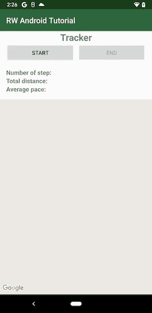

starter 项目的屏幕截图

你会看到谷歌地图片段现在什么也没有显示。是因为`google_maps_api.xml` 文件缺少 Google 地图 SDK API key，地图碎片无法连接 Google 服务器。您将在下一节学习如何获得一个。

# 获取谷歌地图 API 密钥

谷歌根据使用的数据量向开发者收费，并为使用任何云工具验证每个应用程序生成 API 密钥。因此，你必须尽可能保证 API 密匙**的安全，以防止任何意外的账单和费用。**

1.  在[谷歌云控制台](https://console.cloud.google.com/)创建一个账户和一个项目

谷歌云控制台图标

2.进入**侧菜单** > **“仪表板”**>**“API&服务”**

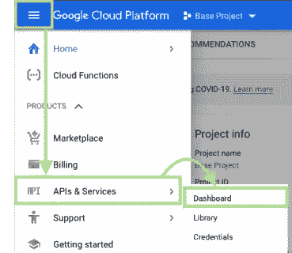

3.点击页面顶部的**“启用 API 和服务”**

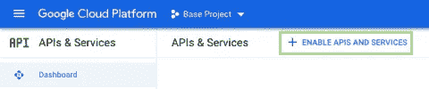

4.搜索或点击**Android 版地图 SDK**。

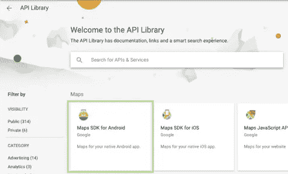

5.点击**启用**激活 API

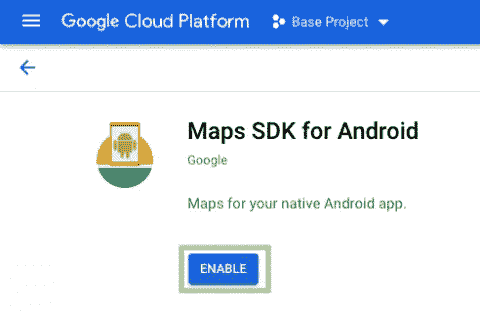

6.转到侧面菜单中的“**凭据**选项卡，然后单击页面顶部的“**创建凭据**”。在弹出的对话框中点击 **API 键**。

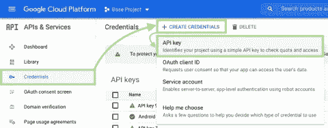

7.复制生成的 API 密钥

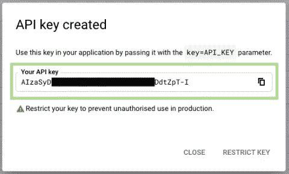

8.将生成的 API 密匙粘贴到 **google_maps_api.xml**

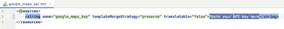

9.构建并运行。您将在地图片段处看到地图，如下所示:

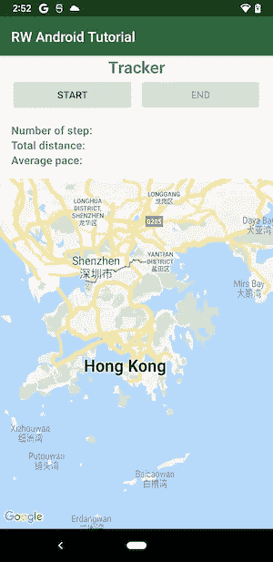

谷歌地图使用 API 键可以正常工作

# 限制您的 API 密钥

上一节生成的 API key 是一个**无限制的 key** ，这意味着每一个拥有这个 key 的开发者都可以使用所有的云工具，包括 Firebase ML API、Firebase Remote Config API、Cloud Trace API 等。你应该限制钥匙，以防止使用任何不必要的工具，招致额外的账单。

1.  转到“**API&服务**”的“**凭证**”选项卡，并选择您的 API 密钥。

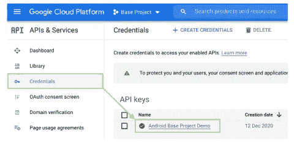

2.在“**应用限制**”部分选择**“Android apps”**，输入包名和 SHA-1，包含在下一步中。

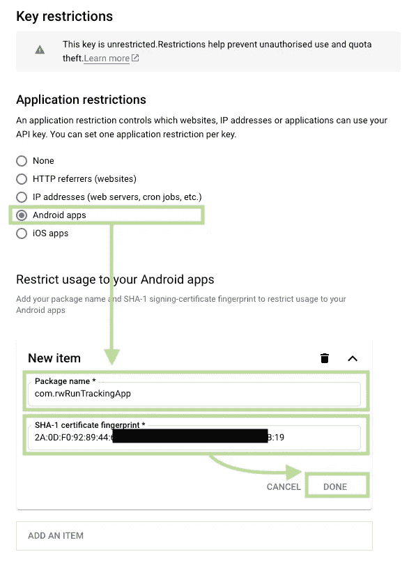

3.用`**debug.keystore**`生成调试 SHA-1 证书指纹

调试指纹是根据开发时给 app 签名的`debug.keystore`生成的。通过在 Android Studio 终端运行以下命令，您将很容易获得调试 SHA-1 证书指纹。

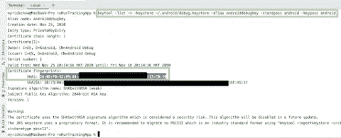

4.用`**release.keystore**`生成发行 SHA-1 证书指纹

另一方面，您还需要生成一个发布指纹，因为您将使用不同的密钥库(例如`release.keystore`)将应用程序签名到 Google Play。用自己的值替换下面的`fooReleaseKeystorePath`、`fooAliasName`、`fooStorePassword`、`fooKeyPassword`。在 Android Studio 终端运行它，您将获得您的发布指纹。

5.在**“API 限制”**部分选择**“Android 版地图 SDK”**

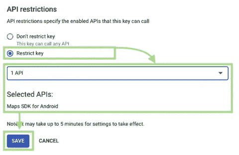

6.你现在只能使用 Android 谷歌地图 SDK 的 API 键。如果您在其他 Google Cloud 工具中使用它，例如 Firebase ML API，您应该会看到错误。

# 开始跑步

Android 设备可以有许多不同的传感器，例如计步器、加速度计和陀螺仪等。计步传感器可以获得自上次启动时间以来用户已经走了**的步数。你可以用这个传感器来计算平均速度。然而，步数计数器有一个限制——感应到的事件和报告的事件之间的时间差最多可达 [10 秒](https://developer.android.com/guide/topics/sensors/sensors_motion#sensors-motion-stepcounter)。因此，不能保证实时向用户显示步数。**

# 请求体育活动许可

在从`SensorManager`中获取步数之前，你还必须考虑到 Google 已经从 API 29 开始限制步数传感器的可用性。`**ACTIVITY_RECOGNITION**`必须获得许可才能获得用户的步数。如果您的目标只是 API 28 或更低版本，您可以跳过以下三个步骤。

## 1)添加使用用户计步器的许可请求

从谷歌的角度来看，用户的隐私是最重要的。从 API 29 开始，[谷歌将用户身体活动的使用归类为敏感隐私，并要求所有应用程序在运行时请求此许可](https://developer.android.com/about/versions/10/privacy/changes#physical-activity-recognition)。如果您的目标用户是运行 Android API 29 或更新版本的用户，您必须在`AndroidManifest.xml`标签下粘贴以下代码:

## 2)添加权限请求库

Android 中请求运行时权限和处理用户响应的过程包含一些样板代码。你可以利用一些公共图书馆以更简单的方式来完成这项任务。其中一个有用的库是基于 Google 工程师编写的`[EasyPermissions](https://github.com/googlesamples/easypermissions)`构建的`[EasyPermissions-ktx](https://github.com/VMadalin/easypermissions-ktx)`。将以下代码添加到 app/build.gradle 中，以将`[EasyPermissions-ktx](https://github.com/VMadalin/easypermissions-ktx)`添加到您的项目中:

## 3)请求**活动识别**权限

请求`ACTIVITY_RECOGNITION`很简单。当用户的设备 API 等级为 29 或以上时，只需要在下面的代码处调用一个单独的函数`EasyPermissions.requestPermissions()`。在`MapsActivity`处的 `startTracking()`函数上放置以下代码。

## 4)构建并运行

单击开始按钮，您将看到以下弹出对话框，用于请求体育活动许可。授予许可后，您将在 Android Studio 日志中看到结果。

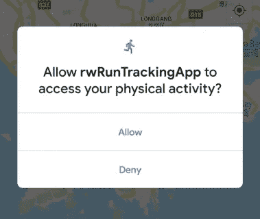

# 设置步骤计数器监听器

在获得用户访问计步传感器的权限后，您现在将设置一个监听器来观察它的变化。

## 1)设置计步监听器

每次有更新时，Android 设备中的步数计数器都会发回步数。您必须注册一个监听器，并在`Activity`级别处理新数据。在`MapsActivity.kt`处添加以下代码

1.  首先，你得到了`SensorManager`系统服务。
2.  然后，您可以访问设备的计步传感器。
3.  由于这个传感器在 Android 环境中是一个可选的硬件，所以您必须添加一个`null`检查来确保设备中有一个。
4.  您会在`registerListener`函数中看到一个错误，因为您还没有实现下一步中包含的`SensorEventListener`。

`registerListener`功能的第三个参数是以微秒为单位的采样周期率。请注意，这只是对系统的一个提示。接收事件的速度可能比指定的速度快或慢。您可以使用 4 种不同的选项:

1.  `SENSOR_DELAY_FASTEST` : 0us
2.  `SENSOR_DELAY_UI`:1 美国
3.  `SENSOR_DELAY_GAME` : 2us
4.  `SENSOR_DELAY_NORMAL` : 3us

因为你正在开发一个追踪应用程序，你应该选择较低的采样率，以尽可能快地获得步数。因此，使用`SENSOR_DELAY_FASTEST`。当用户授予`ACTIVITY_RECOGNITION`权限时，调用函数`setupStepCounterListener()`。

## 2)处理来自步数计数器的数据

这时，Android Studio 会警告你缺少`SensorEventListener`接口的实现。现在，更新`MapsActivity`类声明，并将下面的代码粘贴到 body 部分。

## 3)构建并运行。

尝试摇动你的设备，你可以看到日志`onSensorChanged`连续记录。回拨可能会有短暂的延迟。根据[官方文档](https://developer.android.com/guide/topics/sensors/sensors_motion#sensors-motion-stepcounter)，延时最多 10 秒。

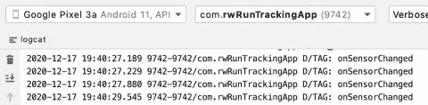

## 4)从`SensorEvent`中检索步数

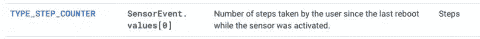

根据官方文档，`values`属性的第一个元素是自上次引导以来的步数。用以下内容替换`onSensorChanged`功能:

1.  如果`sensorEvent`不是`null`，则继续函数的剩余部分，否则返回。
2.  因为这个回调可能被其他传感器触发，而这些传感器不能返回任何值，所以您还必须向第一个元素添加一个`null`检查。

## 5)构建并再次运行

摇动你的设备，你可以看到下面的日志

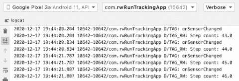

# 计步器的技巧

如本节开头所述，返回的步数指的是从上次设备启动开始的总步数。因此，当用户开始跑步或按下开始跑步按钮时，您需要保存初始步数以跟踪当前步数。在`MapsActivity`中添加实例变量:

在`onSensorChanged`函数的`firstOrNull()?.let`回调中添加以下代码:

构建并运行。您将在这里看到标准化的步数:

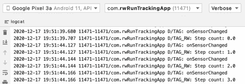

# 使用 FusedLocationManager 获取位置数据

从用户的角度来看，位置信息是敏感的。您必须首先向用户请求位置权限。

## 1)请求位置许可

您可以使用两种类型的位置权限:— `ACCESS_FINE_LOCATION`:让应用程序访问精确的位置。— `ACCESS_COARSE_LOCATION`:让一个应用程序访问一个大概的位置。在这种情况下，你应该选择`ACCESS_FINE_LOCATION`。您不必明确请求位置权限，因为 Google Maps SDK 会为您完成。在清单标签下面的`AndroidManifest.xml`中添加以下代码。

## 2)添加播放服务位置依赖性

`FusedLocationManager`使用 Google Play 服务来检测和计算用户的当前位置。将下面的依赖关系添加到依赖关系块内的`app/build.gradle`文件中

## 3)在`MapsActivity`的顶部声明`FusedLocationProviderClient`实例

## 4)初始化`MapsActivity`的`onCreate()`回调函数中的`FusedLocationProviderClient`对象

## 5)注册位置变更监听器

一旦 Android 操作系统检测到任何位置变化，它就会将数据发送回注册的监听器。将以下代码粘贴到`MapsActivity`中，以注册位置回调:

这里，您使用先前创建的`fusedLocationProviderClient`实例来请求带有特定`LocationRequest`的位置更新。

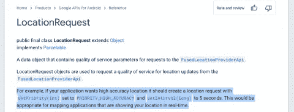

位置请求的间隔设置为 5000 毫秒。这意味着应用程序将每 5 秒请求用户的位置。这个间隔足够小以平衡跟踪特征和电池消耗。

## 6)在`startTracking`功能处调用`setupLocationChangeListener`功能

构建您的应用程序。点击开始，四处走动一分钟。您会发现如下位置更新日志:

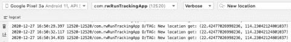

# 模拟位置变化

走很长时间去调试一个 app，在现实情况下是不可行的。在开发阶段，在 Android 中模拟一个位置有两种选择。

## **1)Android Studio 中的 Android 模拟器**

您可以将 GPX/KML 文件导入 Android 模拟器来模拟位置路线。这里有一个 GitHub 上的 [GPX 文件](https://github.com/gps-touring/sample-gpx/blob/master/RoscoffCoastal/1_Roscoff_Morlaix_A_parcours.gpx)的例子。

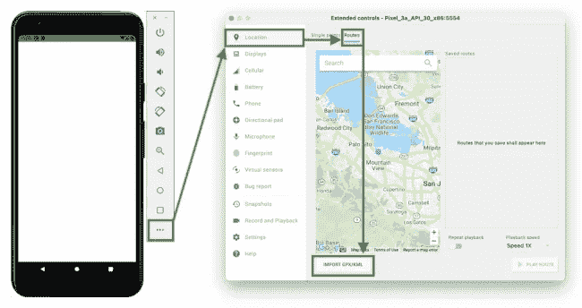

Android 模拟器截图

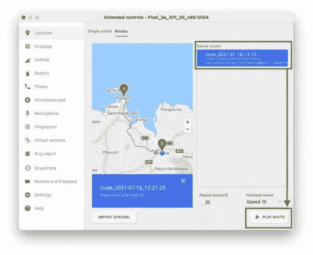

用于导入 GPX 文件的 Android 模拟器截图

## **2)真实装置**

在 Play Store 中，你可以找到多个可以模仿设备 GPS 的应用程序。你可以下载其中一个来模拟 GPS 进行调试。一个例子是[“模拟 GPS”](https://play.google.com/store/apps/details?id=net.marlove.mockgps&hl=en&gl=US)app。

# 显示用户的当前位置

将以下功能 `showUserLocation`添加到`MapsActivity`中，并在`mMap = googleMap`之后的`onMapReady`功能处触发，以确保`mMap`在被访问之前被初始化。

通过启用`isMyLocationEnabled`属性，用户的当前位置可以显示在地图上。构建并运行。你会看到:

# 在地图上显示路线

该应用程序应该能够显示用户从起点到当前位置的路线。您将使用谷歌地图的 API `Polyline`在地图上画一条线。将以下代码添加到`MapsActivity`:

代码接收从`onLocationResult`中检索的新位置列表，并用这些位置构造一个`LatLng`列表。该列表作为`PolylineOptions`附加到地图上。在`MapsActivity`中的`onLocationResult`回调处调用`addLocationToRoute`函数。

构建并运行。当用户的位置改变时，你会看到一条线被画出来。

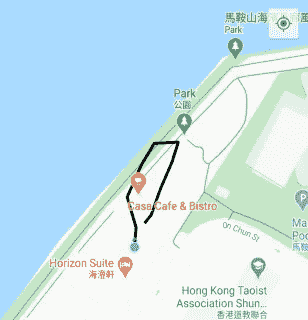

# 房间数据库大纲

此刻，如果你重启应用程序，地图上的路线就会消失。要解决这个问题，需要保存路线数据。这可以使用`**Room**`持久数据库来完成。`**Room**`是`SQLite`之上的抽象层。您只需要创建三个文件来访问房间数据库:

1.  **实体文件**:包含一个用`@Entity`注释标注的类。如果批注中没有指定，则类的每个实例用类名表示表中的一行
2.  **DAO** :提供方法(CRUD ),应用程序的其余部分使用这些方法与特定表中的数据进行交互
3.  **数据库**:扩展`RoomDatabase`，定义数据库配置，并作为应用程序对持久化数据的主要访问点

请记住，数据库操作应该**而不是**从主 UI 线程调用，以防止应用程序被冻结。您需要添加协程依赖来调用另一个线程中的作业。在`app/build.gradle`文件中添加`Room`和`Coroutines`的依赖关系。在文件顶部添加以下代码:

在`dependencies`块中添加依赖关系:

# 定义实体

`Entity`是一个数据库表的记录结构。通常，有一个唯一标识记录和其他信息列的主键。您现在可以用下面的代码创建一个数据类— `TrackingEntity`。

有几个重要的注释:

1.  `**@Entity**`:声明该数据类是可被`**Room**`库识别的实体
2.  `**@PrimaryKey**`:表示这是该实体的唯一标识符
3.  `**@ColumnInfo**`:表示这是该实体的数据列

`TrackingEntity`实体中有四个属性:

1.  `timestamp`:表示本次位置更新的时间，是该实体唯一标识各记录的主键。
2.  `latitude` & `longitude`:表示跟踪记录的地理细节。
3.  `distanceTravelled`:表示当前地理点与上一条记录中的地理点之间的距离。对于第一条记录，它是 0。

有两个有用的实例函数:

1.  `asLatLng()`是一个转换器函数，用于将`TrackingEntity`转换为`LatLng`，以便在谷歌地图片段上绘制折线。
2.  `distanceTo()`用于计算两个`TrackingEntity`之间的距离。`Location`类已经考虑到地球曲率并精确计算距离。

切记经纬度的单位是**度**而不是**长**，不能用勾股定理计算距离。

# 定义一个道

DAO 的意思是**数据访问对象**，它包含访问数据库的 CRUD 函数。用以下代码创建一个`TrackingDao`:

您用 SQL 命令创建了上述七个函数。一个一个看细节:

1.  您从没有过滤的`trackingentity`表中查询所有实体。在房间数据库中，默认情况下，表名是小写的类名。返回值在`LiveData`的类中，当这个 SQL 命令的结果改变时，它会通知其他类。该功能的结果将被转换为`LiveData`，并在`Activity`级别观察是否有任何变化。
2.  这与前面的函数相同，但是返回类型是`List`而不是`LiveData`。
3.  您可以在所有追踪实体中查询行进距离的总和。
4.  您按照时间戳对实体进行降序排序，并获得第一个实体。确保返回的`TrackingEntity`是可选值，因为当数据库中没有记录时`Room`数据库返回`null`。
5.  SQL 命令与第四个函数相同，但它是一个挂起函数，只能在`Coroutines`中调用，不会阻塞 UI 线程。
6.  将记录插入到`Room`数据库中可以像注释`@Insert`一样简单。
7.  该功能从`trackingentity`表中删除所有实体。

# 定义数据库

`database`是一个抽象类，用于处理本地持久存储的操作。例如，定义数据库的当前版本以及在不同版本之间迁移数据的规则。用以下代码创建一个`TrackingDatabase`:

1.  您需要用注释`@Database`对数据库类进行注释，并定义数据库中涉及的实体列表。当数据库结构更新时，版本号用于数据迁移。
2.  您需要从`RoomDatabase`类扩展数据库类，并使其成为`abstract`类。
3.  该函数向数据存储库公开 DAO，这将在下一节中定义。
4.  您通常只希望在一个应用程序中有一个数据库，因此您在这里采用了 singleton 模式。

# 定义存储库

储存库可以被认为是从不同来源(例如本地持久存储、远程服务器存储和本地缓存)检索数据的数据管理器。其他类不需要知道数据来自哪里。这些类只需要立即处理数据。创建一个`TrackingRepository`。

1.  您需要将您在上一节中定义的数据库中的 DAO 对象传递给这个存储库，以触发对数据库的 SQL 命令。不要将数据库实例传递到存储库中，因为不应该让存储库拥有对数据库的完全访问权限，而只能访问特定的 DAO。建议将 DAO 标记为`private`,因为您不应该将 DAO 直接暴露给这个项目中的其他对象或其他开发人员。
2.  这三个属性都属于`LiveData`类型，然后可以在`ViewModel`级别转换为`LiveData`。
3.  这些是可以在协程中调用的挂起函数。

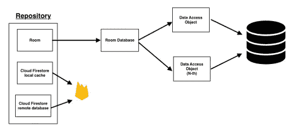

您可能对这个项目是否需要存储库层有疑问，为什么不在 ViewModel 级别直接使用 DAO。以下是一些评论:

1.  在一个真实的应用程序中，可以有多个数据源。例如，房间数据库、云 Firestore 本地缓存和云 Firestore 远程数据库等。存储库层可以将所有数据源分组到一个类中，并处理所有情况，以便在正确的时间选择正确的数据源。
2.  你可以利用分工的优势。一个开发人员可以专注于 SQL 命令和数据管理。其他 UI 开发人员可以通过直接调用存储库中的函数来处理 UI，而不用担心底层的数据管理。

# 初始化数据库和存储库

创建一个新的扩展`Application`的`TrackingApplication`文件:

在`AndroidManifest.xml`处设置自定义`Application`文件:

由于在一个 app 生命周期中应该只有一个`TrackingRepository`的实例，所以可以把初始化过程放在 app 的应用文件中。

1.  您必须扩展一个自定义类到`Application`并在`AndroidManifest.xml`中的`application`处的`name`标签处设置自定义类`TrackingApplication`。
2.  您必须将数据库和存储库的初始化过程设置为`lazy`，因为它们在初始化期间需要大量时间。

# 创建视图模型

A `ViewModel`是现代 Android 开发中一个特殊的架构组件。它存储可观察的实例，当它们的值改变时，可以通知观察者。观察者通常是有自己生命周期的`Activity`、`Fragment`和`Application`。`ViewModel`仍然存在，即使`Activity`和`Fragment`在方向改变后被重新创建。在`build.gradle (app)`文件中添加以下依赖关系:

1.  您需要从 Android `ViewModel`类扩展您的`MapsActivityViewModel`，并且`MapsActivityViewModel`必须接受一个`TrackingRepository`实例来访问可观察数据库`LiveData`实例。
2.  您可以将可观察的数据库`LiveData`实例转换成`LiveData`类型，让`MapsActivity`观察它。
3.  `ViewModel`中有一个默认的实例属性`viewModelScope`。您可以在这里启动一个`Coroutine`并调用`TrackingRepository`中的任何暂停函数。

# 创建视图模型工厂

Android 系统将在`Activity`的整个生命周期中存储`ViewModel`实例，即使它是在配置更改后重新创建的，例如方向更改。因此，您不应该自己初始化`ViewModel`，而应该使用`ViewModelProvider.Factory`来检索先前存储的`ViewModel`。

# 在活动级别观察 LiveData

`LiveData`是一个可观察类，`Activity`可以设置相应的观察器对`LiveData`中的数据变化做出反应。

1.  您想要观察`TrackingEntity`表中的所有数据。一旦表被清除，您需要相应地重置 UI。
2.  一旦最新的追踪实体(按`timestamp`排序)被更新，你必须在谷歌地图片段上画出新的路线。
3.  当有新记录插入到`TrackingEntity`表中时，总行驶距离的值也会更新。然后，您可以用最新的数据更新 UI。
4.  因为步数的变化并不意味着用户位置的变化，所以您需要单独处理数据变化。
5.  您需要更新`MapsActivityViewModel`中`currentNumberOfStepCount`的值来触发前一点的监听器。
6.  为了实现 ViewModel 模式，向数据库中插入一条新记录，Android 系统将触发对`LiveData`的更新。最后，`Activity`将得到通知并相应地更新 UI。
7.  一旦数据库中有更新，您将更新地图片段处的折线。因此，`addLocationToRoute`的输入参数应更新为`TrackingEntity`。

构建并运行。现在，一旦`TrackingEntity`记录被插入到`Room`数据库中，您将看到路线被更新。

# 应用程序重启时重绘路线

您是否注意到在应用程序重新启动后，路由就丢失了？这是因为您尚未在地图上重新绘制路线。因为您已经设置了一个观察器来监听跟踪实体的数据变化，所以您可以简单地从数据库中获取所有的实体，观察器中的函数将为您绘制路线。将以下代码添加到`onMapReady()`函数中:

谷歌地图在 SDK 中异步初始化，你不应该在`onCreate`回调时重新绘制路线。您应该等到地图在`onMapReady`回调时完全初始化。构建应用程序，你可以发现重新启动应用程序后，路线被重新绘制。

# 停止奔跑

用户停止跟踪后，您必须在`Activity`和数据库级别重置配置。将上述代码放到`MapsActivity`中，当用户想要停止跟踪时运行该代码。

您需要:

1.  重置存储在实例变量中的路线。
2.  清除`MapsActivityViewModel`中存储的所有数据，包括房间数据库中的记录。
3.  移除任何未来位置更新的处理程序。
4.  移除任何未来新步骤计数的处理程序。

# 从这里去哪里？

你可以在这里下载[最终项目](https://github.com/myrickchow32/RunnerTrackingAppFinal)。学完这个教程，你就做了一个追踪 app，恭喜你！然而，你总是可以改善或改变一些事情，比如:

1.  当你用 looper 请求位置更新时，只有当应用在前台时，它才能正常工作。如果想在后台跟踪用户的信息，用`ForegroundService`和`PendingIntent`代替。
2.  你可能会在不同的应用版本中更新`TrackingEntity`。必须完成数据库迁移。
3.  从`FusedLocationProviderClient`检索的位置具有不同的精度。您可以过滤到更准确的数据，以便为用户提供更好的 UX。
4.  **Realm** 是`Room`的替代数据库实现。

欢迎您通过[Twitter @ my rik _ chow](https://twitter.com/myrick_chow)关注我，了解更多信息和文章。感谢您阅读这篇文章。祝您愉快！😄