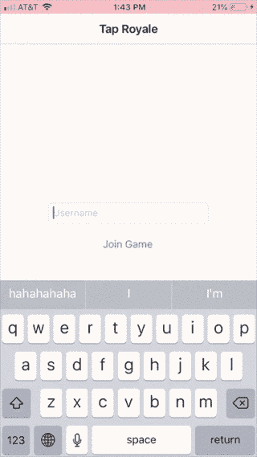

# 如何用 PubNub 做一个权威的游戏服务器

> 原文：<https://itnext.io/how-to-make-an-authoritative-game-server-with-pubnub-723264518adc?source=collection_archive---------10----------------------->

我见过的大多数用 PubNub 制作游戏的教程只是在客户端之间传递消息。这意味着游戏完全信任每个客户。这是一个很好的学习方法，但是在实践中(尤其是 HTML5 游戏),用户很容易破解你的游戏！他们所要做的只是改变广播他们位置(或任何其他重要数据)的代码，突然之间其他客户都认为他们可以飞了。

*PubNub 的功能和数据存储特性*允许我们把一个频道变成一个完全权威的服务器。

我做了一个简单的皇家战役游戏和 iOS 客户端来演示功能。代码可以在这篇文章底部的源代码部分找到。我会把注意力放在大众方面。

玩家可以加入游戏，等到游戏开始，再互相攻击。这是它的样子。

现在是代码！

# **功能 1**

我们需要做的第一件事是创建一个在发布或触发之前发生的函数。[这里有一个关于创建函数的快速教程](https://www.pubnub.com/docs/tutorials/pubnub-functions)。我们需要这发生在消息发布之前，这样我们可以确保游戏状态确实存在。

# **创建游戏状态和添加玩家状态**

对于导入，默认情况下我们得到的只有`kvstore`和`xhr`。`kvstore`是我们用来存储数据的和`xhr` [处理 http 请求](https://www.pubnub.com/docs/blocks/xhr-module)，我们并不真的需要它们。我们需要添加`pubnub`，这样我们就可以[向玩家发布消息](https://www.pubnub.com/docs/blocks/pubnub-module)。

**这个权威策略的主要概念是在我们从数据库获得游戏状态后处理消息。**在每一个函数中，一旦我们得到了游戏状态，我们会用它来决定做什么，然后在函数结束时更新它。

**第 6 行**从响应中获取消息对象。为了方便起见，我们将在每个函数中这样做。

**第 8 行**将从数据库中检索一个带有关键字“gameState”的对象，而`.then`回调将把检索到的数据作为`gameState`提供给我们。现在我们有了数据，我们需要确保它存在。

**第 11 行**检查游戏状态是否不存在(或者我们是否发送了一个“重置-游戏状态”消息，这对调试真的很有帮助)。

**第 13–18 行**将用我们默认的游戏状态更新`gameState`变量

第 26–29 行将会把我们新的游戏状态推送到数据库中。

# **向游戏状态添加玩家**

现在我们已经有了我们的游戏状态，我们需要在玩家加入时添加他们。这将替换 TODO 注释。

首先，我们确保该消息是一个“加入”消息。如果玩家的 uuid 在我们的 playerStates 对象中还不存在，我们为他们创建一个 playerState。**玩家状态可以包含关于玩家的任何信息，比如他们的用户名、状态等等。**对于这个例子，我只需要知道他们是否准备好了，他们的健康状况如何。

因为示例游戏是皇家战役，所以我需要玩家总数。随后，当人们准备好了，我们会将准备好的玩家与此进行比较，以告知游戏应该何时开始。

**然后我们向所有玩家发布这个新的游戏状态**。我们需要将整个游戏状态发送到这里，以确保这个新玩家是最新的。这也将更新这个新玩家的游戏状态！

# **功能 2**

我们现在需要创建一个在发布之后发生的函数。这个功能将是游戏的核心。它将处理玩家互动和更新游戏状态。我会把这个分成小块。

**设置**

让我们首先设置函数的核心。

这和上一个函数看起来很像。

从游戏状态中获取玩家的状态

第 16–25 行处理零散信息。用户可能会在错误的时间发送消息，如果他们的客户端有点落后，或者他们可能会试图攻击别人。

`return request.okay()`将返回一个响应并退出该功能。

第 28–32 行是我们服务器的核心。他们检查游戏的状态，然后相应地处理消息。我一会儿会解释每一个的内容。

**第 34–41 行**向所有玩家发送更新的游戏状态。这是一种昂贵且低效的方法，可以改进。你应该只发送小的状态变化给玩家，只有当玩家加入时才发送完整的游戏状态。如果你的游戏中有 100 个玩家，这个游戏状态会变得非常大。我这样做是为了加快客户端的开发。我只需要更新这条消息的状态，而不是一堆消息。

**TODO 1(下面)有一个为小的状态变化更新客户端状态的例子。**

然后，我们更新数据库中的状态，现在每个人都跟上了速度！

# **TODO 1:如果游戏状态是等待**

如果游戏状态是等待，我们只需要担心玩家发送“就绪”消息。如果所有玩家都准备好了，我们也将开始游戏。其他任何消息都只是玩家想偷偷摸摸的。

**第 2–7 行**如果我们得到一个就绪信息，只需更新该玩家的状态并添加到活跃玩家中。

**第 10–19 行**将检查是否所有玩家都准备好了。如果是，它将更新游戏状态，并向所有玩家发送游戏已经开始的消息。**我把它放在这里作为更新客户端游戏状态而不发送整个游戏状态的例子。**每一个改变游戏状态的动作，都要发送一条小消息告诉玩家发生了什么。

# **TODO 2:如果游戏正在进行**

如果游戏正在进行，我们需要处理玩家的交互。

在我的示例游戏中，唯一的交互是攻击，所以这是我们需要检查的唯一信息。

**第 2–3 行**会获得目标玩家的状态，并递减其生命值。我设置了一个`DEFAULT_DAMAGE`常量来简化事情，但是对于一个更复杂的游戏，这个常量可以从发送者的玩家状态中获取！

**第 7–10 行**查看目标玩家是否死亡。如果他们这样做了，减少活跃的球员。这基本上是说，如果他们死了，游戏中就少了一个玩家。

**第 13–27 行**查看游戏是否应该结束。由于我们没有运行的游戏循环，我们需要在重要的消息中进行这些检查。我们检查是否只剩下一个活跃的玩家，如果是，我们重置游戏状态，并向所有玩家发送“赢”消息。

**注意:**在我的客户端上，当有人获胜时，我让所有用户取消订阅该频道，这意味着他们必须重新加入游戏。如果你想让用户留在游戏中，不要重置游戏状态，只需重置玩家状态。

# **结论**

就是这样！只要所有改变游戏的消息更新游戏状态，并且服务器向客户端发送更新，PubNub 就可以作为简单游戏的权威游戏服务器。

这里我没有展示一些代码，比如处理存在和玩家的离开，但是这里有 PubNub 函数的源代码！

源代码:

[Swift 客户端](https://github.com/diericx/TapRoyale)

[PubNub 功能](https://github.com/diericx/PubNub-AuthoritativeGameServer)