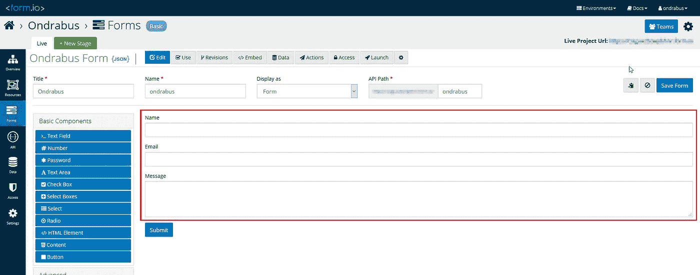
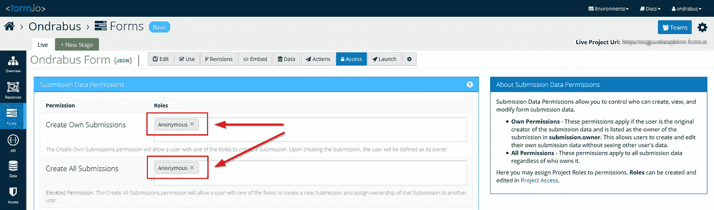
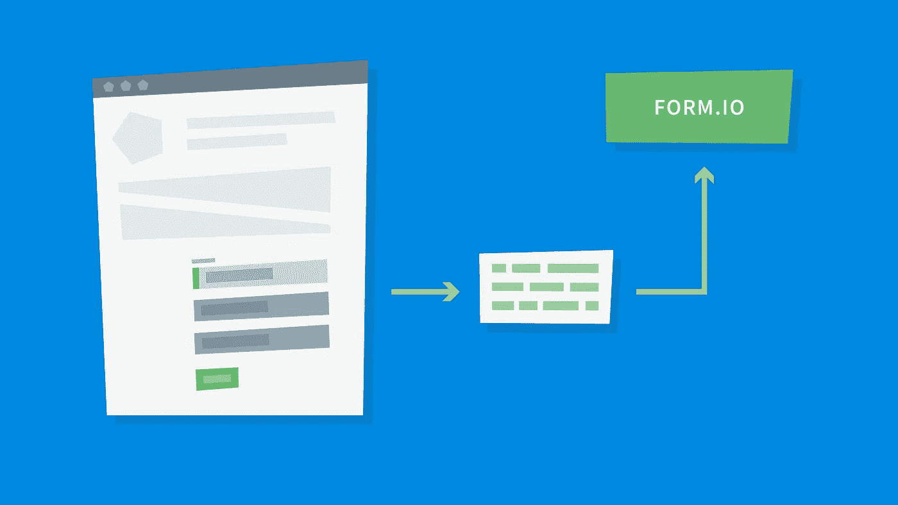
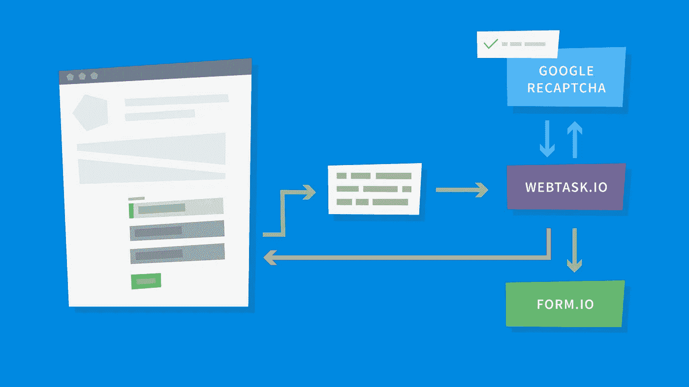
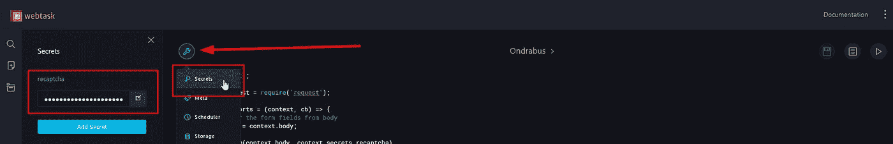

# 如何在 API 网站上安全提交表单

> 原文：<https://itnext.io/how-to-make-form-submissions-secure-on-an-api-website-d80bcfdb5149?source=collection_archive---------1----------------------->


在一个 Vue.js 网站上实现表单？拥有一个只读网站是小菜一碟。使用 headless CMS 易于开发，易于维护，完全不用担心安全性。但是，如果你想在你的网站上有一个联系方式呢？你打算把提交的表格存放在哪里？你将如何保护它免受机器人和其他形式的误用？

当我们开始讨论表单和处理人们提交的数据时，我们需要处理三个重要部分:

1.  **表单定义**
    我们要显示哪些字段，以什么顺序显示
2.  **表单提交存储**
    我们将提交的表单数据存储在哪里
3.  表单安全性
    我们如何保护表单免受机器人和邪恶的人的攻击

从网站访问者处收集数据时，您可能需要遵守 GDPR。如果是这种情况，确保收集访问者对处理数据的同意，并将数据存储在 GDPR 合规服务中。

在这篇文章中，我将展示我的个人网站上的所有步骤，就像之前的文章一样。

# 表单定义

当你决定要在你的网站上有一个表单——用户输入的方法——时，你可能已经知道你想从网站访问者那里得到什么样的数据。在大多数情况下，这是一个简单的联系形式。列出您想要收集数据的字段是有益的。在我的例子中，这个列表是这样的:

*   名字
*   电子邮件
*   消息

我不想用太多的字段淹没访问者，因为那会降低他们实际提交消息的概率。因此，表单非常简单，但所有字段都是必填的。


# 表单提交存储

好了，表单已经定义好了，包含了所有的字段，但是动作 URL 是什么呢？表单的目标是什么？

这就是乐趣的开始！我们将使用外部服务来存储提交的表单中的所有数据。到目前为止，我们已经使用[headless CMS Kentico Cloud](http://bit.ly/2QzUALM)作为外部服务，为我们的网站提供内容。然而，headless CMS 不是为存储表单提交而设计的。它的目的是维护内容并将其交付给各种渠道，在我们的例子中是一个网站。表单提交总是包含私有数据，这些数据永远不会在网站上发布。

因此，我们需要选择一个专为此任务设计的服务。我偶然发现了几个能做到这一点的服务:

*   [表格 io](http://bit.ly/2Opl3ht)
*   [Formstack.com](http://bit.ly/2IPr3Km)
*   [Formkeep.com](http://bit.ly/2AfZ0Bh)

如果你做更多的研究，你很可能会找到其他人。我选择 Form.io 有一个特别的原因——每月 1000 次提交是免费的。



快速注册后，管理界面允许您创建表单定义。这定义了存储提交数据的字段。在我的情况下，我只是按照我之前编写的列表，并为名称，电子邮件和消息定义字段。

为了简化向该表单提交数据的整个过程，请切换到 Access 选项卡，并通过 API 启用匿名访问。



匿名 API 访问听起来有点不安全，对吧？为了将数据发布到 Form.io 表单，即使是匿名发布，也需要知道 API 路径。因此，只要您对 API 路径保密，您就没有什么可担心的。我将在后面解释为什么匿名访问在这里更容易。

# 表单安全性

表单被定义，表单提交存储被选择，让我们把它们放在一起！



嗯，还没有。可以将我前面介绍的联系人表单与 Form.io 表单直接连接起来，但是这将使它非常脆弱。

为什么？任何人都可以无限期地重复张贴联系表单。这将对网站的可用性产生负面影响。此外，Form.io 的免费计划只包括一定数量的 API 调用，这些调用很快就会被超过。你能想象把垃圾邮件和真实邮件分开会是一场噩梦吗？

因此，我们需要保护表单。过去我一直使用谷歌的 reCaptcha 控件。我相信你已经在很多网站上看到了它的作用。你勾选一个方框，等一会儿，你就可以提交表格了。


当然，我们也需要在服务器上验证这个过程。否则，任何提交表单的人都可以重复向表单端点发出的 HTTP 请求，而不管您是否有 reCaptcha。



为了进行这种验证，您需要一个允许您处理一点代码的服务。我决定使用免费的 Webtask.io。但是你也可以轻松地利用 Azure 函数(查看这篇由[布莱恩·索尔蒂斯](http://bit.ly/2CdjrQR)撰写的[关于 Azure 函数](http://bit.ly/2Pw8q0y)的伟大文章)。

Webtask.io 上的服务器功能将检查提交是否包含所有必填字段的数据，还将验证提交的 reCaptcha 代码。如果有任何问题，它将通过适当的消息进行响应。否则它会直接将数据发送到 Form.io API。

# 让我们开始吧

最后一个模式看起来工作量很大吗？这就是微服务架构的美妙之处。它看起来可能很复杂，但是当你看到实际的代码时，它非常简短、清晰、易于理解。把这些放在一起只花了我几个小时，包括所有的注册和弄清楚 API 的细节，因为我以前没有使用 Webtask.io 或 Form.io 的经验。

# 谷歌 reCaptcha

首先让我们将 reCaptcha 添加到网站上。在 [Google reCaptcha](http://bit.ly/2yzhkDl) 上注册应用程序后，有一个 JavaScript 文件需要包含在 HTML 头中:

```
...
<script src='https://www.google.com/recaptcha/api.js?onload=recaptchaLoaded'></script>
...
```

请注意，我添加了带有`recaptchaLoaded`值的属性`onload`。ReCaptcha 在使用之前需要初始化，这个属性确保一旦初始化，它将调用方法`recaptchaLoaded`。当然，这个方法是需要实现的。我把它添加到了`app.js`文件的底部:

```
...
var recaptchaLoaded = function(){
 bus.$emit('recaptchaLoaded');
}
...
```

你注意到`bus`这个变量了吗？干得好！整个表单是一个 Vue.js 组件，因此它处理自身的所有功能。这包括数据提交、表单呈现等等。因此，我们需要告诉组件 reCaptcha 已经初始化，表单可以提交了。简单的方法是使用 Vue.js 中的事件。我们只需要为此创建一个 Vue.js 的专用实例。我把它加到了`components.js`文件的开头，因为它是第一个。

```
var bus = new Vue();
...
```

# Vue.js 实现

现在让我们呆在`components.js`文件中，看看表单组件的实现。

```
...
data: function(){
 return {
  name: null,
  email: null,
  message: null,
  errors: [],
  formGood: false,
  disabled: true,
  sending: false
 }
},
...
```

`data`函数现在包含了几个新的属性。每个表单字段(`name`、`email`、`message`)、错误消息数组(`errors`)和三个状态字段(`formGood`、`disabled`、`sending`)都有一个属性。

```
...
template: `
 <form>
  <div class="fields" v-if="!formGood">
  …
  <input type="text" v-model="name" id="name" required />
  …
  <input type="email" v-model="email" id="email" required />
  …
  <textarea v-model="message" id="message" rows="4"></textarea>
  …
  <div class="g-recaptcha" data-sitekey="{your-site-key}"></div>
  …
  <div class="field" v-if="errors.length">
  …
  <li v-for="error in errors">{{error}}</li>
  …
  <ul class="actions" v-if="!formGood">
   <li><input type="submit" value="Send Message" @click.prevent="submitForm" :disabled="disabled" /></li>
  </ul>
  <div v-if="formGood">
   <h3>Thank you!</h3>
   <p>Your message was submitted. I will get back to you as soon as I can.<br />Ondrej</p>
  </div>
  …
  <div v-if="sending" class="form-overlay"><i class="fa fa-circle-o-notch fa-spin"></i></div>
 </form>
`,
...
```

使用`v-model`属性将表单字段的属性绑定到各自的输入。状态属性`formGood`将确保在表单成功提交时显示*感谢*消息。在处理表单提交时，属性`sending`将在表单上方呈现一个简单的覆盖图。最后，`disabled`属性将确保表单在 reCaptcha 初始化之前不会被提交。还记得`recaptchaLoaded`功能吗？当 reCaptcha 初始化时发出事件`recaptchaLoaded`的那个。表单组件的`created`函数将监听这个事件。

```
...
created: function(){
 bus.$on('recaptchaLoaded', this.enable);
},
...
```

创建表单组件时执行`created`功能。这在 reCaptcha 初始化之前很久就发生了，所以当这种情况发生时，form 已经在等待事件，并随后调用`enable`方法，该方法又通过`disabled`属性启用提交按钮。

```
...
methods: {
 enable(){
  this.$data.disabled = false;
 },
 submitForm(){
  this.sending = true;
  this.errors = [];
  this.formGood = false;
  fetch({webtask.io/your-function-endpoint}, {
   body: JSON.stringify({
    name: this.$data.name,
    email: this.$data.email,
    message: this.$data.message,
    recaptcha: grecaptcha.getResponse()
   }),
   headers: { 'content-type':'application/json' },
   method: 'POST'
  })
  .then(res => res.json())
  .then(res => {
   if (res.status){
    this.$data.formGood = true;
   } else {
    grecaptcha.reset();
    this.$data.errors = res.errors;
   }
   this.$data.sending = false;
  });
 }
}
...
```

下面重点介绍一下`submitForm`的方法。我正在使用`fetch`从 Webtask.io 函数中获取一个带有响应的 Promise 对象。在此类请求的正文中，您可以找到 JSON 格式的联系人表单中的所有字段。注意，reCaptcha 代码需要使用`getResponse()`方法直接从表示 reCaptcha 的 JavaScript 对象中获得。

对提交请求的响应也是 JSON 格式。在解析它并检查状态之后，有两种可能性。提交成功并且表单数据被转发到 Form.io，或者存在一些问题。在这种情况下，错误被复制到本地数据集中，并通过 Vue.js 显示给访问者。

在提交处理结束时，我们可以重置`sending`标志，以便覆盖图再次隐藏。

# Webtask.io 函数

我几次提到 Webtask.io 函数，但是实现是什么样子的呢？基本上有两个任务需要解决:

1.  验证所有必填字段
2.  验证 reCaptcha

这是函数的基本实现:

```
'use strict';
const request = require('request');
module.exports = (context, cb) => {
 // gather the form fields from body
 let form = context.body;
 checkForm(context.body, context.secrets.recaptcha)
  .then(result => {
   if (result.errors.length){
    cb(null, {status: false, errors: result.errors});
   }else{
    // here we will store data in Form.io
    sendToFormIo(context.body)
     .then(result => {
      if (result.errors.length){
       cb(null, {status: false, errors: result.errors});
      }else{
       cb(null, {status: true});
      }
     });
   }
 });
}
...
```

包含 JSON 中表单字段数据的主体在`context.body`属性中可用。在函数`checkForm` 中，我们检查表单的必填字段并验证 reCaptcha。如果请求有效，使用`sendToFormIo`函数将数据提交给 Form.io，否则我们用错误消息和状态进行响应。

```
...
function checkForm(f, recaptchaKey){
 return new Promise((resolve) => {
  let errors = [];
  if (!f.name || f.name.trim() === '')
   errors.push("Please fill in your name.");
  if (!f.email || f.email.trim() === '')
   errors.push("Please fill in your email address.");
  if (!f.message || f.message.trim() === '')
   errors.push("Please fill in your message.");

  request.post('https://www.google.com/recaptcha/api/siteverify', {
   form: {
    secret: recaptchaKey,
    response: f.recaptcha
   }
  }, (err, resp, body) => {
   if (!JSON.parse(body).success){
    errors.push('Please complete captcha validation.');
   }
   resolve({errors: errors});
  });
 });
}
...
```

在`checkForm` 函数中，看看如何验证 reCaptcha 代码。需要有一个对 Google API 的 POST 请求，作为回报，Google 用验证结果进行响应。请注意，为了验证 reCaptcha 代码，您需要提供 reCaptcha API 密钥。我把它作为秘密变量存储在 Webtask.io secrets 中:



如果你用同样的方法，你可以在函数的实现中使用`context.secrets.recaptcha`来引用这个值。

```
...
function sendToFormIo(f){
 return new Promise((resolve) => {
  let errors = [];
  request.post('{your-form.io-api-path}/{form.io-form-name}/submission', {
   body: {
    data: {
     name: f.name,
     email: f.email,
     message: f.message
    }
   },
   json: true
  }, (err, resp, body) =>
  {
   if (resp.statusCode !== 201){
    console.log(resp);
    errors.push('Your submission could not be saved. Please try again later.');
   }
   resolve({errors: errors});
  });
 });
}
```

在 Webtask.io 函数的最后一部分，您可以看到我基本上是在将相同的消息转发给 Form.io API。还记得我建议您在 Form.io 表单上启用的匿名访问吗？这使我能够将消息直接发布到 Form.io API。否则，我必须调整函数的实现，首先在认证请求中获取`jwt-token`,然后在另一个认证请求中发送表单数据。因为 Webtask.io 和 Form.io 之间的通信是私有的，API 路径是保密的，所以这里不需要担心认证的问题。

注意，在响应处理逻辑附近有一个`console.log(resp)`。如果出现问题，并且由于服务之间的通信失败而导致请求无法处理，则使用`console.log`将带有错误代码和描述的实际响应存储在日志中，稍后可以在 Webtask.io 管理界面中进行调查。

在这一部分中，我从 Raymond Camden 在他的博客[上发表的](http://bit.ly/2yDZcbo)[伟大文章](http://bit.ly/2PHoRXS)中获得了实现的灵感。

# 结论

一旦你全部实现了，就开始试运行吧。首次成功提交表单后，您将在 data 选项卡下的 Form.io 表单中看到表单数据。

您将会看到，将服务连接在一起并创建一个以安全方式运行和处理敏感数据的网站是很容易的。你不需要照看任何运行在昂贵的主机方案上的大型解决方案，或者更糟，在租用的虚拟服务器上。

因此，我的网站目前使用以下服务:

*   [无头 API CMS Kentico Cloud](http://bit.ly/2QzUALM) (免费)
*   [Webtask.io 函数](http://bit.ly/2yCjNgl)(免费)
*   [表单. io 表单带 AP](http://bit.ly/2Opl3ht) I(自由)
*   少量静态文件的托管空间(在我的例子中是 4.2 美元/年)

很酷，对吧？您对软件即服务服务有什么体验？你用了吗？你会选择和我不同的吗？留下评论。

在我的下一篇文章中，我将关注安全性、SEO、性能和其他更高级的特性。

## 该系列的其他文章:

1.  [第一次如何开始创建一个令人印象深刻的网站](http://bit.ly/2Duglu1)
2.  如何为你的网站决定最好的技术？
3.  [如何用 Vue.js 和最少的努力启动你的网站](http://bit.ly/2zLRE8a)
4.  [如何把无头 CMS 和一个 Vue.js 网站混在一起，零付费](http://bit.ly/2CyDnhX)
5.  **如何在 API 网站上安全提交表单**
6.  用 CMS 建立一个超级快速安全的网站没什么大不了的。或者是？
7.  [如何用 Vue.js 快速生成静态网站](http://bit.ly/2PN46Jy)
8.  [如何快速建立静态站点的构建流程](http://bit.ly/2Dv2UGS)