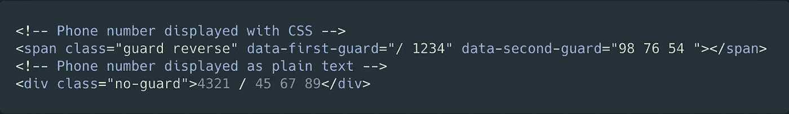
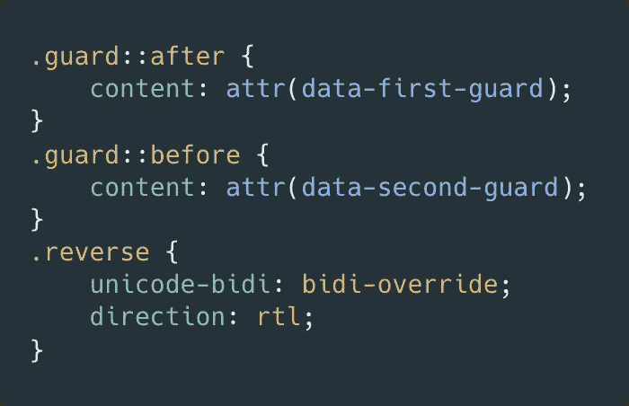

# 如何用 CSS 让抓取工具更难获取你的联系方式

> 原文：<https://itnext.io/how-to-make-it-harder-for-scrapers-to-get-your-contact-data-with-css-26fbe3dfd5e3?source=collection_archive---------5----------------------->

## 收到更少的垃圾邮件，同时仍然向您的访问者提供电子邮件

照片由[迈尔斯·伯克](https://unsplash.com/@milesb?utm_source=medium&utm_medium=referral)在 [Unsplash](https://unsplash.com?utm_source=medium&utm_medium=referral) 拍摄

大多数网页都为访问者提供了联系方式。通常，网页还包括联系人的电子邮件和联系人的电话号码，这样你就可以直接给他们打电话，或者用你最喜欢的电子邮件客户端给他们写邮件。

这本身并不坏，因为你可以为人们提供多种联系你的方式。但是，如果您需要将您的电话或电子邮件作为纯文本显示在您的网页上，那么您应该保护它，以避免可疑人员使用爬虫将您添加到他们的垃圾邮件列表中。

我能想到的解决这个问题的两个基本方法是:

*   使用访问者需要填写的联系表格与您联系。
*   使用 CSS 显示你的联系数据。

第一种方法非常简单，但是第二种方法听起来可能有点奇怪，因为 CSS 是用来修改网站外观的。然而，CSS 远比它看起来更有能力。`[content](https://developer.mozilla.org/en-US/docs/Web/CSS/content)`属性可以用来插入生成的内容。我们可以利用这一点。想法是不要让实际的内容数据成为 DOM 的一部分，而是通过 CSS 显示它。这样，网页抓取者和垃圾邮件发送者将很难获得您的联系数据。

让我们看看如何使用一点 HTML 和 CSS 来尝试解决这个问题。

## 保护您的联系人数据的 HTML 标记

只需将以下两个 CSS 类附加到包含联系人数据的 HTML 元素中。请确保反向拼写联系人数据，并且不要在实际的 HTML 元素中放置任何内容。相反，使用 [HTML 数据属性](https://developer.mozilla.org/en-US/docs/Web/HTML/Global_attributes/data-*)，它们共同构成了您的联系数据(在下面的例子中是一个电话号码)。您可以随意命名数据属性和 CSS 类。

## 用 CSS 保护你的联系人数据

我们利用`content`属性通过 CSS 显示联系人数据。`[attr](https://developer.mozilla.org/en-US/docs/Web/CSS/attr())`是一个 CSS 函数，用于检索所选元素的属性值，并在样式表中使用它。我们还应用了保留文本[方向](https://developer.mozilla.org/en-US/docs/Web/CSS/direction)，这样联系人数据就能正确地显示给用户(因为联系人数据是以逆序存储为 HTML 数据属性的)。

## 用 CSS 保护联系人数据的缺点

*   [**可访问性**](https://developer.mozilla.org/en-US/docs/Web/CSS/content#Accessibility_concerns) : CSS 生成的内容不包含在 DOM 中。如果内容传达的信息对理解页面的目的至关重要，最好将其包含在 HTML 中。一个屏幕阅读器可能无法读出联系人数据，这是由于 CSS 才显示的。
*   UX:你不能选择任何文本内容，因为文本并不存在。因此，访问者不能轻易复制联系信息。
*   **SEO** :如果你想让搜索引擎在搜索结果中显示你的联系方式，那么这种基于 CSS 的方法并不合适。但是请记住，许多垃圾邮件发送者通过网络抓取获得电子邮件，所以如果您的联系电子邮件是明文的，您可能会收到更多的垃圾邮件。
*   **安全**:我想指出的是，这种方法也不是银弹。尽管这很难做到，但创建一个检查 CSS 的脚本也不是不可能的。

## 结论

感谢您阅读这篇短文。如您所见，用 CSS 保护联系人数据很容易。不过，你必须决定保护你的联系数据的好处是否超过潜在的缺点，比如更差的可访问性。这也是一个很好的例子，说明了像`content`这样不太为人所知的 CSS 特性如何被有效地用来解决问题。

你知道解决这个问题的其他方法吗？请在评论中告诉我。