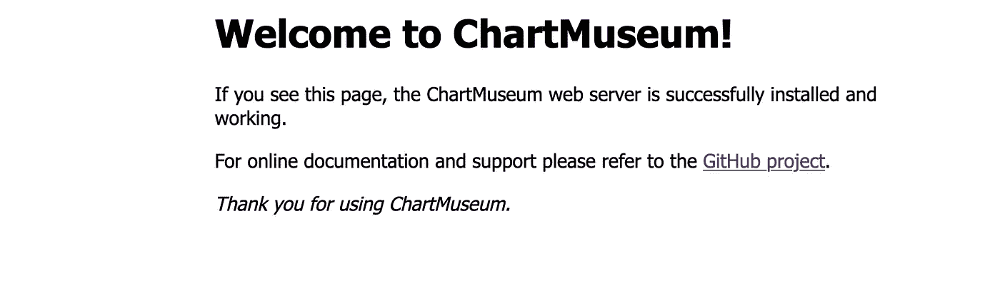

# 如何使用 Helm3 & ChartMuseusm 简化 Kubernetes 部署

> 原文：<https://itnext.io/how-to-make-kubernetes-deployments-easier-witth-helm3-chartmuseusm-34f043b2124c?source=collection_archive---------4----------------------->

## 权威指南

## 如何用 ChartMuseusm 高效使用 Helm3，减少维护？


# 简介:

Helm 是用于 Kubernetes 包管理的工具之一。这是 CNCF 的一个孵化器项目，由 Helm Community 维护。它已经存在了一段时间，最近发布了 Helm v3，旨在通过移除舵杆使其更加灵活和用户友好。以下是 Helm 如何让您的生活变得轻松:

*   轻松创建、共享和托管您自己的包。
*   将软件包安装到任何 Kubernetes 集群中。查询群集以查看安装和运行了哪些软件包。
*   更新、删除、回滚或查看已安装软件包的历史记录。
*   Helm 社区提供的 800 多张图表。

在本文中，我将重点介绍如何使用 Helm3 将应用程序部署到 Kube 集群。如果你还在头盔 2 上，那么这里的是头盔社区提供的迁移到头盔 3 的指南。

# 如何有效地使用头盔:

*   可以定制 Helm 模板来打包您的大多数生产应用程序。创建可用于所有或大部分部署的智能模板。下面是我为本文创建的一个名为 **wonderchart** 的示例图表:

[](https://github.com/Krishna1408/helm3templates) [## Krishna 1408/helm 3 模板

### 海图博物馆和海图博物馆配置的头盔模板。-Krishna 1408/helm 3 模板

github.com](https://github.com/Krishna1408/helm3templates) 

*   部署应用程序时，请始终对图表进行版本控制并使用版本。这将保护您的部署不被破坏，并使回滚更容易。

```
# Chart.yamlapiVersion: v2
name: wonderchart
description: A Helm chart which can be used for multiple purposes.
version: 0.1.2appVersion: 1.0.2
```

*   如果您正在使用某个社区图表，请确保**锁定**正在使用的版本。使用最新版本可以打破现有的应用程序很多时间。示例:

```
# Installing nginx-ingress chart:helm upgrade -i nginx-ingressstable/nginx-ingress -f values.yaml --namespace nginx-ingress --version 1.26.2
```

*   使用像 Chartmuseum 这样的工具，您可以轻松地在存储库之间共享您的模板，并减少维护工作。

# 图表博物馆:

好了，您已经准备好了高度定制的图表。现在唯一剩下的事情就是将它分布到你的微服务的各个存储库。跨微服务复制粘贴或移动图表/模板效率不高，而且会增加维护工作量。在这里，ChartMuseusm 开始发挥作用。

## 为什么选择 ChartMuseum:

*   轻松地跨不同的部署管道或存储库分发图表。
*   它公开了一个用于图表操作的 API。
*   减少维护，因为您可以轻松共享图表或模板。
*   几乎不需要任何努力就可以在 kubernetes 建立起来。
*   支持多个云的后端，例如 AWS S3。

> 他的文章将主要关注 AWS 云。如果您打算在任何其他云上部署它，同样的步骤也适用。

## 在 Kubernetes 上设置 Chartmuseum:

*   为后端创建一个 S3 桶，例如`chart-museum-bucket`
*   创建一个 Kube2Iam 角色，以便 chartmuseusm 可以访问这个存储桶。如果你不使用 Kube2Iam，那么它不是必需的。
*   这是博物馆掌舵图的链接。使用它来创建云或环境的值文件。下面是 AWS 的一个示例值文件。请确保为入口添加机密和正确的 DNS 主机名:

AWS 的图表 museusm 值

*   使用命令部署图表:`helm upgrade -i chartmuseum-test -f values.yaml stable/chartmuseum`
*   图表部署后，您可以通过值文件中为入口指定的 URL 来访问它，在当前示例中:`http://chartmuseum-test.example.com`



## 将图表上传到 Chartmuseum:

这里，我们将使用我的 git 存储库作为示例:

[](https://github.com/Krishna1408/helm3templates) [## Krishna 1408/helm 3 模板

### 海图博物馆和海图博物馆配置的头盔模板。-Krishna 1408/helm 3 模板

github.com](https://github.com/Krishna1408/helm3templates) 

目录结构如下所示:

```
helm3templates
  wonderchart/
  chart-museusm-values/
```

要将 Wonderchart 上传到 chartmuseum created，请遵循以下步骤:

```
cd wonderchart# Create the package to upload
helm package .# Above command will create a package: wonderchart-0.1.1.tgz# Upload the package
curl --data-binary "@wonderchart-0.1.1.tgz" http://chartmuseum-test.example.comapi/charts -u <user>:<password>
```

## 如何使用 Chartmuseum:

*   使用以下命令添加 chartmuseusm repo:

```
helm repo add <repo-name> http://chartmuseum-test.example.com  — username <user> — password <password># Example:
helm repo add chartmuseum-test [http://chartmuseum-test.example.com](http://chartmuseum-test.example.com) ---username user1 --password Password123
```

*   使用`helm repo list`命令查看已添加的回购:

```
$ helm repo listNAME             URLstable           https://kubernetes-charts.storage.googleapis.com/chartmuseum-test      https://chartmuseum-test.example.com
```

*   使用 ChartMuseusm 部署一个测试部署，使用:`helm upgrade -i test-deployment chartmuseum-test/wonderchart -f values.yaml`

> 您可以在您的 CI 中使用本节中提到的命令，并使用 chartmuseum 在 kubernetes 集群上部署应用程序。


希望这篇文章有助于解决你面临的一些问题。在过去的两年里，我一直在使用 Helm and chartmuseum，它帮助我保持物品整洁。快乐驾驶！！！