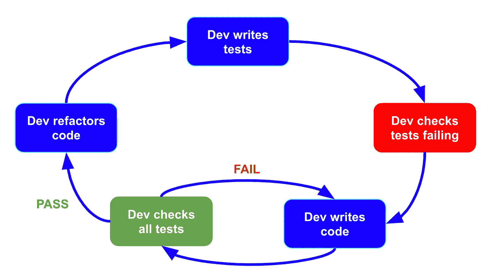
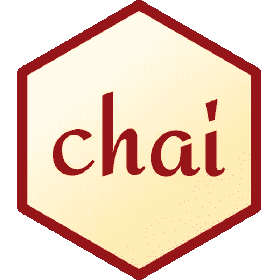
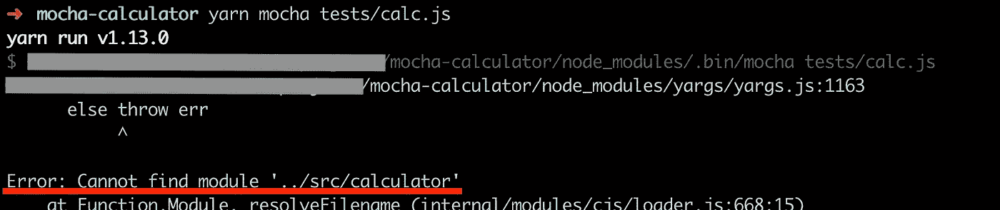
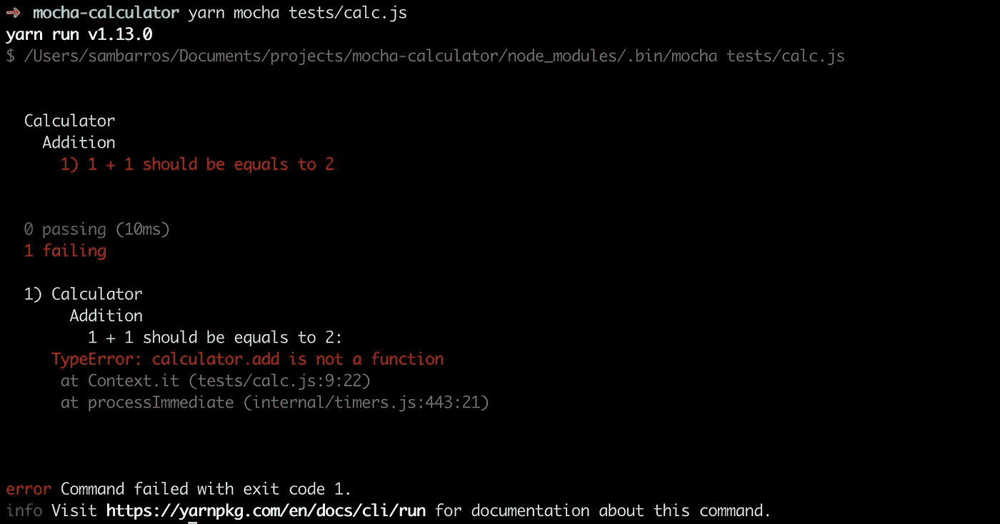
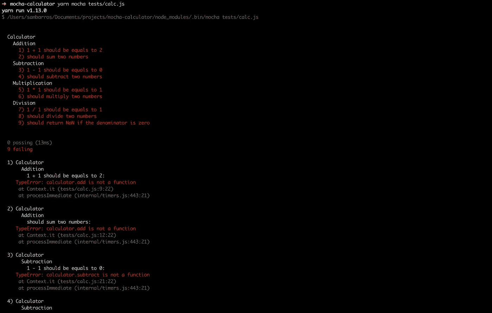
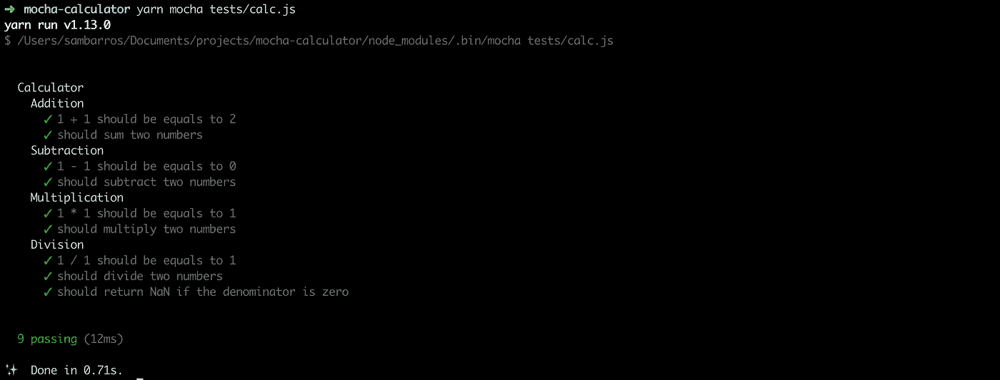

# 如何用柴和摩卡做测试？

> 原文：<https://itnext.io/how-to-make-tests-using-chai-and-mocha-e9db7d8d48bc?source=collection_archive---------0----------------------->

NodeJS 应用程序的 TDD


勒内·波洛克在 [Unsplash](https://unsplash.com?utm_source=medium&utm_medium=referral) 上的照片

大家好，

在本文中，我将向您展示我们如何使用两个非常棒的工具进行测试:[柴](https://www.chaijs.com/)和[摩卡](https://mochajs.org)。

但是首先，我想谈谈测试的重要性。为什么测试如此必要？为此，我应该解释一下什么是 TDD。

**测试驱动开发** (TDD)是一个软件工程过程，它要求在代码验证之前编写单元测试，这依赖于非常短的开发周期的重复，其中需求在测试用例中被转换。这样一来，首先代码会失败(很惨)，然后开发人员应该编写干净的代码来通过测试。

循环很简单。**开发人员编写了一个测试**，这个测试会失败，因为你没有为这些测试开发任何代码，所以开发人员应该**检查测试是否失败**。在这之后，**开发人员编写干净的代码来使测试通过**。同样，开发人员应该**检查是否所有的测试都通过了**，如果没有，就应该回去写代码。最后，我们应该记得让我们的代码总是更好，并且**重构**它来创建新的测试。



TimeDivisionDuplex 时分双工

考虑到这一点，我们可以谈谈柴和摩卡。


摩卡标志

Mocha 是一个运行在 Node.js 和浏览器中的 JavaScript 测试框架。Mocha 允许异步测试、测试覆盖报告和使用任何断言库。



Chai 是一个用于 NodeJS 和浏览器的 BDD / TDD 断言库，可以与任何 javascript 测试框架愉快地配对。

基本上，mocha 是一个框架，chai 是一个库。我们再深入一点摩卡。

# 摩卡:怎么考？

摩卡用钩子来组织它的结构。来说说他们吧。

*   **describe()** :用来分组，可以嵌套的一样深；
*   **it()** :是测试用例；
*   **before()** :它是一个运行在*之前的钩子，首先是* it()或 describe()；
*   **beforeEach()** :是一个运行在 *each* it()或 describe()之前的钩子；
*   **after()** :跟在它后面运行()或 describe()是钩子；
*   **afterEach()** :运行在 *each* it()或 describe()之后的一个钩子；

让我们来看一些场景

## 场景 1:一个测试用例

在这种情况下，我们可以只调用一个单独的 **it()** ，mocha 将运行这个唯一的测试。

## 场景 2:嵌套的测试用例

在这种情况下，我们可以嵌套一些**descriptions()**钩子，最后调用它()来执行测试。

## 场景 3:一个测试中的两个测试用例

这里，在 describe()中，我们有两个 it()来执行测试。

## 场景 4:在第一个测试用例之前只运行一次

在这个场景中，在第一个**之前，** it() mocha 将执行 **before()** 中的内容，但只执行一次。

## 场景 5:在每个测试用例之前运行一次

与 before()(或 describe())相反， **beforeEach()** 是我们拥有的每一个 it()【或 describe()】的每次执行。如果我们有一个 it()，它将只执行一次。如果我们有两个 it()，它将被执行两次。如果我们有三个 it()，它将被执行三次，如此继续下去。

## 场景 6:大型测试中的两个测试

在最后一个场景中，mocha 将嵌套 describe()并执行它()。

# 动手！！！

为了看到它的工作，让我们先做一个简单的例子:一个计算器。让我们创建一个测试用例，其中我们的计算器应该计算以下操作:

*   添加
*   减法
*   增加
*   分开

我们将通过 mocha 使用所有的 TDD 结构。

## 创建项目

首先，让我们创建一个名为 **mocha-chai-tests** 的项目。

```
$ mkdir mocha-chai-tests
$ cd mocha-chai-tests
$ yarn initor $ npm init -y
```

装柴和摩卡。

```
$ yarn add chai mochaor $ npm i chai mocha --save
```

在项目**中，创建一个名为 **tests** 的文件夹和一个名为 **calc.js** 的文件。**

```
$ mkdir tests
$ touch tests/calc.js
```

现在，我们可以创建我们的第一个测试。为此，我们将创建一个 describe()来指示我们正在对一个**计算器**进行测试，并创建另一个 describe()来指示**加法**操作。让我们调用一个名为**的函数，将两个数相加。我们来测试一下 1 加 1 会不会是 2。**

摩卡-柴-测试/测试/计算. js

> 嘿 Sam，但是文件 **src/calculator.js** 不存在。我们该如何处理这件事？

不存在，但应该存在。如此之多，如果我们运行测试，我们会得到一个错误。让我们这样做，看看会发生什么。在终端上键入以下命令:

```
$ yarn mocha tests/calc.js
```



因此，为了解决这个问题，让我们创建文件夹 **src** 和一个名为 **src/calculator.js** 的空文件。

```
$ mkdir src
$ touch src/calculator.js
```

如果你再次运行测试，你会看到另一个结果。

```
$ yarn mocha tests/calc.js
```



意识到你可以看到计算器包含的结构，加法，以及我们测试的失败。测试告诉我们问题出在*计算器。add 不是函数*。这是因为我们在**src/计算器**中没有任何代码。

在开始开发 **src/calculator.js** 上的功能之前，让我们改进我们的测试。

摩卡-柴-测试/测试/计算. js

解释我做了什么。我创建了名为**计算器**的主结构。我正在测试四个数学运算:**加法**、**减法**、**乘法**和**除法**，我在每个 describe()中构造了它们。因此，在**加法**中，我测试 1+1=2，然后我使用随机数，我知道它们的和的结果，并确保我的函数是否返回正确的值。我在**减法**、**乘法**、**除法**上也是遵循同样的思路。但是，在**除法**中，我增加了一个新的测试:如果分母(除数)为零，我们应该返回*未定义的*，因为这个操作是不允许的。

出于好奇，你可以再次提交测试，看看会发生什么。



现在，我们可以进行必要的更改，以使我们的测试通过。让我们编辑文件 src/calculator.js。

mocha-chai-tests/src/calculator . js

如果我们再次提交测试…



现在所有的测试都通过了。

# 使用 chai 和 mocha 测试 API

正如我们所知道的使用 chai 和 mocha 进行测试，让我们使用 API 进行测试。让我们创建我们的文件夹和文件。在同一个文件夹**中，创建:**

```
$ touch tests/api.js
```

而现在，我们来安装一个新的依赖: [**柴-http**](https://www.chaijs.com/plugins/chai-http/) 。它将帮助我们从服务器发出请求。为此，让我们利用并安装 **express** 。

```
$ yarn add chai-http express or$ npm i chai-http express
```

对于这种情况，我将创建一个名为 **createFakeServer** 的函数，这意味着它将在测试期间创建一个服务器，并在最后关闭它。另外，我会在柴身上用不同的测试用例。我将创建一个端点，它将返回一个带有一些信息的特定对象，我们将对它进行验证。

要在提交结束时关闭服务器，我们应该使用“-exit”mocha 选项。

```
$ yarn mocha --exit tests/api.js 
```

我们应该注意一些事情。因为**结束**函数被传递了一个*回调*，断言被异步运行*。这意味着必须使用一种机制来通知测试框架回调已经完成。否则，测试将在检查断言之前通过。在**摩卡**中，这是通过使用**完成**回调来完成的，这表明回调已经完成，断言可以被验证。🙂*

# *结论*

*本教程旨在向您展示 TDD 的理论，以及如何在使用 chai 和 mocha 的节点应用程序中使用 TDD。*

*我想感谢你，我的朋友，花时间阅读这篇文章。*

*我希望这篇文章能帮助你理解如何使用测试来提高你的开发技能。有什么地方需要改进才能写出更好的文章，欢迎随时告诉我。*

*完整的项目你可以在我的 [GitHub](https://github.com/samaronybarros) 中找到，搜索 [jwt-app](https://github.com/samaronybarros/jwt-app) 。*

# *关于我*

*Sam Barros 是一名巴西人，作为一名软件工程师在柏林生活和工作。他是一个技术爱好者，他总是用自己的生活来帮助人们。*

*连接到:*

*   *[领英](https://www.linkedin.com/in/sam-barros/)*
*   *[GitHub](https://github.com/samaronybarros)*
*   *[中等](https://medium.com/@samarony.barros)*
*   *[个人网站](https://sambarros.com/)*

# *我的其他文章*

*[](https://medium.com/swlh/how-do-i-deploy-my-code-to-heroku-using-gitlab-ci-cd-6a232b6be2e4) [## 如何使用 GitLab CI/CD 将我的代码部署到 Heroku？

### 关于如何使用舞台和生产环境的教程

medium.com](https://medium.com/swlh/how-do-i-deploy-my-code-to-heroku-using-gitlab-ci-cd-6a232b6be2e4) [](https://medium.com/swlh/http-an-overview-of-web-development-4f6033efb9da) [## HTTP:web 开发概述

### 开发者指南

medium.com](https://medium.com/swlh/http-an-overview-of-web-development-4f6033efb9da) [](https://medium.com/swlh/authentication-how-to-create-a-nodejs-application-using-jwt-cee8bc5a89fe) [## 身份验证:如何使用 JWT 创建 NodeJS 应用程序

### 用 JSON Web 令牌保护 API

medium.com](https://medium.com/swlh/authentication-how-to-create-a-nodejs-application-using-jwt-cee8bc5a89fe) [](https://medium.com/swlh/what-do-i-need-to-know-about-git-5017bde0b572) [## 关于 Git，我需要了解什么？

### 初学者教程

medium.com](https://medium.com/swlh/what-do-i-need-to-know-about-git-5017bde0b572) [](https://medium.com/swlh/how-to-create-your-first-mern-mongodb-express-js-react-js-and-node-js-stack-7e8b20463e66) [## 如何创建你的第一个 MERN (MongoDB，Express JS，React JS 和 Node JS)栈

### 嗨伙计们，

medium.com](https://medium.com/swlh/how-to-create-your-first-mern-mongodb-express-js-react-js-and-node-js-stack-7e8b20463e66)*