# 如何用 Firebase 动态链接创建自己的网址缩写

> 原文：<https://itnext.io/how-to-make-your-own-url-shortener-with-firebase-dynamic-links-53d163712b06?source=collection_archive---------2----------------------->

## 一个简单的教程，很容易使网址缩短像 bit.ly 或 ow.ly，并推出自己的短域名。

像 bit.ly 和 ow.ly 这样的服务很棒，它们提供了一种简便的方法，可以将长而难记的 URL 缩短为更短、更容易理解的 URL。在调查如何制作自己的版本时，我遇到了 Firebase 动态链接。

Firebase 是谷歌的一个网络和应用平台，为开发者提供负担得起的功能，如托管、无服务器功能、数据库和存储。它有一个优秀的免费层，功能丰富，易于导航，所以让我们开始吧。

## 抢到一个短域名

这是这个过程中最耗时的部分，你能走多短取决于你自己，但是通常任何短于你域名左边 4 个字符的东西都很难找到，或者非常昂贵。

我在 [Namecheap](http://namecheap.pxf.io/PDeVX) 上找到了 tris.cc 和 tris.uk，顾名思义，提供廉价域名，上面有大多数顶级域名，坚持下去，你会找到一个有效的。

## 登录 Firebase

一旦你找到了你的新域，是时候把它和 Firebase 连接起来了。所以首先，创建一个新项目。决定你是否需要数据分析，并遵循设置说明。

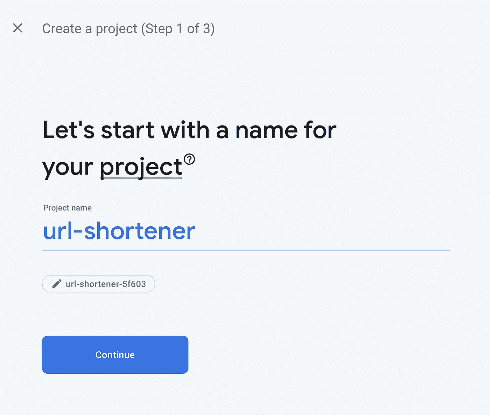

接下来，你要前往导航左侧的主机选项卡，然后单击开始。

不直观地说，它会要求你在你的本地设备上设置 Firebase 工具，你不需要这样做，因为主机只是用来将我们的短 URL 与 Firebase 本身联系起来。

只需点击这些说明(但不要担心遵循它们)

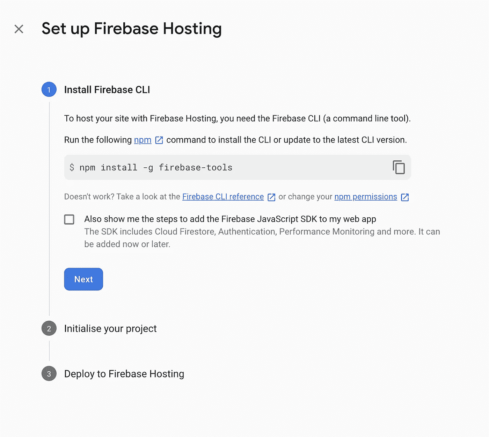

直到您到达以下屏幕

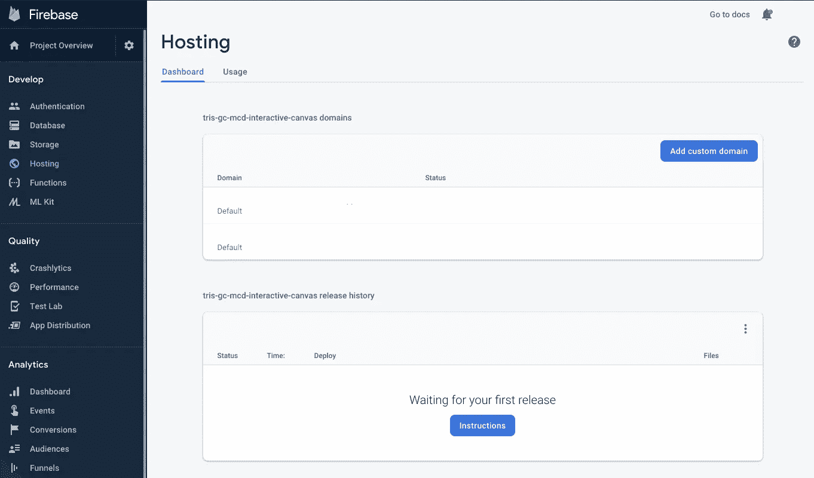

接下来，点击蓝色的“**添加自定义域名**按钮

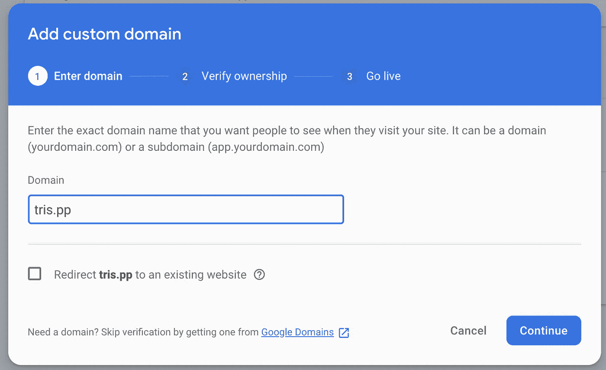

输入你的新域名，或者你的域名是从哪里来的。然后点击继续。

这将给你一个 TXT 记录弹出到你的领域

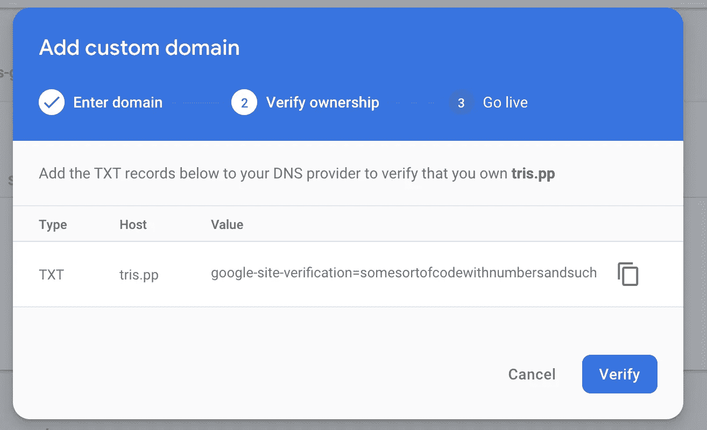

每个域都是不同的，因此说明将取决于您的提供商，但这里有一个基本的 jist:

## 在 Namecheap 上设置记录(其他提供商提供😉)

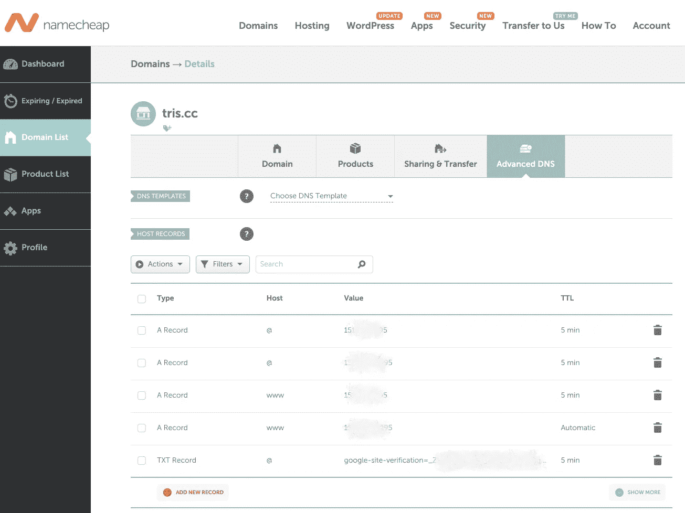

头转向你的新域，头转向高级 DNS，加一个新的`TXT Record`，主机是`@`，相当于说“我”。TTL 为 5 分钟，这减少了域名提供商的传播时间，但 Firebase 仍然需要 48 小时才能看到，所以请耐心等待。

一旦完成，Firebase 将进行验证，然后为您提供一个要添加的记录，同样遵循上面的过程，但是选择`A Record` 而不是`TXT Record`。再次，等待它传播，一旦它的工作，Firebase 会让你知道，你可以点击“查看”在托管面板的网站

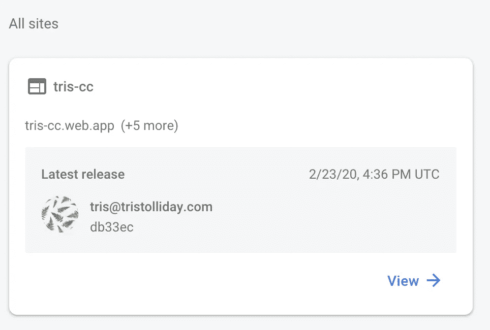

如果状态是“**已连接**”，您就可以开始了。

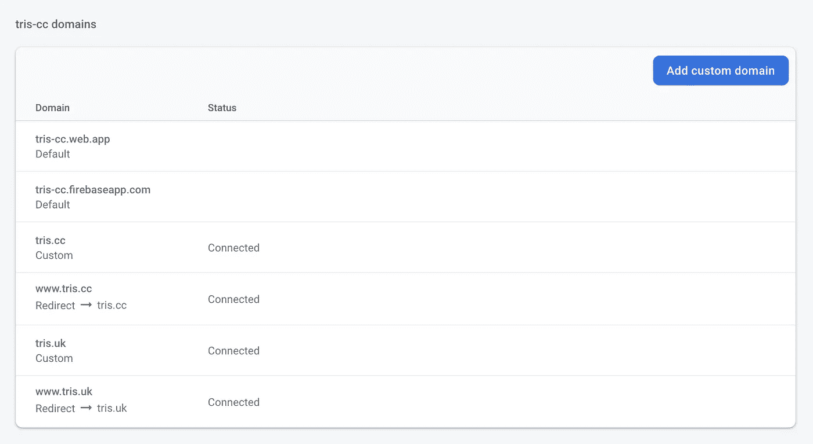

## 创建 Firebase 动态链接

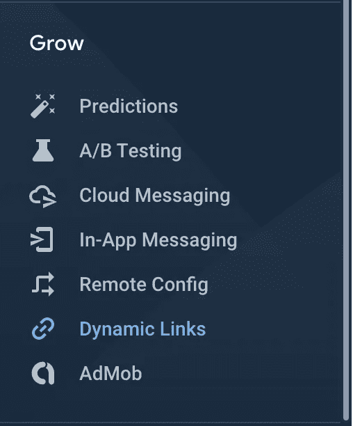

在左侧，向下滚动到“ **Grow** ，你会在下面找到“**动态链接**”。

点击动态链接上的“开始”，会弹出一个模式，如果你点击域名(上面的一切都很好)，你的域名会显示在一个列表中，选择其中一个，然后点击继续

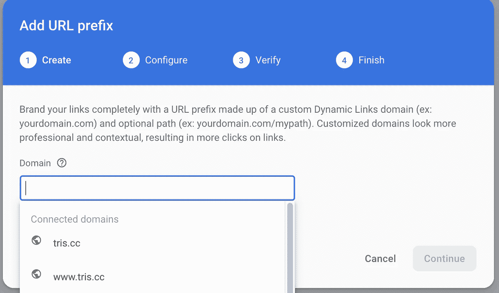

接下来你可以添加一个“路径前缀”，如果你也想把这个域作为你的主域，这很有用，路径前缀会在你所有的快捷链接前添加一个前缀，例如`/landing/`会把所有的链接放在前面，例如`/landing/aGdHx`。

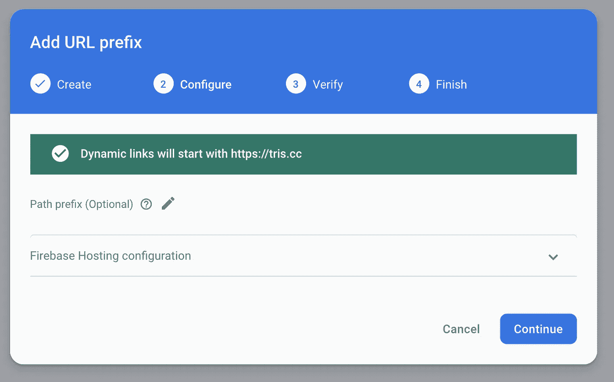

为了简短起见，我保留了这个空白，所以我所有的短链接都尽可能的短。点击 continue，如果一切正常，Verify 应该会自动排序，然后你就可以点击 finish 了！

我们现在已经完成了设置，万岁，所以现在我们可以进行我们的第一个短链接。

## 创建我们的第一个动态链接

点击“新动态链接”，让我们开始填写表格，

你可以选择你自己的链接网址，当你拥有它的时候，你可以想多短就多短。我试了试 tris.cc/-，惊讶地发现它居然有效！

接下来我们把它指向我们想要它去的地方

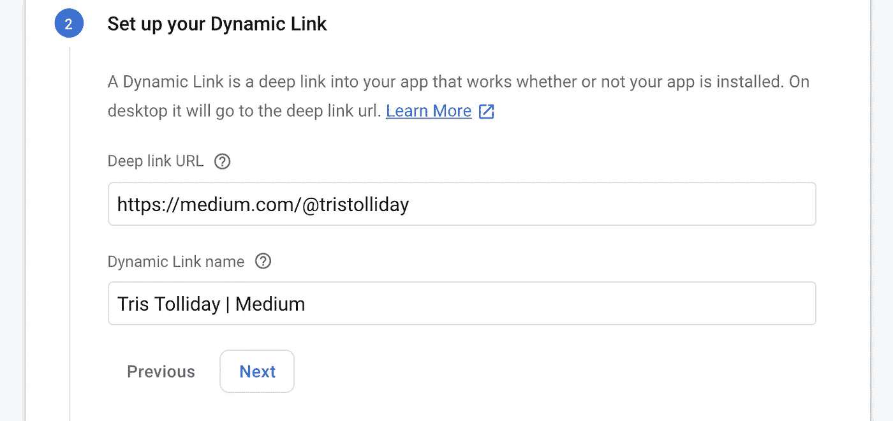

我们现在可以直接使用 Android 和 iOS 浏览器，但如果我们将来需要应用集成，它是可用的

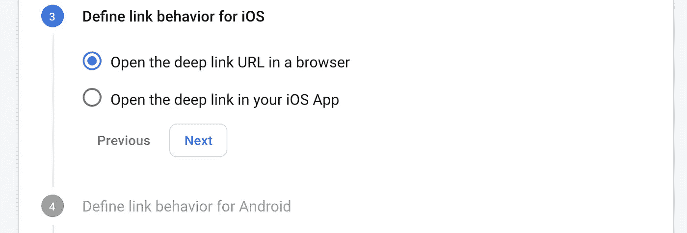

最后，我们添加了社交、元和分析链接:

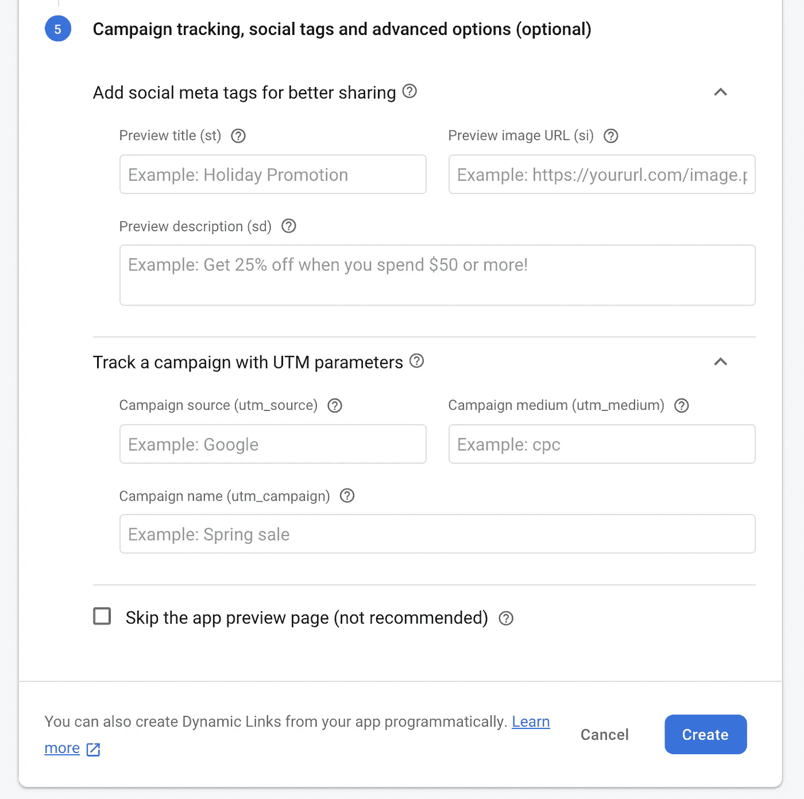

尽管这些都是可选的，我还是强烈推荐添加社交元标签和分析。这些广告会以图片和标题的形式出现在社交网络上(如 Twitter、LinkedIn、脸书),使它们更具吸引力和可点击性。谷歌分析收集 UTM 参数来帮助跟踪用户的旅程。

点击“**创建**”，你就完成了你的第一个自制网址缩短器。

喜欢你读的吗？考虑给一些👏 👏 👏