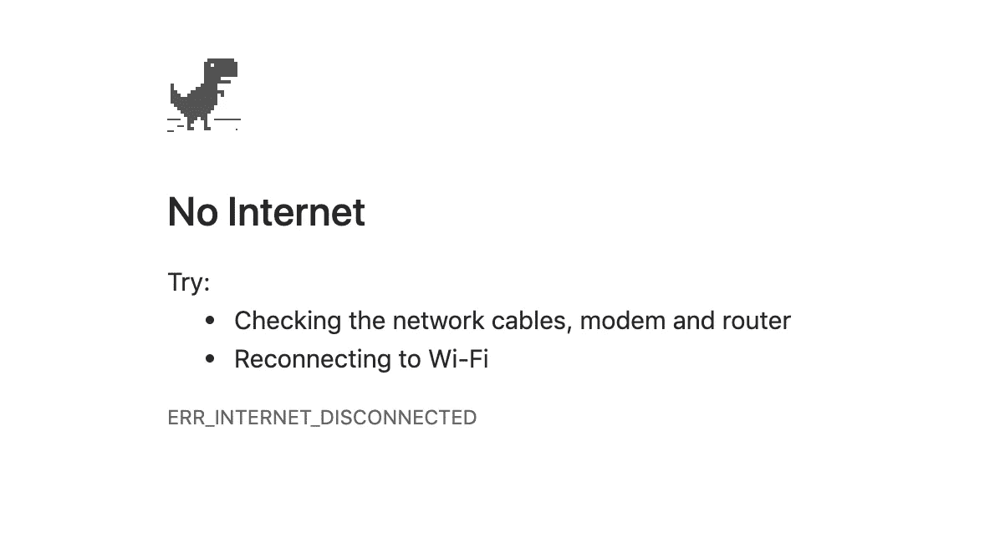
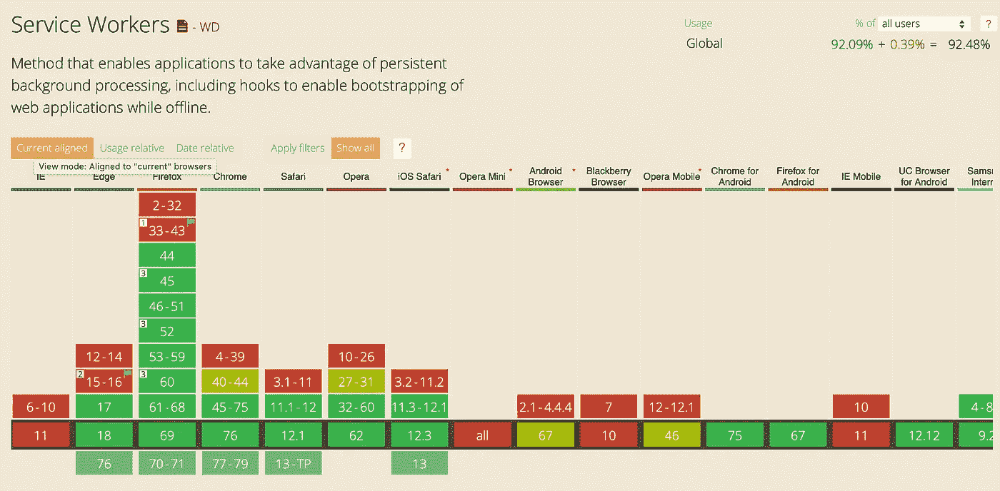

# 如何让你的网站离线工作

> 原文：<https://itnext.io/how-to-make-your-website-work-offline-b5be47b92adc?source=collection_archive---------1----------------------->

只需一个简单的步骤即可获得更好的性能和用户体验


乔纳森·肯珀在 [Unsplash](https://unsplash.com?utm_source=medium&utm_medium=referral) 上拍摄的照片

这是两部分系列的第一部分，[第二部分](https://medium.com/itnext/how-to-make-your-website-work-offline-part-2-6923b9038dd6)

你是否曾经在手机上打开一个原生应用程序，看到一个恐龙的图片，告诉你需要连接到互联网才能使用该应用程序？

不会。大多数原生应用会给你更好的用户体验，至少会向你展示一些东西，直到你再次连接。

但是，如果你断开互联网，访问一个随机的网站，那么通常你得到的是:什么也没有。



恐龙在那里是有原因的

这是一种耻辱，因为没有理由提供如此糟糕的体验，而有许多理由提供更好的体验。如果用户在重新上线之前，至少可以用有限的功能使用你的网站，你就提供了更好的用户体验。

但是完全离线对用户来说并不会发生太多。更常见的情况是，用户的连接速度慢且不稳定。当这种情况发生时，你的网站将永远无法加载，用户也不会再烦了，也不会离开了。

[74%的人会离开一个需要 5 秒以上才能加载的移动网站](https://www.machmetrics.com/speed-blog/how-does-page-load-time-affect-your-site-revenue/)。

> 但是，如果你至少在屏幕上显示最低限度所需的一切都已经存在，而你只需要互联网来获取新数据，那该怎么办呢？

这就是原生应用的工作方式。UI 会立即加载，并从互联网上获取新数据。如果用户离线，陈旧数据会一直显示，直到用户重新在线。

如果你已经确保你的网站的资产(CSS，图片，JavaScript)可以从本地缓存提供，那么这些将会立即可用，而不需要通过网络获取。如果你已经确保你最常访问的页面也在本地缓存，那么这些页面也会立即可用。

这确保了您的网站将提供更好的用户体验和更好的性能。

这就是所有网站应该如何工作的方式，幸运的是，你今天就可以做到。

# 如何让你的网站离线工作

第一步:添加服务人员
第二步:享受！

服务工作者是一个网络工作者，就像你的网站、浏览器和网络之间的代理服务器。它使您能够拦截所有的请求和响应发生在您的网站上。

让这一点沉淀一分钟:通过在你的网站上增加一个服务人员，你现在必须拦截任何传出的请求和传入的响应。仅此一点就足以成为今天在你的网站上添加一个的理由。

这实际上意味着您可以拦截任何请求，并基本上提供您想要的任何服务。您可以直接从本地缓存提供静态资产，甚至从 [IndexedDB](https://developer.mozilla.org/en-US/docs/Web/API/IndexedDB_API) 提供 API 响应和 BLOBs。

服务人员受到所有现代浏览器的支持，并通过*渐进增强*工作，这意味着当用户使用不支持服务人员的旧浏览器访问您的网站时，不会出现任何问题。在这种情况下，它在离线状态下是行不通的。



所有现代浏览器现在支持服务工作者(数据来自 caniuse.com)

要向您的网站添加服务人员，只需创建一个名为`service-worker.js`(任何名称都可以)的文件，并将其放在您的应用程序的根目录下。然后我们调用`navigator.serviceWorker.register`来注册服务人员。

用支票把它包起来，确保旧浏览器不会坏:

```
if('serviceWorker' in navigator) {
  let registration;

  const registerServiceWorker = async () => {
    registration = await          navigator.serviceWorker.register('./service-worker.js');
  };

  registerServiceWorker();
}
```

太好了！您的站点现在由一个服务人员控制，但是由于文件仍然是空的，它实际上不会做任何事情。服务工作者是事件驱动的 Web 工作者，因此我们需要添加代码来响应这些事件，从生命周期事件开始。

# 服务人员生命周期

为了确保服务人员不会破坏任何东西，他们有一个严格定义的生命周期。这可以确保只有一个服务人员控制网站的某个部分(因此只有一个版本的网站存在)。

理论上，你可以让多个服务人员控制你的网站，但前提是他们控制不同的范围。现在，知道只有一个服务人员可以控制某个范围就足够了。

要了解服务人员，了解服务人员的生命周期至关重要。

## 安装事件

第一个被激发的事件是`install`事件。当服务工作程序被成功下载、解析和执行时，它被触发。如果在此阶段出现任何错误，从`navigator.serviceWorker.register`返回的承诺被拒绝，`install`事件将*而不是*触发，服务人员将被丢弃。如果已经有一个服务工作程序在运行，它将继续运行。

如果成功安装了服务工作器，将触发`install`事件，在事件处理程序中，您应该缓存您的静态资产。缓存是使用位于`window.caches`的`[CacheStorage](https://developer.mozilla.org/en-US/docs/Web/API/CacheStorage)`对象完成的。

这是我们缓存所有需要的 HTML、CSS、JavaScript、图像、字体等的部分。显示网站的最小用户界面。当用户再次访问该站点或刷新页面时，所有内容都将从本地缓存中提供，这意味着它将被立即提供。

> 不需要从网络上获取任何东西，它已经在那里了。

为了缓存所有资产，我们首先打开一个缓存，然后将一个指向我们想要缓存的资产的路径数组传递给`addAll`方法。`open`方法返回一个承诺，我们将这个承诺传递给安装事件的`waitUntil`方法，以便在安装完成时向浏览器发出信号，如果安装成功:

```
const cacheName = 'my-cache';
const filestoCache = [
  '/',
  '/about',
  '/index.html',
  '/about.html',
  '/css/styles.css',
  '/js/app.js',
  '/img/logo.png'
]; self.addEventListener('install', e => {
  e.waitUntil(
    caches.open(cacheName)
    .then(cache => cache.addAll(filesToCache))
  );
});
```

同样，如果传递给`e.waitUntil`的承诺被拒绝，它将向浏览器发出安装失败的信号，新的服务工作者将被丢弃，留下现有的(如果存在)服务工作者运行。

例如，如果您有不指向特定文件(如`/about.html`)而只是指向`/about`的路径，您可能也需要缓存这些路径。例如，当你的网站是一个单页应用程序，并且每个请求都被路由到`/index.html`时，就是这种情况。

然后，您应该缓存路径，以便您的应用程序仍然可以工作并提供正确的视图。

## 激活事件

当成功安装(新的)服务工作者时，将触发`activate`事件。服务人员现在准备好控制您的网站，*但它还不会控制它。*

只有当你在后刷新页面*时，服务人员才被激活，并控制你的网站。这也是为了确保没有任何损坏。*

服务人员控制的网站窗口称为其`clients`。在`install`事件的事件处理程序中，可以通过调用`self.clients.claim()`来控制不受控制的`clients`。

服务人员将立即控制网站，尽管这仅在服务人员第一次被激活时有效。当激活新版本的服务人员时，它不起作用:

```
self.addEventListener('activate', e => self.clients.claim());
```

## 拦截请求和响应

现在是您一直在等待的事情:拦截请求和响应。

每当网站请求服务人员控制时，就会触发一个`fetch`事件。`FetchEvent`的`request`属性提供了对请求的访问。在事件处理程序中，我们可以为之前在`install`事件处理程序中添加到缓存中的静态资产提供服务:

```
self.addEventListener('fetch', e => {
  e.respondWith(
    caches.match(e.request)
    .then(response => response ? response : fetch(e.request))
  )
});
```

通过调用`FetchEvent`的`respondWith`方法，浏览器的默认获取处理被阻止。我们称之为承诺，承诺解决了一个`Response`然后服务。

对`caches.match()`的调用检查缓存以查看资产是否被缓存。如果是，它将作为缓存中的一个`Response`，但是如果不是，我们通过调用`fetch(e.request)`从网络中获取它。

这确保了静态资产将*总是*被缓存，只要它们以前被缓存过。现在，无论您网站的用户何时处于糟糕的移动连接甚至完全离线状态，缓存的资产仍将提供服务，您能够为您的用户提供良好的用户体验。

如果您已经确保缓存所有静态资产和所有可能的路线，任何访问您网站的任何页面至少一次的用户现在都可以离线使用您的网站。

这是服务人员的完整代码，他们会处理好这一切。将它放在网站根目录下的一个文件中，并给它一个名字，例如`service-worker.js`:

然后在代码的早期，注册服务工作者:

```
if('serviceWorker' in navigator) {
  let registration;

  const registerServiceWorker = async () => {
    registration = await          navigator.serviceWorker.register('./service-worker.js');
  };

  registerServiceWorker();
}
```

恭喜你！您的网站现在脱机工作，您为您的用户提供了更好的体验和更好的性能！

# 接下来去哪里

为了进一步增强网站的离线能力和性能，我将在下一篇文章中展示如何缓存 API 调用，这样动态内容也可以立即可用。