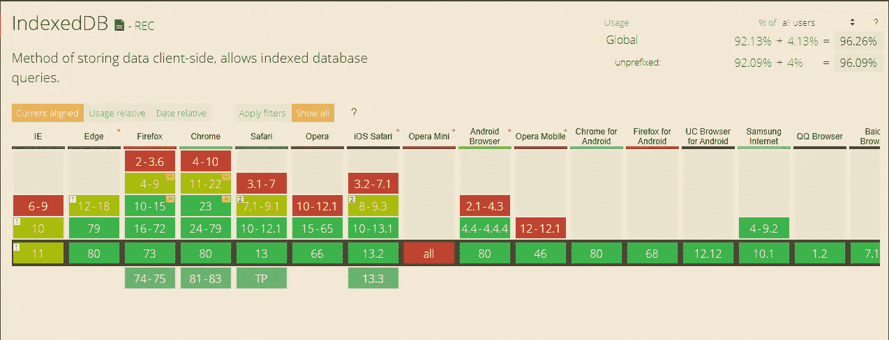

# 如何让你的网站离线工作第二部分

> 原文：<https://itnext.io/how-to-make-your-website-work-offline-part-2-6923b9038dd6?source=collection_archive---------3----------------------->

您的动态内容也可以脱机使用


Maksym Kaharlytskyi 在 [Unsplash](https://unsplash.com?utm_source=medium&utm_medium=referral) 上拍摄的照片

在我的上一篇文章中，我向你展示了如何通过使用一个服务人员来让你的静态网站离线工作。

但是今天大多数网站不仅有静态内容，还有动态内容。例如，这些内容可能来自 REST API，当客户端离线时，这种类型的内容通常不可用。

幸运的是，浏览器为此提供了一个解决方案，服务人员已经为您做好了准备，因为您也可以缓存它。

# 缓存动态内容

每当向 API 发出请求时，我们可以缓存响应以备后用。如果再次发出相同的请求，但由于某种原因失败了，我们只提供之前缓存的响应。

这些响应可以使用 [IndexedDB](https://developer.mozilla.org/en-US/docs/Web/API/IndexedDB_API) 进行缓存，这是一个面向对象的客户端键值存储，可以持久存储大量的结构化数据。虽然`localStorage`和`sessionStorage`对于存储少量数据很有用，但是 IndexedDB 对于大量数据更有用。

IndexedDB 拥有出色的浏览器支持:



来自 caniuse.com 的 IndexedDB 浏览器支持

因为 IndexedDB 中的所有数据都是用一个键索引的，所以它提供了对这些数据的高性能搜索，这使得它非常适合缓存 API 响应。

下面是`fetch`事件处理程序，它负责缓存我们的 API 请求和响应:

```
self.addEventListener('fetch', e => {
  const {method, url} = e.request;
  const requestClone = e.request.clone(); // if the url of the request contains '/api', it's a call to 
  // our api
  if(url.includes('/api')) {
    e.respondWith(
      fetch(e.request)
      .then(response => {
        const responseClone = response.clone(); // here we cache the response for future use
        if(method === 'GET') {
          cacheApiResponse(responseClone);
        } return response;
      })
      .catch(err => {         
         // something went wrong in calling our api, let serve 
         // the response we cached earlier
         if(method === 'GET') {
           return getCachedApiResponse(e.request);
         }
         // if it was a POST request we tried to write something 
         // to our api.
         // let's save the request and try again later     
         if(method === 'POST') {
           cacheApiRequest(requestClone); return new Response(JSON.stringify({
              message: 'POST request was cached'
           }));
         }
       })
   );
 }
 else {
   e.respondWith(
     caches.match(e.request)
     .then(response => response ? response : fetch(e.request))
   );
 }
});
```

假设 API 的 url 是`https://www.oursite.com/api`，那么当请求的 URL 包含`/api`时，我们知道这是对 API 的调用。然后我们通过用`fetch(e.request)`调用`e.respondWith`来传递它，这基本上只是转发相同的请求。

当响应到达时，它需要被克隆，然后用`cacheApiResponse`方法保存到 IndexedDB(下面的实现),然后被服务。

然而，当获取时发生错误，并且从`fetch(e.request)`返回的承诺被拒绝时，我们捕捉错误并提供一个 API 响应，该响应在之前用`getCachedApiResponse(e.request)`缓存。

通过这种方式，我们可以确保对动态内容的调用也会成功，即使用户离线或者 API 由于其他原因无法访问。

## 自动同步

上面的例子都是关于获取数据的 GET 请求，但是如果你需要 POST 请求来在后端保存数据呢？

正如您所看到的，在上面的例子中的`catch`子句中有一个 POST 请求的检查:

```
.catch(err => {
  ... if(method === 'POST') {
    cacheApiRequest(requestClone); return new Response(JSON.stringify({
      message: 'POST request was cached'
    }));
  }
})
```

这意味着每当对 API 的 POST 请求失败时，例如，由于用户离线，使用`cacheApiRequest`方法(下面的实现)保存请求的一个克隆，并返回一个定制响应，指示 POST 请求已保存。

这允许我们保存对 IndexedDB 所做的所有更改，并在用户重新上线时将这些更改发送到后端。

每当用户的连接恢复时，就会触发一个`sync`事件，我们可以重试之前进行的 API 调用:

```
self.addEventListener('sync', e => {
    e.waitUntil(retryApiCalls());
});
```

## 预加载响应

到目前为止，我们已经看到了如何为之前缓存的静态资产提供服务，以及如何保存 API 响应以便以后在 API 不可用或用户离线时从缓存中为它们提供服务。

但是获取动态内容的 API 调用必须首先至少进行一次*，这样它们才能被缓存以供后续调用。这意味着任何不是首先进行的 API 调用都不会被缓存，因此当用户脱机时也不可用。*

*如果你的网站只包含静态的 HTML 页面，你可以在`install`事件中缓存这些页面，把它们提供给`cache.addAll()`调用:*

```
*const filesToCache = [
  '/index.html',
  '/about.html',
  '/blog/posting.html'...
];self.addEventListener('install', e => {
  e.waitUntil(
    caches.open(cacheName)
    .then(cache => cache.addAll(filesToCache))
  );
});*
```

*我们实际上可以为任何或某些 API 调用做同样的事情，这些 API 调用将从我们的网站预取内容。例如，如果你的网站是一个博客，你可以预先获取你最近或最受欢迎的帖子，这样即使用户离线，他们也可以立即获得。*

*用户只需要访问你的网站的一个页面，当服务人员被激活时，我们预取我们想要的内容。合适的位置是服务人员的`activate`事件:*

```
*self.addEventListener('activate', e => {
  ... const postings = [
    '/api/blog/1'
    '/api/blog/12'
    '/api/blog/7'
  ];

  e.waitUntil(async () => {
    await Promise.all(postings.map(url => prefetch(url)));
  }());
});const prefetch = async url => {
  const response = await fetch(url);
  const clone = response.clone();

  cacheApiResponse(clone);
};*
```

*在`activate`事件中，我们迭代一个数组，该数组包含我们最受欢迎的博客帖子的 URL。然后在后台获取每个帖子，并使用`cacheApiResponse`方法存储。*

*现在，我们能够从缓存中提供所有这些帖子，因此它们将立即可用，而无需网络呼叫。*

*不仅你的网站现在完全可以离线使用，它还会立即加载，给用户一个类似应用程序的体验。*

*我建议你深入 [IndexedDB](https://developer.mozilla.org/en-US/docs/Web/API/IndexedDB_API) 学习它的 API。挺简单的，很好学。*

*以下是完整的服务人员，评论中有解释:*

*缓存 API 请求和响应的服务工作者*

# *如何以及何时缓存*

*在上面的服务工作者示例中，我们首先尝试从缓存中提供 API 调用，如果失败，我们尝试网络。*

*当然，我们也可以通过网络调用所有 API，并且在网络不可用时只提供缓存的响应。其他策略也是可能的，例如仅网络或仅高速缓存。*

*在下一篇文章中，我们将深入探讨我们可以采用的各种缓存策略。*