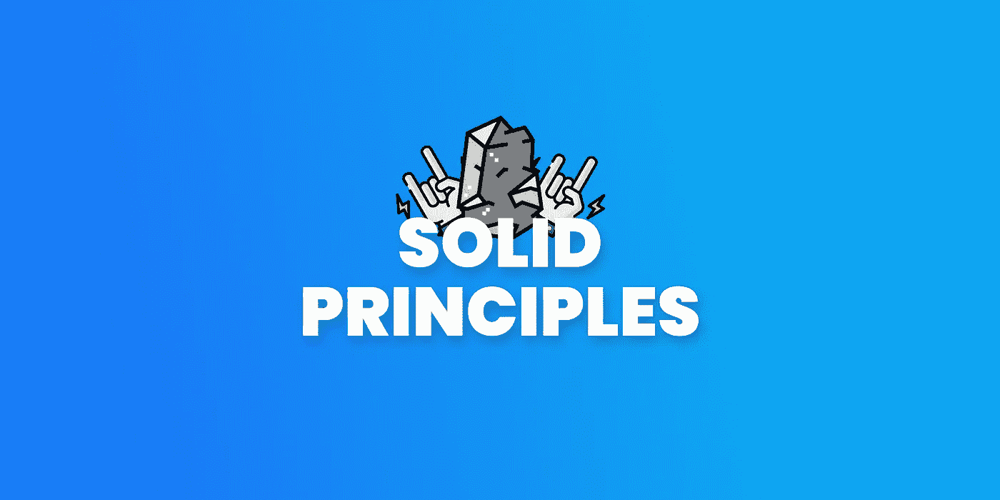
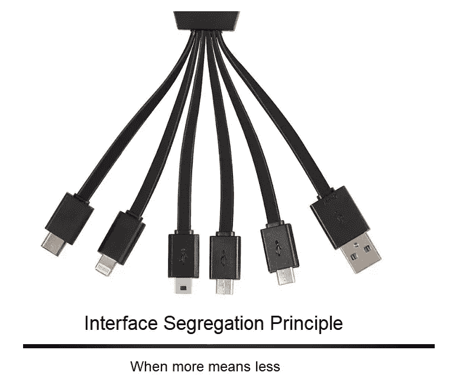
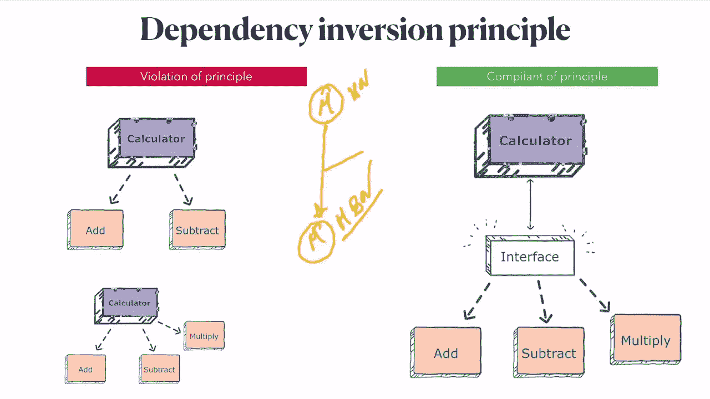

# 如何让你的生活坚如磐石

> 原文：<https://itnext.io/how-to-make-yours-rock-solid-66ea50bce31f?source=collection_archive---------3----------------------->

## 颤振/飞镖的基本原理

如果你想让你的工作永远快乐。你的应用程序需要坚如磐石，而你却乐此不疲，对吗？所以让我们来学习如何在编程上扎实！

# 坚实的原则

1.  SIP——单一责任原则
2.  OCP —开放封闭原则
3.  LSP——利斯科夫替代原理
4.  ISP —接口隔离原则
5.  倾角相关反演原理

# 1.SIP——单一责任原则

> 每个类或函数应该只解决一个问题。

## 为什么？

如果代码出了问题，我们可以通过这种方式立即发现问题！

如果我们需要再次使用该方法，我们不需要再次复制粘贴，只需再次使用相同的方法就可以了！！

## 例子

# 2.OCP —开放封闭原则

> 你应该能够扩展一个(类、模块、函数等。)的行为而不修改它

## 为什么？

因为，如果您以前在某个地方使用过该方法，如果您修改了它，您就可以破坏旧的功能

## 例子

# 3.LSP——利斯科夫替代原理

> 基类必须能够在不知道的情况下使用派生类的对象。

## 为什么？

大佬们只能说需要做什么！而不是怎么做！因为每个人的工作方式不同，对吗？

## 例子

[https://blog . ndepend . com/solid-design-the-interface-segregation-principle-ISP/](https://blog.ndepend.com/solid-design-the-interface-segregation-principle-isp/)

# 4.ISP —接口隔离原则

> **客户端不应该暴露给它不需要的方法**。

## 为什么？

如果一个普通用户可以看到管理其他用户的帐户，这将会造成不必要的混乱并导致安全问题，对吗？

## 例子

【https://www.youtube.com/watch?v=ykGW0Zen0YY 

# 5.倾角相关反演原理

> 高级模块/类不应该依赖于低级模块/类。两者都应该依赖于抽象。

## 为什么？

让我们假设我们有一个与 firebase 集成的应用程序，但后来我们想将 DB 迁移到 MongoDB 服务器。如果我们让它们依赖于一个接口，那就不会有任何问题，我们只需要改变服务。

就像换玩具电池一样。玩具仍然是旧玩具，但电池是新电池

## 例子

 [## Dart/Flutter 中的 FutureOr 是什么？

### 什么是 FutureOr，我们为什么需要它？什么时候用？让我们深潜进去吧！

itnext.io](/what-is-futureor-in-dart-flutter-681091162c57) 

# 参考

 [## 依赖倒置原则:理解低层组件和高层组件如何…

### 我正在学习依赖倒置原则。它指出:高级模块不应该依赖于…

softwareengineering.stackexchange.com](https://softwareengineering.stackexchange.com/questions/235025/dependency-inversion-principle-understanding-how-both-low-level-components-and)  [## 在飞镖中是坚固的。

### 坚实的原则。

ankitgg66.medium.com](https://ankitgg66.medium.com/being-solid-in-dart-1933037168ae)  [## 清洁颤振第二卷:固体原理

### 💡建议:尽可能多的回到这篇文章来澄清下面的内容，因为有…

开发到](https://dev.to/elianmortega/vol-2-solid-rules-in-dart-2e6m) 

# 感谢您的阅读！

如果你喜欢这篇文章，请点击👏按钮(你知道你可以升到 50 吗？)