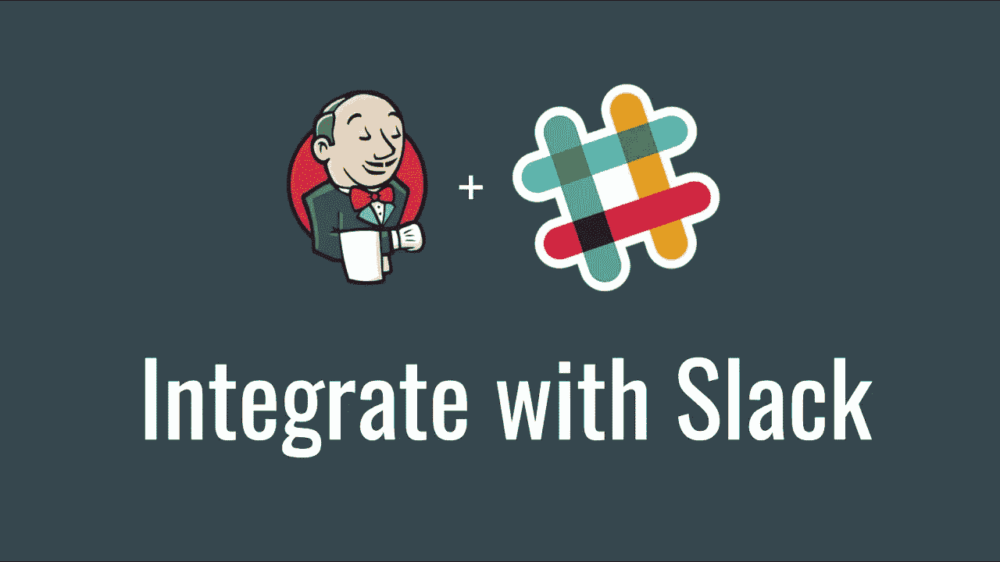
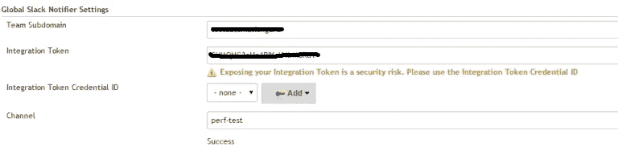
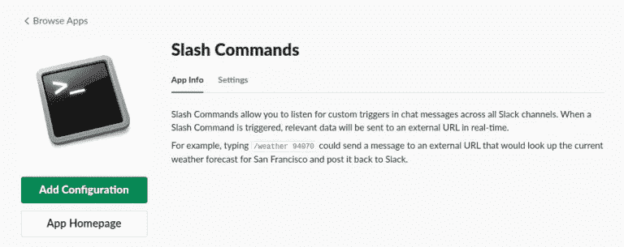
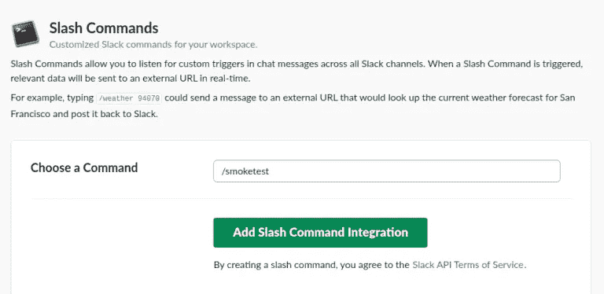
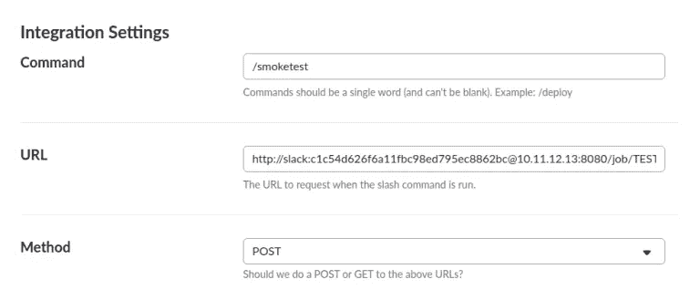
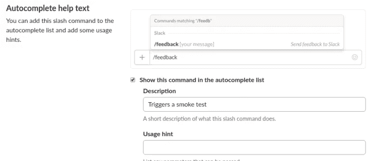

# 如何从懈怠中管理詹金斯

> 原文：<https://itnext.io/how-to-manage-jenkins-from-slack-7bb42f8f2001?source=collection_archive---------1----------------------->


测试自动化不仅仅是自动化应用程序。我会说，甚至以编程的方式与团队共享测试结果也是测试自动化的一部分。因此，团队不依赖任何个人来获得结果。团队还可以根据测试结果立即采取进一步的行动。

在本文中，我们将看到如何在 Slack 中共享测试结果。另外，您如何在 Jenkins/CI 工具中触发自动化测试套件的执行。

**松弛**

我们在组织中使用松弛。您也可以使用 Slack 在您组织的团队成员之间交流信息。Slack 是一个很好的工具，它让每个人都了解最新情况，减少不必要的电子邮件。

**Slack** 是工作的协作枢纽，无论你做什么工作。这是一个对话、决策和信息唾手可得的地方。有了 Slack，您的团队可以更好地联系起来。
你可以使用这个 app [on-off.site](https://slack.com/)

**Slack — Jenkins CI 应用程序—集成**



我假设我们大多数人使用 Jenkins 进行连续的自动化测试。所以在这篇文章中，我提供了集成 Jenkins 和 Slack 的步骤。如果你使用其他工具，如 TeamCity、Bamboo 等，这个过程几乎还是一样的。

**松弛**:

*   转到[https://slack.com](https://slack.com/)
*   浏览“詹金斯”应用程序
*   在您的空闲时间安装 Jenkins CI 应用程序
*   点击“添加配置”


*   记下团队域和令牌
*   选择我们要放置结果的通道


詹金斯

*   转到管理 Jenkins ->管理插件->可用选项卡
*   安装时差通知插件
*   更新备用域和令牌= >管理 Jenkins ->配置系统->全局备用通知程序设置



*   单击“Test Connection”——您应该会在 Jenkins 中看到“success”消息，并在 slack 通道中看到以下消息。


**詹金斯—测试工作**

*   为测试创建一个 Jenkins 作业
*   用您想要的自定义消息更新构建后操作，如下所示


**詹金斯管道**

您需要向插件添加一个调用

```
slackSend color: 'good', message: 'Message from Jenkins Pipeline'
```

接下来，我们需要确定消息的正确颜色和信息文本:

```
def notifySlack(String buildStatus = 'STARTED') {

    // Build status of null means success.
    buildStatus = buildStatus ?: 'SUCCESS'
    def color
    if (buildStatus == 'STARTED') {
        color = '#D4DADF'
    } else if (buildStatus == 'SUCCESS') {
        color = '#BDFFC3'
    } else if (buildStatus == 'UNSTABLE') {
        color = '#FFFE89'
    } else {
        color = '#FF9FA1'
    }
    def msg = "${buildStatus}: `${env.JOB_NAME}` #${env.BUILD_NUMBER}:\n${env.BUILD_URL}"
    slackSend(color: color, message: msg)
}
node {
    try {
        notifySlack()
        sh 'runbuild'
    } catch (e) {
        currentBuild.result = 'FAILURE'
        throw e
    } finally {
        notifySlack(currentBuild.result)
    }
}
```

**总结**

作为持续测试过程的一部分，我们定期使用 Jenkins 运行自动化脚本。只有你，作为测试工程师，大多知道结果。其他团队成员可能不知道测试结果。使用自动化工具，我们可以创建自动化脚本，使用 Slack API，我们可以以编程方式共享结果。

**创建新用户**

让我们从在 Jenkins 中创建一个新用户供 slack 使用开始。记下 API 令牌。

假设这个空闲用户有足够的权限触发作业。

执行下面的 CURL 命令，验证用户是否能够调用作业。

这是 URL 的格式。用适当的信息替换[ ]中的内容。

```
curl -X POST http:*//[user:token]@[jenkins-host-with-port]/job/[job-name]/build*
```

在我的例子中，我尝试了如下所示的方法。

```
curl -X POST http:*//slack:c1c54d626f6a11fbc98ed795ec8862bc@10.11.12.13:8080/job/TEST_SMOCK_SLACK_JOB_DEMO/build*
```

**松弛-斜线命令**

为了调用上面的 Jenkins 作业，我们将使用 Slack 的 slash 命令。所以每当你在斜杠后面输入一些东西——例如:'/smoke tests '——Slack 会把它当作一个命令，并且可以响应这个命令。因此，例如，Slack 可以被配置为提供您所在城市的天气报告。

为了调用上面的 Jenkins 作业，我们将使用 Slack 的 slash 命令。所以每当你在斜杠后面输入一些东西——例如:'/smoke tests '——Slack 会把它当作一个命令，并且可以响应这个命令。因此，例如，Slack 可以被配置为提供您所在城市的天气报告。



*   转到您的松弛配置以添加斜线配置。
*   我将创建一个冒烟测试命令——这样我的团队就可以从 slack 中触发冒烟测试来检查应用程序的健康状况。



*   如下所示添加集成设置。提供我们需要调用来触发 Jenkins 作业的 URL。



*   选择自动完成帮助



*   配置完成后，您可以立即在空闲时间进行验证。只需键入“/s”就可以看到“smoketest”命令


*   调用命令—检查 Jenkins 是否能够触发作业。


*   如果作业需要参数，请使用下面的 URL 格式调用带有默认参数的作业。

```
curl -X POST http:*//[username:token]@[jenkins-host-with-port]/job/[job-name]/buildWithParameters*
```

*   如果需要传递任何特定的参数，只需在参数中追加变量和值。

```
curl -X POST http:*//[username:token]@[jenkins-host-with-port]/job/[job-name]/buildWithParameters?ENVIRONMENT=UAT*
```

*   要获得作业的状态/结果，应该将作业配置为将结果发送回 Slack。你可以在这里找到一篇关于这个的文章。

**注**

*   为了让上述方法起作用，Slack 应该可以访问您的 Jenkins 服务器。确保它没有被防火墙阻止。

**总结**

Slack 命令非常有用，在获取信息或触发您可能经常做的事情时非常方便。通过这样做，团队中的任何非技术用户都可以通过直接调用 slash 命令来使用您的自动化测试脚本。