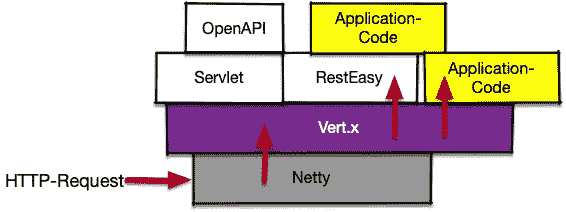

# 如何在 Quarkus 中修改传入的 HTTP 头

> 原文：<https://itnext.io/how-to-mangle-http-headers-in-quarkus-d91a904adea7?source=collection_archive---------4----------------------->

与我上一篇文章中的[类似，我们需要对](https://medium.com/@pilhuhn/how-to-rewrite-http-request-paths-in-quarkus-aa85c3400d95) [Quarkus](https://quarkus.io/) 中的传入 HTTP-header 进行一些更改:用户在没有请求特定媒体类型的情况下调用 */openapi.json* 端点，这使得 Quarkus 返回 Yaml。


图片来源[成功](https://pixabay.com/de/users/succo-96729/?utm_source=link-attribution&utm_medium=referral&utm_campaign=image&utm_content=1311577)失败[图片来源](https://pixabay.com/de/?utm_source=link-attribution&utm_medium=referral&utm_campaign=image&utm_content=1311577)

用户习惯于假设 URL 路径的后缀也决定了媒体类型——可能是因为在 Windows 上是这样的——他们期望调用 */openapi.json* 来返回 json 格式的数据。

查看 [Quarkus 源代码](https://github.com/quarkusio/quarkus)显示[open API 数据的默认媒体类型是 Yaml](https://github.com/quarkusio/quarkus/blob/master/extensions/smallrye-openapi/runtime/src/main/java/io/quarkus/smallrye/openapi/runtime/OpenApiHandler.java#L65) 。如果用户需要 Json，需要传递一个额外的 HTTP Accept 头，但用户代码没有提供(因为它已经有了后缀)。

## Vert.x 路由器拯救世界

正如我之前所展示的，所有 HTTP 请求都通过 Quarkus 的 [Vert.x Web 路由器](https://vertx.io/docs/vertx-web/java/#_basic_vert_x_web_concepts)层:



Quarkus 中 HTTP 请求的路径

这意味着我们可以使用一个[vert . x](https://vertx.io/)route filter 来完成这项工作:

```
@**RouteFilter**(401)                                          // (1)
void oasAcceptHeaderMangler(RoutingContext **rc**) {
    if (rc.normalisedPath().endsWith("openapi.json")) {    // (2)
        rc.request().headers().remove("Accept");           // (3)
        rc.request().headers()
                    .add("Accept","application/json");     
    }
    rc.next();                                             // (4)
}
```

我们在(1)中用 *RouteFilter* 对该方法进行了注释。如果我们的路径以“openapi.json”结束，我们开始修改请求(2)。当我们查看来自 *RoutingContext* 的 *normalisedPath()* 时，我们不需要担心查询参数，不像我在另一篇文章中的情况，我们必须使用 HttpRequest-URI。
下一步，当旧的 Accpet-Header 存在时，我删除它，并添加一个请求 Json (3)的 Accpet-Header。最后，但同样重要的是，我们告诉 Vert.x 调用链中的下一个过滤器或分派到下一层(4)。如果我们忘记这一点，夸库斯就会被绞死。

## 结论

[Vert.x web 路由器](https://vertx.io/docs/vertx-web/java/#_basic_vert_x_web_concepts)是 Quarkus 中的逻辑点，用于独立于更高层中使用的应用程序框架来修改 HTTP 请求。在[的上一篇文章](https://medium.com/@pilhuhn/how-to-rewrite-http-request-paths-in-quarkus-aa85c3400d95)中，我们已经看到了如何使用它来改变请求路径。

[反应式路由指南](https://quarkus.io/guides/reactive-routes)讲述了更多关于 Quarkus 及其 Vert.x 网络路由器的信息。