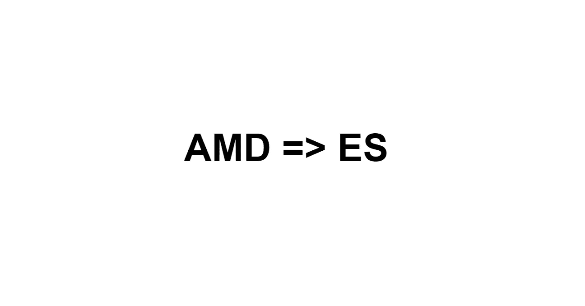
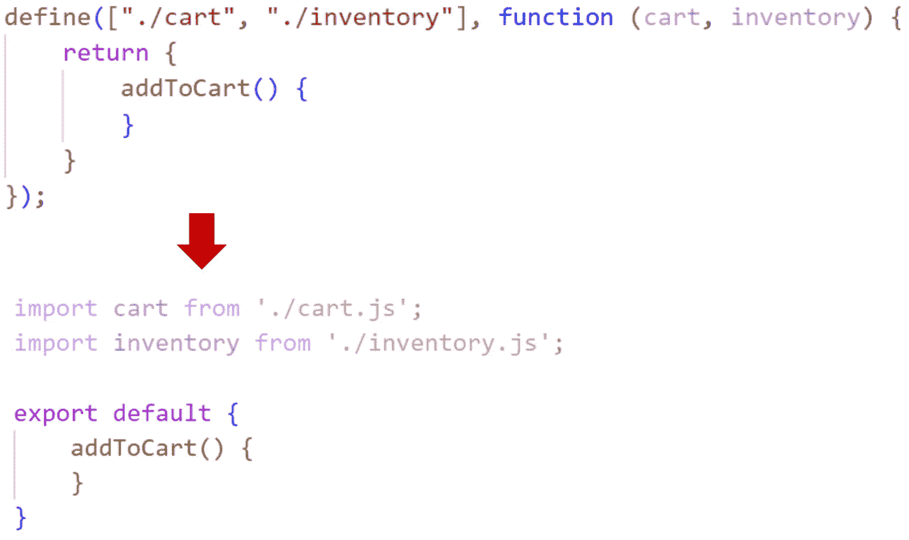
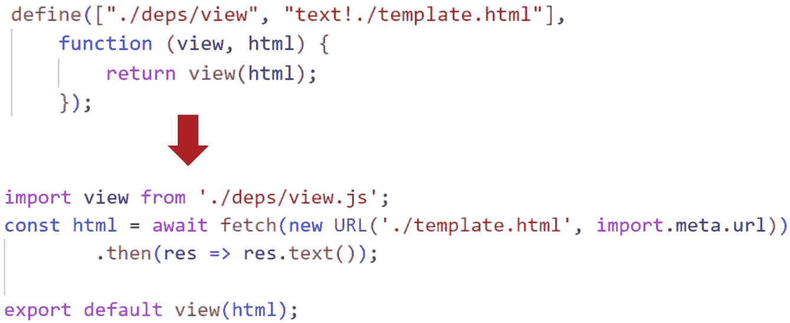
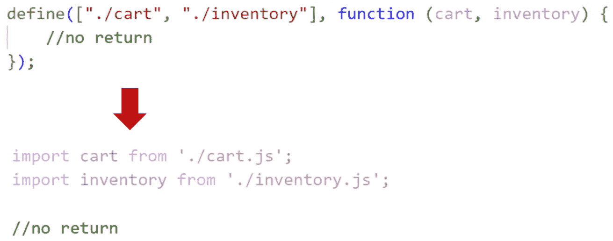
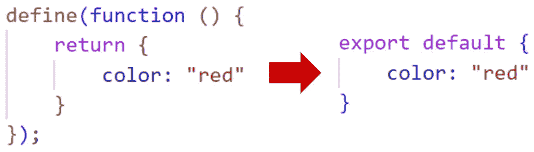
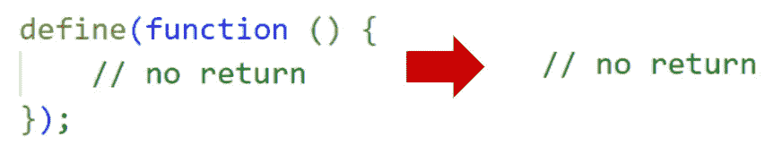
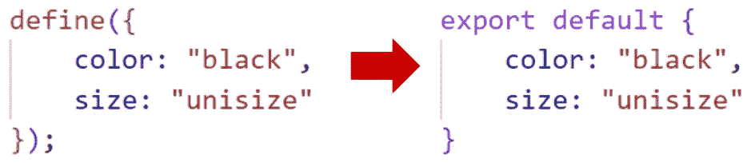
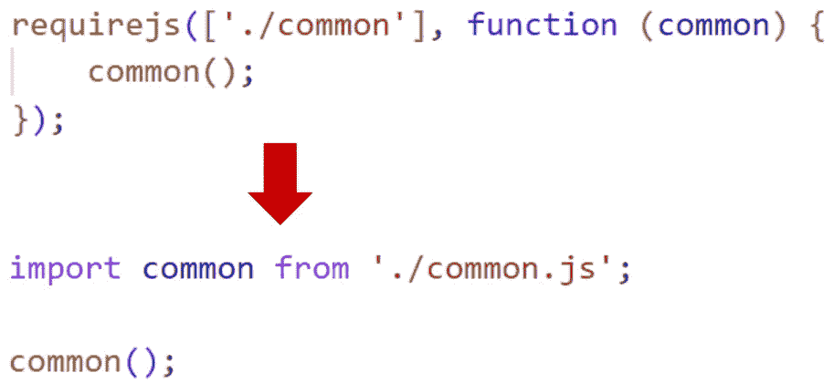
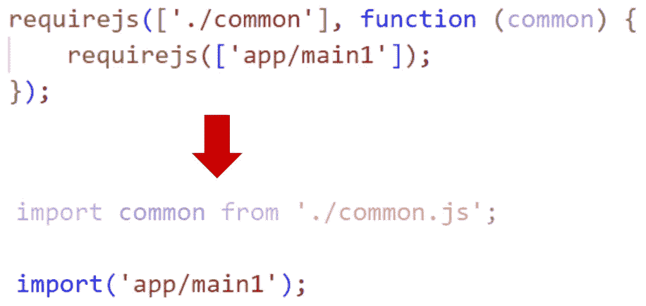
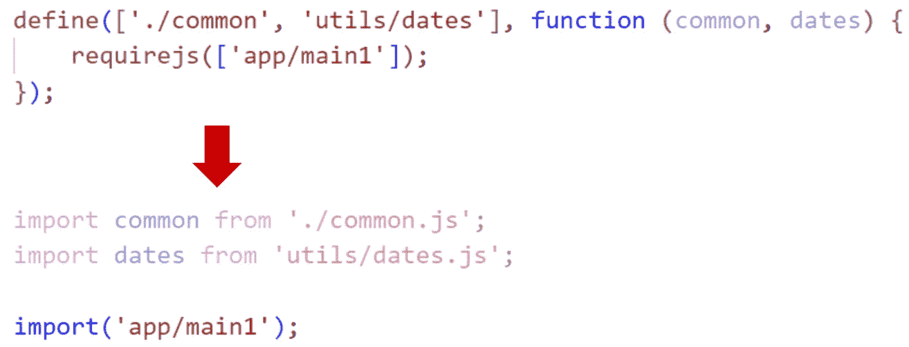

# 如何将 AMD 迁移到 ES 模块

> 原文：<https://itnext.io/how-to-migrate-amd-to-es-modules-1107395a150c?source=collection_archive---------3----------------------->

## 永远忘记 AMD 吧，再也没有使用 AMD 的好理由了

AMD 模块曾经很受欢迎。许多网络应用程序和网站都是使用 AMD 模块开发的。但是最近 ES 模块已经明显超过了传统的 AMD 模块。

当时，AMD 模块最吸引人的特性是，与 CommonJS 模块不同，它们可以在浏览器中运行，无需额外的预处理。开发过程中的构建步骤需要时间，并且会使调试变得复杂。ES 模块也不需要被转换和捆绑以在浏览器中执行。与 AMD 相比，ES 模块具有额外的有用功能。加载顺序定义明确，加载过程中的错误消息更能提供信息。循环依赖是我最喜欢的特性。循环依赖允许快速修复和重构代码，同时保持应用程序的功能。基于承诺的动态导入只允许在需要的时候加载代码。[预加载和缓存模块使得绑定变得可有可无，至少在企业应用中是如此。](https://javascript.plainenglish.io/what-is-better-preloading-or-caching-javascript-modules-246d3573e6ad?source=your_stories_page-------------------------------------&gi=36a8fcb5236b)与 Rollup 捆绑比与 Webpack 捆绑 AMD 模块更容易。

ES 模块唯一的相对限制是它们还不支持 HTML 模板的导入。[所以现在可以用顶层](https://marian-caikovski.medium.com/how-to-import-html-template-file-into-javascript-module-265746167974) `[await](https://marian-caikovski.medium.com/how-to-import-html-template-file-into-javascript-module-265746167974)`加载文本文件。

# 如何从 AMD 迁移到 ES 模块

直到最近，我还维护着几个前端由几百个 AMD 模块组成的应用程序。为了简化他们的开发，我最近将应用程序转换成了 ES 模块。除了具有复杂条件动态导入的少数模块，转换非常简单——将`define()`参数转换为`import`语句，并将函数中的`return`替换为`export default`。事实上，ES 模块中存在`export default`的主要原因是为了便于从 AMD 移植。

为了在很大程度上自动化转换，我开发了一个简单的基于 *Nodejs* 的工具。这个应用程序依赖于一个 JavaScript 解析器库 *acorn* (如果你从未使用过 JavaScript 解析器，你可能会有兴趣看看它们是做什么的[https://astexplorer.net/](https://astexplorer.net/))。

我不打算再使用我的工具，因为我没有更多的应用程序要迁移。但也许我的工具或它的碎片对其他人可能有用。

为了说明该工具的功能，下面我展示了在该工具的详尽测试用例中使用的输入和预期输出的彩色图片。

# 定义模块的许多方法

在`define()`函数中定义了一个 AMD 模块。通常`define()`接收一个带有模块路径的数组和一个接收列出的模块并返回一个模块的函数。

## 用依赖数组和函数定义()

每个依赖路径连同定义函数的相应参数成为一个`import`语句。功能的`return`变为`export default`。`define()`被移除。

## define()加载一个 HTML 模板

*RequireJS* 允许使用 *text.js* 插件加载文本依赖。 [ES 模块支持导入 JSON](https://marian-caikovski.medium.com/how-to-import-json-into-javascript-module-json-modules-e6721e19a314)，但尚不支持导入 HTML。一个 HTML 模板可以被加载到一个带有顶层`await`的 ES 模块中。我在之前的一篇文章中详细介绍了这种方法。

## 使用依赖数组和不带 return 语句的函数定义()

生成的 ES 模块没有导出:

## 用不带参数的函数定义()

因为源 AMD 模块没有依赖性，所以产生的 es 模块没有`import`

## 用不带 return 语句的函数定义()

## 用对象定义()

# 处理要求 js()

与`define()`不同的是，`requirejs()`不创建模块，它通常在 *main.js* 中用来加载定义好的模块并启动应用程序。

## 带有依赖数组和函数的 requirejs()

它被视为带有不带`return`语句的函数的`define()`。

## 嵌套的 requirejs()

鉴于`define()`不能嵌套，`requirejs()`可以在`requirejs()`或`define()`内。嵌套的`requirejs()`用于条件导入的条件内部。但是使用`requirejs()`的动态导入相对较少，而且可能很复杂，所以手动精确处理它们比编写一个可靠的代码转换成动态导入更容易。我的工具只是用功能等同的`import()`替换了嵌套的`requirejs()`。

如果 requirejs()嵌套在 define()中，结果相同。

# 快速迁移

手续很快。它包括几个快速步骤:

*   在迁移之前，将任何未提交的更改提交到本地 *git* 存储库。使用 git 你可以欣赏到该工具带来的所有变化。
*   打开命令行，转到包含该工具的文件夹并安装依赖项:`npm install`
*   通过执行指定包含 AMD 模块的文件夹的命令来启动该工具。该工具转换 **。js* 父文件夹上所有子文件夹中的文件:`node main.js path/to/folder/with/js-files`
*   现在传递给`requirejs.config()`的对象的`paths`对象应该被转换成 HTML 文件中的导入映射，通常是*index.html*，加载 JavaScript 代码。必须调整`paths`中列出的文件夹和模块的 URL，例如以 *js/* 为前缀，因为在导入映射中，URL 与包含导入映射的文件相关。如果你从未使用过导入地图，请阅读[一篇关于导入地图的帖子](https://marian-caikovski.medium.com/remapping-javascript-module-names-with-import-maps-bd2bad121c1d)。
*   尝试启动转换后的应用程序。如果失败，您可以在控制台中看到原因。首先，应用程序可能会因为导入映射中未正确定义的模块说明符而失败。但是在导入映射中进行了几次调整后，应用程序将开始工作。除了格式化之外，大多数转换后的模块不需要任何额外的手动后处理。
*   如果源应用程序有任何基于`requirejs()`的导入，检查它们并调整自动转换的代码。

## 刻痕

转换后的代码未格式化。它可以通过运行一个额外的库来格式化，但我个人更喜欢在转换后清楚地看到哪些文件没有被我编辑。当我修改代码时，我总是格式化它。

将基于 AMD 的 JavaScript 代码移植到 ES 模块的工具可以从[https://github.com/marianc000/amdToEsm](https://github.com/marianc000/amdToEsm)下载