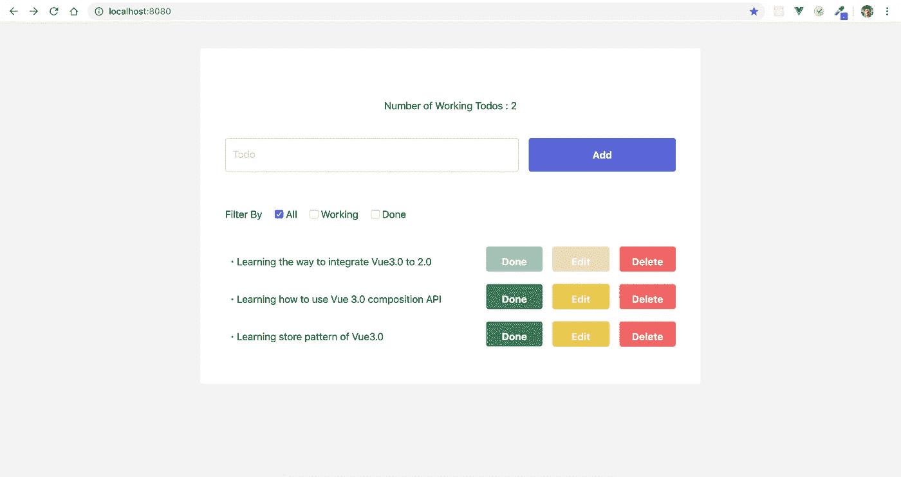

# 如何使用 TS 从 Vue 2.0 迁移到 Vue 3.0 组合 API(第 1 部分:集成)

> 原文：<https://itnext.io/how-to-migrate-from-vue-2-0-to-vue-3-0-composition-api-with-ts-part-1-integration-b4bb74d2bcd8?source=collection_archive---------2----------------------->


2019 年 10 月，Vue 3.0 pre-alpha 终于发布。所以用 Vue 3.0 做生产是迟早的事。

为了做好准备，我想分享一下如何从 Vue 2.0 迁移到 Vue 3.0。因为现在大量的 Vue 用户已经引入了 TypeScript，所以本文也使用 TypeScript。

迁移有 3 个步骤，如下所示。

1.  [将 Vue 3.0 注入 Vue 2.0](https://medium.com/@egctoru/how-to-migrate-from-vue-2-0-to-vue-3-0-composition-api-with-ts-part-1-integration-b4bb74d2bcd8)
2.  [将 Vue 2.0 代码替换为 Vue 3.0](https://medium.com/@egctoru/how-to-properly-use-vue-3-0-composition-api-with-typescript-part-2-usage-73606fb1b296)
3.  [使用 Vue 3.0 组合 API 创建全球商店](https://medium.com/@egctoru/how-to-migrate-from-vue-2-0-to-vue-3-0-composition-api-with-ts-part-3-create-a-global-store-aabdfa45a687)

因为这个话题有点长，我把它分成了 3 篇文章。如果您想从特定部分开始，请随意进入页面。

# 如何将 Vue 3.0 注入 Vue 2.0

到目前为止，由于 Vue 3.0 没有迁移到 Vue 包中，

## 让我们先设置 Vue 2.0 代码

我已经用 TypeScript 创建了用 Vue 2.0 编写的简单的 todo 应用程序。

想在你学习的时候编码的人，请克隆这个回购，直接运行即可。可以看到下面这样的小应用。

```
git clone [https://github.com/egurinko/vue3.0-composition-api-demo.git](https://github.com/egurinko/vue3.0-composition-api-demo.git)
yarn serve
```



Vue 2.0 待办事宜应用

## 将 Vue 3.0 组合 API 注入 Vue 2.0

当你现在想用 Vue 3.0 的时候，你要安装 Vue 3.0，把它当插件用。但是这很简单。

首先，只需将`@vue/composition-api`安装到依赖项中。

```
yarn add @vue/composition-api
```

其次，在您的 utils 目录中创建组合 api 插件文件。当然换目录是免费的。

```
// src/utils/compositionPlugin.tsimport CompositionApi from "@vue/composition-api";
import Vue from "vue";
Vue.use(CompositionApi);
```

`compositionPlugin.ts`做的是声明使用 Vue 3.0 composition api 作为插件。用 vue-router 也差不多。声明后，只需将合成插件导入`main.ts`。

```
// src/main.ts
import Vue from "vue";
import router from "./router/index";
import "./assets/styles/index.css";import "./utils/compositionPlugin";import App from "./App.vue";
```

看起来很容易，哈？但是这里有一个导入的事情是**导入合成插件必须在导入 App.vue** 之前。因为你会在 App.vue 里面写 Vue 3.0 代码，所以在使用之前一定要准备好 Vue 3.0。

那就是 Vue 3.0 对 Vue 2.0 的注入结束了。

在这篇文章中，我解释了如何将 Vue 3.0 注入 Vue 2.0。如果你想知道更多，请随意阅读下面的文章。非常感谢！

1.  [将 Vue 3.0 注入 Vue 2.0](https://medium.com/@egctoru/how-to-migrate-from-vue-2-0-to-vue-3-0-composition-api-with-ts-part-1-integration-b4bb74d2bcd8)
2.  [将 Vue 2.0 代码替换为 Vue 3.0](https://medium.com/@egctoru/how-to-properly-use-vue-3-0-composition-api-with-typescript-part-2-usage-73606fb1b296)
3.  [使用 Vue 3.0 组合 API 创建全球商店](https://medium.com/@egctoru/how-to-migrate-from-vue-2-0-to-vue-3-0-composition-api-with-ts-part-3-create-a-global-store-aabdfa45a687)