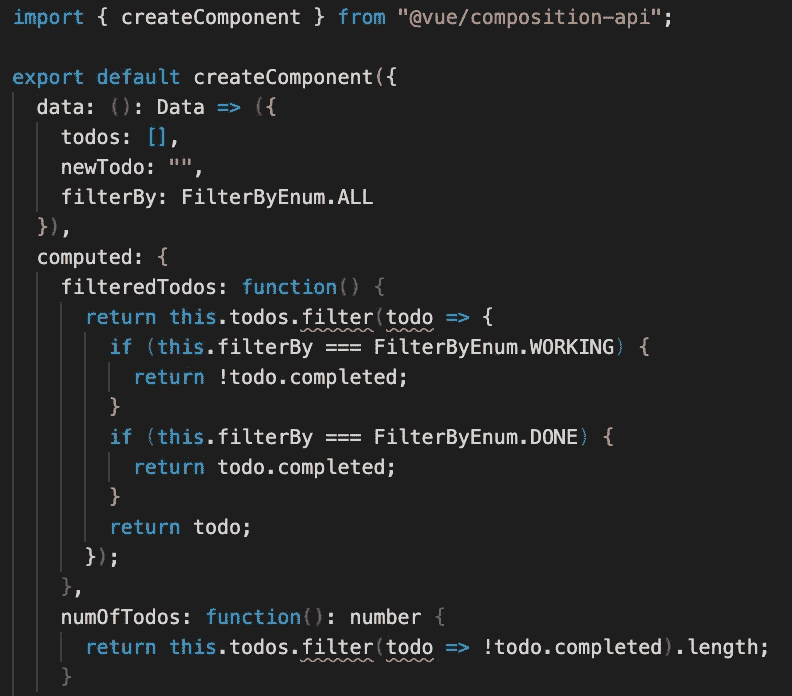

# 如何使用 TS 从 Vue 2.0 迁移到 Vue 3.0 组合 API(第 2 部分:替换)

> 原文：<https://itnext.io/how-to-migrate-from-vue-2-0-to-vue-3-0-composition-api-with-ts-part-2-replace-73606fb1b296?source=collection_archive---------1----------------------->


VueFes Japan 2018 尤雨溪 Vue3.0 更新

2019 年 10 月，Vue 3.0 pre-alpha 终于发布。所以用 Vue 3.0 做生产是迟早的事。

为了做好准备，我想分享一下如何从 Vue 2.0 迁移到 Vue 3.0。因为现在大量的 Vue 用户已经引入了 TypeScript，所以本文也使用 TypeScript。

迁移有三个步骤，如下所示。

1.  [将 Vue 3.0 注入 Vue 2.0](https://medium.com/@egctoru/how-to-properly-use-vue-3-0-composition-api-with-typescript-b4bb74d2bcd8)
2.  [将 Vue 2.0 代码替换为 Vue 3.0](https://medium.com/@egctoru/how-to-properly-use-vue-3-0-composition-api-with-typescript-part-2-usage-73606fb1b296)
3.  [使用 Vue 3.0 组合 API 创建全球商店](https://medium.com/@egctoru/how-to-migrate-from-vue-2-0-to-vue-3-0-composition-api-with-ts-part-3-create-a-global-store-aabdfa45a687)

因为这个话题有点长，我把它分成了 3 篇文章。本文是第一步的延续。如果您想从特定部分开始，请随意进入页面。

# 将 Vue 2.0 代码替换为 Vue 3.0

您已经在上一篇文章的[中设置了 Vue 3.0 合成 API！所以让我们逐渐用 Vue 3.0 取代 Vue 2.0 代码吧！](https://medium.com/@egctoru/how-to-migrate-from-vue-2-0-to-vue-3-0-composition-api-with-ts-part-1-integration-b4bb74d2bcd8)

## 使用 createComponent 和 setup()而不是 Vue.extend

在 Vue 2.0 中，“Vue.extend”用于让 TypeScript 正确推断 Vue 组件内部的类型。而不是“Vue.extend”，必须使用 Vue 3.0 中的 createComponent 进行类型推断。此外，在 createComponent 内部，应该使用 setup 函数，这是调用组合函数的入口点。

```
// src/List.vue<script lang="ts">
import { createComponent } from "@vue/composition-api";export default createComponent({
  setup(){
    // DO SOMETHING HERE
  }
})
```

但是当你把 Vue.extend 替换成 createComponent 的时候，你的编辑器出现了很多错误，因为在 Vue 2.0 中 createComponent 不知道`this`。您在终端中有许多编译错误。



但是不用担心。这个错误来自 Vetur。一切正常。

## 用 reactive 替换 Vue 2.0“数据”

下一步是替换 Vue 2.0 的本地状态，`data`。这非常简单，使用如下设置函数中的反应。

```
// src/List.vue<script lang="ts">
import { FilterByEnum, Data, FilterBy } from "./types/List";
import { createComponent, reactive } from "@vue/composition-api";export default createComponent({
  setup(){
    const todoState = reactive<Data>({
      todos: [],
      newTodo: "",
      filterBy: FilterByEnum.ALL
    });
  }
})
```

`reactive`相当于目前 Vue 2.0 中的 Vue.observable()。从 reactive 返回的值是一个你喜欢的反应对象。

实际上，你有不同的 API 来使变量反应，叫做`ref()`。但是函数本身和`reactive()`很像。请查看它的官方文档。

## 替换 Vue 2.0“方法”！

Vue2.0 中的方法成为 setup 函数中的简单函数。更容易看到代码。我们先去找托多斯。

```
// src/List.vue...
import todos from "../utils/todos";export default createComponent({
  setup(){
    const todoState = reactive<Data>({
      ...
    const init = function(): void {
      getTodos();
    };
    const getTodos = function(): void {
      setTimeout(() => {
        todoState.todos = [...todos];
    }, 1000);
  }
})
```

因为不需要使用`this`来访问本地状态，所以更简单。

到目前为止，您已经有了初始化 todos 的函数。但是你什么时候称之为？是的，您希望在 Vue 实例被“挂载”时这样做。
当然 Vue 3.0 有生命周期挂钩。你应该像下面这样使用它。

```
// src/List.vue...export default createComponent({
  setup(){
    const todoState = reactive<Data>({
      ...
    onMounted(() => {
      init();
    }); const init = function(): void {
      getTodos();
    }; const getTodos = function(): void {
      setTimeout(() => {
        todoState.todos = [...todos];
    }, 1000);
  }
})
```

您可以将其余方法移至内部设置功能。移动所有方法后，`List.vue`就变成了下图这样。

```
// src/List.vue<script lang="ts">
import Vue from "vue";
import todos from "../utils/todos";
import { FilterByEnum, Data, FilterBy } from "./types/List";
import { createComponent, reactive, onMounted } from "@vue/composition-api";export default createComponent({
  setup(props, context) {
    const todoState = reactive<Data>({
      todos: [],
      newTodo: "",
      filterBy: FilterByEnum.ALL
    });onMounted(() => {
      init();
    });

    const init = function(): void {
      getTodos();
    };
    const getTodos = function(): void {
      setTimeout(() => {
        todoState.todos = [...todos];
      }, 1000);
    };
    const addTodo = function(): void {
      const newTodo = { name: todoState.newTodo, completed: false };
      todoState.todos = [...todoState.todos, newTodo];
      todoState.newTodo = "";
    };
    const deleteTodo = function(index: number): void {
      todoState.todos = todoState.todos.filter((todo, i) => i !== index);
    };
    const completeTodo = function(index: number): void {
      todoState.todos[index].completed = true;
    };
    const handleClickFilterBy = function(filterBy: FilterBy): void {
      todoState.filterBy = filterBy;
    };
    const goEditTodo = function(index: number): void {
      context.root.$router.push(`/todos/${index}/edit`);
    };
},
```

你还不知道的一件事是，关于设置、道具和上下文的两个论点。道具很好理解。你可以在设置功能里面得到一个道具。在上下文中，您可以检查许多在 Vue 2.0 的`this`中看到的东西，如`slot`、`parent`和`root`。

所以如果想用`$router`，可以从`context.root`接入。

## 替换 Vue 2.0 的“计算值”

您已经注意到，Vue2.0 代码仅在 computed 中使用。但是也超级容易更换。

```
// src/List.vue...import { createComponent, reactive, onMounted, computed } from "@vue/composition-api";export default createComponent({
  setup(props, context) {
    const todoState = reactive<Data>({
      todos: [],
      newTodo: "",
      filterBy: FilterByEnum.ALL
    }); const filteredTodos = computed(function() {
      return todoState.todos.filter(todo => {
        if (todoState.filterBy === FilterByEnum.WORKING) {
          return !todo.completed;
        }
        if (todoState.filterBy === FilterByEnum.DONE) {
          return todo.completed;
        }
        return todo;
    }); const numOfTodos = computed(function(): number {
      return todoState.todos.filter(todo => !todo.completed).length;
    });...
```

您可以从`@vue/composition-api`导入计算结果。就像方法一样，您可以声明 computed 的名称并将 computed 的逻辑传递给 computed 的参数。就是这样。

## 如果你想在模板中使用变量、方法

到目前为止，您已经将所有 Vue 2.0 代码替换为 Vue 3.0 的代码。这个 todo 应用程序在模板中使用了许多变量和方法，如下所示。

*   状态
    -托多斯
    -纽多
    -过滤
*   计算的
    -过滤的时间
    -数量
*   方法
    -add todo
    -delete todo
    -complete todo
    -handleClickFilterBy
    -goEditTodo

但是如果你想在模板中使用它们，你应该怎么做呢？真的很简单。只需在设置函数中返回您需要的内容。

```
// src/List.vue// Inside of template, nothing changed....import { createComponent, reactive, onMounted, computed, toRefs } from "@vue/composition-api";export default createComponent({
  setup(props, context) {
    ...
    return {
      ...toRefs(todoState),
      filteredTodos,
      numOfTodos,
      addTodo,
      handleClickFilterBy,
      completeTodo,
      goEditTodo,
      deleteTodo
    };
  }
})
```

有一点你不知道的是`toRefs`。因为当你使用`reactive`而不使用`reRefs`时，你必须像`todoState.todos`、`todoState.filterBy`一样在太阳穴内使用。但是还没干！通过`toRefs()`和析构，你可以像以前一样使用它们。

所以现在，一切正常！

## 使其可组合

到目前为止，Vue 3.0 是完美的作品。但是你可以重构它。Vue 3.0 组合 API 的主要目的是使代码可组合。这意味着代码应该被分割成小部分，并让它们反复使用。

所以让我们来编写 todo 函数。

1.  在导出默认值之外创建一个名为 useTodos 的函数。

```
// src/List.vue...import { createComponent, reactive, onMounted, computed, toRefs } from "@vue/composition-api";export default createComponent({
  setup(props, context) {
    ...
  }
})const useTodos = () => {}
```

2.将设置中的功能和状态复制粘贴到`useTodos`

因为`goEditTodo`有点不一样，不用动。

```
// src/List.vue...import { createComponent, reactive, onMounted, computed, toRefs } from "@vue/composition-api";export default createComponent({
  setup(props, context) {
    const goEditTodo = function(index: number): void {
      context.root.$router.push(`/todos/${index}/edit`);
    };
    return {
      goEditTodo
    };
  }
})const useTodos = () => {
  const todoState = reactive<Data>({
    todos: [],
    newTodo: "",
    filterBy: FilterByEnum.ALL
  });

  ... return {
    ...toRefs(todoState),
    filteredTodos,
    numOfTodos,
    addTodo,
    handleClickFilterBy,
    completeTodo,
    deleteTodo
  }
}
```

这个`useTodos`函数叫做复合函数。

3.调用 setup 里面的`useTodos`并使用。

```
// src/List.vue...import { createComponent, reactive, onMounted, computed, toRefs } from "@vue/composition-api";export default createComponent({
  setup(props, context) {
    const goEditTodo = function(index: number): void {
      context.root.$router.push(`/todos/${index}/edit`);
    };

    return {
      ...useTodos(),
      goEditTodo
    };
  }
})const useTodos = () => {
  ...return {
    ...toRefs(todoState),
    filteredTodos,
    numOfTodos,
    addTodo,
    handleClickFilterBy,
    completeTodo,
    deleteTodo
  }
}
```

现在它完美地工作了！

4.将合成功能分离到其他文件中。

因为复合函数只是一个函数，你可以很容易的把它分离出来。从 Linus Borg 的演示报告中，那些组合函数被保存到`src/composables/`。并且每个组成功能的命名都像下面的`useHoge`一样。实际上，类型文件也被移到 composables 下。

```
// composables/useTodos.ts
import todos from "../utils/todos";
import { FilterByEnum, Data, FilterBy } from "./types/UseTodos";
import { reactive, onMounted, computed, toRefs } from "@vue/composition-api";export const useTodos = () => {
  ...
};
```

并导入到`List.vue`。

```
// src/List.vue
<script lang="ts">
import Vue from "vue";
import { createComponent } from "@vue/composition-api";
import { useTodos } from "../composables/useTodos";export default createComponent({
  setup(props, context) {
    const goEditTodo = function(index: number): void {
      context.root.$router.push(`/todos/${index}/edit`);
    };
    return {
      ...useTodos(),
      goEditTodo
    };
  }
});
</script>
```

现在，`List.vue`超级干净。使用 Compostion API，您可以将逻辑从 vue 组件中分离出来，vue 组件可以更专注于视图。这是 Vue 3.0 的一大价值。

## 下一关

到目前为止，composition 函数是在 List.vue 组件中调用的。如果在 Edit.vue 中调用相同的构图函数会怎样？组件之间共享状态和功能吗？？

答案是“没有”。因为 composition 函数只是一个函数，你必须用一些东西来全局共享它们。复合功能不是 Vuex 那样的状态管理。

但是如果你使用 Vue 的提供和注入，你可以创建全局存储。因此，下一篇文章将解释如何使用 Vue 3.0 创建全球商店。

在这篇文章中，我解释了如何将 Vue 2.0 替换为 Vue 3.0。但是这篇文章还没有谈到 Vue 的`global store`。我想分享 Vue 3.0 全球商店的可能性，并努力实现它。

1.  [将 Vue 3.0 注入 Vue 2.0](https://medium.com/@egctoru/how-to-properly-use-vue-3-0-composition-api-with-typescript-b4bb74d2bcd8)
2.  [将 Vue 2.0 代码替换为 Vue 3.0](https://medium.com/@egctoru/how-to-properly-use-vue-3-0-composition-api-with-typescript-part-2-usage-73606fb1b296) (现在在这里！)
3.  [使用 Vue 3.0 组合 API 创建全球商店](https://medium.com/@egctoru/how-to-migrate-from-vue-2-0-to-vue-3-0-composition-api-with-ts-part-3-create-a-global-store-aabdfa45a687)