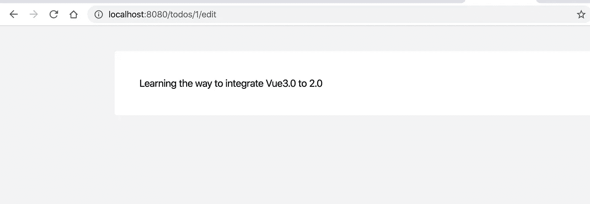

# 如何使用 TS 从 Vue 2.0 迁移到 Vue 3.0 组合 API(第 3 部分:创建全局存储)

> 原文：<https://itnext.io/how-to-migrate-from-vue-2-0-to-vue-3-0-composition-api-with-ts-part-3-create-a-global-store-aabdfa45a687?source=collection_archive---------1----------------------->


VueFes Japan 2018 尤雨溪 Vue3.0 更新

2019 年 10 月，Vue 3.0 pre-alpha 终于发布。所以用 Vue 3.0 做生产是迟早的事。

为了做好准备，我想分享一下如何从 Vue 2.0 迁移到 Vue 3.0。因为现在大量的 Vue 用户已经引入了 TypeScript，所以本文也使用 TypeScript。

迁移有 3 个步骤，如下所示。

1.  [将 Vue 3.0 注入 Vue 2.0](https://medium.com/@egctoru/how-to-properly-use-vue-3-0-composition-api-with-typescript-b4bb74d2bcd8)
2.  [将 Vue 2.0 代码替换为 Vue 3.0](https://medium.com/@egctoru/how-to-properly-use-vue-3-0-composition-api-with-typescript-part-2-usage-73606fb1b296)
3.  [使用 Vue 3.0 组合 API 创建全球商店](https://medium.com/@egctoru/how-to-migrate-from-vue-2-0-to-vue-3-0-composition-api-with-ts-part-3-create-a-global-store-aabdfa45a687)

因为这个话题有点长，我把它分成了 3 篇文章。本文是最后一篇。如果您想从特定部分开始，请随意进入页面。

# 使用 Vue 3.0 组合 API 创建全球商店

你已经在上一篇文章的[中将 Vue 2.0 代码替换为 Vue 3.0！如果你跳过了前一篇文章，你想检查实际代码，请检查我的回购。](https://medium.com/@egctoru/how-to-migrate-from-vue-2-0-to-vue-3-0-composition-api-with-ts-part-2-replace-73606fb1b296)

```
git clone [https://github.com/egurinko/vue3.0-composition-api-demo.git](https://github.com/egurinko/vue3.0-composition-api-demo.git)
git checkout feature/finish_replace_vue2_with_vue3
```

`feature/finish_replace_vue2_with_vue3`分支有替换 Vue 2.0 代码后的代码。

## 复合函数中的状态和函数是局部的。

如果您已经使用了像 Vuex 这样的状态管理，您通常会认为您想要全局共享状态和动作，因为从父节点向子节点传递数据有点困难，尤其是对于大型应用程序。

在构图功能上怎么样？？有可能在全球范围内分享它们吗？？答案是“没有”。

例如，如果在列表组件和编辑组件中调用`useTodos`复合函数，则状态不共享。它只是在每个组件中创建不同的实例。

因为复合函数只是函数，函数有自己的作用域。你需要一些全局共享状态的东西。

那么，如何使状态和函数全球化呢？？

## 依赖注入和提供/注入

Provide 和 inject 一起使用，允许祖先组件充当其所有后代的依赖注入器，只要它们在同一个父组件中。这意味着如果你在应用程序的根组件中提供存储，所有组件都可以使用它，哈！

因为有点难以理解，所以让我们用`useTodos.ts`创建全球商店。

1.  将 useTodos.ts 及其类型移动到/src/store
    下组织文件结构，我们先来做！
    `src/composables/useTodos.ts`=>`src/store/useTodos.ts`
    `src/composables/types/UseTodos.ts`=>`src/store/types/UseTodos.ts`

2.定义注射键

为了决定你在每个组件中注入什么，你需要定义注入键。所以让我们把它定义为`useTodos`。

```
// src/store/useTodos...import { reactive, onMounted, computed, toRefs, InjectionKey } from "@vue/composition-api";...export type UseTodos = ReturnType<typeof useTodos>;
export const TodosKey: InjectionKey<UseTodos> = Symbol("UseTodos");
```

如果您有多个合成功能要共享，只需重复相同的过程。

在我们的 todos 演示应用程序中，只放置了一个逻辑。但是随着应用程序变得越来越大，存储目录中逻辑也越来越多。因此，为了组织文件存储，让我们将存储合并为一个。

创建`src/store/index.ts`。

```
// src/store/index.tsimport { InjectionKey } from "@vue/composition-api";
import { useTodos } from "./useTodos";export default function store() {
  return {
    ...useTodos()
  };
}export type Store = ReturnType<typeof store>;
export const StoreKey: InjectionKey<Store> = Symbol("Store");
```

3.创建提供程序组件以注入存储

正如您已经读到的，您需要根祖先来注入存储。所以创建`components/Provider.vue`。

```
// src/components/Provider.vue<template>
  <div>
    <slot />
  </div>
</template><script lang="ts">
import { provide } from "@vue/composition-api";
import store, { StoreKey } from "../store";export default {
  setup() {
    provide(StoreKey, store());
    return {};
  }
};
</script>
```

如果使用 slot，就不必指定子组件。

4.用提供者包装你的应用程序

在应用程序的顶层节点(可能是 App.vue)，用提供者包装组件，使所有组件成为父子关系。

```
// src/App.vue<template>
  <Provider>
    <div id="app">
      <router-view />
    </div>
  </Provider>
</template><script lang="ts">
import Vue from "vue";
import { createComponent } from "@vue/composition-api";
import Provider from "./components/Provider.vue";export default createComponent({
  components: {
    Provider
  }
});
</script>
```

5.在儿童中使用注射储存

因为你已经为全球商店提供了`provide`，你所要做的就是在你需要的地方用`inject`注射钥匙。在演示 todo 应用程序中，List.vue 想要使用它。

```
// src/pages/List.vue...<script lang="ts">
import { ...something, inject } from "@vue/composition-api";
import { StoreKey, Store } from "../store";export default createComponent({
  setup(){
    const store = inject(StoreKey);
    if(!store) return;

    const {
      todos,
      newTodo,
      filterBy,
      filteredTodos,
      numOfTodos, 
      addTodo,
      handleClickFilterBy,
      completeTodo,
      deleteTodo
    } = store;

    return { // what you need }
  }
})
```

最终你得到了一个全球商店！！

## 检入其他组件

pages 目录中还有一个组件。所以让我们检查一下我们的工作。

```
// src/pages/Edit.vue<template>
  <div class="list-container m-auto my-10 bg-white rounded p-10">
    {{ todos[0].name }}
  </div>
</template><script lang="ts">
import Vue from "vue";
import { createComponent, inject } from "@vue/composition-api";
import { StoreKey, Store } from "../store";export default createComponent({
  setup(props, context) {
    const store = inject(StoreKey);
    if (!store) return; const { todos } = store;

    return { todos };
  }
});
```



完美！是全球商店！！

## 下一关

在本文中，没有提到动作和异步任务。但是当你使用 Vuex 时，你可以将动作、突变、状态分离到不同的文件中。如果你这样做了，你的全球商店会变得更加整洁有序！！

## 利弊

这种存储模式的神奇之处绝对是对 TypeScript 的良好兼容性。你可以在任何地方查看商店的类型。

不利的一面是，当你想从一个全局状态引用另一个全局状态时，很难做到干净利落。

在本文中，我解释了如何用 Vue 3.0 组合 API 创建一个全局商店。如果你想知道更多基本的东西，可以去看看前面的文章。

1.  [将 Vue 3.0 注入 Vue 2.0](https://medium.com/@egctoru/how-to-properly-use-vue-3-0-composition-api-with-typescript-b4bb74d2bcd8)
2.  [将 Vue 2.0 代码替换为 Vue 3.0](https://medium.com/@egctoru/how-to-properly-use-vue-3-0-composition-api-with-typescript-part-2-usage-73606fb1b296) (现在在这里！)
3.  [使用 Vue 3.0 组合 API 创建全球商店](https://medium.com/@egctoru/how-to-migrate-from-vue-2-0-to-vue-3-0-composition-api-with-ts-part-3-create-a-global-store-aabdfa45a687)