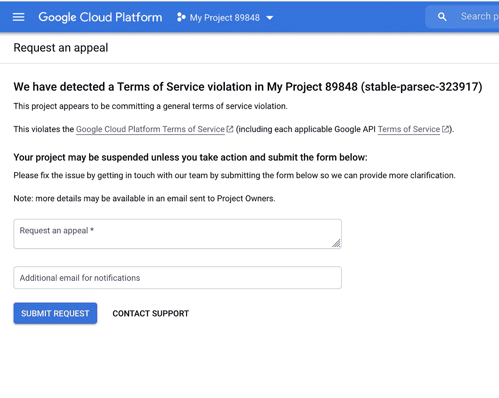
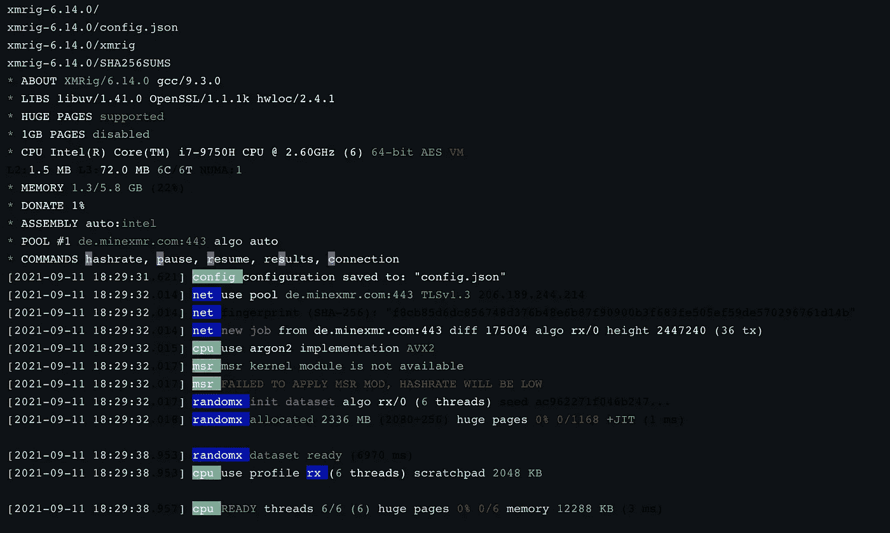
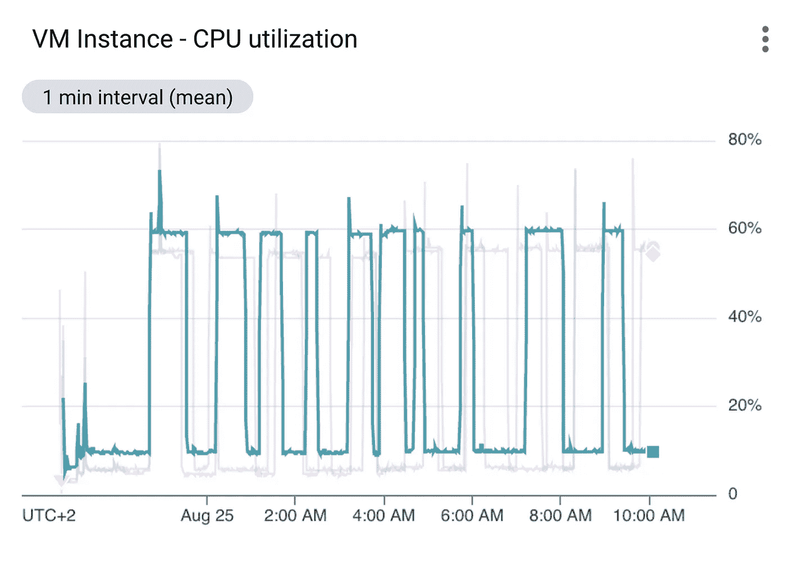
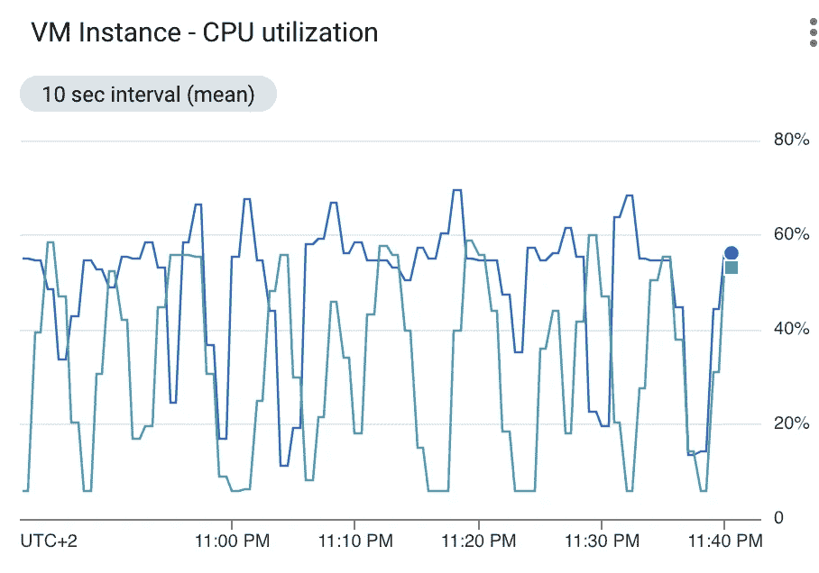
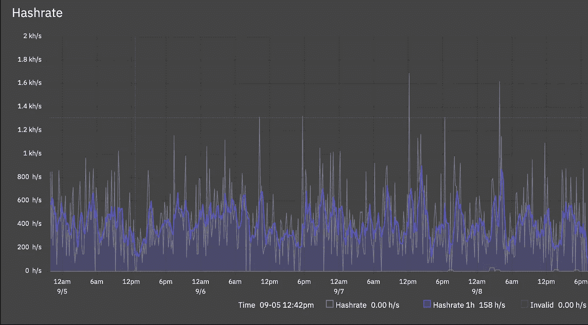

# 如何在 GCP 开采 Monero

> 原文：<https://itnext.io/how-to-mine-monero-in-gcp-d2b1f40497f7?source=collection_archive---------0----------------------->

在 GCP 开采 monero 矿的实用指南，以及如何逃脱。

[张秀坤·万尼](https://unsplash.com/@dominik_photography?utm_source=medium&utm_medium=referral)在 [Unsplash](https://unsplash.com?utm_source=medium&utm_medium=referral) 上的照片

首先，声明:根据 GCP 的“可接受使用”政策，开采加密货币是不允许的。如果你被抓住，你的项目**将**暂停。

在本文中，我们将介绍如何在 GKE 集群中挖掘 Monero，同时避免这种情况，并研究 Google 用来检测挖掘操作的检测机制。

我是在 GKE 做的，所以图形可能有多条线，显示每个节点的总 CPU 消耗，但是挖掘本身并不依赖于 Kubernetes。该方法基于在野外发现的加密劫持活动，其中我们劫持了在 Kubernetes pod 中运行的应用程序，并运行 shell 脚本，该脚本从官方 repo 和配置文件中提取最新的 XMrig 二进制文件，使该二进制文件可执行，并运行:

一切都好了几个小时，直到你被其中一个击中:

好吧，所以让 XMrig 吞噬 95%的 CPU 并不是世界上最好的主意。那么，把它限制在 30%怎么样？这么说吧，那个项目也被暂停了。

我还浏览了 GCP 安全中心的[产品页面，解释说:](https://cloud.google.com/blog/products/identity-security/detect-and-respond-to-high-risk-threats-in-your-logs-with-google-cloud)

> 事件威胁检测通过检查 VPC 日志中与已知不良域的连接来检测硬币挖掘恶意软件，以获取挖掘池和其他日志数据。

记住 XMrig 应用程序的信息量有多大，我决定通过将 stdout 发送到/dev/null 并将 stderr 重定向到 stdout 来将这些日志发送到 void:
`>/dev/null 2>&1 '

并通过 TLS 将流量发送到挖掘池。这个池被改成了支持 TLS 的池，一个 [dante socks 代理](https://www.inet.no/dante/)被设置在一个数字海洋水滴中。

但丁被设定为允许一切:

但这也遭到了友好的“请求上诉”——这种信息我现在已经太习惯了..

好的。因此通信被加密，日志被删除，CPU 消耗被调节。因此，这意味着连续操作是不可行的。让我们用一个超时函数来打破消费模式，该函数挖掘 10 到 60 分钟，然后休眠 10 到 80 分钟:

现在，pod 不再持续采矿，CPU 消耗图看起来好了很多，并被允许在暂停前运行约 17 个小时。直到我发现了法比奥·戈麦斯和米格尔·科雷拉写的一篇文章，名为 [*带 CPU 使用指标的密码劫持检测*](https://www.gsd.inesc-id.pt/~mpc/pubs/cryptojacking-nca20-final.pdf) ，我才明白 CPU 消耗图仍然是太方形了。

为了打破图表并挑战 Gomes 和 Correia 的发现，我们现在通过为时间间隔和 CPU 使用设置最小和最大阈值来进一步打破挖掘间隔和 CPU 消耗，然后根据时间选择 CPU 限制。较长的时间间隔意味着较低的 CPU 消耗，而较短的时间间隔允许更密集的挖掘:

虽然牺牲了很多散列率，但这种方法变得**更好，现在已经变得不可检测。值得注意的是，这个脚本需要‘jq’来重写 config.json 文件。如果有人找到了用“sed”或“awk”来做这件事的方法，请联系我！**

## 结论

在撰写本文时，在用完信用之前，挖掘操作在由两个 e2-standard-4 节点(每个节点 4 个 vCPUs 和 16GB RAM)组成的 GKE 集群中运行了 4 天。平均哈希速率约为 200 小时/秒，相当于 0.0004 xmr/天。所以你不会变得富有，但它表明，绕过谷歌的可接受使用强制执行程序，在 GCP 开采加密货币并使用免费信用来这样做是完全可能的。谷歌意识到了这些发现。