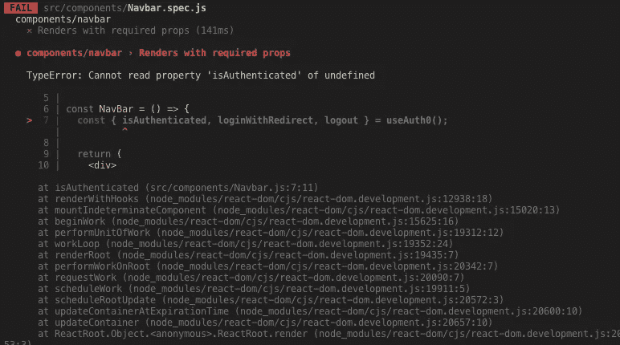

# 如何模拟 Auth0 spa 挂钩来测试 React 组件

> 原文：<https://itnext.io/how-to-mock-auth0-spa-hooks-to-test-your-react-components-e45b6a38fddb?source=collection_archive---------3----------------------->


最近，我们开始开发一个新的 React Web 应用程序，并决定使用 [Auth0](https://auth0.com/) 来处理认证。

Auth0 有一个名为 [auth0/auth0-spa-js](https://github.com/auth0/auth0-spa-js#readme) 的新库，它处理连接你的应用和 auth0 所需的大量繁重工作。它提供了关键的登录功能，还包括一系列有用的 React 挂钩，可以在整个应用程序中使用，以访问用户配置文件和登录状态

你可以在 npm 包的 readme 文件中找到他们的快速入门链接，这里还有一个很好的教程，解释了如何将这个库与你的 react 应用程序集成。

指南非常好，我们很快就开始了，但是有一个方面在库的文档中没有详细说明:在对组件执行单元测试时如何模拟钩子。我将展示一小段代码，我们发现它在我们的项目中创建单元测试时非常有用。

# 假设

在本教程中，我假设如下:

*   你对什么是单元测试，为什么它们有用有一些基本的了解，并且你在过去做过一些
*   您的项目已经连接了运行 jest 测试的正确依赖项
*   我的`spec`文件将保存在与主组件相同的文件夹中。您可以将您的文件保存在其他地方，它仍然可以工作，显然要确保导入路径是正确的
*   我也在我的代码中使用了`enzyme`，但是我相信如果你使用其他库，比如`react-test-renderer`，这个教程也会以同样的方式工作

# 以 Navbar 为例

让我们看看教程示例中引用的 NavBar.js 文件:

```
// src/components/NavBar.js

import React from "react";
import { useAuth0 } from "../react-auth0-wrapper";

const NavBar = () => {
  const { isAuthenticated, loginWithRedirect, logout } = useAuth0();

  return (
    <div>
      {!isAuthenticated && (
        <button
          onClick={() =>
            loginWithRedirect({})
          }
        >
          Log in
        </button>
      )}

      {isAuthenticated && <button onClick={() => logout()}>Log out</button>}
    </div>
  );
};

export default NavBar;
```

如您所见，该组件引用了`useAuth0`钩子，该钩子允许 navbar 访问用户配置文件和登录状态(在`isAuthenticated`中)

您通常为该组件编写单元测试的方式是这样的:

```
// src/components/Navbar.spec.jsimport React from 'react';
import { mount } from 'enzyme';
// component to test
import Navbar from './Navbar';describe('components/navbar', () => { it('Renders with required props', async () => {
    const wrapper = mount(<Navbar />);
    expect(wrapper).toBeTruthy();
  });});
```

然而，问题是你会得到一个错误，因为`useAuth0`是未定义的。

`TypeError: Cannot read property 'isAuthenticated' of undefined`



这是因为在单元测试的上下文中，`react-auth0-wrapper`还没有被 React 上下文初始化，所以函数是未定义的。

除此之外，我们希望能够测试具有不同用户状态的组件:用户登录，用户注销，用户是否验证了他们的电子邮件，等等。

# 嘲笑 useAuth0 钩子

我们所做的是在上面的代码上写一个简单的附加，允许我们模仿 useAuth0 函数，并让它返回一个特定的对象。

这是最后的代码:

```
// src/components/Navbar.spec.jsimport React from 'react';
import { mount } from 'enzyme';// component to test
import Navbar from './Navbar';// import the auth0 hook
import { useAuth0 } from '../react-auth0-wrapper';// create a dummy user profile
const user = {
  email: 'johndoe@me.com',
  email_verified: true,
  sub: 'google-oauth2|2147627834623744883746',
};// intercept the useAuth0 function and mock it
jest.mock('../react-auth0-wrapper');describe('components/NavBar - logged in', () => { beforeEach(() => { // Mock the Auth0 hook and make it return a logged in state
    useAuth0.mockReturnValue({
      isAuthenticated: true,
      user,
      logout: jest.fn(),
      loginWithRedirect: jest.fn(),
    }); }); it('Renders with required props', async () => { const wrapper = mount(<Navbar />);
    expect(wrapper).toBeTruthy(); }); it('Renders with correct link in the menu', async () => { const wrapper = mount(<Navbar />);
    expect(wrapper).toBeTruthy(); // should contain a button to be defined
    expect(wrapper.find('button')).toHaveLength(1); // the button should be the "Log out" one since the use is logged in
    expect(wrapper.find('button').text()).toEqual('Log out'); });});
```

这是怎么回事:

```
// import the auth0 hook
import { useAuth0 } from '../react-auth0-wrapper';and // intercept the useAuth0 function and mock it
jest.mock('../react-auth0-wrapper');
```

一起导入函数，然后告诉 Jest 使用一个模拟版本

然后这一节:

```
beforeEach(() => {// Mock the Auth0 hook and make it return a logged in state
    useAuth0.mockReturnValue({
      isAuthenticated: true,
      user,
      logout: jest.fn(),
      loginWithRedirect: jest.fn(),
    });});
```

允许我们定义一组测试，对于每个测试，Jest 将用我们定义的函数替换`useAuth0`函数。在这种情况下，我们将返回`isAuthenticated: true`和我们在文件中定义的虚拟用户配置文件。

然后我们测试组件安装是否正确，以及`NavBar.js`中选择显示登录或注销的条件是否有效:

```
{isAuthenticated && <button onClick={() => logout()}>**Log out**</button>}
```

因此，我们测试了导航栏中的按钮是否以文本形式“注销”。

# 接下来呢？

从那里，添加另一组测试将非常容易，这次我们为 useAuth0 调用返回一组不同的数据。简单地复制`describe`块，在`beforeEach`部分，修改`useAuth0`返回的对象。可能很简单:

```
{ isAuthenticated: false, user: null, logout: jest.fn(), loginWithRedirect: jest.fn()}
```

然后测试这次组件在按钮中显示“Log in”文本。

这个小片段对于测试应用程序中使用`useAuth0`钩子的各种组件应该非常有用。

您还可以模拟点击按钮，并测试函数`loginWithRedirect`和`logout`是否被成功调用。

当然，我们可以说整个`react-auth0-wrapper`可以而且应该用 Jest 来测试。对于一个简单的项目，你可以认为这个库是 Auth0 的责任，测试这个组件超出了范围(也就是说，它是 Auth0 的工作)。或者你可以争辩说代码实际上是项目的一部分，因此应该被测试。在我看来，因为我们有一个完整的组件，而不只是做一个`import '@auth0/auth0-spa-js'`我们很可能很快就会认为它应该被正确测试。一旦完成，它也将为我们提供另一种测试使用钩子的组件的方法，用一个虚拟的 Auth0Provider 组件包装被测试的组件。

同样，也可以认为需要编写端到端的测试，合并这个库。
例如，您可能想要测试您的登录页面，并测试一个序列:*登录页面正确挂载* >输入*用户名=" <测试值> " +密码=" <测试密码> " +单击“登录”* > *页面刷新，用户对象出现* `*isAuthenticated=true*` *。我也同意这一点，我认为测试应该是整个测试策略的一部分。同样，我们已经在其他项目中使用了旧的 auth0.js 库，新的 auth0-spa 是一个新的库，我们还没有在端到端测试中完全集成，所以可能会在下一篇文章中讨论。*

# 结论

我希望这篇短文是有帮助的，一如既往，让我知道你的想法和观点，如果有人有一些更复杂的例子要分享，请让我知道！如果有人比我们走得更远，并且已经嘲笑了 Auth0Provider，我很想听听你的经历。