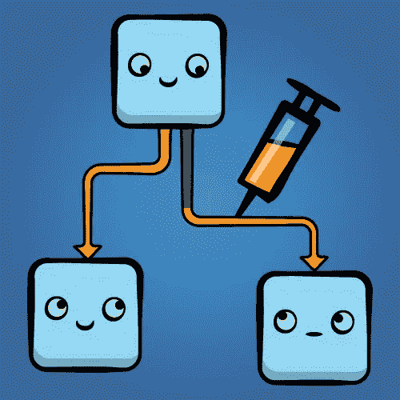

# 如何模拟 Node.js 中的依赖关系，以及为什么应该这样做。

> 原文：<https://itnext.io/how-to-mock-dependency-in-a-node-js-and-why-2ad4386f6587?source=collection_archive---------0----------------------->



这是致力于依赖嘲讽系列的第一个故事:

[](https://medium.com/@antonkorzunov/please-stop-playing-with-proxyquire-923fe6009a0a) [## 请不要玩 proxyquire 了

### 在我们开始之前:我是 3 个男孩的父亲，他们经常“玩”。我喜欢看他们打球，但他们不是…

medium.com](https://medium.com/@antonkorzunov/please-stop-playing-with-proxyquire-923fe6009a0a) [](/unit-tests-for-skynet-written-in-js-6704265858a4) [## 天网的单元测试(用 JS 编写)

### 我要揭示一个关于天网兴衰的真相，以及为什么终结者 1 之后是终结者 2，3…

itnext.io](/unit-tests-for-skynet-written-in-js-6704265858a4) 

让我告诉你一个关于一个大的单元测试世界的一小部分的童话。

关于**嘲讽**。

> 使用[测试驱动开发](https://en.wikipedia.org/wiki/Test-driven_development) (TDD)方法的程序员在编写软件时会使用模拟对象。**模仿对象满足** [**接口**](https://en.wikipedia.org/wiki/Interface_(computer_science)) **的要求，并替代更复杂的真实对象**；因此，它们允许程序员在一个区域编写和[单元测试](https://en.wikipedia.org/wiki/Unit_testing)功能，而无需调用复杂的底层或协作[类](https://en.wikipedia.org/wiki/Class_(computer_science))。谢谢你，维基百科

所以，我希望你知道单元测试**必须** **测试**他们的目标在**隔离**。目标必须被隔离，只要他们只是应该测试自己，而不是第三方库。这就是为什么它们被称为**单元**测试。

> 你唯一需要测试的是一个被测对象。

作为一个良好的开端，让我们测试简单的模块。

1.  天网

```
**import** React, { PropTypes } **from** 'react';
**import** destroyAllHumans **from** 'very-actions';

**export const** SkyNetReactComponent= (props) => (
  <div onClick={**destroyAllHumans**}>BIG BUTTON</div>
);

**export default** ReactComponent;
```

你能测试这个吗？你能保证人类会被点击毁灭吗？请将地面重新放回**位置，使测试可重复**。

> 终结者 1，终结者 2，终结者 3，终结者起源…没有测试会导致失败的重复。

好吧，也许这是个不好的例子。

2.缓慢的测试

```
**import** dataFetcher **from** 'bigDataSource';**export** **default** () => dataFetcher().filter.map.reduce;
```

这段代码没有问题。它太慢了，会减慢你的测试速度。但这仍然不是一个最好的例子。

3.生意

```
**import** prepareData **from** "./data-preparator"
**import** {spendSomeMoneyOnAWS} **from** 'AWS';
**import** petTheCat **from** './catUtils';**const** veryImportantBusinessLogic = data => {
   const preparedData = prepareData(data);
   const result = spendSomeMoneyOnAWS(preparedData);
   **await** patTheCat();
   **return** result; 
}
```

为了在这个测试中获得“信心”，你必须仔细检查什么*非常重要的后端*将被触发，并且有人将轻拍猫。但是你真的要执行那些函数吗，你只是在调用它们的时候侦察它们？

4.等待

```
import eventStream from 'big-event-pipe';
import Santa from 'north-pole';
import { believeIn } from 'side-effects';eventStream.on('xmas', () => believeIn(Santa) );
```

好了，你写了这个测试，现在等待…圣诞节！？

在我这里列出的所有情况下，你不应该执行代码，不应该运行它，但应该检查他们实际在做什么。断言“行为”。

> 不应调用任何真正的函数。它们是副作用。

所以**嘲笑你的依赖**。用空函数替换动作，返回你期望从选择器中得到的东西。将(实际上是— **存根** ) redux 的 handleActions 替换为 sinon.spy/stub,，并检查您为调用提供的参数。不要执行任何操作。模拟来自假来源、假计时器、假网络、假副作用的事件。假的。嘲笑。存根。测试。

PS:还有**不要叫 destroyAllHumans** 。这将使测试可重复。

> 你忘了吗——天网还没有投入生产。你不应该调用真正的端点。还没有。我有一篇关于这个案子的专题文章

[](/unit-tests-for-skynet-written-in-js-6704265858a4) [## 天网的单元测试(用 JS 编写)

### 我将揭示一个关于天网兴衰的真相，以及为什么终结者 1 之后是终结者 2，3…

itnext.io](/unit-tests-for-skynet-written-in-js-6704265858a4) 

# 建造你自己的孤独堡垒。

我必须指出一点——很多人没有看到单词*嘲笑*后的*依赖*，没有区分对象嘲笑和*依赖嘲笑。*

由 sinon 或 jasmine 等在`variables`、`function`、`objects`或`instances`工作的图书馆提供，并在其他地方有用。

> 为了解决谜题，我在上面写道，你必须**重新连接**被测对象(也就是你的模块)。

我说的是像 require-js 的 [Squire](https://github.com/iammerrick/Squire.js) ，Common-JS 模块的[mock](https://github.com/mfncooper/mockery)/[mock-require](https://github.com/boblauer/mock-require)/[proxy quire](https://github.com/theKashey/proxyquire)/Jest，webpack 环境的 rewire、 [inject-loader](https://github.com/plasticine/inject-loader) 和 friends 这样的库。

我希望你至少知道其中的一个，或者也许你正在使用一个非常常用的库 [fetch-mock](https://github.com/wheresrhys/fetch-mock) ，它实际上做同样的事情，但只是为了 fetch(它模仿它)。

# 嘲笑的正确方式

说实话，这些库之间的唯一区别是它们的 API 和它们以前工作的 node.js API。从你的角度来看，结果是一样的。

每一个都有一些优点和缺点。

比如—mock 有关于`isolation`的东西，可以用一个模块替换另一个模块，proxyquire 有关于`callThought`的东西，Jest 有`default`的模拟实现(__mock__)和自动模拟生成。

对你们中的许多人来说，嘲笑是一种代码气味。嘲讽就是 baaaad。

# 这种正确的嘲讽方式就是 DI！

依赖注入——向消费者提供所有“端点”的机制。一种可以替换任何端点的方法，并且可以随心所欲地重新布线。

DI 是替代依赖的一种很酷也很方便的方法，在大多数情况下它会帮助你。但是有三个问题:

1.  DI 是为面向对象的强类型语言设计的，因为没有其他方法可以对组件使用不同的逻辑。
2.  如果你不像 Java 那样经常使用 OOP，那么 DI 就不是最好的选择。而且 Javascript 不是 Java。Javascript 有自己的方式。
3.  可能你已经在使用模仿库，也可能你想模仿`fs`或`http`或`fetch`或`path`或`ezyme`或任何其他库。不是服务提供商。
4.  我不知道 JS 有什么真正好的 DI/IoT 实现
5.  整个 JS/NodeJS 生态系统对 DI 不屑一顾，所以你必须使用“通向 DI 的 javascript 方式”——内部模块系统。

# 在 NodeJS 里嘲讽。

嘲讽是非常固执己见的事情。“嘲讽是一种代码气味”，你知道吗？

带着“坏”的嘲讽，走上通往地狱的道路是相当容易的。

> 难以模仿的代码很难测试。

testDouble 作者贾斯汀·瑟尔斯的下一个视频可能会透露一些关于问题、解决方案和嘲笑自己的信息。这是我见过的最好的模拟教程。

但是在现实中，模仿的主要问题是你用来模仿的工具。

# 工具…

然后我第一次遇到库/文件级别的嘲讽，我很震惊。

> 这是 proxyquire。太丑了！它不起作用。

我不知道为什么——这是个问题。*零反馈*库。proxyquire 并不是唯一一个被嘲笑的人，另一个流行的是没有正确地做一些事情，他们知道他们的问题，但不打算解决它们。

1.  如何使用 Proxyquite 模拟天网

```
const SkyNetUnderTest **=** proxyquire('./SkyNet', {
 'very-actions'**:** { destroyAllHumans: actionStub }
});
```

一句台词，就搞定了。Proxyquire 完美地模仿了*直接使用的依赖关系*。不太适合嘲笑其他任何东西。

2.如何用嘲弄来嘲弄天网？

```
mockery.registerMock({'very-actions'**:** { destroyAllHumans: actionStub })
mockery.enabled();
const SkyNetUnderTest = require('./SkyNet');
mockery.disable();
```

有点啰嗦，但还好。和“类型化”的现成模拟。嘲讽完美的嘲讽出一切，但绝对不适合嘲讽*直接用的* deps，只要不是用嵌套深度来区分。

3.玩笑？

```
import SkyNet from './SkyNet';
jest.mock('very-actions');
```

然后`very-actions`将被自动模仿取代。和嘲笑一样的问题——到处嘲笑一切。需要笑话(这有问题吗？)

4.TestDouble？

```
td.replace('very-actions');
const SkyNet = require('./SkyNet');
```

同样的自动手枪。多年来不支持部分嘲讽。不是很广泛使用。

## 选哪个？选哪个？

我发现要有好的解决方案，我必须自己动手。像往常一样。

这些努力的结果是作为概念证明的[resolve require](https://github.com/theKashey/resolveQuire)、 [proxyquire2](https://github.com/thekashey/proxyquire) 和[proxy quire-web pack-alias](https://github.com/theKashey/proxyquire-webpack-alias)。

> 如果你喜欢 proxyquire，但是想要更好的体验，你应该检查 proxyquire2。它不是零反馈库。

我分叉 proxyquire 是因为一个原因——我希望在`normal`代码和`tests`中有相同的模块名。但是如果在普通代码中我使用 webpack-aliases，在测试中我必须使用 node.js 相对路径。我经常犯错。并且经常只是开始随机改变模拟名字，直到一个通过。而且我经常`mock`一些东西，而不是嘲笑任何东西。

> proxyquire2 解决了我所有的问题，它可以用一种更聪明的方式模拟文件，它还用非常有用的特性扩展了原始 API，比如 noUnusedStubs。不幸的是,“真实的”proxyquire 拒绝了那个 [PR](https://github.com/thlorenz/proxyquire/pull/164) 。

但是，在我完成 proxyquire2 之后，我了解到…

# 那不是一条正确的路

我只是停止对抗代理查询，停止寻找其他解决方案。每个图书馆都有点不同。

*   proxyquire 是易于使用，并且容易出错的库
*   嘲弄是强大的、脆弱的和“低信心”的库。
*   诡辩，双重嘲讽，太简单了。
*   网络包东西？仅适用于 webpack，因为“node”仅适用于 nodejs。
*   玩笑。嘲笑？只是为了开玩笑。但它实际上是超级(但不同)可用的。

## 你想要什么？

*   易于代理的查询，但是“安全”
*   强大得可笑，但“可控”
*   “右派”一样狡辩，但不那么简单？
*   node 和 webpack 能有相同的语法吗？

所以我没有找到任何其他方法，只是从头开始开发一个新的。

## [rewiremock](https://github.com/theKashey/rewiremock)—node . js(和 webpack，和 typescript，和 flow)的最佳模仿库

为什么我如此厚颜无耻地称它为`best`？我建造它已经一年了，每天我都问自己——我能称它为“最好的”吗？我应该吗？答案仍然是——是的。

rewiremock`s 的 API 有点类似于 mockery，有点 proxyquire 的味道。

> 我只是综合了其他解决方案的优点。

```
import rewiremock from 'rewiremock';
...

// totally mock `fs` with your stub 
*rewiremock*('fs')
   .with({
       readFile: yourFunction
   });

// replace module path, by another module 
*rewiremock*('path')
   .by('path-mock');// replace module path, by generated module
*rewiremock*('path')
   .by(() => generateMockedPath());

// replace default export of ES6 module 
*rewiremock*('reactComponent')
   .withDefault(MockedComponent)// replace "the real" file by mocked double, maintaining exports.
*rewiremock*('reactComponent')
   .calledFromMock() // mocking a "first-level"(like proxyquire)
   .mockThrough()// replace only part of some library and keep the rest 
*rewiremock*('someLibrary')
   .callThought() 
   .with({
       onlyOneMethod
   })
   .toBeUsed()
```

您可以预定义模拟，例如模拟 fetch/network/fs，或者为单个模拟回合指定它们。

这也是唯一一个可以轻松处理新的 es6 动态导入的版本。

```
rewiremock.around(() => import('somemodule')).then(mockedModule => doSomething)
```

但是只要你必须为 proxyquire 定义所有的 mock，并且所有的 mock 都必须在之前定义，在 rewiremock 的情况下，你可以使用。在范围内或周围。

```
rewiremock.around(
    () => import('somemodule').then ( you got a mocked module )
    (mock) => { 
        addPlugin(nodePlugin);

        mock('./lib/a/foo').with(() => 'aa');
        mock('./lib/a/../b/bar').with(() => 'bb');
        mock('./lib/a/../b/baz').with(() => 'cc');
    }
).then ( you got a mocked module )
// everything was cleared...
```

rewiremock 也是非常缓存友好的，所有其他解决方案都是不友好的。所以它跑得更快。

正如你所看到的——让你尝试比在一个单独的主题中描述功能更容易。

但是 rewiremock 的主要特性，称之为单元测试最佳的主要原因是…

# 隔离

有两种类型的隔离:

1.第一个确保你没有调用任何东西`unexpected`。

```
**import** {action1} **from** './actions';

**export default** () => {
    action1();
}
```

您用动作 1 和动作 2 模仿了动作。并进行了测试。一切正常。

```
**import** {action1} **from** './actions';
**import** {action2} **from** './new-actions';

**export default** () => {
    action1();
    action2();
}
```

接下来，您添加了一个新的依赖项。一切都还好。测试时，动作 2*不可见*。

rewiremock。**隔离**()会`fix`它，并且会抛出一个错误或者你要求的东西没有被嘲笑，或者没有被列为`passBy.`

> 如果 passBy 列表中列出了某个模块，则它需要的所有模块也会在其中列出。[为什么它如此重要？](https://github.com/mfncooper/mockery/issues/59)

2.还有一种相反的情况—当您不添加导入，而是删除导入时。在某些情况下，测试仍然是绿色的。这是“**反向隔离**”。

嘲笑。**待使用的**()，或者插件。**使用默认**将`fix`它。如果 mock 是由 not used by fact 创建的— rewiremock 将抛出一个错误。

如果你移动了文件，你打错了字，你的插件产生了错误的文件名——你会得到一个异常。

> 依我看，这种隔离必须始终启用。它拯救生命，引导你找到真正的原因，为什么你们间谍没有被召唤。

最后，但同样重要的是

# 你控制一切

开始时，我只希望使用我看到的模块名——由 webpack 别名驱动。

现在你可以通过插件系统控制名字的生成。默认情况下，您有:

1.  Nodejs 插件。只是将模拟名转换为真实文件名，否则会失败。
2.  WebpackAlias 插件——相同，但有强大的别名功能。
3.  相对-仅将提供的名称与传入的名称匹配。所以如果你想嘲笑。/foo —它会嘲笑一切。/foo。
4.  其余的插件就像一个孩子，这使得只有一级儿童被嘲笑。感谢上帝，这是亲戚用的。

你也可以控制模仿是如何产生的，或者如何消亡的。简单且可扩展。

# 你可以嘲笑一切

**例如，Proxyquire** 将仅模拟直接子级(不带全局)，与 inject 相同。

**嘲讽**会嘲讽任何依赖，只是因为它也会擦除整个缓存。

**Rewiremock** 起作用`perfectly` —启用时，它将从缓存中进行模仿和擦除。然后—擦他们的`parents`。然后——父母的父母。

然后你可以像嘲笑一样嘲笑一切，但你没有抹去一切。

很多人会认为，这不是一个好主意——能够重写任何东西……但是你实际上能够在项目范围内模仿`fetch`,文件系统，数据库等等。

假设你有模块 1。它使用模块 2 和模块 3。模块 3 也在使用模块 2。

所以，如果你要模仿模块 2，你可能会用`new`模块 2 得到模块 1，用`old`模块 2 得到模块 3。也可能不会。看情况。并且它是顺序独立的。

在 rewiremock 中，所有的模拟都将从缓存中删除，并重新加载。然后你可以控制你是否应该通过插件来模仿一些模仿。

插件`childOnly`或`relative`只会模仿一级依赖者。例如-从模块 1 导入的模块 2。如果模块 3 是在之前导入的，那么你将得到带有`old`模块 2 的模块 3，如果模块 3 是在之后导入的，那么将得到带有`new`模块 2 的模块 3。

我没有答案。至少它是顺序依赖的，稳定的。

# 主要观点

rewiremock 可以给你的测试带来更多的信心。它可以再次检查你是否已经模仿了你要模仿的东西，使用那个模仿，创造你需要的模仿。从“嘲弄的气味”中去掉“气味”

[](https://medium.com/techtrument/unit-tests-are-production-code-d256d86f073e) [## 单元测试是生产代码

### 但是如果是这样，谁来测试你的测试呢？

medium.com](https://medium.com/techtrument/unit-tests-are-production-code-d256d86f073e) 

# 结论

嘲讽只会让你的测试停滞不前，并将你的代码库与`outside`隔离开来。

您将在编写测试期间花费更少的时间，并且在重构期间花费更少的时间。

唯一持久的是——选择一种嘲笑的方式，不要忘记 DI。

[](https://github.com/theKashey/rewiremock) [## theKashey/rewiremock

### rewiremock——在 Node.js 或 webpack 环境中模拟依赖关系的正确方法。

github.com](https://github.com/theKashey/rewiremock) [](https://github.com/thlorenz/proxyquire) [## thlorenz/proxyquire

### proxy quire-proxy nodejs 需要在测试期间覆盖依赖关系。

github.com](https://github.com/thlorenz/proxyquire) [](https://github.com/mfncooper/mockery) [## MFN Cooper/嘲弄

### mockss 用 Node.js 简化 mock 的使用

github.com](https://github.com/mfncooper/mockery) [](https://github.com/speedskater/babel-plugin-rewire) [## 速滑/巴别塔-插件-重新布线

### 这是一个巴别塔插件，增加了重新连接模块依赖的能力。这使模拟模块能够…

github.com](https://github.com/speedskater/babel-plugin-rewire) [](https://github.com/plasticine/inject-loader) [## 橡皮泥/注射装载机

### inject-loader -:注射器:一个 Webpack 加载器，用于通过模块的依赖关系将代码注入到模块中。

github.com](https://github.com/plasticine/inject-loader) 

但是，我要说的是:

> 他们都能够模仿/重新布线/代理/注入依赖性。
> 
> 他们中的大多数人无法做其他任何事情。
> 
> 它们不会帮助你使单元测试更加“单元化”。

唯一的(imho)是带隔离的嘲弄，带反向隔离的代理查询，以及重新嘲弄。

如果他们都嘲笑，结果是一样的。为什么不根据其他功能进行选择？

PS:如果你正在寻找非 node-js 环境，例如 webpack，仍然选择 rewiremock。

# PS:

等到 rewiremock 继续进化的时候。现在它可以在 nodejs(mocha 甚至 Jest)或者浏览器(webpack)环境中运行。它可以为你所有的模拟提供类型检查。它能做你需要的任何事情。