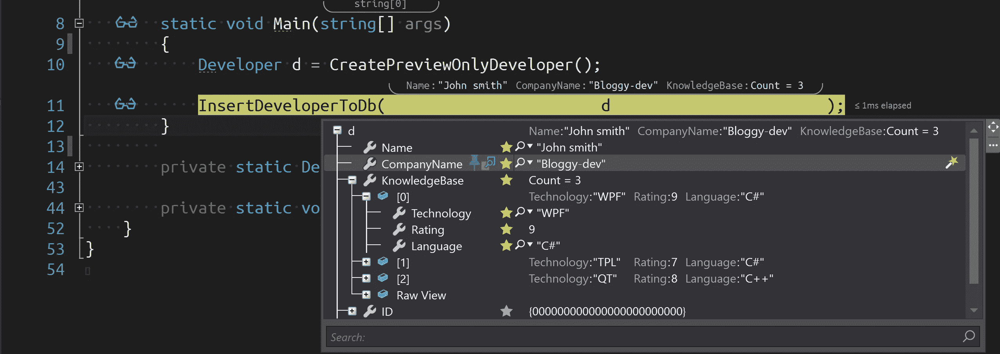
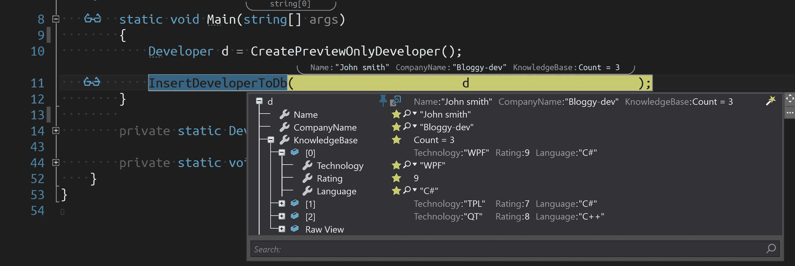
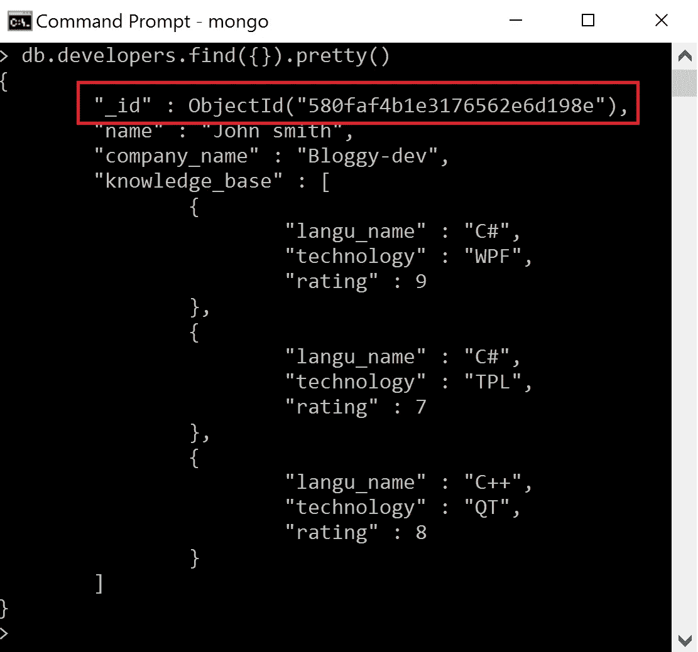
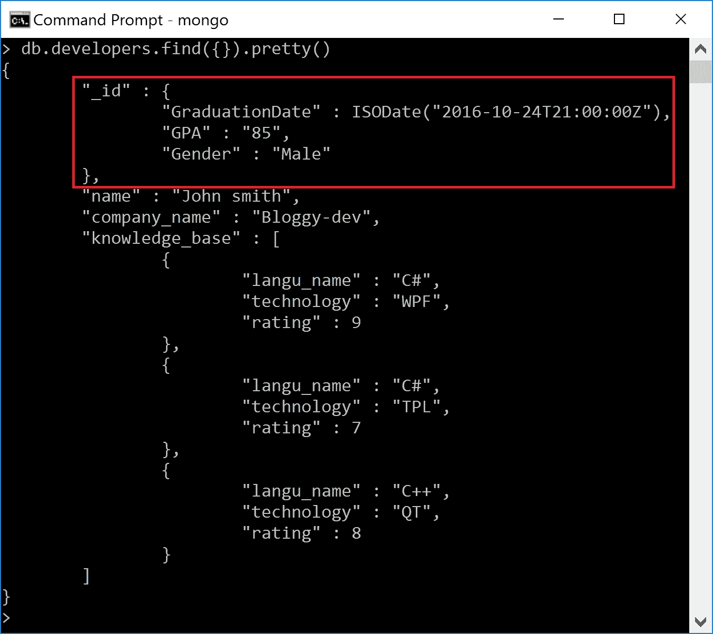

# 如何在 C#中使用 MongoDB 第 1 部分

> 原文：<https://itnext.io/how-to-mongodb-in-c-part-1-ac05e592a3e7?source=collection_archive---------1----------------------->

“如何在 C#中使用 MongoDB”将是一个由多个部分组成的博客文章系列:

1.  **如何在 C#中使用 MongoDB 第一部分**
2.  [**如何在 C#中使用 MongoDB 第二部分**](https://medium.com/@stasrivkin/how-to-mongodb-in-c-part-2-49106e643ca9)
3.  *如何在 C#中使用 MongoDB 第三部分*
4.  *如何在 C#中使用 MongoDB 第四部分*

每个新项目都有新的惊喜和冒险，但是想象一下当我意识到我是将与 [MongoDB](https://www.mongodb.com/?_ga=1.153986620.560290164.1470766224) 一起工作的受害者时我的惊讶。作为一名熟悉 SQL server 的 C#开发人员，我当时想:

因此..当这些消息被消化后，我做了下一个最好的事情——谷歌“MongoDB”(也暴饮暴食😉)

几个小时后，我对我的发现感到沮丧。有很多关于如何使用旧的驱动程序的例子，但是很少有使用新的 C#驱动程序 API 的例子。

所以我决定写这个关于“如何在 C#中使用 MongoDB”的博客系列文章，以省去我旅途中令人沮丧的部分。

这篇文章将简单地谈谈如何设置 MongoDB 等。(有很多关于这个主题的教程)。但是，在接下来的文章中，我将重点关注 MongoDB 的 CRUD API 必须提供的不同的方式，包括标准的和高级的(称为聚合 FW T21)。为了获得有趣的东西，我们必须设置我们的开发环境。

# 介绍

考虑以下 JSON 结构:

这个 JSON 结构将代表我们在 DB 中的“开发人员”对象(实际上，MongoDB 将对象存储为二进制 JSON 的 [BSON](https://www.mongodb.com/json-and-bson) 对象，但这是另一篇博文的主题)。

在 MongoDB 中，在 C# API 中，一切都被认为是一个文档(或者准确地说，是一个 [BsonDocument](http://api.mongodb.com/csharp/current/html/T_MongoDB_Bson_BsonDocument.htm) )。稍后，我将解释我们的强类型开发人员类和 MongoDB 的 BsonDocument 之间的关联。

下面是我们对应的 JSON 对象的 C#类表示:

这是开发者对象的样子:

在这个后续系列中，我们将使用各种最好的 OzCode🙂

我们将使用 MongoDB 的 CRUD 操作来处理大量(我的意思是，**大量**)数据，因此我们最好用适当的调试工具来装备自己。

我将演示如何使用[搜索特性](http://o.oz-code.com/features#search)搜索检索到的对象集合，如何使用[集合过滤](http://o.oz-code.com/features#filter)过滤它们并仅显示满足特定标准的对象，甚至使用[导出](https://vimeo.com/185820705)导出大量数据(参见从 26:30 分钟开始的操作)

在上面的截图中，我正在使用 OzCode 的出色的 [Reveal 特性](http://o.oz-code.com/features#reveal)来更好地可视化调试体验，否则我需要用[DebuggerDisplayAttribute](https://msdn.microsoft.com/en-us/library/system.diagnostics.debuggerdisplayattribute%28v=vs.110%29.aspx)来包装我的 POCO 对象，甚至更糟，使用[DebuggerTypeProxyAttribute](https://msdn.microsoft.com/en-us/library/system.diagnostics.debuggertypeproxyattribute%28v=vs.110%29.aspx?f=255&MSPPError=-2147217396)来构建调试器代理。(*开发者*类调试显示可通过选择相关星号进行配置)

# MongoDB 的对象映射

有一堆新东西你可能想知道。

您可能已经注意到，我不需要将我的 C#类属性与 JSON 对象匹配，MongoDB 在其存储和检索操作中提供了两种不同的方法来实现这一点:

1.  "**自动**"-基于属性。还有一种使用 [ConventionPack](http://api.mongodb.com/csharp/current/html/T_MongoDB_Bson_Serialization_Conventions_ConventionPack.htm) 定义系统范围通用约定的方法
2.  “**手动**——我们可以使用 [BsonClassMap](http://api.mongodb.com/csharp/current/html/T_MongoDB_Bson_Serialization_BsonClassMap.htm) 、 [RegisterClassMap](http://api.mongodb.com/csharp/current/html/M_MongoDB_Bson_Serialization_BsonClassMap_RegisterClassMap__1_1.htm) 静态方法来配置每个属性

# 使用自动映射

关于这些属性:

*   [BsonId](http://api.mongodb.com/csharp/current/html/T_MongoDB_Bson_Serialization_Attributes_BsonIdAttribute.htm) ，让您指定哪个属性将作为文档的**唯一** ID。
*   [BsonElementAttribute](http://api.mongodb.com/csharp/current/html/T_MongoDB_Bson_Serialization_Attributes_BsonElementAttribute.htm) ，让您调整属性的名称，并告诉 MongoDB 它应该存储在 JSON 中的哪个属性键下。

关于唯一 ID 属性，有几件事值得一提:

**>** MongoDB 将 **always** 把你的 ID 属性作为“_id”存储在 DB 里面，不能更改。*试图使用 BsonElementAttribute 更改名称将被忽略。*

**>** 您不需要指定一个属性作为惟一 ID，MongoDB 会发现您缺少一个 ID 属性，并自动为您生成一个基于 [ObjectId](https://docs.mongodb.com/v3.2/reference/method/ObjectId/) 的“_id”。

*在这里你可以看到，我们的* ***开发者*** *类丢失了它的 ID 属性(树中的最后一个属性丢失了)。*

我使用 MongoDB 的客户端(随安装一起提供)来检索插入的*开发人员*对象。虽然我们没有添加 ID 属性，但是您可以清楚地看到 MongoDB 已经为我们添加了它:

> 请注意——当将这个对象检索回 C#应用程序时，MongoDB 将抛出一个异常，告诉您缺少一个 ID 属性。如果您决定为您的应用程序选择这个策略，您必须用[bsonignoreextralements](http://api.mongodb.com/csharp/current/html/T_MongoDB_Bson_Serialization_Attributes_BsonIgnoreExtraElementsAttribute.htm)标记您的类

ID 属性可以是复杂类型——这是 MongoDB 不会自动为您生成 ID 并使用您的类/结构的默认值的情况之一

如果你决定用 ID 属性来修饰你的类，你没有义务使用 MongoDB 的 ObjectId 结构。实际上，ID 可以是不同的类型，比如 string、int 甚至 GUID。需要记住的主要事情是，MongoDB 为它的“_id”字段分配了一个类型为 [Unique](https://docs.mongodb.com/manual/core/index-unique/) 的[索引](https://docs.mongodb.com/manual/indexes/)。因此，请确保添加一个具有唯一 ID 值的条目，因为与备注#3 相同，它将使用 ID 类型的默认值(GUID 类型除外——MongoDB 将自动为其生成值),并且当试图添加一个具有相同默认 ID 值的条目时，将抛出一个异常。

**>** 您可以使用类型为 [IIdGenerator](http://api.mongodb.com/csharp/current/html/T_MongoDB_Bson_Serialization_IIdGenerator.htm) 的 IdGenerator 作为 BsonIdAttribute 参数。如果您不想使用 ObjectId 结构，您可以利用一些内置的 IdGenerator，例如[stringobjectdgenerator](http://api.mongodb.com/csharp/current/html/T_MongoDB_Bson_Serialization_IdGenerators_StringObjectIdGenerator.htm)。将此类型传递给 BsonIdAttribute，会将 ObjectId 的字符串表示形式存储到 Id 属性中。

它的工作方式是，对于 MongoDB 试图插入的每个文档，它会将 ID 值传递给 *IsEmpty* 方法，返回 *true* 会将文档传递给 *GenerateId* 方法，该方法接受一个容器(负责文档的 CRUD 操作、amount other stuff 的集合)和文档本身。

# MongoDB 的自动约定

最后一件事——我之前提到过，我们可以使用 [ConventionPack](http://api.mongodb.com/csharp/current/html/T_MongoDB_Bson_Serialization_Conventions_ConventionPack.htm) 来一般化我们的应用程序。

考虑下面的例子:您的团队决定所有的属性名称都以小写形式存储，并且在 MongoDB 内部的每个大写字母之间用下划线隔开( *CompanyName* 变成 ***company_name*** )。这种类型的决策需要您检查每个文档及其属性，并应用命名约定。如果你重构你的类呢？如果你的团队制定了一个新的惯例，会怎么样？

幸好(！！)MongoDB 提供了一个基于约定的 API。

您可以创建一个 *ConventionPack* 实例，它基本上是一个 [IConvention](http://api.mongodb.com/csharp/2.2/html/T_MongoDB_Bson_Serialization_Conventions_IConvention.htm) 类型的集合(MongoDB 为您提供了广泛的预定义约定，您可以在[这里](http://api.mongodb.com/csharp/2.2/html/N_MongoDB_Bson_Serialization_Conventions.htm)找到)。然后，您可以添加任意多的约定，并在*convention registry 中注册 *ConventionPack* 。注册*静态方法。

该方法接受 **3 参数**:

1.  您的会议包的名称
2.  要使用的*约定包*
3.  一个 *Func <类型，bool >* 过滤器，该约定不适用于哪些类型(只需传递一个" *t = > true* "来应用于所有类型)

我决定基于[imembermapconvention](http://api.mongodb.com/csharp/2.2/html/T_MongoDB_Bson_Serialization_Conventions_IMemberMapConvention.htm)(从 *IConvention* 派生)实现我之前描述的两个约定，并将它们仅应用于 *Developer* 类。现在我们的*开发者*类看起来更干净了:

# 哦，对了，还有手工操作的方式

这是写给所有喜欢打字的程序员的。正如您所想象的，任何可以用自动化(基于属性)方式完成的事情都可以用手工方式完成。这部分我就不多说了，因为这本手册有一个相当不错的教程，教你如何用手动方式工作(和自动化方式，以一种更详细的方式)。

所以…到目前为止，我们已经涵盖了以下最基本的内容:

1.  JSON 对象和它的孪生兄弟 C#文档之间的关系。
2.  如何使用属性设置和定制您的类
3.  ID 属性突出显示—从 MongoDB 的角度来看

# 下一步是什么

在我们深入 MongoDB 的过程中，仍然有很多内容需要介绍，在下一篇文章和以后的文章中，我将介绍以下内容:

*   如何设置您的数据库连接
*   如何实例化 MongoClient、MongoDatabase 和 MongoCollection 类
*   使用 OzCode 的[搜索、](http://o.oz-code.com/features#search) [收集过滤器](http://o.oz-code.com/features#filter)和导出特征分析 CRUD 操作结果

与此同时，我想到的任何其他东西，敬请关注..

## **博客帖子**:

1.  **如何在 C#中使用 MongoDB 第一部分**
2.  [**如何在 C#中使用 MongoDB 第二部分**](https://medium.com/@stasrivkin/how-to-mongodb-in-c-part-2-49106e643ca9)
3.  *如何在 C#中使用 MongoDB 第三部分*
4.  *如何在 C#中使用 MongoDB 第四部分*

*原载于 2016 年 11 月 14 日*[*blog.oz-code.com*](https://medium.com/@stasrivkin/how-to-mongodb-in-c-part-1-e778b5dc29ce)*。*