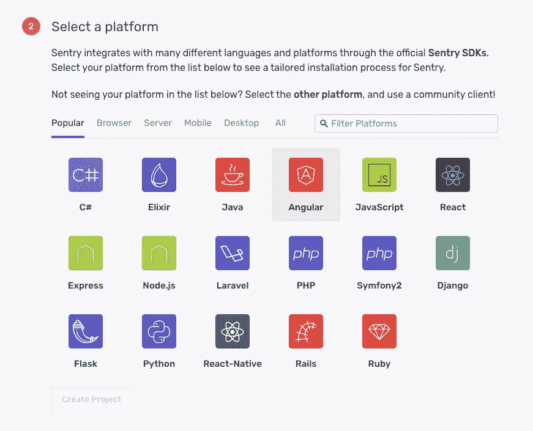
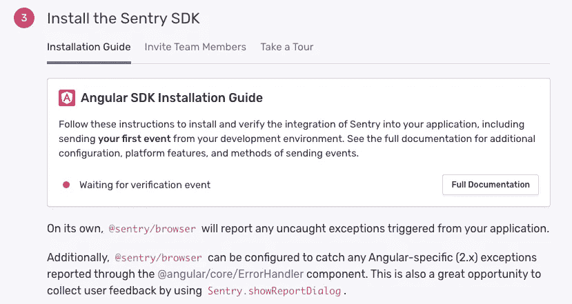
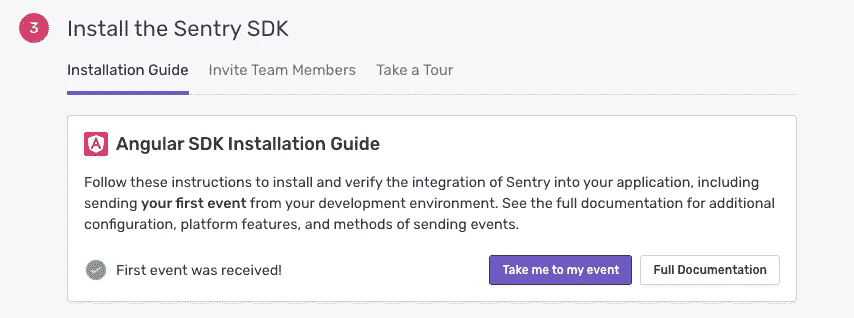
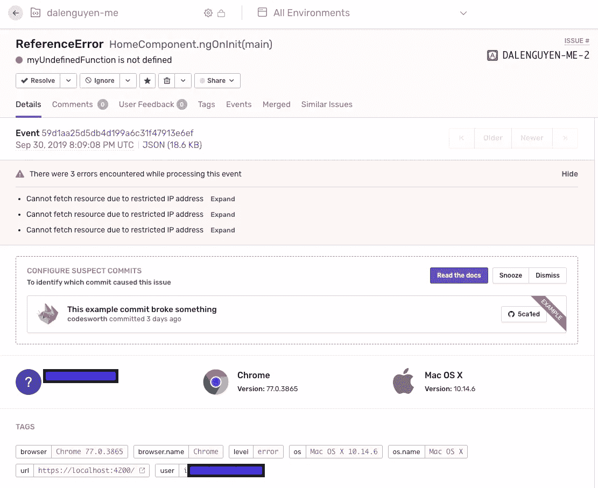
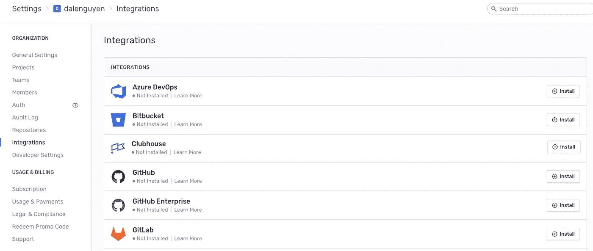
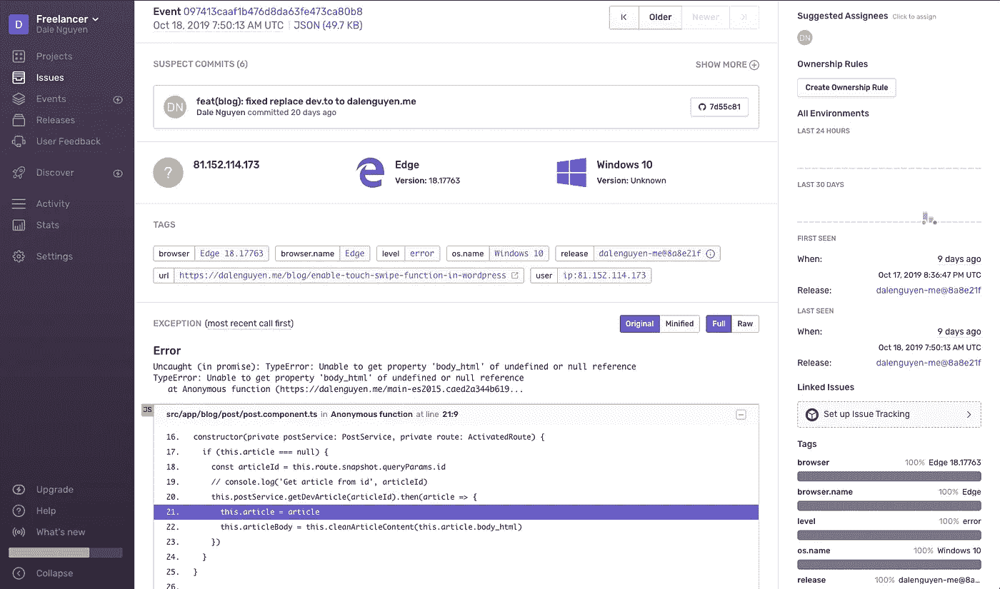

# 如何使用 Sentry (Angular)监控和跟踪应用程序中的错误

> 原文：<https://itnext.io/how-to-monitor-and-track-errors-in-your-apps-with-sentry-angular-7ef9d9b73a2a?source=collection_archive---------2----------------------->


想象一下，你刚刚完成并发布了你令人惊叹的应用程序。你确定它是防错的吗？客户可能会遭受一个你从来不知道的错误，他们会徒劳地尖叫。这完全是一片混乱——我有点夸张了。

然而，如果你不知道并改正错误，你的企业肯定会失去客户。没有一个适当的错误跟踪系统，你永远不会知道为什么。顾客甚至懒得让你知道。他们只是关闭它并使用其他服务。

在本文中，我将向您展示如何使用 Sentry 为您的 Angular 应用程序设置一个跟踪系统，Sentry 是一个开源的托管错误监控工具，可以帮助所有软件团队实时发现、分类和优先处理错误。

**第一步:你需要一个来自哨兵(开发者免费)的帐户**

这很简单，Sentry 支持多种框架和语言。



当你点击你选择的语言，你会看到一个帮助你设置系统的指南。



**第二步:给你的项目添加哨兵(Angular)**

在 NPM 设置岗哨

```
npm install @sentry/browser
npm install @sentry/integrations
```

然后在你的 **app.module.ts** 上添加 initiate Sentry。该版本将帮助您连接 Github commits。如果您使用 TypeScript，RewriteFrames 配置将帮助 Sentry[使用正确的源文件](https://docs.sentry.io/platforms/node/typescript/)链接堆栈跟踪。

```
// app.module.tsimport * as Sentry from '[@sentry/browser](http://twitter.com/sentry/browser)'
import { RewriteFrames } from '[@sentry/integrations](http://twitter.com/sentry/integrations)'Sentry.init({
  dsn: <your-sentry-dsn>,
  release: <should be the same with the deployed code>,
  integrations: [
    new RewriteFrames(),
  ],
})[@Injectable](http://twitter.com/Injectable)()
export class SentryErrorHandler implements ErrorHandler {
  constructor() {}
  handleError(error) {
    Sentry.captureException(error.originalError || error);
    console.error(error)
  }
}[@NgModule](http://twitter.com/NgModule)({
  providers: [{ provide: ErrorHandler, useClass: SentryErrorHandler }]
})
```

**步骤 3:测试配置**

可以在本地测试配置。你需要做的是在你的代码中调用一个未知的函数并运行它。

```
myUndefinedFunction()
```



您将收到一封关于错误的电子邮件通知，您可以在 Sentry 仪表板上查看它。



这意味着从现在开始，如果客户与您的应用程序交互时出现问题，您将会知道。

**步骤 4:创建发布**

发布是部署到环境中的代码版本。你应该在哨兵平台上阅读更多关于这个[的内容。在创建发布之前，您应该将 Sentry 与您的 Git 存储库集成在一起。](https://docs.sentry.io/workflow/releases/?platform=browser)



我准备了一个脚本，在你完成开发后，你可以用它来部署一个版本到 Sentry。

```
// sentry-deploy.sh#!/bin/sh
export SENTRY_AUTH_TOKEN=xxx
export SENTRY_ORG=dalenguyen
export SENTRY_PROJECT=dalenguyen-me# Version from git
REVISION=$(git rev-parse --short HEAD)sentry-cli releases new -p $SENTRY_PROJECT "$SENTRY_PROJECT@$REVISION"sentry-cli releases set-commits "$SENTRY_PROJECT@$REVISION" --auto# Upload source maps
sentry-cli releases files "$SENTRY_PROJECT@$REVISION" upload-sourcemaps ./dist --rewrite# Finalize
sentry-cli releases finalize "$SENTRY_PROJECT@$REVISION"
```

记住 app.module.ts 中的版本，它应该与 sentry-deploy.sh 相同。

```
git rev-parse --short HEAD
```

源地图上传是非常重要的，因为在生产中你的资产是缩小的。当查看缩小的 JavaScript 代码时，调试您的错误会非常困难。

因此，如果您准备好了源地图，您将知道哪一行代码导致了问题。



如果您有任何问题或建议，请留下评论。希望这有所帮助；)