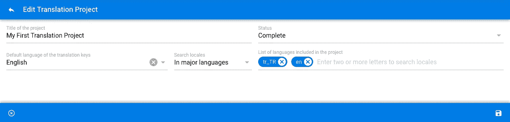

# 如何用 vue-apollo 改变对象数组

> 原文：<https://itnext.io/how-to-mutate-arrays-of-objects-with-vue-apollo-26a3ed80ba76?source=collection_archive---------4----------------------->



你可以用 [Quasar 框架](http://quasar-framework.org/) btw 创建这样的界面。

有时候一个标题不足以解释一篇文章的上下文。这篇文章的一个更好的例子应该是“如何在 Laravel GraphQL 中用 vue-apollo 学习对象数组的变化”,但是解释一点代码太复杂了。

我试着写一些关于开发我的这个项目时出现的问题及其解决方案的文章。这一次，是数组的突变。

我在我的项目中使用 Laravel，因为它的版本是 4 左右。所以这么久了，很难打破我们的联系。Vue.js 允许我将视图从 Laravel 中分离出来，但它对 API 仍然很强大。另外，像我这样的开发人员很难在学习客户端技术的同时学习另一种后端技术。

但是在我看来，学习 GraphQL 并不像学习一门新的编程语言那么难。有很好的资源，如 GraphQL 的 [Webonyx](https://webonyx.github.io/graphql-php) PHP 实现和 Laravel 的[民俗的](https://github.com/Folkloreatelier/laravel-graphql)。我假设你已经很熟悉这些了，因为你已经耐心地读到这里了。

我更喜欢使用 [rebing/graphql-laravel](https://github.com/rebing/graphql-laravel) ，因为它比民俗的代码多了一些额外的东西。我想跳过安装、配置等部分。并且直接去编码；

这是 **config/graphql.php** 中的*模式*键的例子，它有一个查询和变异定义；

```
**'system/translationManager'** => [
    **'query'** => [
        **'projects'** => \App\GraphQL\Queries\System\TranslationManager\ProjectsQuery::class,
    ],
    **'mutation'** => [
        **'updateProject'** => \App\GraphQL\Mutations\System\TranslationManager\Projects\UpdateProjectMutation::class],
    **'middleware'** => ['throttle']
],
```

从示例中可以看出，我的 Laravel API 有多个 GraphQL 端点。为了*查询*或*变异* **项目**在这个 API 中，当使用 apollo 方法时，*/system/translation manager*后缀应该被添加到 */graphql* url。

项目查询只是服务于翻译项目数据，包括从数据透视表中收集的 **id** 、**名称**、**状态**和**地区列表**。

在编辑项目 Vue 组件中，有一个包含在项目中的**区域设置列表**，用户可以添加/删除**区域设置**。下面是一个带有列表**区域设置**的项目数据示例；

```
**data** () {
  **return** {
    **id:** 6,
    **name:** 'My First Translation Project',
 **status:** 'active',
 **locales:** [
      {
       **id:** 2,
       **identifier:** 'tr-TR',
       **description:** 'Turkish (Turkey)'
      }, {
 **id:** 3,
 **identifier:** 'en-GB',
 **description:** 'English (United Kingdom)'
      }
    ]
  }
}
```

假设用户已经修改了数据，是时候更新模型了。第一件事是在 Laravel 中创建 InputObject 类型。但是为了给出更好的解释，我将首先给出查询和类型定义。

您可能认为我已经有了在向客户端提供区域设置数据时已经使用的区域设置类型。那我们为什么需要另一种类型呢？但实际上，这种类型的语言环境只能提供数据。假设它是一个带有自定义 getter/setter 函数的 Vue.js 组件的计算数据。Laravel GraphQL 中的查询类型是数组数据的 getters，InputObject 类型是数组数据的 setters。

这里是 Locales 类型(getter)；

这是项目类型；

我们在 Projects Query 中使用这两种类型，就在 *config/graphql.php* 中定义它们之后；

```
'types' => [
    **'locales_type'** => \App\GraphQL\Types\System\Localization\LocalesType::class,

    **'projects_type'** => \App\GraphQL\Types\System\TranslationManager\ProjectsType::class
],
```

现在我们准备定义 InputObject 类型的 Locales(setter)；

诀窍是$inputObject = true

我们应该把这个也添加到 *config/graphql.php* 中；

```
'types' => [
    'locales_type' => \App\GraphQL\Types\System\Localization\LocalesType::class, **'locales_input_object_type' => \App\GraphQL\Types\InputObjects\LocaleInputObjectType::class,** 'projects_type' => \App\GraphQL\Types\System\TranslationManager\ProjectsType::class
],
```

我们现在在 UpdateProject 变异中使用一切；

不要忘记在 *config/graphql.php* 中添加突变

最后一步是从我们的应用程序发送突变；

```
**this**.$apollo.mutate({
  mutation: gql`mutation ($id:Int!, $name:String!, $status:String!, $locales:**[LocaleInputObjectType]**) {
    updateProject (id:$id, name:$name, status:$status, locales:$locales) {
      id
      name,
      status
    }
  }`,
  variables: {
    id: id,
    name: name,
    status: status,
    **locales: locales**
  },
  context: {
    **uri: process.env.API_URL + '/graphql/system/translationManager'**
  }
}).then((data) => {
  console.log(data)
}).catch((error) => {
  console.error(error)
})
```