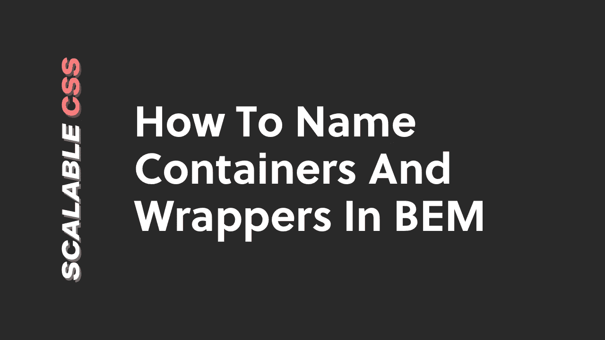
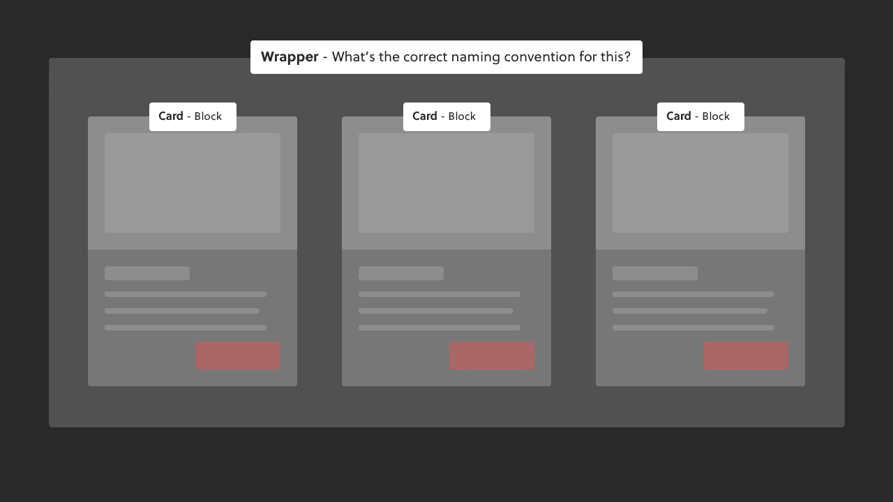
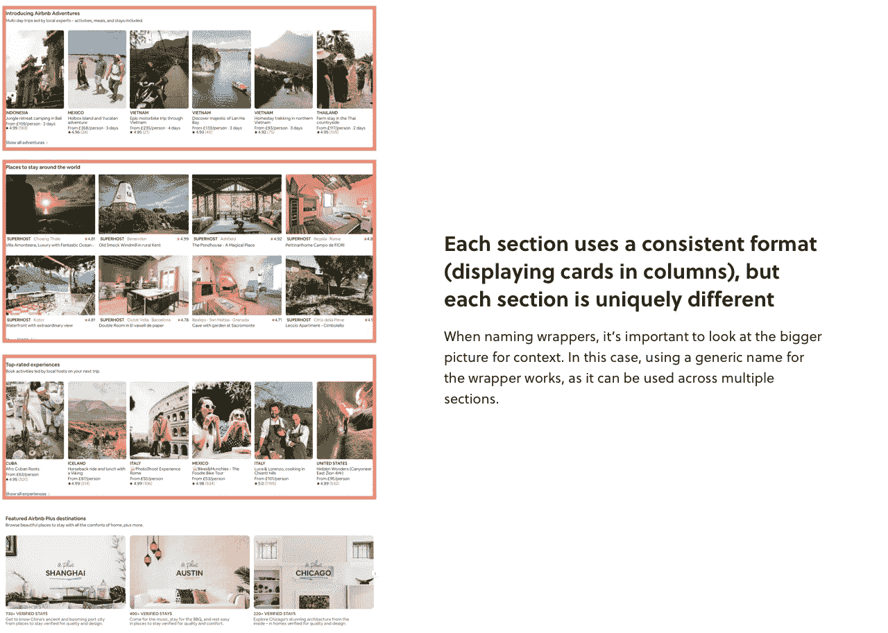

# 如何在 BEM 中命名容器和包装器

> 原文：<https://itnext.io/how-to-name-containers-and-wrappers-in-bem-a12c6ad3f943?source=collection_archive---------2----------------------->

你不清楚 [BEM](https://scalablecss.com/bem-quickstart-guide/) 包装器和容器 CSS 类命名惯例的最佳实践吗？

例如，您可能有多个块，您需要添加一个包装类来设计这些块的位置。

很难知道如何命名包装器和容器类，因为它们脱离了“块、元素和修饰符”的心理模型。

让我们深入研究一下，看看解决这个问题的方法。

**奖励:** [下载一份免费的备忘单](https://scalablecss.com/resource/bem-cheat-sheet/)，向您展示如何快速入门 BEM。

# 重复包装:Airbnb 示例

以下是 Airbnb[主页的截图:](https://airbnb.com)

戴上你的 BEM 帽子思考，你会注意到:

-每张卡可视为一个 BEM 块(例如`.card` )
-需要一个包装器来水平放置 5 个块

下面是 HTML 将如何遵循 BEM 约定来构建:

事实上，Airbnb 主页的其他部分也遵循类似的结构。例如，“Airbnb Plus”部分使用 3 列而不是 5 列:

所以问题是:

包装器的 BEM 最佳实践命名惯例是什么？

在这种情况下，由于包装器的工作方式有**种重复的**种模式，所以最好的方法是使用通用的包装器名称，比如`. grid`。

这允许您在多个地方使用包装器，因为它不受语义的限制。

例如，以下是 Airbnb 体验部分的 HTML 外观:

这里是 Airbnb Plus 部分:

使用修饰符来调整布局，像`.grid--experiences`和`.grid--plus`允许你使用一个通用的包装器，它可以在设计中大规模应用。

很酷，是吧？

但是你可能会想…

在包装器不是重复模式的例子中呢？

比如一次性设计需要一个包装器来设计 BEM 块集合的样式？

这将需要一个稍微不同的方法…

# 唯一包装器:概念示例

从[idea . so](https://notion.so)主页来看看这个设计:

再次，戴上你的 BEM 帽子思考，你会注意到:

*   每个季度可被视为一个 BEM 块(例如`.feature`
*   需要一个包装器来定位 4 个块

下面是如何按照边界元法构造 HTML 的:

这个例子和之前的 Airbnb 例子有一个重要的区别:

纵观整个 Airbnb 页面的设计，很明显每个部分的布局都使用了一致的格式，略有不同(比如列数)。

然而，概念特征部分是上下文特有的。即网站上没有其他类似的部分。

因此，**没有像我们为 Airbnb 那样为包装器使用通用的命名约定，而是需要一种不同的**命名约定方法用于概念示例中的包装器。

命名约定的最佳方法是使用特定于块的包装器，如“features-wrapper”。

例如，下面是 HTML 如何查找概念特征部分:

# 结论

因此，在 BEM 心智模型中命名包装器和容器类的关键是考虑上下文:

这种布局是否是一种重复的模式，可以在许多领域加以利用？

如果是这样，使用一个通用的类名，如`.grid`或`.container`。

还是说这种布局是某个区块集合特有的？

在这种情况下，使用与您正在定位的块相关的类名。因此，如果你需要一个包装类来包装一堆`.card`块，那么`.cards-wrapper` 会很好地工作。

# 下载免费的 BEM 备忘单

想开始练习 BEM 并寻找一本实用的快速行动指南吗？

[下载一个免费的小抄](https://scalablecss.com/resource/bem-cheat-sheet)，涵盖 BEM 的基础知识，这样你就可以马上开始练习了。