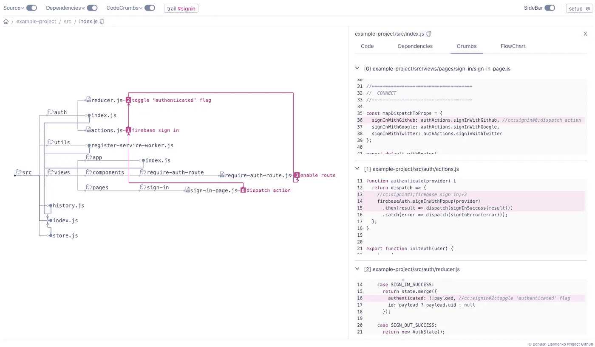
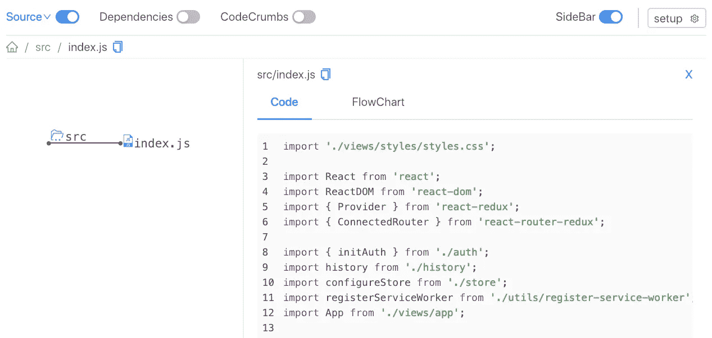
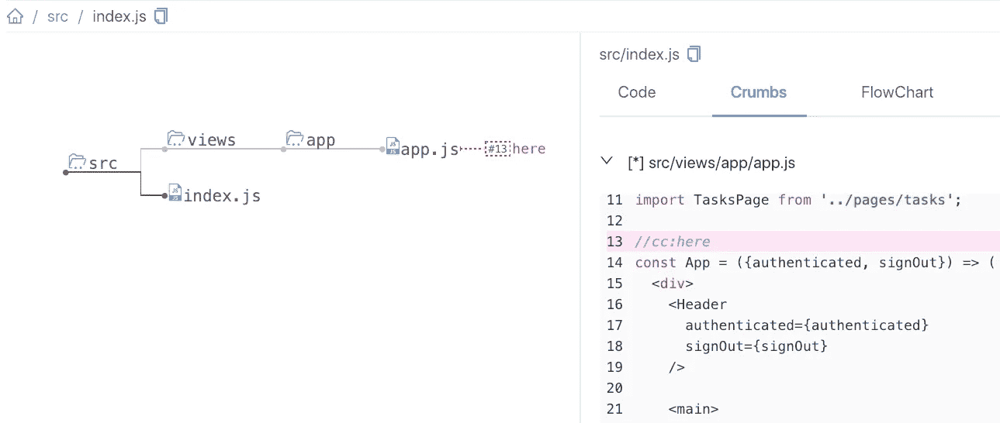
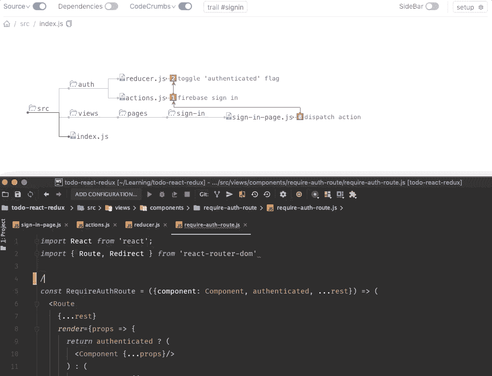
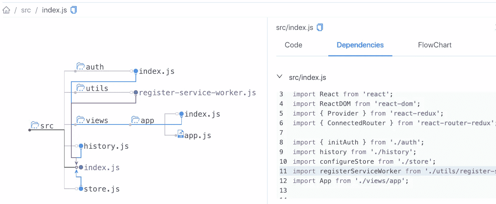
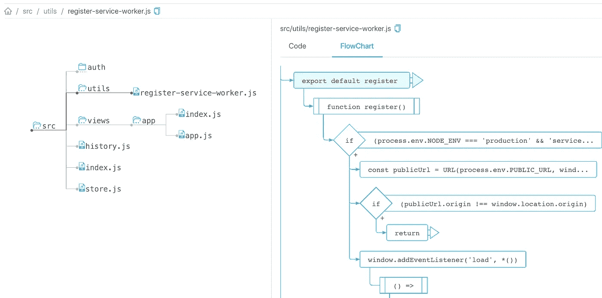
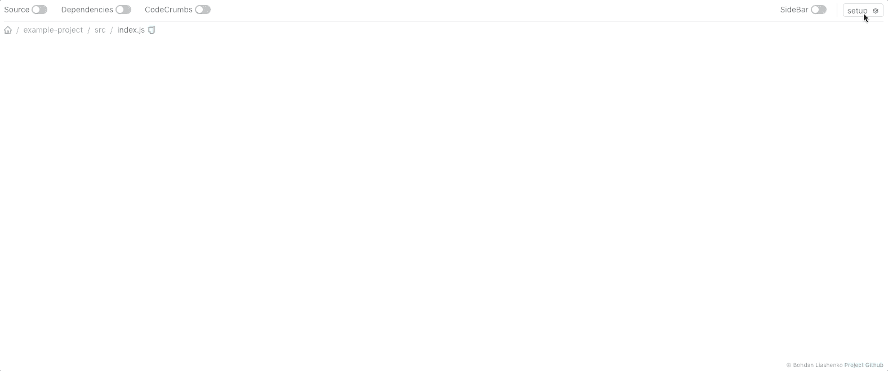

# 如何在 JavaScript 代码的迷宫中导航

> 原文：<https://itnext.io/how-to-navigate-the-maze-of-javascript-code-541250447cbb?source=collection_archive---------3----------------------->

单击以全尺寸预览

> ***TL；在这篇文章中，我想强调导航一个大代码库的问题，并展示一个关于 [codecrumbs](https://github.com/Bogdan-Lyashenko/codecrumbs) 的小演示——一个帮助你更快学习代码库的可视化工具。你可以在这里在线看到单机版。感谢您的早期反馈！***

# 想法

我们，作为程序员，当我们跳进一个大的代码库，或者我们一无所知的代码库时，效率是超级低的。这是一个代码迷宫。**我们很容易迷路，开始在完全黑暗的文件间漂流**。这只是太多无用的噪音，太多的细节模糊了我们的视觉和对代码的理解。你可以查看我最近的文章[其中我强调了阅读代码的问题以及更多的想法。](https://hackernoon.com/how-to-stop-reading-code-and-start-delivering-part-1-6215dd64f507)

所以我们需要一些方法来:

*   减少大代码库的噪音
*   突出大代码库中的重要点
*   甚至引导我们通过大代码库

可视化工具是解决这一问题的好方法，如果:

*   它给出了正确的视角(而不仅仅是让它看起来很花哨)
*   事实上，减少了无用的细节(而不是增加一个视觉)
*   它很容易与现有的代码库一起使用，不需要重写代码

所有这些，我相信，都可以通过[码屑](https://github.com/Bogdan-Lyashenko/codecrumbs)解决。尽管还有很多工作要做，但基本特性已经实现了。让我们来看看！

# 超级简单集成

因此，让我们挑选一些我们可以使用的项目作为例子。我选择了["*Todo App with Create React App，React Redux，和 Firebase"*](https://github.com/r-park/todo-react-redux) ，因为它足够简单，不会让人不知所措，同时，它有足够的文件结构(55 个文件，20 个文件夹)，看起来像一个真正的项目。

**全局或在`devDependencies`中安装** `codecrumbs`:

`yarn add codecrumbs -D`

将带有**条目** **文件**和**源文件目录**的命令添加到您的`package.json`中的`scripts`部分:

`“start:cc”: “codecrumbs -e src/index.js -d src”`

**从终端运行** `yarn start:cc`。现在它正在运行并观察代码的变化！在浏览器中打开 [http://localhost:2018/#](http://localhost:2018/#) 看看你得到了什么。

有两个主要的视图:文件结构树和带有代码的侧边栏(点击预览)

# 代码迷宫中的面包屑

工具的**“杀手级特性”**隐藏在“CodeCrumbs”开关后面。让我们启用它。现在我们可以在代码中留下面包屑，它们将出现在一个方案中。在飞行中。为此，只需写下注释。

## 放置第一个面包屑的示例

让我们打开`src/view/app/app.js`，写下`//cc:here`。在这个例子中，`cc`(代表 CodeCrumb)是解析器使用的前缀，*‘here’*是我们第一个面包屑的标题。

带有 codecrumb 的文件被添加到方案中，并在侧边栏中突出显示(点击预览)

您可以看到又有一个文件被添加到该方案中，我们通过在那里写下代码片段将该文件标记为“重要”。此外，我想强调的是**所有代码库仍然在那里**，你可以展开文件夹并查看其他文件，但你总是可以关闭它们以**为我们只过滤关键文件**。这就是我所说的*【减少噪音】*。

## 放置面包屑痕迹的示例

此外，您还可以创建“面包屑痕迹”——基本上是遵循一些数据流(例如，用户登录或表单提交等)的一系列代码碎屑。).让我们来看一个登录的例子。

要创建一个 codecrumb 作为跟踪的一部分，您需要编写:`//cc:signin#0;dispatch action`其中`signin`是跟踪 ID，`#0`是步骤的顺序号，*分派动作*是描述该步骤的标题。再补充几个吧。你可以在这里看到他们所有人。

留下评论并即时查看更改更新(点击预览)

# 其他功能

让我们快速浏览一下其他主要特性。

## 属国

另一件“大事”是**依赖**树。当您选择一个节点(文件)时，请求将被发送到本地服务器，并返回为入口点生成的依赖关系树。您可以选择连接并查看“导入了什么”和“它的实现”。

所选模块之间的连接(点击预览)

## 流程图

[js2 流程图](https://github.com/Bogdan-Lyashenko/js-code-to-svg-flowchart)用于侧边栏中绘制所选文件编码的流程图

所选文件的 SVG 流程图(点击预览)

# 轻松学习——轻松分享您的知识

所以让我们假设你收集了一些描述项目内部重要流程的代码碎片的**踪迹。你如何与他人分享它？只需**下载**码屑商店的 json 文件**，**发送给朋友，他/她**上传**到**码屑**就能看到你刚刚看到的！**

## [计] 下载

下载运行快照的最小状态(当然，不复制所有源代码)

## 上传

上传快照，即使项目不在本地(单击预览)

# 还会有更多

我现在正在开发几个大的功能，但是很快它们也会完成。同时，看看 https://github.com/Bogdan-Lyashenko/codecrumbs，告诉我你的想法。欢迎提出想法和改进。谢了。

如果你喜欢这篇文章，并想了解我下一篇文章的更新，请在 twitter 上关注我。