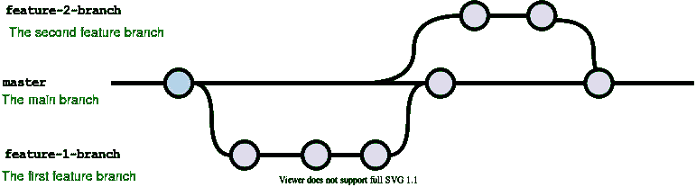
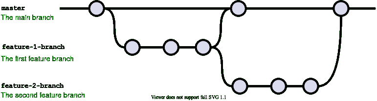

# 如何在等待代码评审时不被阻塞

> 原文：<https://itnext.io/how-to-not-get-blocked-while-youre-waiting-for-a-code-review-651451f6b1b0?source=collection_archive---------1----------------------->

您已经提出了令人敬畏的新拉动式请求，但是必须审阅它的人在几个小时内都没有时间。虽然我们都努力尽可能快地审查代码，但总会有延迟。
那么，在等待评估时，你会做些什么呢？
咖啡机总是有的，但如果你要在那里呆上几个小时，人们可能会开始问类似*“你为什么一直在这里？”*、*、*、*、【请不要盯着我看】*

这里有三种方法可以避免这些评论，并在等待代码审查时继续工作

# 在代码库中做一些其他的事情

一个好的策略是总是有至少两个你可以做的任务——最好是那些尽可能不相关的任务。这样，当你完成第一个任务时，你就可以从主分支再次分支去做一些完全不相关的工作。

这方面的例子:

*   如果你的第一次公关是在后台，开始在前台工作，反之亦然。
*   在你的公关之后，找一个有趣的 bug 去追踪和修复。一般来说，在开发新功能和修复 bug 之间切换效果很好。
*   或者只是找到另一个在代码库中没有任何重叠的问题来解决。

这里我们可以看到从主干分支出来的两个分支。当您的第一个分支准备好接受审查时，开始第二个分支并继续工作。

对我来说，这是保持你的速度的最有效的方法之一，但是它要求你能处理多项任务(并且有多项任务要处理)

软件开发中有很多事情要做，不仅仅是软件开发。我们可以做很多与代码无关的任务。这些任务非常适合在等待评审时花时间去做。一些例子:

*   回复电子邮件
*   查看来自其他人的提取请求
*   编写文档
*   写下或分解任务
*   帮助同事做某事

或者只是休息一下，这样你就可以准备好之后重新开始工作。

# 从相同的代码继续工作

不幸的是，做别的事情并不总是可行的。有时只有一件事要做——你必须把你的工作建立在你刚刚提交的简历上。
你可以从你想合并的分支分出一个分支到主分支。
这意味着在等待分支机构时，你可以继续工作。然后，您可以在第一个分支中进行合并，稍后在第二个分支中进行合并。

此工作流程的一个示例。当你完成第一个分支后，你创建了一个 PR，同时也创建了一个基于第一个分支的新分支。然后，您可以继续工作，同时保留所有原始更改。

一些警告:

*   如果您希望在最初的 Pull 请求中得到很多反馈，那么在合并第二个分支时，您可能需要处理一些合并冲突。
*   如果你在合并 PR 的时候挤压你的提交，这就变得更有问题了。你将不得不做一些合并或重置，以使你的第二个分支合并干净。然而，对于大型分支机构，这通常不会超过几分钟。

*原载于*[*https://www . Gustav wengel . dk*](https://www.gustavwengel.dk/how-to-not-get-blocked-while-waiting-for-code-review)*。*