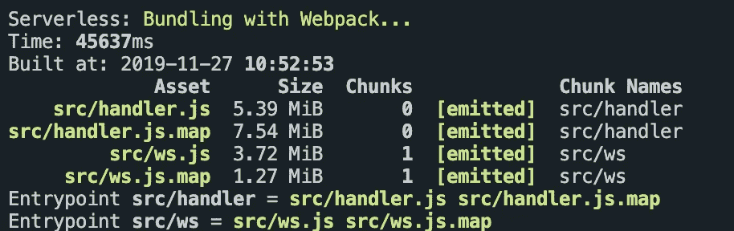
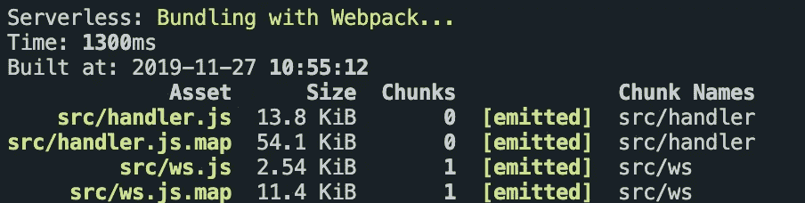
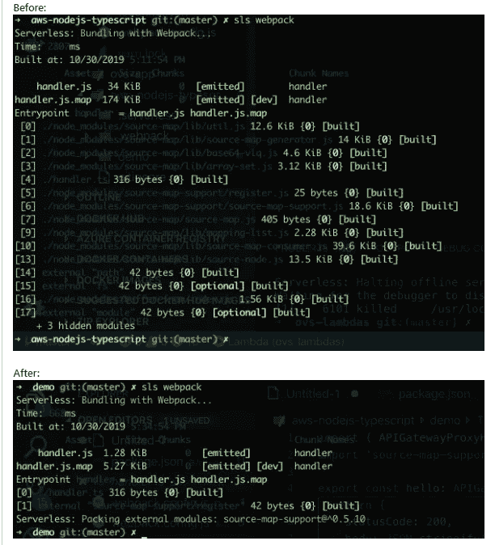

# 如何优化无服务器的 typescript eslint webpack 设置以提高性能

> 原文：<https://itnext.io/how-to-optimise-your-serverless-typescript-webpack-eslint-setup-for-performance-86d052284505?source=collection_archive---------0----------------------->

或者我如何通过调整 Typescript 设置、webpack、serverless.yml 和 eslint，在构建时间和软件包大小方面改进无服务器 AWS NodeJS Typescript 模板( [aws-nodejs-typescript](https://github.com/serverless/serverless/tree/master/lib/plugins/create/templates/aws-nodejs-typescript) )。


如果你的 typescript、eslint 或 webpack 安装很慢，你可以按照下面的提示来优化它们。

## 优化 Typescript — tsconfig.json

1.  仅包括`**/*.ts`文件，排除`node_modules`和构建目录。
2.  通过在`compilerOptions`下设置`“removeComments”: true`，从捆绑中删除注释。
3.  启用增量 API 和观察 API。

```
// tsconfig.json
{ "compilerOptions": { "lib": [ "es2017" ], "removeComments": true, "moduleResolution": "node", "resolveJsonModule": true, "noUnusedLocals": false, "noUnusedParameters": false, "sourceMap": true, "allowSyntheticDefaultImports": true, "forceConsistentCasingInFileNames": true, "importHelpers": true, "incremental": true, "watch": true, "target": "es2017", "outDir": "lib"},"include": [ "./**/*.ts"],"exclude": [ "node_modules/**/*", ".serverless/**/*", ".webpack/**/*", "_warmup/**/*", ".vscode/**/*", "*.config.js", "**/*.js" ]}
```

## 优化 eslint — .eslintrc.js

现在 [tslint 被弃用了](https://github.com/palantir/tslint/issues/4534)，我们应该使用 eslint 和 [typescript-eslint](https://github.com/typescript-eslint/typescript-eslint/) 来代替。然而，我不禁注意到切换后的性能差异，eslint 比 tslint 慢。下面是你可以做的最有效的方法:

1.  设置一个`.eslintignore`文件来忽略`node_modules`以及编译/非类型脚本文件。
2.  运行 eslint 时使用`--cache`标志，例如:`eslint --cache **/*.ts`。
3.  不要在 eslint 配置中扩展昂贵的`"plugin:@typescript-eslint/recommended-requiring-type-checking"`配置。
4.  添加一个`.eslintignore`文件来忽略 node_modules 并构建目录

```
//.eslintrc.js
module.exports = {"extends": [ "eslint:recommended", "plugin:@typescript-eslint/eslint-recommended", "plugin:@typescript-eslint/recommended", "standard"],"env": { "node": true},"parser": "@typescript-eslint/parser","plugins": [ "@typescript-eslint",],"settings": { "import/parsers": { "@typescript-eslint/parser": [ ".ts", ".tsx" ] }, "import/resolver": { "typescript": {}  }},"parserOptions": { "project": "./tsconfig.json", "tsconfigRootDir": "./", "sourceType": "module", "ecmaVersion": 2018},"rules": { "@typescript-eslint/no-explicit-any": "off", }}
```

添加一个`.eslintignore`文件来忽略不需要链接的非 src 文件

```
//.eslintignore
node_modules.serverless.vscode*.config.js.webpack_warmup**/*.js
```

## 优化 webpack.config.js

1.  安装 [webpack-node-externals](https://github.com/liady/webpack-node-externals) 以从构建中移除未使用的`node_modules`。
2.  对于开发/本地构建，将`devtool`设置为`cheap-module-eval-source-map`。
3.  从“resolve”属性中删除不必要的扩展名。
4.  从加载器规则中排除`node_modules`以及构建/非 src 目录。
5.  通过[这些提示](https://webpack.js.org/guides/build-performance/)优化你的 webpack 构建性能。
6.  从`ts-loader`禁用类型检查，并启用新的观察 API。
7.  使用[fork-ts-web pack-checker-plugin](https://www.npmjs.com/package/fork-ts-checker-webpack-plugin)在单独的进程上运行类型检查。

```
// webpack.config.js
const path = require('path');
const slsw = require('serverless-webpack');
const nodeExternals = require('webpack-node-externals');
const ForkTsCheckerWebpackPlugin = require('fork-ts-checker-webpack-plugin');

module.exports = {
  context: __dirname,
  mode: slsw.lib.webpack.isLocal ? 'development' : 'production',
  entry: slsw.lib.entries,
  devtool: slsw.lib.webpack.isLocal ? 'cheap-module-eval-source-map' : 'source-map',
  resolve: {
    extensions: ['.mjs', '.json', '.ts'],
    symlinks: false,
    cacheWithContext: false,
  },
  output: {
    libraryTarget: 'commonjs',
    path: path.join(__dirname, '.webpack'),
    filename: '[name].js',
  },
  target: 'node',
  externals: [nodeExternals()],
  module: {
    rules: [
      // all files with a `.ts` or `.tsx` extension will be handled by `ts-loader`
      {
        test: /\.(tsx?)$/,
        loader: 'ts-loader',
        exclude: [
          [
            path.resolve(__dirname, 'node_modules'),
            path.resolve(__dirname, '.serverless'),
            path.resolve(__dirname, '.webpack'),
          ],
        ],
        options: {
          transpileOnly: true,
          experimentalWatchApi: true,
        },
      },
    ],
  },
  plugins: [
    // new ForkTsCheckerWebpackPlugin({
    //   eslint: true,
    //   eslintOptions: {
    //     cache: true
    //   }
    // })
  ],
};
```

8.(奖励)升级到 web pack V5[https://webpack.js.org/migrate/5/](https://webpack.js.org/migrate/5/)

## 优化 serverless.yml

1.  为了用`serverless-webpack` 插件正确设置节点外部插件，你需要在你的无服务器. yml 文件中设置`custom: webpack: includeModules`选项，如无服务器 webpack 插件在这里提到的[，以便正确支持](https://github.com/serverless-heaven/serverless-webpack#node-modules--externals) [webpack 节点外部插件](https://github.com/liady/webpack-node-externals)
2.  通过在`serverless.yml`文件中设置`apiGateway:minimumCompressionSize: 1024`，启用 GZip 压缩以最小化返回的响应大小
3.  通过将`environment: AWS_NODEJS_CONNECTION_REUSE_ENABLED: 1`设置为[重用 HTTP 连接](https://docs.aws.amazon.com/sdk-for-javascript/v2/developer-guide/node-reusing-connections.html)来启用 AWS 连接重用

```
//serverless.yml
service:
  name: aws-nodejs-typescript
# app and org for use with dashboard.serverless.com
#app: your-app-name
#org: your-org-name

custom:
  webpack:
    webpackConfig: ./webpack.config.js
    includeModules: true

# Add the serverless-webpack plugin
plugins:
  - serverless-webpack

provider:
  name: aws
  runtime: nodejs10.x
  apiGateway:
    minimumCompressionSize: 1024 # Enable gzip compression for responses > 1 KB
  environment:
    AWS_NODEJS_CONNECTION_REUSE_ENABLED: 1

functions:
  hello:
    handler: handler.hello
    events:
      - http:
          method: get
          path: hello
```

## 结果:

现在让我们来看看实施上述优化后的结果。感谢 github 用户 [*sapher*](https://github.com/sapher) 在我[拉请求](https://github.com/serverless/serverless/pull/6904)后提供了自己对一个大项目的反馈。这些是他的结果

之前:



之后:



如您所见，第一个文件的 **37 000%** 文件大小从 **5.9MB** 到 **13.8 KB** ，构建速度提高了 **3410%** (从 **45.5 秒**到 **1.3 秒**！).

这些是模板 hello world 项目中没有依赖项的结果



**我在这里做了一个** [**的拉请求**](https://github.com/serverless/serverless/pull/6904) **对 2019 年 11 月已经合并的** [**无服务器库**](https://github.com/serverless/serverless) **做了这些改动。**

如果您的项目是早期创建的，您可能希望通过查看 pull 请求中的更改来手动更新您的设置，正如您所看到的，它们实际上非常小，但是非常重要。

## 优化总包装尺寸和部署速度

后来，我将打包的 zip 文件减少了一半以上，并通过以下方式加快了打包和部署速度:

1.  [更新到 webpack v5](https://webpack.js.org/migrate/5/#upgrade-webpack-cli-to-the-latest-available-version-when-used)
2.  运行`sls deploy`时，通过使用`aws-s3-accelerate`标志使用 [s3 传输加速](https://docs.aws.amazon.com/AmazonS3/latest/dev/transfer-acceleration.html),以更快地上传到 s3，但需要额外付费。
3.  从 npm 切换到 yarn，通过运行`yarn autoclean — init`和`yarn autoclean — force`来利用[自动清理](https://yarnpkg.com/en/docs/cli/autoclean)功能，这清理了我的 node_modules 并从那里删除了不必要的文件，这要感谢 serverless-webpack 中的这个 [github 问题](https://github.com/serverless-heaven/serverless-webpack/issues/519)。
4.  将`serverless-webpack`插件配置为使用`yarn autoclean`来包含`node_modules`，并通过将它添加到我的 serverless.yml 来使用我配置的`.yarnclean`文件

```
//serverless.yml
webpack:webpackConfig: ./webpack.config.jsincludeModules: trueforceExclude:- aws-sdkpackager: "yarn"packagerOptions:scripts:- yarn autoclean --init- rm .yarnclean && cat ../../.yarnclean >> .yarnclean && echo '\n*.ts' >> .yarnclean- rm -rf node_modules/aws-sdk- yarn autoclean --force
```

6.配置一个比通过`yarn autoclean — init`创建的[文件更高级的](https://gist.github.com/khaledosman/e145fffc2de691e780c7da246e2b3da4) `[.yarnclean](https://gist.github.com/khaledosman/e145fffc2de691e780c7da246e2b3da4)`文件，该文件也使用由[节点修剪](https://github.com/tj/node-prune)删除的文件

7.通过 serverless-webpack 的`packagerOptions.scripts`将 aws-sdk 从我的包中强制移除，我注意到即使 aws-sdk 被声明为 devDependency 并被 externals pugin 排除，它仍然通过`aws-xray-sdk-core`被添加到我的包中，它将`aws-sdk`声明为 Dependency 而不是 peerDependency，所以它仍然出现在我的包中，在 aws-xray-sdk 中已经有一个关于这个的 [github 问题](https://github.com/aws/aws-xray-sdk-node/issues/113)。

以上步骤有助于将我的一辆 lambdas 的包装尺寸从 **18MB** 一直减小到 **7MB** ，其他的从 **11MB** 减小到**2.7 MB**