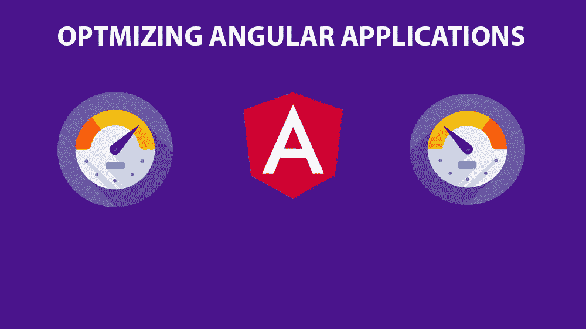
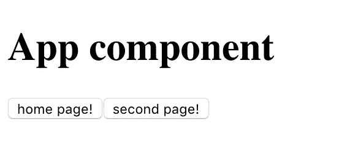
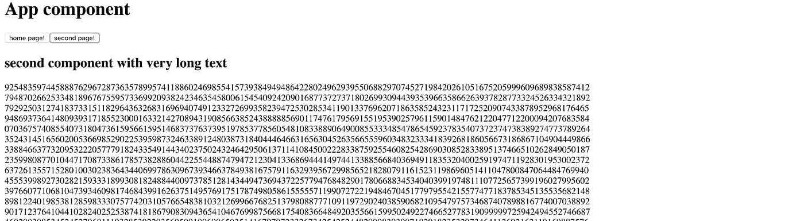
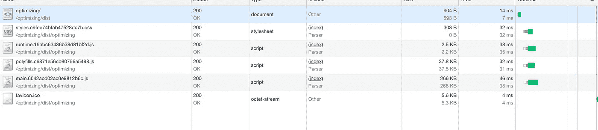
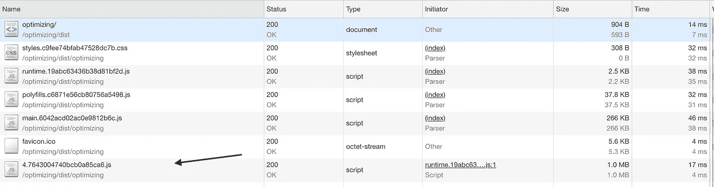
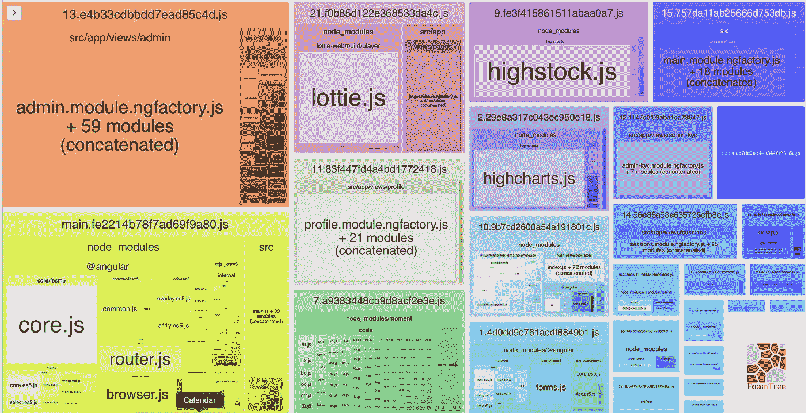

# 如何优化角度应用

> 原文：<https://itnext.io/how-to-optimize-angular-applications-99bfab0f0b7c?source=collection_archive---------0----------------------->



Angular 是构建单页面 web 应用程序最流行的框架。虽然我说的是单页面，但这并不意味着你的应用程序只能包含一个页面。你可以用 Angular 创建一个有几十个页面的网站。由于团队和社区的努力，框架本身(最新版本)得到了很好的优化，然而当谈到性能时，我们应该总是考虑一些可以使我们的应用程序快速流畅运行的事情。

## #1 通过延迟加载优化主包

当我们在没有延迟加载的情况下在生产中构建我们的应用程序时，我们很可能会看到这些文件在`dist`文件夹中生成

```
polyfills.js
scripts.js
runtime.js
styles.css
main.js
```

*polyfills.js* 是为了让我们的应用程序兼容不同的浏览器。因为我们用最新的特性编写代码，而不是所有的浏览器都支持这些特性。

*scripts.js* 包含我们在 angular.json 文件的脚本部分声明的脚本

```
"scripts": [
   "myScript.js",
]
```

*runtime.js* 是 webpack 加载器。该文件包含加载其他文件所需的 webpack 实用程序

*styles.css* 包含我们在 angular.json 文件的 styles 部分声明的所有样式

```
"styles": [
  "src/styles.css",
  "src/my-custom.css"
],
```

*main.js* 包含我们所有的代码，包括组件(ts、html 和 css 代码)、管道、指令、服务和所有其他导入的模块(包括第三方)。

正如你所看到的，随着时间的推移，main.js 文件会越来越大，这是一个问题，因为为了看到网站浏览器需要下载 main.js 文件，执行，并在页面上呈现，这不仅对互联网速度慢的移动用户来说是一个挑战，对桌面来说也是如此。

解决这个问题最简单的方法是将您的应用程序分成几个惰性模块。当我们为每个模块使用惰性模块时，angular 会生成自己的块，直到需要时才会加载(通常是通过激活路由)。

为了演示这一点，我创建了两个组件， *app.component* 和 *second.component.* 都在 *app.module* 中，所以这里没有偷懒。App.component 非常简单，有两个按钮用于导航到 Second.component 和返回 App.component。



然而，第二个组件在模板中包含非常大的文本(大约 1 mb)。



因为没有懒惰，当我们构建我们的应用程序时，我们得到 big main.js，它包含来自 app.component 和 second.component 的所有代码。

现在在 chrome 开发工具的网络标签中，我们可以看到 main.js 确实太大了(1.3 mb)


问题是大部分时候用户访问的是主页面，而不是某个特定的页面，所以加载其他页面的所有代码并不是最好的解决方案。我们可以为第二个组件创建懒惰模块，该模块将只在需要时被激活(即，只有当用户导航到该页面)。这给了我们非常小的 main.js，所以主页的第一次加载非常快。

当我们使用延迟加载时，在构建过程之后，新的文件将被创建，比如 4.386205799sfghe4.js。这是那个延迟模块的块，它不会在启动时被加载。现在，当我们打开应用程序时，我们看到 main.js 非常小(266 kb)



只有当我们导航到第二页时，我们才看到加载了新文件(1 mb)



然而，以这种方式加载每个片段也会影响性能，因为初始导航会更慢。幸运的是，Agular 通过[预加载策略](https://angular.io/api/router/PreloadingStrategy)也提供了解决这个问题的方法。我们可以说 Angular 加载我们的主模块(main.js ),当它完全加载并执行后，才在后台加载其他惰性模块，所以当用户导航到惰性页面时，所有内容都已经下载了。预加载所有模块的示例代码

```
*import* { PreloadAllModules, RouterModule } *from* '@angular/router';RouterModule.forRoot(
[
 {
    path: 'second',
    loadChildren: './second/second.module#SecondModule' } 
], {preloadingStrategy: PreloadAllModules})
```

> 所以总是考虑使用尽可能多的懒惰模块，并采用一些预加载策略。这将保持你的 main.js 较小，这意味着更快的下载和渲染主页。

## #2 使用 Webpack Bundle Analyzer 调试捆绑包

即使在将应用程序的逻辑分割成许多惰性模块后，您得到了大型主包(我个人认为中小型应用程序的“大型”超过 1 mb)，您也可以使用 Webpack Bundle Analyzer 进一步优化。这个 npm 包允许用一个交互式的可缩放树状图来可视化 webpack 输出文件的大小。首先在你的 angular 项目中安装插件作为开发依赖

```
npm install --save-dev webpack-bundle-analyzer
```

然后修改您的 *package.json* 文件，在`scripts`部分添加这一行

```
"bundle-report": "ng build --prod --stats-json && webpack-bundle-analyzer dist/stats.json"
```

注意`dist/stats.json`在你的项目中可能是不同的。例如，如果您的包文件是在`dist/browser`中生成的，您需要将命令修改为`dist/browser/stats.json`

终于跑了

```
npm run bundle-report
```

这将创建包含每个包的统计信息的生产构建，在 webpack bundle analyzer 的帮助下，我们可以使用 zoomable treemap 来可视化。



从这里我们可以看到每个包中使用了哪些模块/文件。这非常有帮助，因为我们可以直观地看到不应该出现的内容。

## #3 创建几个小的共享模块

让[和](https://en.wikipedia.org/wiki/Don%27t_repeat_yourself)共享模块被认为是最好的做法，但是有时候共享模块也会变得越来越大。例如，如果我们有包含许多其他模块/组件/管道的 *SharedModule* ，在 app.module 中导入这样的模块会增加 main.js 的包大小，因为我们不仅会导入主模块需要的东西，还会导入 *SharedModule* 附带的所有其他不必要的东西。为了避免这种情况，我们可以创建另一个共享模块， *HomeSharedModule* ，它将只包含主模块及其组件需要的组件。

> 拥有多个共享模块比一个大的共享模块要好。

## #4 对页面中不可见的图像使用延迟加载

当我们第一次加载我们的主页时，我们可以有对用户不可见的图像(不在视窗中)。用户必须向下滚动才能看到图像。然而，当我们加载页面时，图像会被立即下载，如果我们有很多图像，这真的会影响性能。为了解决这个问题，我们可以延迟加载图片，只在用户需要的时候加载。有一个 JavaScript API - [交叉点观察器 API](https://developer.mozilla.org/en-US/docs/Web/API/Intersection_Observer_API) ，这使得实现延迟加载内容变得非常容易。此外，我们可以为可重用性创建指令。这是关于它的一篇很好的文章。

## #5 对大列表使用虚拟滚动

框架的第 7 版在 CDK 引入了虚拟滚动。虚拟滚动基于列表的可见部分从 DOM 加载和卸载元素，使得我们的应用程序非常快。


我们可以只显示当时可见的几个项目，而不是加载和显示完整的列表

## #6 字体使用`FOUT`而不是`FOIT`

在大多数网站上，我们看到的是定制的漂亮字体，而不是普通字体。然而，当用户访问我们的页面时，使用其他服务提供的自定义或字体需要浏览器下载并解析该字体。如果我们使用像 Google Fonts
1 这样的第三方服务提供的自定义字体，会出现两种情况。浏览器等待下载字体，解析字体，然后在页面上显示文本。在字体没有被下载和解析之前，页面上的文本是不可见的。这是`FOIT`，或者说`Flash of invisible text`。

2.浏览器最初以常规字体显示文本，并尝试获取外部字体样式。当下载和解析后，它会用我们的自定义字体替换常规字体。页面上的文本将以常规字体呈现，同时如果浏览器将下载并解析外部字体，字体将被交换。这是`FOUT`，或者说`Flash of unstyled text`

大多数浏览器使用`FOIT`，只有 Internet Explorer 使用`FOUT`。为了解决这个问题，我们可以使用`@font-face`的`font-display`描述符，并告诉浏览器我们是否想使用常规字体，然后交换或隐藏文本。你也可以阅读[这篇文章](https://malthemilthers.com/font-loading-strategy-acceptable-flash-of-invisible-text)，它解释了字体是如何工作的，以及在什么情况下你需要`FOIT`和`FOUT`

我们可以使用许多其他技术来提高性能，包括服务器端渲染、服务工人、AMP 页面等等，我将在下一篇文章中讨论这些技术