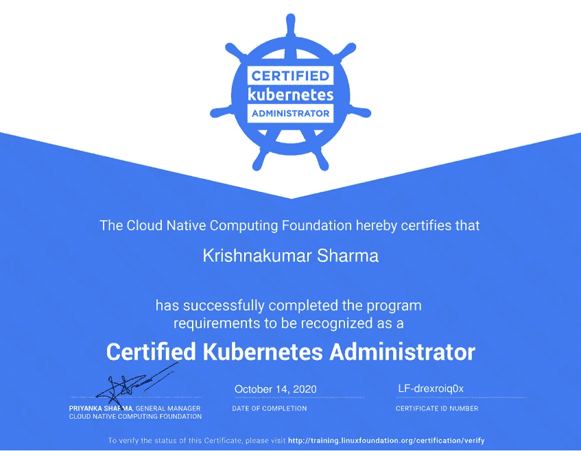

# 如何通过 2020 年 9 月发布的新 CKA 考试

> 原文：<https://itnext.io/how-to-pass-the-new-cka-exam-released-at-september-2020-e0e014d67f78?source=collection_archive---------0----------------------->

## 终极指南

## 通过考试的“技巧、诀窍和精选资源”的简短阅读

Linux 基金会决定对 CKA 进行一些修改，并从 2020 年 9 月开始发布新的格式。新的考试形式是两个小时，他们提高了问题的质量。现在，故障排除和集群管理有 17 个问题和大量权重:

集群架构、安装和配置— 25%
工作负载&计划— 15%
服务&网络— 20%
存储— 10%
故障排除— 30%

[这个](https://training.linuxfoundation.org/cka-program-changes-2020/)是了解新 CKA 的链接。跟随[这个](http://cncf.io/certification/ckad/)链接查看 CKAD，它只关注在 Kubernetes 上部署应用程序。

> 如果您正在使用 Kubernetes 的托管解决方案，例如 EKS、GKE 等。CKAD 可能是一个更好的选择，因为你不必担心 Kubernetes 的控制平面。

# 我是如何准备的:

在我去寻找提示、技巧和快速链接之前。我想快速说明我是如何准备的:

*   我在购买考试时浏览了 Linux 基金会提供的 Kubernetes 基础知识( [LFS258](https://training.linuxfoundation.org/training/kubernetes-fundamentals/) )。提供了许多实验，我做了很多次。
*   我在[**acloud . guru**](https://learn.acloud.guru/course/7f5137aa-2d26-4b19-8d8c-025b22667e76/dashboard)**中提到了[这个](https://learn.acloud.guru/course/7f5137aa-2d26-4b19-8d8c-025b22667e76/dashboard)课程。我也用过一些 handson 实验室。**
*   如果你没有订阅 acloud.guru，请点击[这个](https://www.udemy.com/course/certified-kubernetes-administrator-with-practice-tests/) [**udemy 课程**](https://www.udemy.com/course/certified-kubernetes-administrator-with-practice-tests/) ，我听到了非常好的评论。
*   我还尝试了一些 Katacoda.com 的场景来进行实践。
*   完成一次艰难的旅程。
*   我浏览了 kubernetes 文档，收藏了许多博客帖子和页面。我用 alfred 存储书签，这样我就可以快速打开它们。

> 至少给自己一个多月的时间来准备。

# 策划资源:

我参考了许多链接、博客和教程。最后，我将它们全部缩小到以下资源:

*   肯定会有一个关于网络政策的问题，请使用以下链接:[https://github.com/ahmetb/kubernetes-network-policy-recipes](https://github.com/ahmetb/kubernetes-network-policy-recipes)
*   **【重要】**试一试你在考试中能得到的一些问题，试试下面的指南:
    [https://github.com/David-VTUK/CKA-StudyGuide](https://github.com/David-VTUK/CKA-StudyGuide)
    [https://github.com/dgkanatsios/CKAD-exercises](https://github.com/dgkanatsios/CKAD-exercises)
*   我自己没有用过，但是我的一些朋友发现它很有用:
    [https://github.com/arush-sal/cka-practice-environment](https://github.com/arush-sal/cka-practice-environment)
*   为了理解 etcd 备份和恢复，我使用了以下链接:
    [https://cloud . Google . com/anthos/gke/docs/on-prem/archive/1.1/how-to/administration/backing-up](https://cloud.google.com/anthos/gke/docs/on-prem/archive/1.1/how-to/administration/backing-up)
*   我发现下面的链接包含了很多资源。如果你是 kubernetes 新手，想了解更多的话可以参考一下:
    [https://gist . github . com/strong JZ/4c 9 ad 30a 12 ab 715 AE 94 cf 72d 0e 7 BBC 30](https://gist.github.com/strongjz/4c9ad30a12ab715ae94cf72d0e7bbc30)

# **小技巧&招数:**

> 购买考试的最佳时间是在黑色星期五或网络星期一。考试费+ kubernetes 基础课程费用约为 200 美元，这是一笔不错的交易。当我上次检查时，通常费用是大约 500 美元。

*   练习使用命令式命令创建资源，例如`kubectl create --dry-run -o yaml > file.yaml`、`kubectl run`、`kubectl scale`和`kubectl expose`命令。这帮助我更快地解决了简单的问题。
*   学会使用`kubectl explain`命令，因为它可以给你很好的提示，帮助你在考试中使用命令。例如，对于网络策略，我使用了`kubectl explain netpol.spec.ingress`
*   务必在考试时设置正确的语境。给定了设置上下文的命令，因此请确保复制粘贴它。
*   我使用了下面的别名，你可以在大多数资源中使用它们。
    kg = " kube CTL get "
    KC = " kube CTL create "
    KD = " kube CTL describe "
*   您可以使用多个屏幕，因此请提前做好屏幕设置。
*   总是先完成简单的问题。如果某件事是不可能的，那么当你完成所有其他问题并再次检查你所有的答案后，尝试去做。

> 用 [killer.sh](https://killer.sh/cka) 练习考试。这是 CKA 考试模拟器。你会得到多少有些相似的经历。强烈推荐给想测试技能的人。

# 结束语:

我试图使这个指南尽可能紧凑。除了本指南中提到的资源之外，我认为您不会需要更多的资源。说实话，涵盖本指南中提到的所有资源花了我一个多月的时间。

我祝你通过认证。万一你第一次失败了，没什么可担心的。再试一次，你仍然可以通过考试。在两种尝试中，大多数问题通常是相似的。