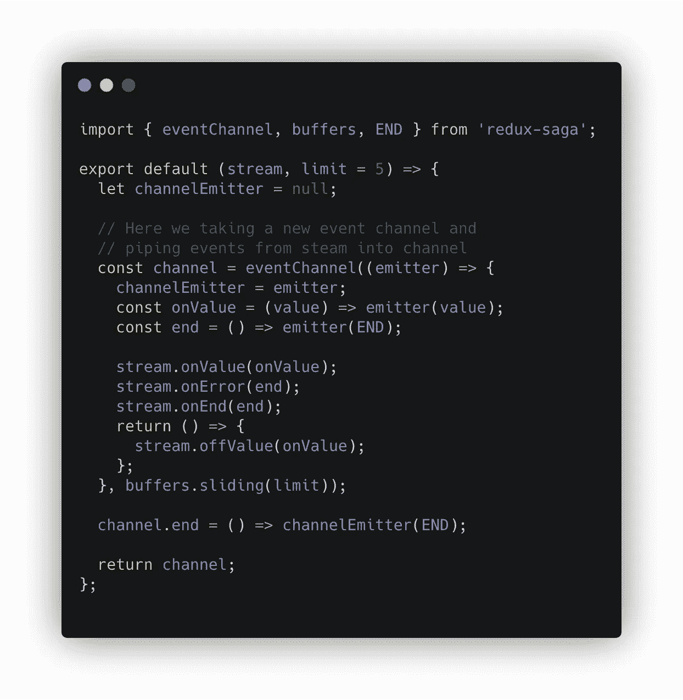
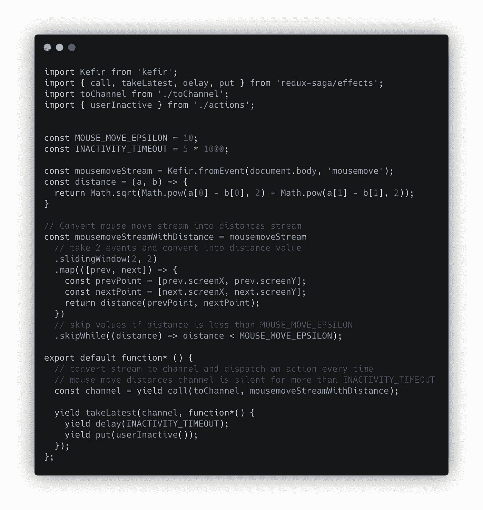

# 如何用 redux-saga 完美处理用户交互

> 原文：<https://itnext.io/how-to-perfectly-handle-user-interactions-with-redux-saga-5e5944e3ed8b?source=collection_archive---------3----------------------->

照片由[岩田良治](https://unsplash.com/@ryoji__iwata?utm_source=unsplash&utm_medium=referral&utm_content=creditCopyText)在 [Unsplash](https://unsplash.com/s/photos/saga?utm_source=unsplash&utm_medium=referral&utm_content=creditCopyText) 拍摄

通常，像 redux-thunk 或 redux 中间件这样的东西被用来处理 redux 动作触发的副作用，例如，redux 动作可以由按钮点击触发。但是如果您需要处理像鼠标或滚动事件这样的用户交互呢？您是否会创建一个组件，将所有事件传输到 redux 存储循环中？

我不这么认为，这有一些常识性的限制。您必须以其他方式将这些事件传递给副作用处理逻辑。

最简单的解决方案是使用`addEventListerner`并通过直接调用`store.dispatch`来分派动作，但是这并不理想。我们希望能够做异步的事情，节流/反跳，如果需要，等待其他行动，自由订阅/取消订阅事件。

我相信有很多方法可以做到这一点，但今天我想谈谈 redux-saga 的方法，以及如何使用它来处理 redux 之外触发的副作用。

## 向传奇传递事件

将事件传递到另一个模块或组件的好方法是什么？

我们希望控制 saga 之外的订阅/退订，以减少逻辑并保持整洁。此外，我们可能想分享传奇之间的事件。听起来我们应该为此使用[流](https://www.wikiwand.com/en/Stream_(computing))！

流很容易映射、减少、节流或去抖，并作为参数传递，这很好。此外，创建 DOM 事件流也很容易。

好的，很好，接下来我们需要用 streams 制作一个传奇作品。为了处理动作，有一组`take`效果[可用](https://redux-saga.js.org/docs/api/#takepattern)，它们接收模式或通道。

模式是像动作类型或`"*"`(对于所有动作)这样的字符串，或者这样的字符串的数组。 [Channel](https://redux-saga.js.org/docs/api/#channel) 是 saga 用来在任务间发送和接收消息的对象，队列中的消息一直存在，直到第一个感兴趣的接收者请求它，这与 streams 有点不同，streams 不存储消息，如果没有接收者或相同的消息可以被多个接收者接收，则消息将无处可去。

因此，我们可以使用通道作为媒介，将事件从一个流传递到一个传奇的生效中。这很简单:

`toChannel(stream, limit)`功能

当我们可以简单地从 DOM 事件中创建一个通道时，为什么还要创建一个流，然后将它转换成通道呢？这是一个很好的问题，我想说这使得事情在未来变得不那么复杂。

一般来说，你不希望一个频道有多个接收器(除非在极少数情况下，你真的需要它)。所以他们通常在提供生效之前创建，对于每一个新的效果应该创建一个新的通道，否则，消息不会被传递到每个`take`效果任务，而只会传递到第一个准备好接受消息的。因此，拥有一个流(可以很容易地被复制、映射、简化成另一个流)和`toChannel`函数看起来更方便，而不是为每个新创建的通道编写逻辑。

## 传奇故事

看起来一切准备就绪，可以开始处理交互了。

举个例子，如果鼠标在一段时间内没有活动，我们需要触发一个动作，让我们来处理这种情况。

活动跟踪传奇

Saga 显得很单薄，5 行代码，大多是鼠标事件和 redux store 之间的胶水。但我喜欢的是，我们只是将激烈的全局事件源转换为简单的 redux store 动作，而不必再定义一个根组件，将许多动作分派到 redux store 中，并在中间件中过滤它们。

上面对一个传奇的最初描述听起来很有趣，可能不太容易实现，但是 redux-saga + streams 将它变成了一个简单但有些无聊的任务。

这太棒了！

## 结论

在 sagas 中使用流可能听起来与复杂抽象的简化相反，但事实上，它只需要一点时间来适应，并以巨大的能力处理交互，这可以与一个结构更好的 redux 商店结合，以构建优秀和高性能的客户端应用程序。