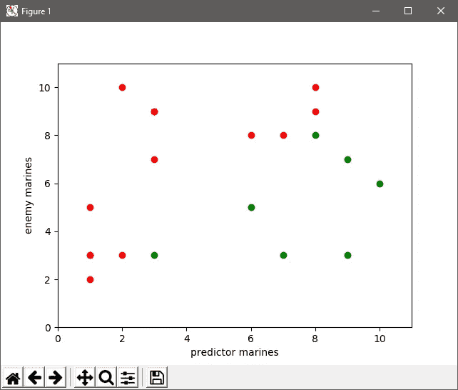
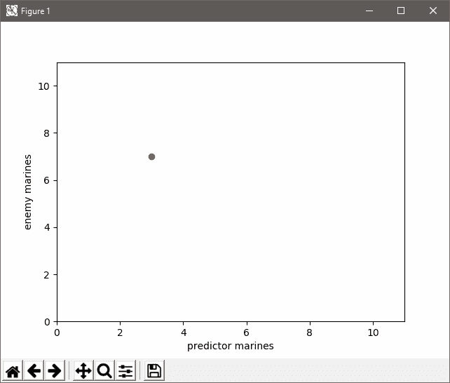
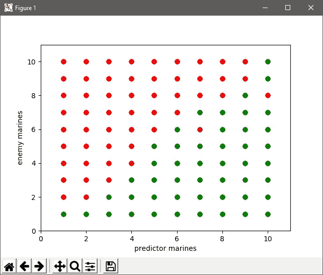
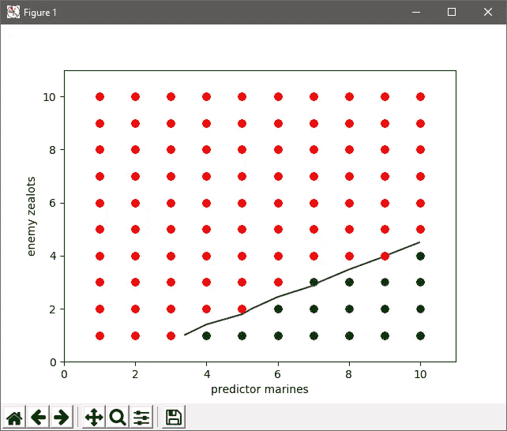

# 如何用机器学习预测星际争霸 2 战斗结果

> 原文：<https://itnext.io/how-to-predict-starcraft-ii-battle-outcomes-with-machine-learning-40d527a2f7a4?source=collection_archive---------0----------------------->

最近我采访了拉夫尔和不寻常，他们是成功的星际争霸 2 机器人名为微型机器的创造者。在采访中，他们描述了他们的机器人如何使用来自 [sc2-libvoxelbot](https://github.com/HalfVoxel/sc2-libvoxelbot) 的战斗模拟器来模拟某些单位之间的战斗结果，并使用这些模拟来选择是进攻还是撤退。

战斗模拟器是一个很棒的工具，让我想起了我在 2017 年参加 BlizzCon 人工智能峰会时的一个想法。目标是训练一个机器学习算法来预测部队之间的战斗结果。在本教程中，我们将实现这一目标。

为了简单起见，我们将使用两个人族机器人，让他们选择建造 1 到 10 个陆战队员，然后让他们互相攻击。我们将记录几场比赛的结果，然后将这些结果输入到机器学习算法中，看看它能有多准确。

# 1.建造基本的人族机器人

人族机器人非常简单，和你在我以前的教程中看到的机器人非常相似，但是这次有一些性能上的改进。创建一个名为`terran_agent.py`的文件，我们可以导入我们的库:

接下来，我们将用三种方法创建我们的`TerranAgent`类，这三种方法将允许机器人建造补给站、兵营和训练海军陆战队:

现在我们有了特殊的攻击方法。首先，如果有任何敌军单位，我们会把我们的单位送到地图中间去和他们战斗。这确保了地形、建筑或任何其他因素可以从战斗中移除，从而确保一个干净的结果。一旦敌人的军队被击败，我们将集中火力攻击他们的建筑来快速结束游戏。

最后，在 step 方法中，我们将整理机器人做出决策所需的所有信息。通过在这里的单个循环中这样做，我们消除了以后重复循环单元的需要。这种性能改进对我们的 bot 的速度有很大的影响。

为了防止海军陆战队生产过剩，我们需要跟踪有多少人在我们的军营排队。为了做到这一点，我们循环通过军营的所有订单。如果订单的值为`511`，这意味着一名海军正在排队:

我们还将整理一些关于敌军的数据:

最后，如果这是游戏的第一步，我们将记录基本位置，以便将来的计算更简单一些:

你可以在这里看到这个文件的最终版本。

# 2.创造敌方特工

现在创建一个名为`battle_tvt.py`的新文件，并添加一些导入:

为了确保代理只在他们都准备好的时候攻击，我们使用了一个战斗管理器作为中心通信工具。当预测者和敌人都准备好了，他们就可以进攻了:

接下来我们创建我们的`EnemyAgent`类，接收战斗管理器作为参数:

在我们的步骤方法中，如果是游戏的第一步，我们想随机选择一个数量的陆战队员来建造，并在战斗管理器中记录这个数量。我们还重置了敌人的准备状态:

这里的最后一行将把敌方海军陆战队的数量输出到控制台，这样你就可以跟踪每场比赛中的决策。

在我们执行任何行动之前，我们还希望更新敌人的就绪状态，以防到了攻击的时候:

现在，我们把建造建筑和训练海军陆战队的所有逻辑放进去。首先，我们要检查两个代理是否都准备好了，如果是的话，我们将攻击，否则我们继续建造顺序。

这个序列是非常重要的，一旦我们标志着代理人准备好了，我们不想在游戏的剩余时间里建造任何建筑或训练任何陆战队员，否则结果将会是扭曲的。这就是为什么我们把攻击检查放在第一位。

你还可以在这里看到另一个重要的逻辑，我们将海军陆战队的数量添加到排队的海军陆战队数量中，并与我们的目标进行比较。这样做是很重要的，以确保我们不会过度生产海军陆战队。

# 3.创建预测代理

接下来我们将创建我们的`PredictorAgent`类。这个职业与`EnemyAgent`非常相似，但是有一些细微但非常重要的区别。

您可以看到的第一个区别是，我们设置了预测器海洋目标，并重置了预测器就绪状态。

为了跟踪每场比赛的结果，我们将让预测代理在最后一步将结果输出到一个 CSV 文件:

接下来，我们添加准备就绪检查，确保使用预测值:

然后，我们添加攻击和构建顺序，再次使用预测值:

# 4.让它跑起来

最后，在文件中，我们添加了代码，使代理之间相互竞争。首先，我们创建一个战斗管理器实例，并将其提供给每个代理:

然后我们添加正常的游戏循环代码。在这种情况下，我们使用 Flat128 地图，这样我们可以避免地形扭曲结果。我们使用相对较低的分辨率 64，步长乘数 128，这有助于我们的机器人快速前进许多构建进度，这意味着它将运行得更快。我们还将禁用战争迷雾，这样视觉就不会改变结果。

这个文件的最终版本可以在[这里](https://github.com/skjb/pysc2-tutorial/blob/master/Battle%20Predictor/battle_tvt.py)获得。

现在运行您的代码，它应该完成 20 集，并将所有结果输出到`tvt.csv`。

# 5.分析结果

为了选择正确的机器学习算法来解决您的问题，在图表上绘制结果会很有帮助。

创建一个名为`plot_tvt.py`的新文件，并添加一些导入:

接下来，我们将读取 CSV 文件中的所有行:

然后，我们可以将这些值添加到图表中。在这种情况下，我们将添加一个预测值为“赢”的绿点(值为 1)或预测值为“输”的红点(值为-1):

接下来，我们可以添加一些标签和限制，使图形更好看一些:

最后，我们展示图表:

我的图表看起来是这样的，但是你的会略有不同，因为海军人数是随机的:



我们需要一个分类算法来帮助我们尽可能好地区分“赢”和“输”这两个类别。幸运的是，有一种专门为此设计的算法叫做逻辑回归。

为了帮助您了解算法是如何工作的，这里有一个在每场比赛后训练算法的动画，这条线显示了“决策边界”或算法从“赢”切换到“输”的点:



你可以在这里看到这个文件[的最终代码。](https://github.com/skjb/pysc2-tutorial/blob/master/Battle%20Predictor/plot_tvt.py)

# 6.训练算法

创建一个名为`train_tvt.py`的新文件，并添加以下导入:

接下来，我们要读取 CSV 中的行并构建两个数据集，第一个数据集将包含预测者和敌人的陆战队计数，第二个数据集将包含结果:

这是我原来的 [CSV](https://github.com/skjb/pysc2-tutorial/blob/master/Battle%20Predictor/tvt.csv) 文件:

```
3,7,-1
9,7,1
1,3,-1
6,8,-1
2,3,-1
1,5,-1
9,3,1
7,8,-1
1,3,-1
7,3,1
3,9,-1
8,10,-1
1,2,-1
6,5,1
3,3,1
2,10,-1
8,8,1
10,6,1
3,9,-1
8,9,-1
```

在阅读了这个文件之后，`inputs`的值看起来会是这样的:

```
[(3, 7), (9, 7), (1, 3), (6, 8), (2, 3), (1, 5), (9, 3), (7, 8), (1, 3), (7, 3), (3, 9), (8, 10), (1, 2), (6, 5), (3, 3), (2, 10), (8, 8), (10, 6), (3, 9), (8, 9)]
```

之后`labels`的值看起来类似于:

```
[0, 1, 0, 0, 0, 0, 1, 0, 0, 1, 0, 0, 0, 1, 1, 0, 1, 1, 0, 0]
```

幸运的是 [scikit-learn](https://scikit-learn.org/) 库包含了一个逻辑回归算法，所以我们首先创建一个实例:

为了检查机器学习算法的准确性，通常将数据集分成训练集和测试集。我们可以将我们的`inputs`和`labels`值输入到`train_test_split`函数中，以获得训练集和测试集:

术语“标签”通常用于描述分类算法的输出或预测。在这种情况下，有两个标签，赢或输，用值 1 和 0 表示。

默认情况下，train_test_split 函数使用 75%的数据进行训练(我们的数据集中有 15 行)，剩余的 25%用于测试(我们的数据集中有 5 行)。

现在，我们可以通过输入训练数据和标签来训练我们的逻辑回归算法:

然后，我们要求算法对测试数据进行预测:

最后，我们可以将预测与真实的测试集结果进行比较:

你应该会发现这里的最后一行输出一个介于 0.8 (80%)和 1.0 (100%)之间的值，由于随机的数据集，结果可能会有所不同。随着更多的数据，你会发现准确率稳定在 90%左右，例如我训练了 1000 场比赛:



这导致了 91.2%的准确率。如果你看上面的图表，你会发现有一些你可能没有预料到的有趣情况，例如 6 个敌方陆战队员对预测者的 7 个导致了失败，8 个敌方陆战队员对预测者的 10 个也是如此。即使双方的海军陆战队人数相等，结果也可能是这样或那样。

这个“灰色区域”意味着 90%左右的准确率实际上可能非常接近您从系统中所能获得的最高准确率。

这个文件的最终版本可以从[这里](https://github.com/skjb/pysc2-tutorial/blob/master/Battle%20Predictor/train_tvt.py)获得。

# 7.扩展和实现

我们在本教程中涉及的例子非常简单，但是我已经扩展到包括更复杂的军队组成和比赛，它们都达到了 90%以上的准确率。我尝试的一个场景是陆战队员对狂热者，它有 99%的准确率:



一旦你训练了你的比赛，你可以保存所学的数据。首先添加一个导入:

然后，在对整个数据集而不仅仅是测试集进行训练之后，您可以转储数据。

然后你需要做的就是加载数据，让你的算法做一个预测，比如:

这将会产生如下结果:

```
[0]
```

预测速度非常快，所以你可以定期运行它，而不会对你的机器人的速度产生重大影响。为了最终的优化，你应该加载它一次，并多次调用`predict`。

如果你喜欢这个教程，请在 [Patreon](https://www.patreon.com/skjb) 上支持我。也请和我一起上 [Discord](https://discord.gg/zXHU4wM) ，或者关注我上 [Twitch](https://www.twitch.tv/skjb) 、 [Medium](https://medium.com/@skjb) 、 [GitHub](https://github.com/skjb) 、 [Twitter](https://twitter.com/theskjb) 和 [YouTube](https://www.youtube.com/channel/UCZcEvhpV4_6llcrWrWQ2wsg) 。