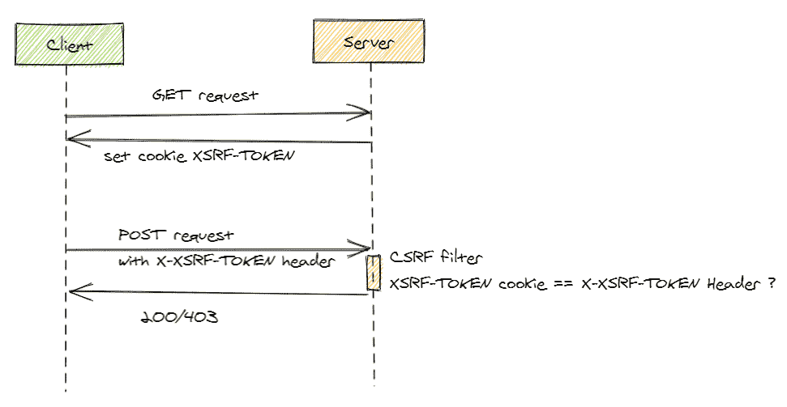
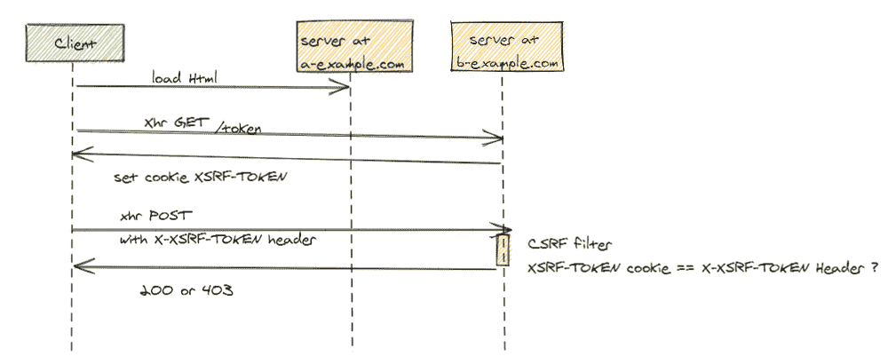
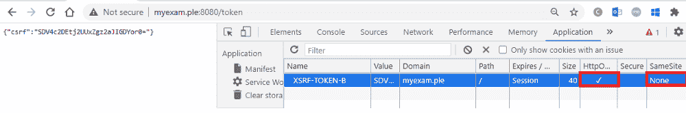

# 如何防止跨站请求伪造合法的跨站请求

> 原文：<https://itnext.io/how-to-prevent-cross-site-request-forgery-of-legitime-cross-site-request-5b59a6a56808?source=collection_archive---------1----------------------->

你在你的角度应用中打开 CSRF 保护了吗？你注意到这对于合法的跨站点请求不起作用吗？

东圭佑在 [Unsplash](https://unsplash.com?utm_source=medium&utm_medium=referral) 上的照片

想象一下，有一天你醒来，发现有人窃取了你的互联网域名。这正是几年前设计师大卫·艾雷的情况。一名攻击者利用了 [Gmail 的 CSRF 漏洞](https://www.davidairey.com/google-gmail-security-hijack)，控制了大卫·艾雷的邮箱，并以他的名义联系了域名注册商。

在过去的几年里，CSRF 已经意识到了这一点，所以现在的现代框架都有内置的保护机制。

一个常见的情况是，网站从同一个域(即源)提供服务，就像站点发出请求的目标域一样。但是，情况并非总是如此，这种情况对 CSRF 来说尤其脆弱。

在这篇文章中，我探讨了有哪些选项可以减轻同站点和单页面应用程序的合法跨站点请求的 CSRF 漏洞。这篇博客中的代码示例是针对在服务器端使用 Spring 用 Angular 编写的单页面应用程序的，但是这些原则也适用于其他框架。

## 什么是 CSRF？

互联网上有大量解释 CSRF 袭击的精彩文章。让我在这里引用一下，根据 [OWASP](https://cheatsheetseries.owasp.org/cheatsheets/Cross-Site_Request_Forgery_Prevention_Cheat_Sheet.html#double-submit-cookie) 的定义是什么:

> 跨站点请求伪造是一种攻击，当恶意网站、电子邮件、博客、即时消息或程序在用户通过身份验证后导致用户的 web 浏览器在受信任的站点上执行不需要的操作时，就会发生这种攻击。CSRF 攻击之所以有效，是因为浏览器请求自动包含所有 cookie，包括会话 cookie。因此，如果用户通过了站点的身份验证，站点就无法区分合法请求和伪造请求。"

# 相同站点场景和双重提交 Cookie

根据带有双重提交 cookie 保护模式的 OWASP 备忘单:“我们在 cookie 和请求参数中发送一个随机值，服务器验证 Cookie 值和请求值是否匹配。”

双重提交 Cookie 方案

## Angular 的内置保护

在自定义请求头中发送 CSRF cookie 值是 Angular 内置保护的一部分，默认情况下**关闭**。我们需要导入`HttpClientXsrfModule` 来打开保护。****

**这指示站点查找名为`XSRF-TOKEN`的 cookie，提取 cookie 值，并将其设置为每个状态修改`XHR` 请求的自定义`X-XSRF-TOKEN`请求头。**

**当然，`XSRF-TOKEN` cookie 必须被设置为`HttpOnly:false`，这样 javascript 代码才能读取它的值。也可以定制一个 cookie 名称和请求头，如 Angular 文档[中所述。](https://angular.io/guide/http#security-xsrf-protection)**

## **服务器生成的 CSRF 令牌**

**在客户端可以在每个状态改变请求中附加 cookie 之前，需要设置 cookie。这对于 Spring Security 来说很简单。**

**使用`csrf().csrfTokenRepository(CookieCsrfTokenRepository.withHttpOnlyFalse()`,我们可以确保对于每个到达服务器的请求，服务器都会评估`X-XSRF-TOKEN`请求头是否存在，并将其与自定义请求头中存在的`XSRF-TOKEN` cookie 的值进行比较。如果没有 cookie，或者 cookie 不匹配，服务器用 HTTP 状态代码 403 响应，并在响应`Set-Cookie` 响应头中添加新生成的`XSRF-TOKEN`。**

## **为什么这为 CSRF 提供了保护**

1.  **从 javascript 不可能读取或修改 cookiess，这些 cookie 是为作为站点来源的不同域设置的。因此，如果攻击者诱骗用户访问 evil.com，evil.com 上的 javascript 无法读取也无法覆盖为 example.com 域设置的`XSRF-TOKEN` cookie 的值**
2.  **根据 javascript，不可能根据浏览器的同源策略设置自定义请求头(例如`X-XSRF-TOKEN`)，除非服务器允许来自该域的跨源请求，并允许这种特定的自定义头。**
3.  **如果 cookie 是在服务器端用`SameSite`属性设置的，它将提供额外的保护级别，因为该属性告诉浏览器不要在跨站点请求中附加 cookie。这是 Spring Security 的类`CookieCsrfTokenRepository`的一个限制，到今天为止，它还不能将 CSRF cookie 设置为`SameSite:Strict`或`Lax`。**

**第一个致命弱点是攻击者控制了子域，因为 evil.example.com 有可能为 example.com 设置了一个 cookie。OWASP 备忘单建议通过设置 HMAC 签名的 CSRF cookie 在服务器端引入另一层保护，这样即使在子域上运行的恶意代码覆盖了 cookie，服务器也会注意到 cookie 被篡改了。**

**另一个弱点是，即使带有安全标志的 cookies 也可能被 http 站点覆盖。这两个弱点在这里都有详细的[。](https://owasp.org/www-chapter-london/assets/slides/David_Johansson-Double_Defeat_of_Double-Submit_Cookie.pdf)**

# **跨站点场景和双重提交 Cookie**

**以前的方法不适用于跨源请求，在跨源请求中，站点合法地从另一个域而不是站点源请求资源。**

****

**这是因为 javascript 无法读取为不同域设置的 cookie 的值。因此，不可能使用 Angular 的内置功能。**

## **生成并分发 CSRF 令牌**

**解决这个问题的一种方法是公开一个专用的令牌 API 方法，该方法生成一个令牌，将它包含在自定义响应头或响应体中，同时通过`Set-Cookie`响应头将其设置为 cookie。**

**在这个新的/token 方法的实现中:**

*   **我们不再需要 javascript 可读的 cookie，因此我们将 cookie 设置为`HttpOnly`**
*   **`SameSite` 被设置为`None` —这与 [OWASP CSRF 预防备忘单建议](https://cheatsheetseries.owasp.org/cheatsheets/Cross-Site_Request_Forgery_Prevention_Cheat_Sheet.html#samesite-cookie-attribute)使用`SameSite`T5 或`Strict`相矛盾。然而，如果在这种情况下，我们真的需要针对不同的领域，所以我们必须设置`None`。如果我们不显式设置，Chrome 默认为`Lax`(正如我之前的[博文](https://medium.com/swlh/7-keys-to-the-mystery-of-a-missing-cookie-fdf22b012f09)中所讨论的)。**

****

## **获取 CSRF 令牌并将其附加到状态更改请求**

1.  **在下面的示例中，主组件/令牌方法在`ngOnInit`中被调用，来自响应主体的令牌被设置为变量 csrfToken。注意，由于请求是跨源请求，它必须是`withCredentials:true`，否则服务器响应`Set-Cookie`将被浏览器忽略。**

**2.实现一个拦截器，它在定制请求头`X-XSRF-TOKEN-B`中向每个(状态改变)请求附加令牌值**

## **过滤请求**

**此外，还需要在服务器上实现一个定制的过滤机制，将从请求头中提取的值与 cookie 中的值进行比较。CSRF 滤波器的参考实现可以在[这里](https://github.com/righettod/poc-csrf/blob/master/src/main/java/eu/righettod/poccsrf/filter/CSRFValidationFilter.java)找到。**

## **为什么这为 CSRF 提供了保护**

1.  **除非服务器在`Access-Control-Allow-Origin` 响应头中回复带有站点来源的预检请求，否则站点不可能向加载站点之外的来源发出 XHR 请求。**
2.  **网站不可能在 XHR 请求中附加任意自定义标题，除非服务器在允许的标题列表中用自定义标题回复预检请求**

> **在这个场景中，服务器端的令牌分发和过滤本身**并不能保护**免受 CSRF 攻击，因为当访问恶意站点时，GET request to /token 方法可能是伪造的。如果 CSRF 令牌被期望作为隐藏的表单值 POST 发送到服务器，这将不会提供任何保护。CSRF 令牌作为自定义请求标头发送是非常重要的。**

## **模拟攻击**

**下面是一个恶意 HTML 的例子，在加载时，XHR 获取获取令牌的请求，然后将这个令牌附加在隐藏的表单参数中。如果我们运行这个目标后端服务，它表明，由于 CORS 政策，自定义标头中带有 CSRF 令牌值的 POST 请求将被浏览器阻止，除非该自定义标头和该域被特别允许。**

# **摘要**

**为合法的跨站点请求实现足够的跨站点伪造保护是具有挑战性的。**

**至少可以做的是:**

*   **使用**定制请求头**实现双重提交 cookie 模式**
*   **依靠浏览器的同源策略，该策略不允许 XHR 请求指向任意来源。在服务器端设置特定(**而非通配符**)允许的来源和自定义头**
*   **防范跨站点脚本(XSS)。XSS 的攻击可以打破任何 CSRF 的保护**