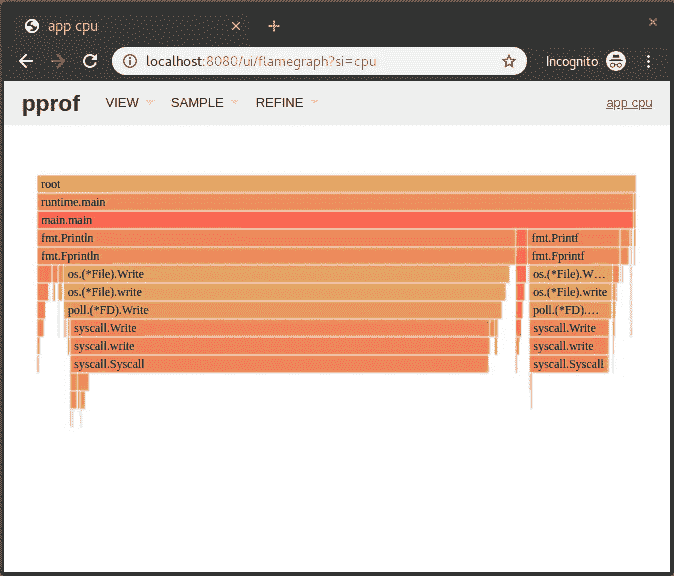
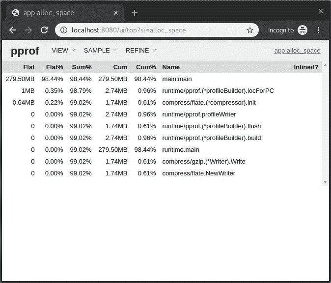

# 如何在 docker 容器中分析 Go 应用程序

> 原文：<https://itnext.io/how-to-profile-go-applications-inside-a-docker-container-d29431fbb427?source=collection_archive---------5----------------------->

# 介绍

在这篇文章中，我将简要介绍几种可以用来分析/调试 docker 容器中运行的 Go 应用程序的方法。为了更深入地了解这几种方法，我在文章末尾添加了源代码链接，您可以参考。我真的建议您阅读列出的源代码，并仔细阅读如何使用和解释创建的概要文件，以便调试/优化您的应用程序。这篇文章旨在帮助你在使用 Docker 容器运行 Go 应用程序时创建这些配置文件。主要思想是我们将利用由`net/http`包提供的远程概要分析功能。

# 应用

我们将使用`pprof`来分析您的 Go 应用程序，当您能够在本地访问应用程序的二进制文件时，您通常会使用`pprof`。当你使用 docker 容器时，你需要在容器中安装`go tool`来分析它。然而，还有另一种方法来分析 docker 容器中运行的 Go 应用程序。为此，我们需要创建一个 HTTP web 服务器，它将启用`pprof` HTTP 端点。从这些端点，我们能够下载正在运行的应用程序的配置文件。

所以首先我们需要创建一个 HTTP web 服务器，我们将在一个 goroutine 中运行它。然后我们可以导入`net/http/pprof`包，它会自动启用我们创建的 web 服务器的`pprof` HTTP 端点，并且会在`http://localhost:6060/debug/pprof` URL 下安装处理程序。

因此，我们可以在代码中添加以下内容:

```
// main.go
package mainimport (
    "fmt"
    "math/rand"
    "net/http"
    "net/http/pprof"
)func main() { // Add the following
    go func() {
        http.ListenAndServe(":6060", nil)
    }() // Some sample code
    for {
        n := rand.Intn(10) + 1
        fmt.Printf("Fibonacci sequence for %d:\n", n)
        for i := 1; i <= n; i++ {
            fmt.Println(fibonacci(i))
        }
    }
}func fibonacci(n int) int {
    if n < 2 {
        return n
    }
    return fibonacci(n-1) + fibonacci(n-2)
}
```

当您使用不同的路由器时，我们可以执行以下操作来使`pprof` HTTP 端点工作。下面是一个例子，如果你使用 [gorilla/mux](https://github.com/gorilla/mux) 你会如何做

```
// main.go
package mainimport (
    _ "expvar"
    "net/http"
    "net/http/pprof"
    _ "net/http/pprof"

    "github.com/gorilla/mux"
)func main() {
    router := mux.NewRouter() router.HandleFunc(
        "/debug/pprof/", pprof.Index,
    )
    router.HandleFunc(
        "/debug/pprof/cmdline", pprof.Cmdline,
    )
    router.HandleFunc(
        "/debug/pprof/profile", pprof.Profile,
    )
    router.HandleFunc(
        "/debug/pprof/symbol", pprof.Symbol,
    )
    router.HandleFunc(
        "/debug/pprof/trace", pprof.Trace,
    )
    router.Handle(
        "/debug/pprof/goroutine", pprof.Handler("goroutine"),
    )
    router.Handle(
        "/debug/pprof/heap", pprof.Handler("heap"),
    )
    router.Handle(
        "/debug/pprof/threadcreate", pprof.Handler("threadcreate"),
    )
    router.Handle(
        "/debug/pprof/block", pprof.Handler("block"),
    )
    router.Handle(
        "/debug/vars", http.DefaultServeMux,
    ) http.ListenAndServe(":6060", router)
}
```

# 码头工人

对于 docker 容器，我们将创建以下`Dockerfile`:

```
# Dockerfile
FROM golang:1.13

WORKDIR /go/src/app
COPY . .

RUN go get -d -v ./...
RUN go install -v ./...

CMD ["app"]
```

接下来，我们可以构建并启动 Docker 容器:

```
$ docker build -t pprof-app .
$ docker run -p 6060:6060 -it --rm --name my-running-app pprof-app
```

一旦您更新了文件，您将能够通过使用您的浏览器访问端点并转到[http://localhost:6060/debug/pprof/](http://localhost:8888/tree)，或者您可以使用`go tool pprof`。我们将探索一些使用`go tool pprof`分析应用程序的方法

# pprof

现在，我们已经为使用`pprof`做好了一切准备，我们将为 cpu 和 heap 分析我们的应用程序。此外，我们还将跟踪应用程序。

**CPU**

当我们想要开始分析我们的应用程序以确定应用程序在哪里花费时间时，我们首先需要做一个 CPU 分析。我们有几种方法可以做到这一点。下面我就举几个常见的。它的要点是，我们通过 HTTP 在应用程序中创建的端点上获取配置文件。

1.  转到[http://localhost:6060/debug/pprof/profile](http://localhost:6060/debug/pprof/profile)，30 秒后你会自动下载这个概要文件，或者
2.  使用`go tool pprof`。它会告诉您配置文件存储在哪里，并会打开一个交互式终端，您可以使用它来解释结果。像这样:`go tool pprof [http://localhost:6060/debug/pprof/profile](http://localhost:6060/debug/pprof/profile)`

之后，我们可以解释结果，为此，我们再次有几个选项和工具，我们可以用来解释结果。你可以在我在帖子末尾的“来源”部分列出的网站上阅读更多关于解释结果的其他方法。

在这里，我将向你展示其中的几个。其中之一是我们能够在自动创建的 web 界面中检查结果。

```
$ go tool pprof -http=":8080" [path-to-profile-dump]
```

这将打开一个网络浏览器，我们可以在其中检查，例如，所创建的配置文件的火焰图。



横轴代表采集的样本总数。所以面积越大，执行相关功能花费的时间就越多。垂直轴表示调用堆栈的深度。所以峰值越高，调用栈越深。颜色不代表任何特定的东西；它们只是为了形成视觉对比。[](#a60c)

另一种方法是我们可以通过使用`go tool`来使用基于命令行的交互界面:

```
$ go tool pprof [path-to-profile-dump]
```

我们还可以立即转到 web 界面，通过使用以下命令来单步执行整个下载配置文件步骤:

```
$ go tool pprof \
    -http=":8080" \
    [http://localhost:6060/debug/pprof/profil](http://localhost:6060/debug/pprof/profile)e
```

需要记住的一点是:如果你制作 cpu 概要文件需要一定的时间，你需要指定你的服务器能够处理那些长时间的请求。您通常希望将以下内容添加到您的`http.Server`:

```
srv := &http.Server{
     WriteTimeout: 30 * time.Second,
}
```

# 许多

为了获得堆配置文件，以便我们可以检查应用程序的内存使用情况，我们可以再次发出以下命令:

1.  转到[http://localhost:6060/debug/pprof/heap](http://localhost:6060/debug/pprof/heap)，我们会自动下载堆概要文件，或者
2.  使用`go tool`，它会告诉你配置文件存储在哪里，并打开一个交互式终端，你可以用它来解释结果:

```
# Heap profile
#
# optional flags:
#   –alloc_space tells you how many megabytes have been allocated.
#   –inuse_space tells you know how many are still in use.
$ go tool pprof http://localhost:6060/debug/pprof/heap
```

而且，就像 CPU 配置文件一样，我们能够用`go tool pprof`和 web 界面来解释它:

```
# Go tool
$ go tool pprof [path-to-profile-dump]

# Web interface
$ go tool pprof -http=":8080" [path-to-profile-dump]

# Create profile and start web interface
$ go tool pprof -http=":8080" http://localhost:6060/debug/pprof/heap
```



# 找到；查出

为了跟踪应用程序的运行时活动/事件，我们可以做以下事情。首先，我们需要下载跟踪文件，为此我们可以使用 curl。指定要创建跟踪的秒数，并确保在该时间段内创建一些负载。下载完成后，您可以使用`go tool`启动一个 web 界面，在其中您可以检查结果。

跟踪工具将捕获执行事件，如创建、阻塞、解除阻塞 goroutines、垃圾收集事件、处理器启动和停止、进入、退出和阻塞系统调用。[](#a00a)

发出以下命令:

```
$ curl \
    http://localhost:6060/debug/pprof/trace?seconds=20 > \
    trace.out
$ go tool trace trace.out
```

这将打开您的 webbrowser，您将能够使用提供的 web 界面解释您的跟踪结果。

# 结论

我们已经探索了一些方法，当 Go 应用程序在 Docker 容器中运行时，这些方法允许我们分析它。还有很多信息可以帮助您使用这些方法优化应用程序。我在下面的“来源”一节中列出了其中的几个。一定要去看看他们，他们有一些很好的额外信息可以帮助你。

# 来源

*   [golang.org:诊断学](https://golang.org/doc/diagnostics.html)
*   [golang . org:Package runtime/pprof](https://golang.org/pkg/runtime/pprof/)
*   [golang . org:Package net/http/pprof](https://golang.org/pkg/net/http/pprof/)
*   [golang.org:剖析围棋程序](https://blog.golang.org/profiling-go-programs)
*   [github.com: Go 工具 pprof](https://github.com/google/pprof/blob/master/doc/README.md)
*   [朱莉娅·埃文斯:剖析与 pprof 一起走](https://jvns.ca/blog/2017/09/24/profiling-go-with-pprof/)
*   [docker 守护进程中的 Jimmy-Xu:pprof](https://gist.github.com/Jimmy-Xu/85fb01cd7620454c6d65)
*   [Rhys hilt ner:go 工具跟踪简介](https://about.sourcegraph.com/go/an-introduction-to-go-tool-trace-rhys-hiltner)
*   里斯·希尔特纳:围棋执行追踪(youtube)
*   [Svet Ralchev:Golang 程序的性能和内存分析](http://blog.ralch.com/tutorial/golang-performance-and-memory-analysis/)
*   [Brad Fritzpatrick:剖析&在 Go 中优化](https://github.com/bradfitz/talk-yapc-asia-2015/blob/master/talk.md)
*   [威尔·休厄尔:去工具追踪](https://making.pusher.com/go-tool-trace/)

1.  【http://www.brendangregg.com/flamegraphs.html 
2.  [https://golang.org/doc/diagnostics.html](https://golang.org/doc/diagnostics.html)

*最初发表于*[*https://bruinsslot.jp/post/profiling-golang-docker-2*](https://bruinsslot.jp/post/profiling-golang-docker-2)