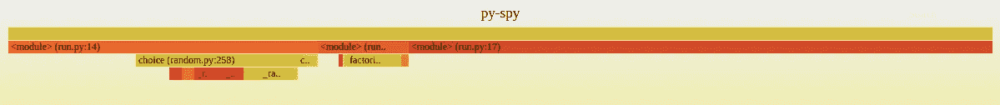

# 如何在 docker 容器中分析 Python 应用程序

> 原文：<https://itnext.io/how-to-profile-python-applications-inside-a-docker-container-ed59bcc22696?source=collection_archive---------2----------------------->


[寺鹂](https://unsplash.com/@templecerulean?utm_source=medium&utm_medium=referral)在 [Unsplash](https://unsplash.com?utm_source=medium&utm_medium=referral) 上拍照

在接下来的文章中，我将解释如何使用 [py-spy](https://github.com/benfred/py-spy) 在 Docker 容器中剖析一个正在运行的 Python 程序。`py-spy`能够生成[火焰图](http://www.brendangregg.com/flamegraphs.html)，并且它可以给我们剖析能力，以便调试我们的 Python 程序。现在，当你的 Python 代码在 Docker 容器中运行时，剖析你的代码可能会有点困难，这篇文章将向你展示如何使用这些工具来完成。

在我们分析 Python 应用程序之前，我们需要设置我们将在这个项目中使用的工具和示例文件。你可以在这里查看成品[。](https://github.com/erroneousboat/profile-python-docker)

# 1.1 项目

让我们从项目大纲开始，创建以下文件和文件夹，`docker-compose.yml`是可选的，因为我也将向您展示如何使用普通的`docker`。

```
$ tree -L 1 --dirsfirst
.
├── app/
├── pyspy/
└── docker-compose.yml
```

# 1.2 个间谍

在`pyspy/`文件夹中，我们将创建一个`Dockerfile`，我们将用它来创建一个包含`py-spy`程序的 Docker 容器。`Dockerfile`应包含以下内容:

```
# pyspy/Dockerfile
FROM python:3.6
RUN pip install py-spy
WORKDIR /profiles
ENTRYPOINT [ "py-spy" ]
CMD []
```

让我们测试一下它是否在工作:

```
$ cd pyspy/
$ docker build -t pyspy .
$ docker run -it pyspypy-spy 0.3.0
Sampling profiler for Python programsUSAGE:
    py-spy <SUBCOMMAND>OPTIONS:
    -h, --help       Prints help information
    -V, --version    Prints version informationSUBCOMMANDS:
    record    Records stack trace information to a flamegraph, speedscope
              or raw file
    top       Displays a top like view of functions consuming CPU
    dump      Dumps stack traces for a target program to stdout
    help      Prints this message or the help of the given subcommand(s)
```

酷，成功了！现在，您也可以在您的主机系统上本地安装`py-spy`。当你这么做的时候，请务必阅读位于:[https://github.com/benfred/py-spy](https://github.com/benfred/py-spy)的文档，了解如何做到这一点。

# 1.3 Python

接下来，我们想要创建一个 Python 程序，我们将使用它来进行概要分析。在`app/`文件夹中创建一个新文件，命名为`run.py`，并将内容复制到其中。

```
# app/run.py
import randomdef factorial(n):
    factorial = 1
    for i in range(1, n + 1):
        factorial *= i return factorialif __name__ == "__main__":
    while True:
        n = random.choice(range(1, 5))
        f = factorial(n=n) print("Factorial of {n} is {f}".format(n=n, f=f))
```

接下来，在`app/`文件夹中创建一个`Dockerfile`:

```
# app/Dockerfile
FROM python:3.6
WORKDIR /usr/src/app
COPY run.py .
CMD [ "python", "./run.py" ]
```

再一次，让我们看看它是否有效:

```
$ cd app/
$ docker build -t app .
$ docker run -t app
```

按`Control-C`退出程序。

# 1.4 Docker 撰写

我承诺我将向您展示如何使用 Docker Compose 来编排我们的容器。创建`docker-compose.yml`文件，并将以下内容添加到其中:

```
# docker-compose.yml
version: "3"
services:pyspy:
    build:
      context: pyspy/
    pid: "host"
    privileged: "true"
    volumes:
      .:/profilesapp:
    build:
      context: app/
    cap_add:
     - sys_ptrace
```

现在，我们可以像这样构建容器:

```
$ docker-compose build
```

你可能会想知道`pid`、`privileged`和`cap_add`是用来做什么的，我将在下一节讨论这个问题。

我们已经设置好了一切，并准备测试一切。首先，让我们运行 python 程序。我们需要添加`--cap-add sys_ptrace`，因为默认情况下 Docker 图像没有`SYS_PTRACE`功能。这是因为 Docker 正在限制`py-spy`用来直接读取 Python 程序内存的`process_vm_readv`系统调用。

```
# docker
$ docker run --cap-add sys_ptrace -t app --name py-app# docker-compose
$ docker-compose up app
```

现在，在我们能够使用`py-spy`程序之前，我们需要获得在容器中运行的 Python 程序的`PID`。我们将使用程序的`PID`，而`py-spy`将从中取样。

```
# docker
$ docker inspect --format '{{.State.Pid}}' py-app
26982# docker-compose
$ docker inspect --format '{{.State.Pid}}' profile-python-docker_app_1
26982
```

现在，我们已经得到了`PID`,我们需要`py-spy`容器能够在它的容器中使用这个`PID`。因此，我们需要在这个容器中使用主机的`PID`名称空间，我们通过向 run 命令添加标志`--pid=host`来实现这一点。此外，我们需要添加`--privileged`标志，以便它允许容器像在主机上的容器外部运行的进程一样访问主机。

```
# docker: change $(pwd) where you want the profiles to be saved
$ docker run \
    --pid=host \
    --privileged \
    -v $(pwd):/profiles \
    -it pyspy record -o myprofile.svg --pid 26982# docker-compose
$ docker-compose run pyspy record -o myprofile.svg --pid 26982
```

您现在可以用浏览器打开`myprofile.svg`文件，查看创建的火焰图，您将能够解释结果。



横轴代表采集的样本总数。所以面积越大，执行相关功能花费的时间就越多。垂直轴表示调用堆栈的深度。所以峰值越高，调用栈越深。颜色不代表任何特定的东西；它们只是为了形成视觉对比。([来源](http://www.brendangregg.com/flamegraphs.html))

`py-spy`的一个很酷的功能是，我们还可以在 [speedscope](https://www.speedscope.app/) 中创建我们的个人资料，并用在线工具进行检查。将`--format speedscope`标志添加到命令中，您将能够导入 speedscope 格式的概要文件。

# 结论

现在，您已经有了在 Docker 容器中分析 Python 应用程序的基本设置。因此，请务必仔细阅读的所有特性和选项，以便您可以充分利用它，并在 Docker 容器中分析您的 Python 应用程序。

*原载于*[*https://bruinsslot . jp*](https://bruinsslot.jp/post/profiling-python-docker/)*。*