# 如何使用 i18next 正确地国际化 React 应用程序

> 原文：<https://itnext.io/how-to-properly-internationalize-a-react-application-using-i18next-e7eafa05b943?source=collection_archive---------0----------------------->

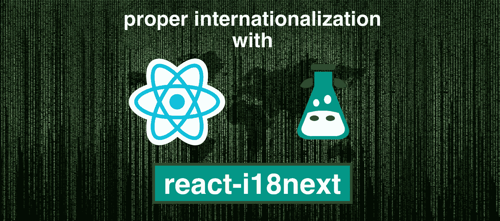

为使用你的软件的用户克服语言障碍是一个重要的话题。英语不再是互联网的通用语言。
截至【2020 年 3 月，只有 25.9%的互联网用户会说英语。
如果没有本地化，你的用户很有可能会跳过你的网站。因此，如果没有多语言网站，你可能会错过一大部分潜在用户。

在 JavaScript 生态系统中，有很多国际化框架。在这里你可以找到一些关于 JavaScript 国际化框架的细节。
在本文中，我们将使用 [i18next](https://www.i18next.com/) 框架来国际化一个 [React.js](https://reactjs.org/) 应用。

# 所以首先:“为什么接下来是 i18？”

说到反应本地化。其中最流行的是带有 react 扩展的[i18 next](https://www.i18next.com/)react-i18 next，理由很充分:

*i18next 创建于 2011 年末。它比你现在使用的大多数库都要老，包括你的主要前端技术(react，vue，…)。*

**➡️可持续发展**

*基于 i18next 已经开源了多久，没有什么真正的 i18n 案例不能用 i18next 解决。*

**➡️成熟了**

*i18next 可以用在任何 javascript 中(还有少数非 javascript —)。net、elm、iOS、android、ruby、……)环境，用任何 UI 框架，用任何 i18n 格式、……*[*可能性无穷*](https://www.i18next.com/overview/supported-frameworks) *。*

**➡️可扩展**

与其他常规的 18n 框架相比，i18next 有很多特性和可能性。

**➡️有钱**

[在这里](https://www.i18next.com/overview/comparison-to-others)你可以找到更多关于 i18next 为什么特别以及[它是如何工作的](https://locize.com/i18next.html#how-does-i18next-work)的信息。

# 让我们开始吧…

# 先决条件

确保安装了 Node.js 和 npm。如果你有一些简单的 HTML、JavaScript 和基本 React.js 的经验，最好在跳到 [react-i18next](https://react.i18next.com/) 之前。

# 入门指南

拿起你自己的 React 项目或创建一个新项目，即使用 [create-react-app](https://create-react-app.dev/) 。

`npx create-react-app my-app`

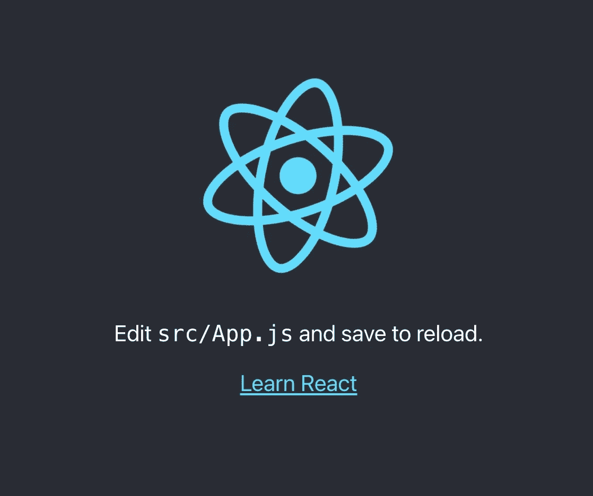

我们将根据用户的偏好调整应用程序来检测语言。
我们将创建一个语言切换器，使不同语言之间的内容变化。

让我们安装一些 i18next 依赖项:

*   [i18 下一个](https://www.i18next.com/)
*   [react-i18 下一个](https://react.i18next.com/)
*   [i18 下一个浏览器语言检测器](https://github.com/i18next/i18next-browser-languageDetector)

`npm install i18next react-i18next i18next-browser-languagedetector`

让我们准备一个 i18n.js 文件:

```
import i18n from 'i18next';
import { initReactI18next } from 'react-i18next';
import LanguageDetector from 'i18next-browser-languagedetector';i18n
  // detect user language
  // learn more: https://github.com/i18next/i18next-browser-languageDetector
  .use(LanguageDetector)
  // pass the i18n instance to react-i18next.
  .use(initReactI18next)
  // init i18next
  // for all options read: https://www.i18next.com/overview/configuration-options
  .init({
    debug: true,
    fallbackLng: 'en',
    interpolation: {
      escapeValue: false, // not needed for react as it escapes by default
    },
    resources: {
      en: {
        translation: {
          // here we will place our translations...
        }
      }
    }
  });export default i18n;
```

让我们将该文件导入到 index.js 文件中的某个位置:

```
import React from 'react';
import ReactDOM from 'react-dom';
import './index.css';
import App from './App';// import i18n (needs to be bundled ;))
import './i18n';ReactDOM.render(
  <React.StrictMode>
    <App />
  </React.StrictMode>,
  document.getElementById('root')
);
```

现在让我们试着将一些硬编码的文本移到翻译中。

我们对第一个文本使用了[转换组件](https://react.i18next.com/latest/trans-component)，对第二个文本使用了[使用转换挂钩](https://react.i18next.com/latest/usetranslation-hook):

```
import logo from './logo.svg';
import './App.css';
import { useTranslation, Trans } from 'react-i18next';function App() {
  const { t } = useTranslation(); return (
    <div className="App">
      <header className="App-header">
        
        <p>
          <Trans i18nKey="description.part1">
            Edit <code>src/App.js</code> and save to reload.
          </Trans>
        </p>
        <a
          className="App-link"
          href="https://reactjs.org"
          target="_blank"
          rel="noopener noreferrer"
        >
          {t('description.part2')}
        </a>
      </header>
    </div>
  );
}export default App;
```

这些文本现在是翻译资源的一部分:

```
import i18n from 'i18next';
import { initReactI18next } from 'react-i18next';
import LanguageDetector from 'i18next-browser-languagedetector';i18n
  // detect user language
  // learn more: https://github.com/i18next/i18next-browser-languageDetector
  .use(LanguageDetector)
  // pass the i18n instance to react-i18next.
  .use(initReactI18next)
  // init i18next
  // for all options read: https://www.i18next.com/overview/configuration-options
  .init({
    debug: true,
    fallbackLng: 'en',
    interpolation: {
      escapeValue: false, // not needed for react as it escapes by default
    },
    resources: {
      en: {
        translation: {
          description: {
            part1: 'Edit <1>src/App.js</1> and save to reload.',
            part2: 'Learn React'
          }
        }
      }
    }
  });export default i18n;
```

# 语言切换器

现在让我们定义一个语言切换器:

```
import logo from './logo.svg';
import './App.css';
import { useTranslation, Trans } from 'react-i18next';const lngs = {
  en: { nativeName: 'English' },
  de: { nativeName: 'Deutsch' }
};function App() {
  const { t, i18n } = useTranslation(); return (
    <div className="App">
      <header className="App-header">
        
        <div>
          {Object.keys(lngs).map((lng) => (
            <button key={lng} style={{ fontWeight: i18n.resolvedLanguage === lng ? 'bold' : 'normal' }} type="submit" onClick={() => i18n.changeLanguage(lng)}>
              {lngs[lng].nativeName}
            </button>
          ))}
        </div>
        <p>
          <Trans i18nKey="description.part1">
            Edit <code>src/App.js</code> and save to reload.
          </Trans>
        </p>
        <a
          className="App-link"
          href="https://reactjs.org"
          target="_blank"
          rel="noopener noreferrer"
        >
          {t('description.part2')}
        </a>
      </header>
    </div>
  );
}export default App;
```

还为新语言添加了一些翻译:

```
import i18n from 'i18next';
import { initReactI18next } from 'react-i18next';
import LanguageDetector from 'i18next-browser-languagedetector';i18n
  // detect user language
  // learn more: https://github.com/i18next/i18next-browser-languageDetector
  .use(LanguageDetector)
  // pass the i18n instance to react-i18next.
  .use(initReactI18next)
  // init i18next
  // for all options read: https://www.i18next.com/overview/configuration-options
  .init({
    debug: true,
    fallbackLng: 'en',
    interpolation: {
      escapeValue: false, // not needed for react as it escapes by default
    },
    resources: {
      en: {
        translation: {
          description: {
            part1: 'Edit <1>src/App.js</1> and save to reload.',
            part2: 'Learn React'
          }
        }
      },
      de: {
        translation: {
          description: {
            part1: 'Ändere <1>src/App.js</1> und speichere um neu zu laden.',
            part2: 'Lerne React'
          }
        }
      }
    }
  });export default i18n;
```

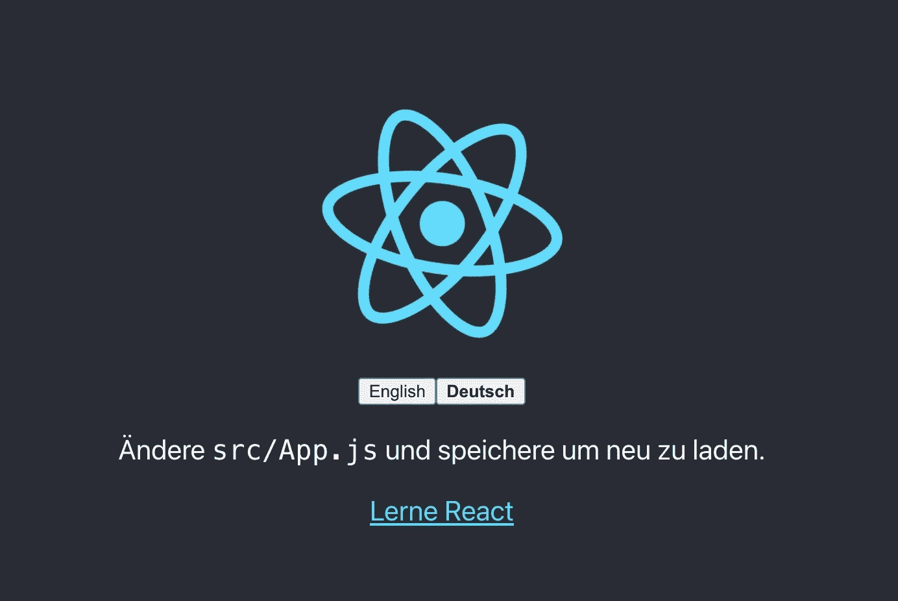

**🥳太棒了，你刚刚创建了你的第一个语言切换器！**

感谢[i18 next-browser-language detector](https://github.com/i18next/i18next-browser-languageDetector)现在它会尝试检测浏览器语言，如果你为它提供了翻译，它会自动使用该语言。在语言切换器中手动选择的语言保存在本地存储中，下次访问该页面时，该语言将被用作首选语言。

# 插值和多元化

i18next 不仅仅提供标准的 i18n 特性。
但是它肯定能够处理[复数](https://www.i18next.com/translation-function/plurals)和[插值](https://www.i18next.com/translation-function/interpolation)。

让我们来数一数语言的每一次变化:

```
import logo from './logo.svg';
import './App.css';
import { useTranslation, Trans } from 'react-i18next';
import { useState } from 'react';const lngs = {
  en: { nativeName: 'English' },
  de: { nativeName: 'Deutsch' }
};function App() {
  const { t, i18n } = useTranslation();
  const [count, setCounter] = useState(0);return (
    <div className="App">
      <header className="App-header">
        
        <div>
          {Object.keys(lngs).map((lng) => (
            <button key={lng} style={{ fontWeight: i18n.resolvedLanguage === lng ? 'bold' : 'normal' }} type="submit" onClick={() => {
              i18n.changeLanguage(lng);
              setCounter(count + 1);
            }}>
              {lngs[lng].nativeName}
            </button>
          ))}
        </div>
        <p>
          <i>{t('counter', { count })}</i>
        </p>
        <p>
          <Trans i18nKey="description.part1">
            Edit <code>src/App.js</code> and save to reload.
          </Trans>
        </p>
        <a
          className="App-link"
          href="https://reactjs.org"
          target="_blank"
          rel="noopener noreferrer"
        >
          {t('description.part2')}
        </a>
      </header>
    </div>
  );
}export default App;
```

…扩展翻译资源:

```
import i18n from 'i18next';
import { initReactI18next } from 'react-i18next';
import LanguageDetector from 'i18next-browser-languagedetector';i18n
  // detect user language
  // learn more: https://github.com/i18next/i18next-browser-languageDetector
  .use(LanguageDetector)
  // pass the i18n instance to react-i18next.
  .use(initReactI18next)
  // init i18next
  // for all options read: https://www.i18next.com/overview/configuration-options
  .init({
    debug: true,
    fallbackLng: 'en',
    interpolation: {
      escapeValue: false, // not needed for react as it escapes by default
    },
    resources: {
      en: {
        translation: {
          description: {
            part1: 'Edit <1>src/App.js</1> and save to reload.',
            part2: 'Learn React'
          },
          counter_one: 'Changed language just once',
          counter_other: 'Changed language already {{count}} times'
        }
      },
      de: {
        translation: {
          description: {
            part1: 'Ändere <1>src/App.js</1> und speichere um neu zu laden.',
            part2: 'Lerne React'
          },
          counter_one: 'Die Sprache wurde erst ein mal gewechselt',
          counter_other: 'Die Sprache wurde {{count}} mal gewechselt'
        }
      }
    }
  });export default i18n;
```

基于计数值 i18next 将选择正确的复数形式。
在[官方 i18next 文档](https://www.i18next.com/)中阅读更多关于[复数](https://www.i18next.com/translation-function/plurals)和[插值](https://www.i18next.com/translation-function/interpolation)的信息。

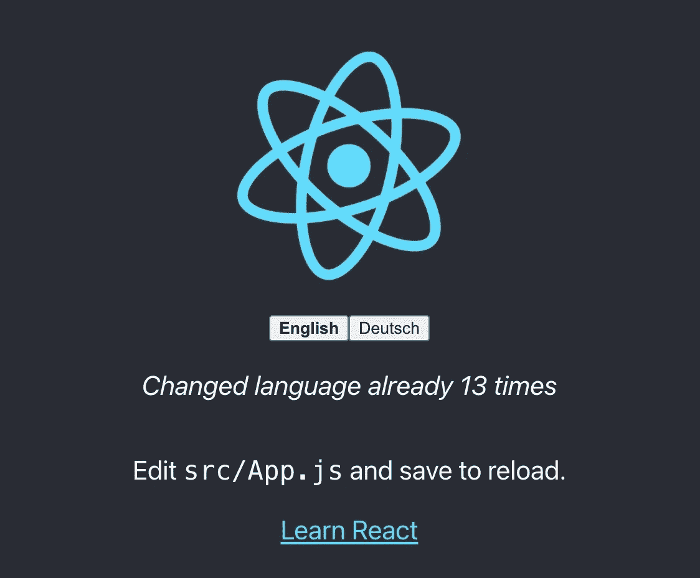

*💡i18next 也能够处理多种复数形式的语言，比如阿拉伯语:*

```
// translation resources:
{
  "key_0": "zero",
  "key_1": "singular",
  "key_2": "two",
  "key_3": "few",
  "key_4": "many",
  "key_5": "other"
}// usage:
t('key', {count: 0}); // -> "zero"
t('key', {count: 1}); // -> "singular"
t('key', {count: 2}); // -> "two"
t('key', {count: 3}); // -> "few"
t('key', {count: 4}); // -> "few"
t('key', {count: 5}); // -> "few"
t('key', {count: 11}); // -> "many"
t('key', {count: 99}); // -> "many"
t('key', {count: 100}); // -> "other"
```

# 格式化

现在，让我们看看如何在 [i18next](https://www.i18next.com/) 和 [Luxon](https://moment.github.io/luxon) 的帮助下使用不同的日期格式来处理日期和时间。

`npm install luxon`

我们希望有一个显示当前日期的页脚:

```
import './Footer.css';const Footer = ({ t }) => (
  <div className="Footer">
    <div>{t('footer.date', { date: new Date() })}</div>
  </div>
);export default Footer;// imported in our App.js and used like this
// <Footer t={t} />
```

导入 luxon 并在 i18next 的插值选项中定义一个格式函数，如[文档](https://www.i18next.com/translation-function/formatting)中所述，并添加新的平移键:

```
import i18n from 'i18next';
import { initReactI18next } from 'react-i18next';
import LanguageDetector from 'i18next-browser-languagedetector';
import { DateTime } from 'luxon';i18n
  // detect user language
  // learn more: https://github.com/i18next/i18next-browser-languageDetector
  .use(LanguageDetector)
  // pass the i18n instance to react-i18next.
  .use(initReactI18next)
  // init i18next
  // for all options read: https://www.i18next.com/overview/configuration-options
  .init({
    debug: true,
    fallbackLng: 'en',
    interpolation: {
      escapeValue: false, // not needed for react as it escapes by default
      format: (value, format, lng) => {
        if (value instanceof Date) {
          return DateTime.fromJSDate(value).setLocale(lng).toLocaleString(DateTime[format])
        }
        return value;
      }
    },
    resources: {
      en: {
        translation: {
          description: {
            part1: 'Edit <1>src/App.js</1> and save to reload.',
            part2: 'Learn React'
          },
          counter_one: 'Changed language just once',
          counter_other: 'Changed language already {{count}} times',
          footer: {
            date: 'Today is {{date, DATE_HUGE}}'
          }
        }
      },
      de: {
        translation: {
          description: {
            part1: 'Ändere <1>src/App.js</1> und speichere um neu zu laden.',
            part2: 'Lerne React'
          },
          counter_one: 'Die Sprache wurde erst ein mal gewechselt',
          counter_other: 'Die Sprache wurde {{count}} mal gewechselt',
          footer: {
            date: 'Heute ist {{date, DATE_HUGE}}'
          }
        }
      }
    }
  });export default i18n;
```

**😎酷，现在我们有一个特定语言的日期格式！**

英语:

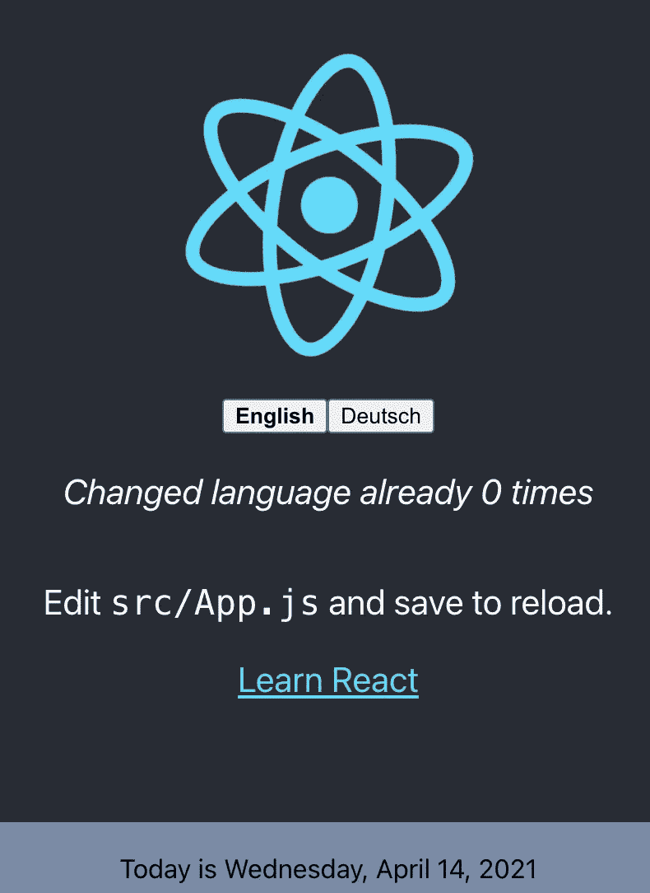

德语:

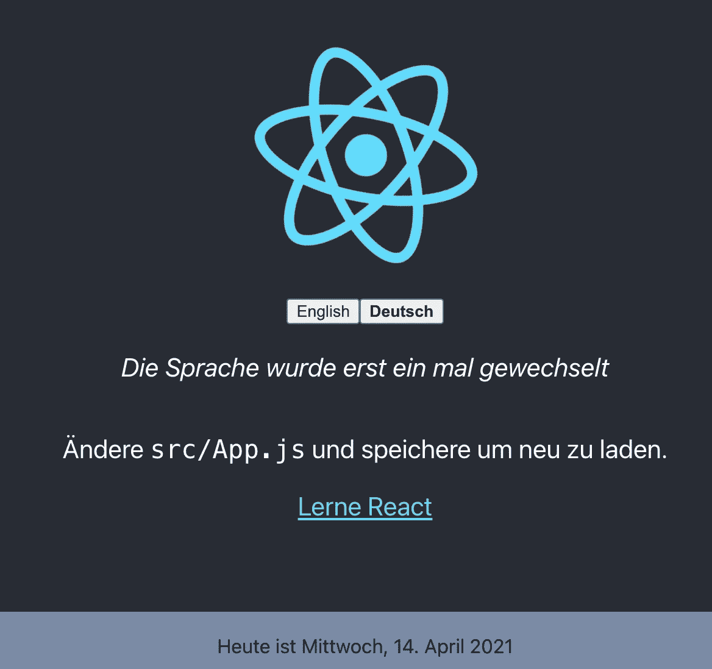

# 语境

基于当天时间的特定问候消息怎么样？即早上、晚上等。多亏了 i18next 的[上下文](https://www.i18next.com/translation-function/context)特性，这才成为可能。

让我们创建一个 getGreetingTime 函数，并将结果用作页脚翻译的上下文信息:

```
import { DateTime } from 'luxon';
import './Footer.css';const getGreetingTime = (d = DateTime.now()) => {
    const split_afternoon = 12; // 24hr time to split the afternoon
    const split_evening = 17; // 24hr time to split the evening
    const currentHour = parseFloat(d.toFormat('hh')); if (currentHour >= split_afternoon && currentHour <= split_evening) {
        return 'afternoon';
    } else if (currentHour >= split_evening) {
        return 'evening';
  }
    return 'morning';
}const Footer = ({ t }) => (
  <div className="Footer">
    <div>{t('footer.date', { date: new Date(), context: getGreetingTime() })}</div>
  </div>
);export default Footer;
```

并添加一些上下文特定的翻译关键字:

```
import i18n from 'i18next';
import { initReactI18next } from 'react-i18next';
import LanguageDetector from 'i18next-browser-languagedetector';
import Backend from 'i18next-http-backend';
import { DateTime } from 'luxon';i18n
  // i18next-http-backend
  // loads translations from your server
  // https://github.com/i18next/i18next-http-backend
  .use(Backend)
  // detect user language
  // learn more: https://github.com/i18next/i18next-browser-languageDetector
  .use(LanguageDetector)
  // pass the i18n instance to react-i18next.
  .use(initReactI18next)
  // init i18next
  // for all options read: https://www.i18next.com/overview/configuration-options
  .init({
    debug: true,
    fallbackLng: 'en',
    interpolation: {
      escapeValue: false, // not needed for react as it escapes by default
      format: (value, format, lng) => {
        if (value instanceof Date) {
          return DateTime.fromJSDate(value).setLocale(lng).toLocaleString(DateTime[format])
        }
        return value;
      }
    },
    resources: {
      en: {
        translation: {
          description: {
            part1: 'Edit <1>src/App.js</1> and save to reload.',
            part2: 'Learn React'
          },
          counter_one: 'Changed language just once',
          counter_other: 'Changed language already {{count}} times',
          footer: {
            date: 'Today is {{date, DATE_HUGE}}',
            date_morning: 'Good morning! Today is {{date, DATE_HUGE}} | Have a nice day!',
            date_afternoon: 'Good afternoon! It\'s {{date, DATE_HUGE}}',
            date_evening: 'Good evening! Today was the {{date, DATE_HUGE}}'
          }
        }
      },
      de: {
        translation: {
          description: {
            part1: 'Ändere <1>src/App.js</1> und speichere um neu zu laden.',
            part2: 'Lerne React'
          },
          counter_one: 'Die Sprache wurde erst ein mal gewechselt',
          counter_other: 'Die Sprache wurde {{count}} mal gewechselt',
          footer: {
            date: 'Heute ist {{date, DATE_HUGE}}',
            date_morning: 'Guten Morgen! Heute ist {{date, DATE_HUGE}} | Wünsche einen schönen Tag!',
            date_afternoon: 'Guten Tag! Es ist {{date, DATE_HUGE}}',
            date_evening: 'Guten Abend! Heute war {{date, DATE_HUGE}}'
          }
        }
      }
    }
  });export default i18n;
```

**😁是啊，它的工作！**

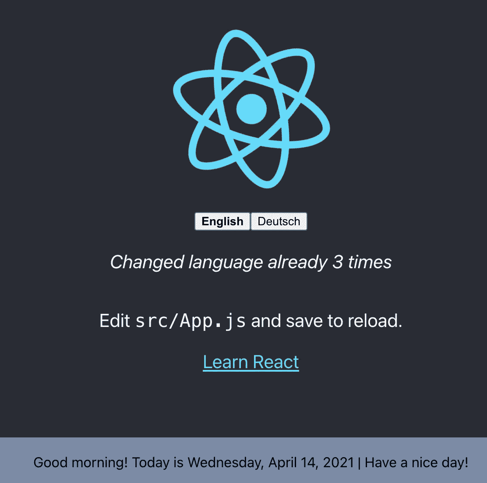

# 将翻译与代码分开

将翻译放在我们的 i18n.js 文件中是可行的，但是不适合翻译人员使用。让我们把翻译从代码中分离出来，放在专用的 json 文件中。

因为这是一个 web 应用程序， [i18next-http-backend](https://github.com/i18next/i18next-http-backend) 将帮助我们这样做。

`npm install i18next-http-backend`

将翻译移动到公共文件夹:

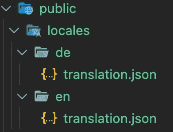

修改 i18n.js 文件以使用 i18next-http-backend:

```
import i18n from 'i18next';
import { initReactI18next } from 'react-i18next';
import LanguageDetector from 'i18next-browser-languagedetector';
import Backend from 'i18next-http-backend';
import { DateTime } from 'luxon';i18n
  // i18next-http-backend
  // loads translations from your server
  // https://github.com/i18next/i18next-http-backend
  .use(Backend)
  // detect user language
  // learn more: https://github.com/i18next/i18next-browser-languageDetector
  .use(LanguageDetector)
  // pass the i18n instance to react-i18next.
  .use(initReactI18next)
  // init i18next
  // for all options read: https://www.i18next.com/overview/configuration-options
  .init({
    debug: true,
    fallbackLng: 'en',
    interpolation: {
      escapeValue: false, // not needed for react as it escapes by default
      format: (value, format, lng) => {
        if (value instanceof Date) {
          return DateTime.fromJSDate(value).setLocale(lng).toLocaleString(DateTime[format])
        }
        return value;
      }
    }
  });export default i18n;
```

现在翻译是异步加载的，所以确保你用一个[悬念](https://reactjs.org/docs/react-api.html#reactsuspense)组件包装你的应用程序来防止这个错误:`Uncaught Error: App suspended while rendering, but no fallback UI was specified.`

```
import { Suspense } from 'react';function App() {
  // your app's code...
}// here app catches the suspense from page in case translations are not yet loaded
export default function WrappedApp() {
  return (
    <Suspense fallback="...is loading">
      <App />
    </Suspense>
  );
}
```

现在你的应用看起来还是一样的，但是你的翻译是分开的。如果你想支持一种新的语言，你只需要创建一个新的文件夹和一个新的翻译 json 文件。
这使您可以将译文发送给一些翻译人员。
或者，如果你正在使用翻译管理系统，你可以[用命令行界面](https://github.com/locize/react-tutorial#use-the-locize-cli)同步文件。

*💡顺便说一下:由于 i18next* 的 [*名称空间*](https://www.i18next.com/principles/namespaces) *特性，您还可以拥有多个**翻译文件*

*🧑‍💻这第一部分的代码可以在这里找到*[](https://github.com/locize/react-i18next-example-app/tree/i18next)**。**

# *更好的翻译管理*

*通过将译文发送给一些译者或翻译机构，你可以更好地控制和直接联系他们。但这也意味着你要做更多的工作。这是一种传统的方式。但是请注意，发送文件总是会产生开销。*

> *有更好的选择吗？*

# *肯定的！*

*i18next 有助于翻译应用程序，这很好，但还有更多。*

*   *您如何整合任何翻译服务/机构？*
*   *您如何跟踪新的或删除的内容？*
*   *你如何处理正确的版本控制？*
*   *如何在不部署整个应用程序的情况下部署翻译更改？*
*   *还有更多…*

***寻找类似 this❓的东西***

*   *[易于集成](https://docs.locize.com/integration/instrumenting-your-code#i-18-next)*
*   *持续部署？[连续定位](https://locize.com//how-it-works.html#continouslocalization)！*
*   *轻松管理翻译文件*
*   *[订购专业翻译](https://docs.locize.com/guides-tips-and-tricks/working-with-translators/localistars)*
*   *分析和统计*
*   *[从我们的内容交付网络(CDN)中获利](https://docs.locize.com/whats-inside/cdn-content-delivery-network)*
*   *[翻译版本](https://docs.locize.com/more/versioning)*
*   *[自动按需机器翻译](https://docs.locize.com/whats-inside/auto-machine-translation)*
*   *[无风险:随身携带您的数据](https://docs.locize.com/more/general-questions/how-is-locize-different-from-the-alternatives#service-lock-in)*
*   *[透明公平的定价](https://locize.com/pricing.html)*
*   *还有更多…*

*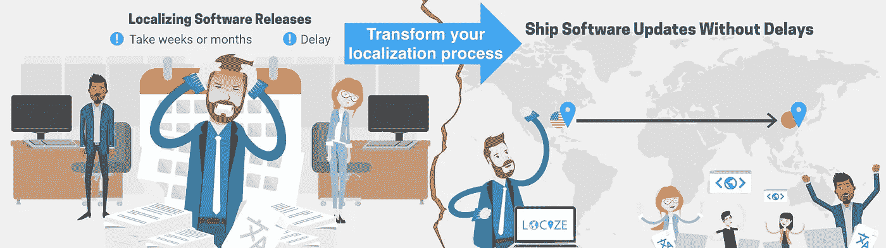*

# *这看起来怎么样？*

*首先你需要在[注册](https://locize.com/register)和[登录](https://docs.locize.com/integration/getting-started/create-a-user-account)。
然后[在 locize 中创建一个新项目](https://docs.locize.com/integration/getting-started/add-a-new-project)并添加您的翻译。您可以通过使用 [cli](https://github.com/locize/react-tutorial#use-the-locize-cli) 或者通过[导入单个 json 文件](https://docs.locize.com/more/general-questions/how-to-import-translations-from-a-file)或者通过 [API](https://docs.locize.com/integration/api#update-remove-translations) 来添加您的翻译。*

*完成后，我们将把 [i18next-http-backend](https://github.com/i18next/i18next-http-backend) 替换为 [i18next-locize-backend](https://github.com/locize/i18next-locize-backend) 。*

*`npm install i18next-locize-backend`*

*导入要本地化的翻译后，删除 locales 文件夹:*

*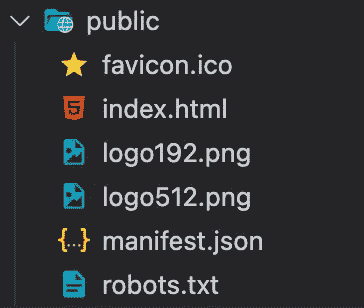*

*修改 i18n.js 文件以使用 i18next-locize-backend，并确保从 locize 项目中复制项目 id 和 api-key:*

```
*import i18n from 'i18next';
import { initReactI18next } from 'react-i18next';
import LanguageDetector from 'i18next-browser-languagedetector';
import Backend from 'i18next-locize-backend';
import { DateTime } from 'luxon';const locizeOptions = {
  projectId: '0bbc223a-9aba-4a90-ab93-ab9d7bf7f780',
  apiKey: 'aaad4141-54ba-4625-ae37-657538fe29e7', // YOU should not expose your apps API key to production!!!
  referenceLng: 'en',
};i18n
  // i18next-locize-backend
  // loads translations from your project, saves new keys to it (saveMissing: true)
  // https://github.com/locize/i18next-locize-backend
  .use(Backend)
  // detect user language
  // learn more: https://github.com/i18next/i18next-browser-languageDetector
  .use(LanguageDetector)
  // pass the i18n instance to react-i18next.
  .use(initReactI18next)
  // init i18next
  // for all options read: https://www.i18next.com/overview/configuration-options
  .init({
    debug: true,
    fallbackLng: 'en',
    interpolation: {
      escapeValue: false, // not needed for react as it escapes by default
      format: (value, format, lng) => {
        if (value instanceof Date) {
          return DateTime.fromJSDate(value).setLocale(lng).toLocaleString(DateTime[format])
        }
        return value;
      }
    },
    backend: locizeOptions
  });export default i18n;*
```

*[i18next-locize-backend](https://github.com/locize/i18next-locize-backend) 提供了直接从 locize 检索可用语言的功能，让我们使用它:*

```
*import logo from './logo.svg';
import './App.css';
import { useTranslation, Trans } from 'react-i18next';
import { useState, Suspense, useEffect } from 'react';
import Footer from './Footer'function App() {
  const { t, i18n } = useTranslation();
  const [count, setCounter] = useState(0); const [lngs, setLngs] = useState({ en: { nativeName: 'English' }}); useEffect(() => {
    i18n.services.backendConnector.backend.getLanguages((err, ret) => {
      if (err) return // TODO: handle err...
      setLngs(ret);
    });
  }, []);return (
    <div className="App">
      <header className="App-header">
        
        <div>
          {Object.keys(lngs).map((lng) => (
            <button key={lng} style={{ fontWeight: i18n.resolvedLanguage === lng ? 'bold' : 'normal' }} type="submit" onClick={() => {
              i18n.changeLanguage(lng);
              setCounter(count + 1);
            }}>
              {lngs[lng].nativeName}
            </button>
          ))}
        </div>
        <p>
          <i>{t('counter', { count })}</i>
        </p>
        <p>
          <Trans i18nKey="description.part1">
            Edit <code>src/App.js</code> and save to reload.
          </Trans>
        </p>
        <a
          className="App-link"
          href="https://reactjs.org"
          target="_blank"
          rel="noopener noreferrer"
        >
          {t('description.part2')}
        </a>
      </header>
      <Footer t={t} />
    </div>
  );
}// here app catches the suspense from page in case translations are not yet loaded
export default function WrappedApp() {
  return (
    <Suspense fallback="...is loading">
      <App />
    </Suspense>
  );
}*
```

# *保存缺失的翻译*

*由于使用了 [saveMissing 功能](https://www.i18next.com/overview/configuration-options#missing-keys)，在开发应用程序时，新的密钥会自动添加到 locize 中。*

*只需在 i18 中传递`saveMissing: true`下一个选项:*

```
*import i18n from 'i18next';
import { initReactI18next } from 'react-i18next';
import LanguageDetector from 'i18next-browser-languagedetector';
import Backend from 'i18next-locize-backend';
import { DateTime } from 'luxon';const locizeOptions = {
  projectId: '0bbc223a-9aba-4a90-ab93-ab9d7bf7f780',
  apiKey: 'aaad4141-54ba-4625-ae37-657538fe29e7', // YOU should not expose your apps API key to production!!!
  referenceLng: 'en',
};i18n
  // i18next-locize-backend
  // loads translations from your project, saves new keys to it (saveMissing: true)
  // https://github.com/locize/i18next-locize-backend
  .use(Backend)
  // detect user language
  // learn more: https://github.com/i18next/i18next-browser-languageDetector
  .use(LanguageDetector)
  // pass the i18n instance to react-i18next.
  .use(initReactI18next)
  // init i18next
  // for all options read: https://www.i18next.com/overview/configuration-options
  .init({
    debug: true,
    fallbackLng: 'en',
    interpolation: {
      escapeValue: false, // not needed for react as it escapes by default
      format: (value, format, lng) => {
        if (value instanceof Date) {
          return DateTime.fromJSDate(value).setLocale(lng).toLocaleString(DateTime[format])
        }
        return value;
      }
    },
    backend: locizeOptions,
    saveMissing: true
  });export default i18n;*
```

*每次您使用新密钥时，它都会被发送到 locize，即:*

```
*<div>{t('new.key', 'this will be added automatically')}</div>*
```

*将导致如下 locize:*

*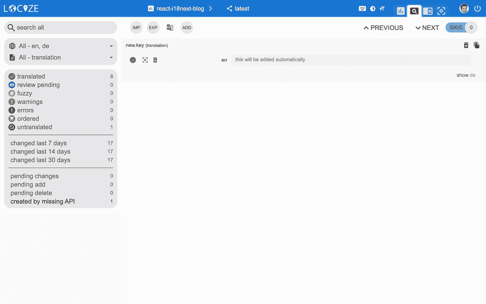*

# *👀但是还有更多…*

*感谢 [locize-lastused](https://github.com/locize/locize-lastused) 插件，你将能够[找到并过滤 locize 哪些键被使用或不再被使用](https://docs.locize.com/guides-tips-and-tricks/unused-translations)。*

*在 [locize](https://github.com/locize/locize) 插件的帮助下，你将能够在上下文编辑器的 locize [中使用你的应用。](https://docs.locize.com/more/incontext-editor)*

*最后，在[自动机器翻译工作流程](https://docs.locize.com/whats-inside/auto-machine-translation)的帮助下，并使用[保存缺失功能](https://www.i18next.com/overview/configuration-options#missing-keys)，新键不仅会在开发应用程序时自动定位，还会使用机器翻译自动翻译成目标语言。*

**看看这个* [*视频*](https://youtu.be/VfxBpSXarlU) *看看自动机器翻译工作流程是什么样子的！**

*`npm install locize-lastused locize`*

*在 i18n.js 中使用它们:*

```
*import i18n from 'i18next';
import { initReactI18next } from 'react-i18next';
import LanguageDetector from 'i18next-browser-languagedetector';
import Backend from 'i18next-locize-backend';
import LastUsed from 'locize-lastused';
import { locizePlugin } from 'locize';
import { DateTime } from 'luxon';const locizeOptions = {
  projectId: '0bbc223a-9aba-4a90-ab93-ab9d7bf7f780',
  apiKey: 'aaad4141-54ba-4625-ae37-657538fe29e7', // YOU should not expose your apps API key to production!!!
  referenceLng: 'en',
};i18n
  // locize-lastused
  // sets a timestamp of last access on every translation segment on locize
  // -> safely remove the ones not being touched for weeks/months
  // https://github.com/locize/locize-lastused
  .use(LastUsed)
  // locize-editor
  // InContext Editor of locize
  .use(locizePlugin)
  // i18next-locize-backend
  // loads translations from your project, saves new keys to it (saveMissing: true)
  // https://github.com/locize/i18next-locize-backend
  .use(Backend)
  // detect user language
  // learn more: https://github.com/i18next/i18next-browser-languageDetector
  .use(LanguageDetector)
  // pass the i18n instance to react-i18next.
  .use(initReactI18next)
  // init i18next
  // for all options read: https://www.i18next.com/overview/configuration-options
  .init({
    debug: true,
    fallbackLng: 'en',
    interpolation: {
      escapeValue: false, // not needed for react as it escapes by default
      format: (value, format, lng) => {
        if (value instanceof Date) {
          return DateTime.fromJSDate(value).setLocale(lng).toLocaleString(DateTime[format])
        }
        return value;
      }
    },
    backend: locizeOptions,
    locizeLastUsed: locizeOptions,
    saveMissing: true
  });export default i18n;*
```

*[自动机器翻译](https://docs.locize.com/whats-inside/auto-machine-translation):*

*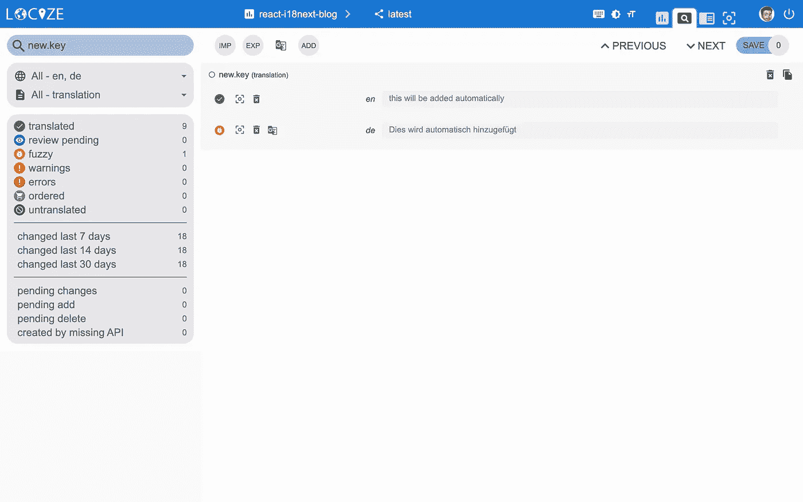*

*[上次使用的翻译过滤器](https://dev.to/adrai/(https://docs.locize.com/guides-tips-and-tricks/unused-translations)):*

*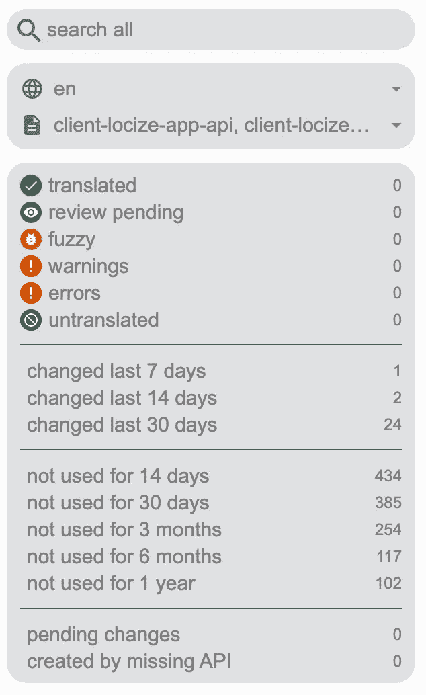*

*[InContext 编辑](https://docs.locize.com/more/incontext-editor):*

*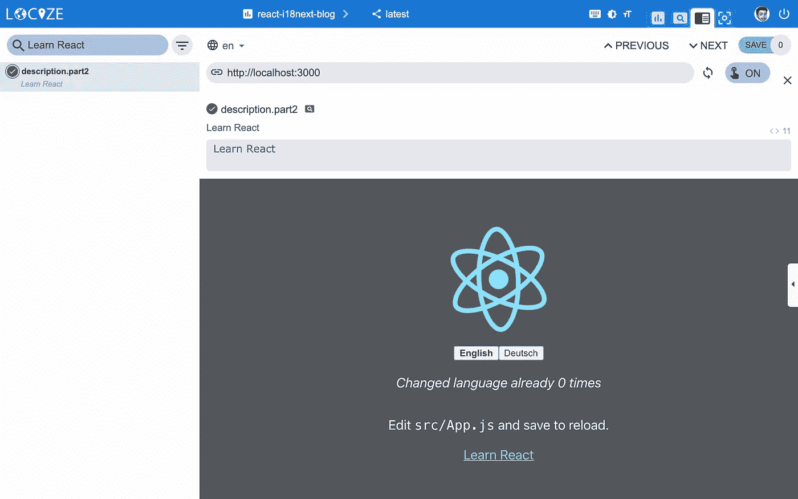*

# *📦让我们为生产做准备🚀*

*现在，我们为[投产](https://docs.locize.com/guides-tips-and-tricks/going-production)准备 app。*

*首先在 locize 中，为生产创建一个专用版本。不要启用该版本的自动发布，而是手动发布或通过 [API](https://docs.locize.com/integration/api#publish-version) 或通过 [CLI](https://github.com/locize/locize-cli#publish-version) 发布。
最后，[为生产版本启用高速缓存控制最大老化](https://docs.locize.com/more/caching)。*

*让我们利用 react-scripts 的[环境特性。](https://create-react-app.dev/docs/adding-custom-environment-variables/)*

*让我们创建一个默认环境文件，一个用于开发，一个用于生产:*

*。环境:*

```
*SKIP_PREFLIGHT_CHECK=trueREACT_APP_VERSION=$npm_package_version# locize
REACT_APP_LOCIZE_PROJECTID=0bbc223a-9aba-4a90-ab93-ab9d7bf7f780
REACT_APP_LOCIZE_REFLNG=en*
```

*开发环境:*

```
*REACT_APP_LOCIZE_VERSION=latest
REACT_APP_LOCIZE_APIKEY=aaad4141-54ba-4625-ae37-657538fe29e7*
```

*生产环境:*

```
*REACT_APP_LOCIZE_VERSION=production*
```

*现在让我们改编 i18n.js 文件:*

```
*import i18n from 'i18next';
import { initReactI18next } from 'react-i18next';
import LanguageDetector from 'i18next-browser-languagedetector';
import Backend from 'i18next-locize-backend';
import LastUsed from 'locize-lastused';
import { locizePlugin } from 'locize';
import { DateTime } from 'luxon';const isProduction = process.env.NODE_ENV === 'production';const locizeOptions = {
  projectId: process.env.REACT_APP_LOCIZE_PROJECTID,
  apiKey: process.env.REACT_APP_LOCIZE_APIKEY, // YOU should not expose your apps API key to production!!!
  referenceLng: process.env.REACT_APP_LOCIZE_REFLNG,
  version: process.env.REACT_APP_LOCIZE_VERSION
};if (!isProduction) {
  // locize-lastused
  // sets a timestamp of last access on every translation segment on locize
  // -> safely remove the ones not being touched for weeks/months
  // https://github.com/locize/locize-lastused
  i18n.use(LastUsed);
}i18n
  // locize-editor
  // InContext Editor of locize
  .use(locizePlugin)
  // i18next-locize-backend
  // loads translations from your project, saves new keys to it (saveMissing: true)
  // https://github.com/locize/i18next-locize-backend
  .use(Backend)
  // detect user language
  // learn more: https://github.com/i18next/i18next-browser-languageDetector
  .use(LanguageDetector)
  // pass the i18n instance to react-i18next.
  .use(initReactI18next)
  // init i18next
  // for all options read: https://www.i18next.com/overview/configuration-options
  .init({
    debug: true,
    fallbackLng: 'en',
    interpolation: {
      escapeValue: false, // not needed for react as it escapes by default
      format: (value, format, lng) => {
        if (value instanceof Date) {
          return DateTime.fromJSDate(value).setLocale(lng).toLocaleString(DateTime[format])
        }
        return value;
      }
    },
    backend: locizeOptions,
    locizeLastUsed: locizeOptions,
    saveMissing: !isProduction // you should not use saveMissing in production
  });export default i18n;*
```

*现在，在开发过程中，您将继续保存丢失的键并利用 lastused 特性。=> npm 运行开始*

*在生产环境中，saveMissing 和 lastused 被禁用，并且 api-key 也不公开。=> npm 运行构建&& npm 运行服务*

*[缓存](https://docs.locize.com/more/caching):*

*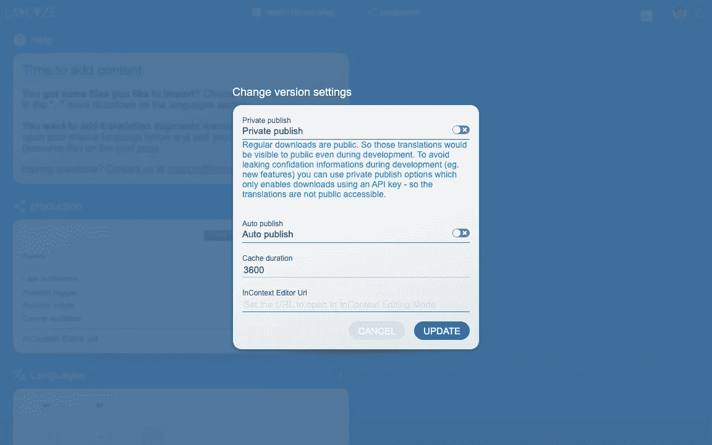*

*[合并版本](https://docs.locize.com/more/versioning#merging-versions):*

*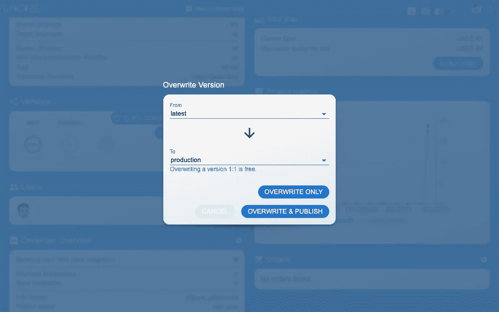*

**🧑‍💻完整的代码可以在* *这里找到* [*。*](https://github.com/locize/react-i18next-example-app)*

**查看* [*代码整合部分*](https://www.youtube.com/watch?v=ds-yEEYP1Ks&t=423s) *在此* [*YouTube 视频*](https://www.youtube.com/watch?v=ds-yEEYP1Ks) *。**

*还有一个 [i18next 速成视频](https://youtu.be/SA_9i4TtxLQ)。*

*这篇博文还有一个[西班牙语翻译。](https://www.ibidem-translations.com/edu/translate-react-i18next-app/)*

# *🎉🥳祝贺你🎊🎁*

*我希望你已经了解了一些关于 [i18next](https://www.i18next.com/) 、 [React.js 本地化](https://react.i18next.com/)和[现代本地化工作流程](https://locize.com/)的新东西。*

*所以如果你想让你的 i18n 话题更上一层楼，值得尝试一下 [locize](https://locize.com/) 。*

*[locize](https://locize.com/) 的创始人也是 [i18next](https://www.i18next.com/) 的创造者。所以使用[定位](https://locize.com/)你就直接支持了 [i18next](https://www.i18next.com/) 的未来。*

# *👍*