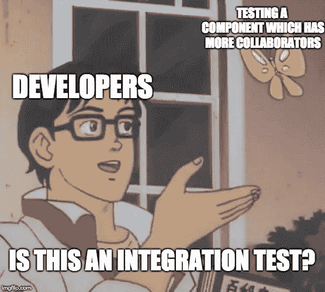

# 如何正确测试 React 组件

> 原文：<https://itnext.io/how-to-properly-test-react-components-9f090969cb6f?source=collection_archive---------0----------------------->

你的测试会因为一点点代码的改变而失败吗？你嘲笑严重吗？您是否一直在测试函数调用和组件状态？嗯，你可能做错了。

> *我们构建壮观的应用程序，检查**[***【auriosoftware.com】***](https://auriosoftware.com/)*

*我读过很多关于如何测试 React 组件的文章，大多数时候我觉得应该有更好的方法。在本文中，我将借助 [Jest](https://jestjs.io/) 和 [Enzyme](https://github.com/airbnb/enzyme) 来解决一些常见问题。*

*所以让我们从最重要的建议开始。*

# ***测试行为，不是实现细节！***

*看看下面的例子。*

*刚开始看起来还可以。我有一个电子邮件输入，我想测试*“当我更改电子邮件输入时，新值将出现在我的状态中”*。*

*问题是您正在测试实现细节，特别是内部组件状态。当您将测试与实现细节结合起来时，您的测试就会变得脆弱。*

*看属性 ***邮件*** 中的状态。每当您重命名该属性或重构组件时，**您的测试将会失败！***

*如果你在问“但是如果我不测试这个，我怎么知道这个输入是否有效”让我告诉你你实际上不需要这个测试。*

## *创建特征*

*假设我们需要一个闪亮的新功能，这是一个简单的订阅表单，用户可以写电子邮件，订阅我们产品的新闻。*

*因为我假装是一个专业人士，我在做 TDD，所以让我写我们的第一个失败的测试。*

*"**当填写了有效的电子邮件并提交了表单时，它应该使用正确的电子邮件订阅新闻***

*如果我们填写电子邮件输入并点击提交按钮，我们期望使用输入中的电子邮件调用 *subscribe* 函数。*

***我们在测试行为！不是实现。***

*我们运行了测试，但是失败了，因为我们还没有任何实现。因此，让我们编写足够的生产代码来通过测试。*

*为了让它通过，我们创建了带有“ ***email*** ”属性的状态对象，并在 email 输入上实现了 ***onChange*** 处理程序。之后，我们在提交按钮上创建了 ***onSubmit*** 处理程序，并从状态用 ***email*** 调用 subscribe 函数。*

*让我们再做一次测试。它过去了。*

*我们的高级用例迫使我们编写代码！这些用例是您应该测试的组件契约。我们不会测试实现细节，比如组件的内部状态以及它是如何变化的，因为它是易变的。*

***结论。**避免测试组件状态，不要为了找到一些你需要测试的元素而潜入 DOM(*ex:div>foo>input*)，因为无论何时你改变你的 DOM，你的测试都会失败。我们希望依赖稳定的东西，就像生活中一样，在软件开发中也是如此。*

# *什么是单元测试？*

*这是另一个重要的话题，因为很多人对什么是真正的单元有点困惑，这种误解对你的测试有很大的影响。*

*让我们通过扩展前面的例子来尝试解决这个问题。*

*过了一段时间，我们的组件变大了，我们将一些逻辑封装到不同的组件中。我们为电子邮件输入、提交按钮和包含一些文本和徽标的营销内容创建了一个组件。*

*我的问题是**我们应该如何改变订阅组件的测试？***

*答案很简单，**我们不会改变** **任何东西！***

*事实上，我们的测试仍然通过。我们在移动、创建和更改东西，我们的测试仍然正常工作，因为我们没有将我们的测试与实现细节结合起来！*

*你可能会问自己。*

**

*这是整合测试吗？答案是否定的！让我们从罗伯特·c·马丁那里拿来一些定义。*

> ***单元测试。**程序员编写的测试，目的是确保生产代码做程序员期望它做的事情。*
> 
> ***集成测试。**由架构师和/或技术负责人编写的测试，目的是确保系统组件的子组件正确运行。这些是*管道*测试。**他们是*而不是*业务规则测试**。他们的目的是确认子组件已正确集成和配置。*
> 
> ***微测。在非常小的范围内编写的单元测试。目的是测试单个功能或一小组功能。***
> 
> ***功能测试**:在较大范围内编写的单元测试，对较慢的组件进行适当的模拟。*

*你在一个单元测试的定义里看到一个词 ***class*** ？*

*我们可以把一个单元想象成一个模块。我们要测试如果我们给模块输入 *a，*它应该返回输出 *b* 。该模块是一个黑盒，我们只测试他的公共 API。*

*很多人把单元测试的概念理解为孤立地测试一个类(组件)。为了孤立地测试这个类，您必须在这个类周围设置严格的界限，并模仿它的所有合作者。但是当你嘲笑所有的合作者时，每次他们改变，你的测试也必须改变。*

*再看看我们之前的测试。*

*我们可以把我们的测试看作是一个**功能测试。**这不是集成测试，因为:*

1.  *我们正在测试商业规则，*
2.  *我们嘲笑我们的慢组件，更具体地说是*订阅*调用，因为这个函数的产品实现可能会调用某个 HTTP 端点，*
3.  *测试范围较大，因为我们测试的是整个订阅组件，包括层次结构中的子表示组件。*

*这给了我们力量，因为我们甚至可以改变库，如材料设计、引导或其他，我们的**测试仍然会通过**，因为它们不依赖于特定的 API。*

## *订阅组件测试的错误示例*

*如果您过度指定您的测试，这就是*订阅*示例的样子。*

*不要这样！*

*我们耦合了实现细节，如*营销内容*、*电子邮件输入*和*提交表单*组件。如果我们把道具“onChange”改成“handleChange”呢？如果我们改变这些组件的名称会怎么样？如果我们移除 *MarketingContent* 并将该逻辑移动到父组件会怎么样？*

*我们的测试会失败！*

*但这不是唯一的问题。现在我们还必须测试所有这些组件！我向你保证，有一天我们会忘记一些测试，所有这些测试都变得无用，因为，在一天结束时，我们的代码不起作用，因为我们忘记调用层次结构中的一些子组件中的一些方法。*

## ***总结***

*测试很难，不要让它更难。试着不要过分指定你的测试，试着依赖稳定的东西。是的，当你在做 TDD 的时候会有趣得多。*

## *一些有用的链接。*

*来自 Robert C. Martin 的测试定义—[https://blog . clean coder . com/uncle-bob/2017/05/05/test definitions . html](https://blog.cleancoder.com/uncle-bob/2017/05/05/TestDefinitions.html)*

*TDD:哪里出了问题——https://www.youtube.com/watch?v=EZ05e7EMOLM*

*[我博客上的更多文章**foobarbaz . club**](http://foobarbaz.club/)*