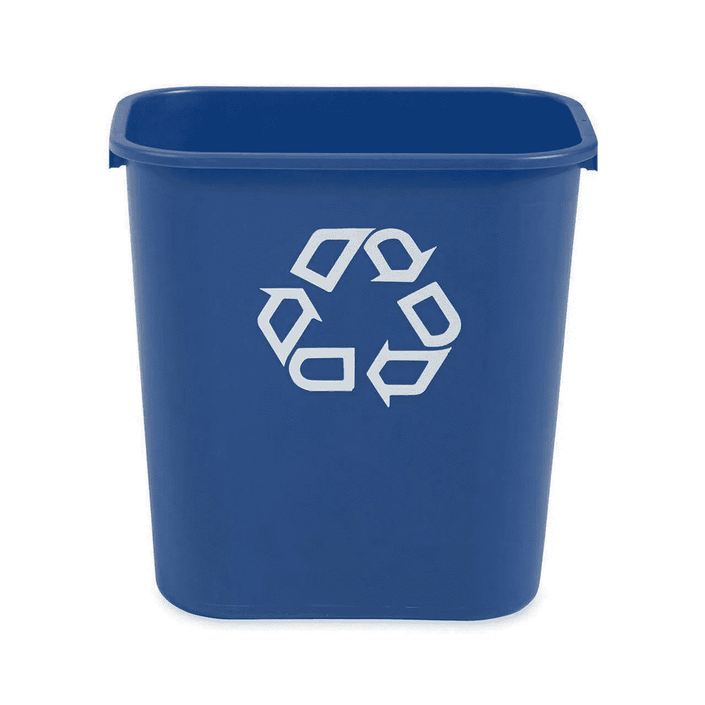

# 如何在 C#8 中正确使用 IAsyncDisposable

> 原文：<https://itnext.io/how-to-properly-use-iasyncdisposable-in-c-8-3c7ec6dcc9fe?source=collection_archive---------0----------------------->



C# 8 是这种语言的一次重大更新，为开发者提供了许多新的关键功能。然而，像 nullable reference types 和 *IAsyncEnumerable* 这样的大人物，也有很多特性被忽略了。

其中一个很好地填补了空白的特性是 ***IAsyncDisposable*** 。它是 *IDisposable* 长期缺失的异步对应物，在异步处理越来越被广泛使用的开发世界中，它扮演了一个非常重要的角色。

# **什么&为什么**

那么， *IAsyncDisposable* 到底是担任哪个角色呢？在 C#8 之前，开发人员只能通过使用仅同步的 *IDisposable* 接口来使用一次性模式。对于大多数情况，这工作得很好。大多数情况下，清理/处置部分应该是一个快速而干净的操作。

然而，随着时间的推移，许多异步 API 变得越来越可用，大多数时候同步处理并不能很好地与 API 一起工作。通常，开发人员更喜欢异步接口，因为它们不会阻塞线程的执行。此外，许多开发人员不仅喜欢使用 dispose 模式来实际处理和清理非托管资源，还喜欢使用自动清理来引入特定的范围，这在许多方面也是异步的。

因此，由于异步编程 API 的丰富性和仍然只能同步处理资源的可能性之间的差异。Net 团队决定引入 *IAsyncDisposable* ，它现在支持

# 如何实现 IAsyncDisposable

基本上，实现 IAsyncDisposable 的最简单方法如下:

```
public class Example : IAsyncDisposable
{
    public async ValueTask DisposeAsync()
    {
        // Async cleanup mock
        await Task.Yield();
        Console.WriteLine("Cleaned up!");
    }
}
```

该接口需要实现带有签名*public value task dispose easync()*的方法。就是这样。然而，有多个陷阱:

根据 MS 指南([https://docs . Microsoft . com/en-us/dot net/standard/garbage-collection/implementing-dispose easync](https://docs.microsoft.com/en-us/dotnet/standard/garbage-collection/implementing-disposeasync))，非密封类应该总是被认为是可继承的。类似于常规同步 *IDisposable* 实现的继承模式，我们也应该添加一个虚拟方法来覆盖子类中的处置行为。

```
public class Example : IAsyncDisposable
{
    public async ValueTask DisposeAsync()
    {
        await DisposeAsyncInternal();
        GC.SuppressFinalize(this);
    }

    protected virtual async ValueTask DisposeAsyncInternal() 
    {
        // Async cleanup mock
        await Task.Yield();
        Console.WriteLine("Base cleaned up!");
    }
}public class ExampleInherited : Example
{ 
    protected override async ValueTask DisposeAsyncInternal() 
    {
        await base.DisposeAsyncInternal();

        // Async cleanup mock
        await Task.Yield();
        Console.WriteLine("Subclass cleaned up!");
    }
}
```

这样，我们可以安全地扩展处置逻辑。

另一个重要的问题是建议在类上实现一个常规的 *IDisposable* 接口，因为不是每个消费者都能够正确处理新的风格。例如，许多旧的反转控制框架还不能处理异步处理。在我们“更简单”的例子中，可能如下所示。

```
public class Example : IDisposable, IAsyncDisposable
{
    private Stream _memoryStream = new MemoryStream();

    public void Dispose()
    {
        _memoryStream.Dispose();
        GC.SuppressFinalize(this);
    } public async ValueTask DisposeAsync()
    {
        await _memoryStream.DisposeAsync();
        GC.SuppressFinalize(this);
    }
}
```

这样，我们可以确保我们的资源能够以两种方式得到适当的清理。幸运的是，在这个例子中，我让自己变得非常容易，因为流提供了同步和异步处理。如果您的资源只提供异步处理，您可能需要硬着头皮进行异步同步，以确保正确的清理。我知道你在想什么，是的，这确实感觉很糟糕，但请记住——在我们有“新”方法之前，每次清理都必须这样做。

注意，根据复杂性和继承结构，还有多种更复杂的方式来实现该模式。如果你对遵循提议的处置模式的更复杂的例子感兴趣，请在 MS 文档上查看[这个例子。](https://docs.microsoft.com/en-us/dotnet/standard/garbage-collection/implementing-disposeasync#implement-both-dispose-and-async-dispose-patterns)

# 如何使用它

现在，我们已经介绍了一些实现示例，并进入了正确的思维模式，让我们看看如何使用它。为了简单明了，我将使用下面的实现:

```
public class Example : IAsyncDisposable
{
    private bool _disposed;

    public void PrintDisposeState() => Console.WriteLine(_disposed);public async ValueTask DisposeAsync()
    {
        // Async cleanup mock
        await Task.Yield();
        Console.WriteLine("Cleaned up!");
        _disposed = true;
    }
}
```

消费它是非常容易的。它基本上是旧的使用模式，但是在使用范围上以一个 *await* 关键字为前缀:

```
async Task Main()
{
    var example = new Example();
    await using (example)
    {
        example.PrintDisposeState();
    }

    example.PrintDisposeState();
}// Output: 
False
Cleaned up!
True
```

此外，由于 C#8 引入了使用范围，我们可以简单地将上面的语句转换为以下内容:

```
async Task Main()
{
    await using var example = new Example();
    example.PrintDisposeState();
}
```

这样，可处置的资源将在作用域的末尾被自动处置。

就是这样！现在在 C#中使用异步可处理性非常容易，它们确实弥补了一个重要的空白。这可能不是你每天都需要使用的东西，但知道这一点很好。尽管接口本身相当容易使用，但是当要正确实现整个模式时，在您的脑海中仍然有一些问题。