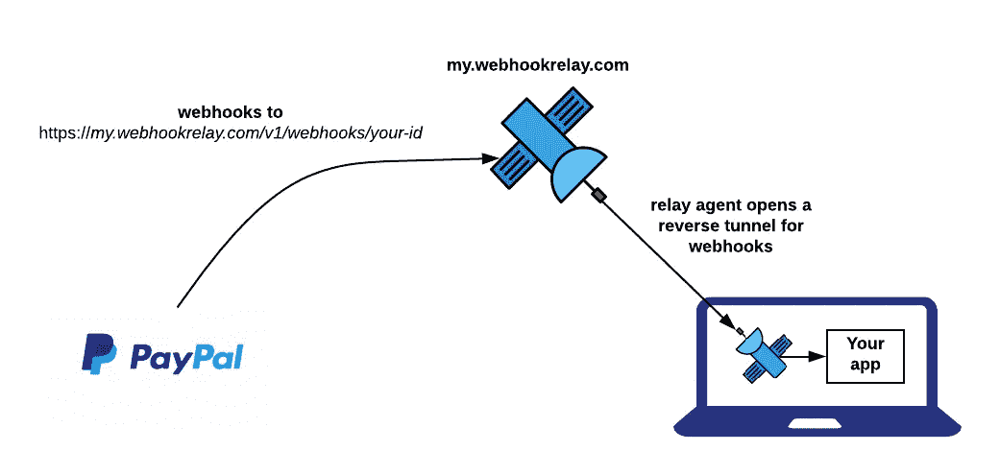
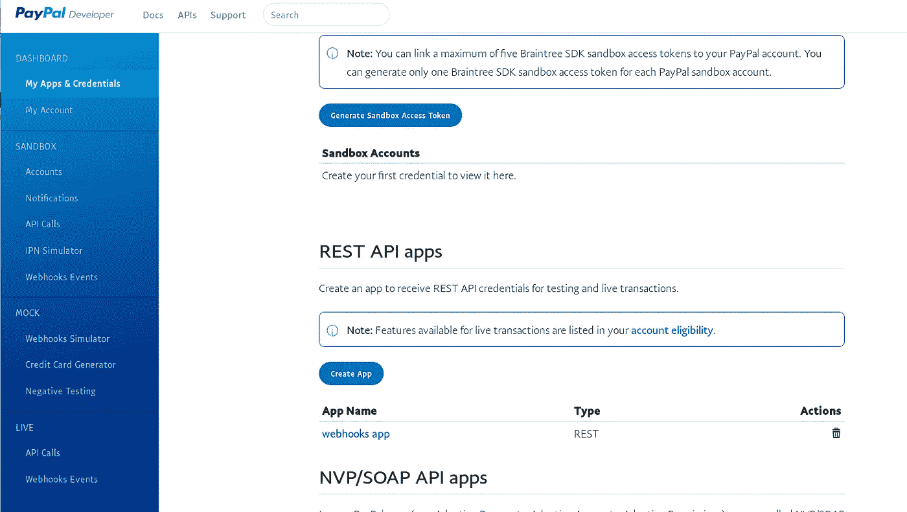
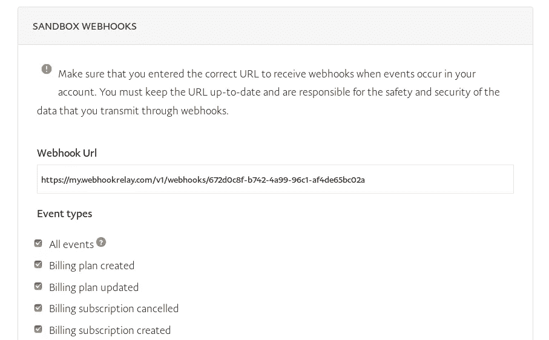
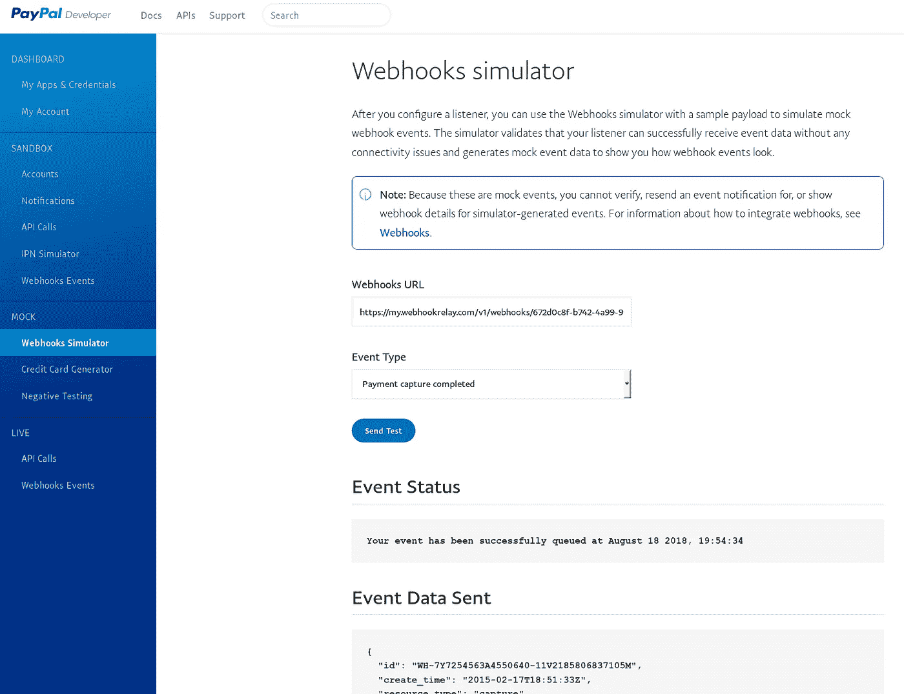
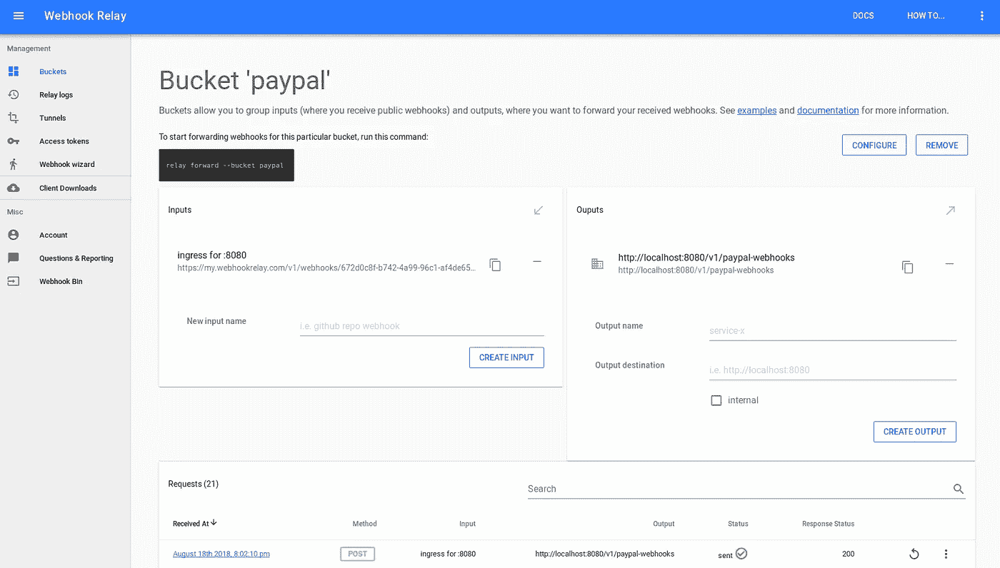

# 如何在本地主机上接收 PayPal webhooks

> 原文：<https://itnext.io/how-to-receive-paypal-webhooks-on-localhost-17c44f494bb3?source=collection_archive---------6----------------------->


马里乌斯·克里斯滕森在 [Unsplash](https://unsplash.com/search/photos/mail?utm_source=unsplash&utm_medium=referral&utm_content=creditCopyText) 上的照片

我想没有必要谈论贝宝和它变得多么有用。在这篇文章中，我们将用我最喜欢的语言 Go 编写一个小型 web 服务器来处理 PayPal 的 webhooks。我将向您展示开始接收 webhooks、开发您的应用程序并使用 Webhook Relay 调试它是多么容易。

根据 PayPal webhook [文档](https://developer.paypal.com/docs/integration/direct/webhooks/rest-webhooks/#):

> Webhooks 是接收事件通知消息的 HTTP 回调。要在 PayPal 创建一个 webhook，用户需要配置一个 webhook 监听器，并为其订阅事件。webhook 侦听器是一种服务器，它在特定的 URL 侦听事件发生时触发的传入 HTTP POST 通知消息。PayPal 会对发送给你的 webhook 监听器的每条通知信息进行签名。

所以，没什么不寻常的或新的。Webhooks 很重要——它们被用在几乎所有订阅模式的 SaaS 应用程序中。使用 webhooks，您可以:

*   客户支付计划费用时启用/禁用功能。
*   通过电子邮件向您的客户发送计划更改确认。

我们的目标是这样设置:



它将让我们在本地主机上接收 webhooks，就像我们在公共互联网上接收我们的服务器一样。

# 没时间解释了，让我们开始吧

*   下载 CLI 并注册以获得您的密钥和机密。说明可以在[这里](https://webhookrelay.com/v1/guide/#Getting-Started)找到。如果你已经这样做了(我猜大多数人已经注册了)，你就可以进入下一步了！
*   下载并安装 Go，说明[此处](https://golang.org/doc/install)。不像其他语言安装天文数字的软件包，使用 Go 你通常只需要几个助手包就可以了。
*   PayPal(这里可能不奇怪)——我们将使用[开发者仪表板](https://developer.paypal.com)。

首先，创建一个 webhook。转到 [PayPal 仪表盘](https://developer.paypal.com/developer/applications/)并创建一个应用程序，然后选择您想要启用 webhooks 的应用程序:



现在，让我们得到我们的公共 Webhook 中继端点。假设我们未来的应用程序将在 [*上接受 web hooks http://localhost:8080/v1/paypal-web hooks*](http://localhost:8080/v1/paypal-webhooks)，开始在那里转发它们:

```
relay forward -b paypal [http://localhost:8080/v1/paypal-webhooks](http://localhost:8080/v1/paypal-webhooks)
```

您应该会看到类似这样的内容:

```
$ relay forward -b paypal [http://localhost:8080/v1/paypal-webhooks](http://localhost:8080/v1/paypal-webhooks)
Forwarding:
https://my.webhookrelay.com/v1/webhooks/672d0c8f-b742-4a99-96c1-af4de65bc02a -> [http://localhost:8080/v1/paypal-webhooks](http://localhost:8080/v1/paypal-webhooks)
Starting webhook relay agent...
1.5345938246082163e+09	info	webhook relay ready...	{"host": "my.webhookrelay.com:8080"}
```

在这里我们可以看到`https://my.webhookrelay.com/v1/webhooks/672d0c8f-b742-4a99-96c1-af4de65bc02a`(您将有一个不同的 ID:)，这是我们可以提供给 PayPal 的公共端点:



PayPal webhook 配置屏幕

让我们勾选“所有事件”，因为我们现在真的不关心它，我们总是可以取消勾选框。滚动到底部，然后单击“保存”。

# 我们走吧

是时候写些围棋了。我开始写这篇文章的时候以为是关于 PayPal 的 IPNs 的，但结果是关于 webhooks 的，我会在后面写另一篇关于 IPNs 的文章。

我们将创建一个包来处理我们的 webhooks(完整的源代码在这里[https://github.com/webhookrelay/paypal-ipn](https://github.com/webhookrelay/paypal-ipn)，请随意克隆它)。

然后，放置应用程序逻辑的代码看起来像这样:

代码可以在这里找到:[https://github.com/webhookrelay/paypal-ipn](https://github.com/webhookrelay/paypal-ipn)。要启动我们的应用程序，我们只需:

```
$ go run example/main.go
2018/08/18 20:01:53 server starting on :8080
```

在现实生活中，你可能想要使用`go install`(让构建快很多)。

# 进入模拟

转到**模拟**部分下的 web hooks 模拟器。现在再次进入我们的公共 Webhook 中继端点，让我们选择“支付捕获完成”:



点击“发送测试”。

几秒钟后，我们应该会在我们的应用程序中看到已接收的 webhook:

```
$ go run example/main.go
2018/08/18 20:01:53 server starting on :8080
2018/08/18 20:02:10 event type: PAYMENT.CAPTURE.COMPLETED
2018/08/18 20:02:10 event resource type: capture
2018/08/18 20:02:10 summary: Payment completed for $ 7.47 USD
```

恭喜，我们刚刚赚了 7.47 美元！

不知道为什么，但有时他们会花更多的时间来发送那些虚拟的网页挂钩，所以如果你点击那个按钮后没有任何反应，就等一会儿。或者一旦你已经有了 webhook 中继，你可以从那里重试，它们会立即被转发。

# 调试 webhooks

我们还可以在我们的 buckets 页面中看到所有通过 Wehboook 中继发送的 webhooks:



您可以从这里检查并重新发送 webhooks。这也是获得初始 JSON 结构并使用这个漂亮的网站将其转换为 Go struct 的好地方:[https://mholt.github.io/json-to-go/](https://mholt.github.io/json-to-go/)。

# 包扎

Webhook 中继使得在本地主机或专用网络上接收 web hook 变得非常简单。如果您不想或不能将 webhooks 处理服务器暴露在互联网上，它不仅可以用于开发，也可以用于生产。

如果你正在使用 Stripe，请点击这里查看我之前的博文。

*原载于 2018 年 8 月 21 日*[*【webhookrelay.com*](https://webhookrelay.com/blog/2018/08/21/receiving-paypal-webhooks-localhost/)*。*