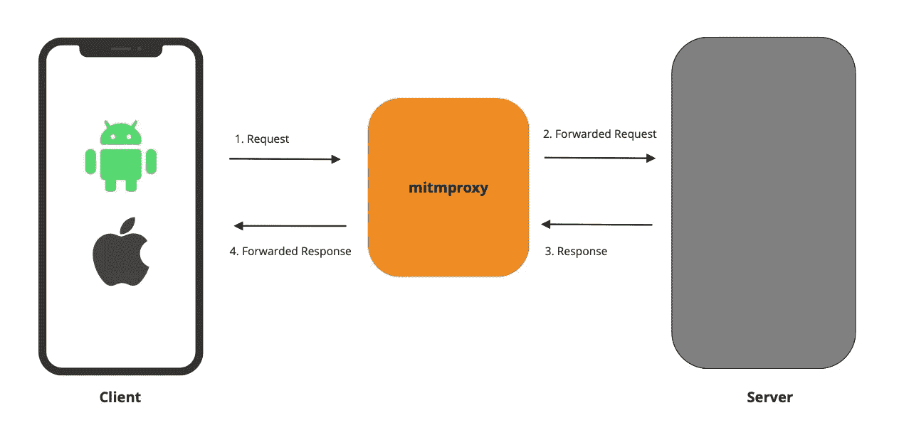
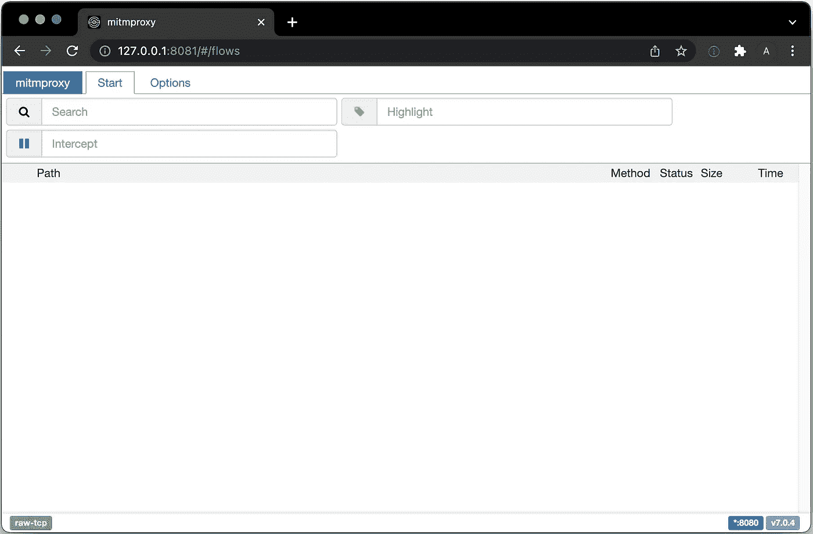
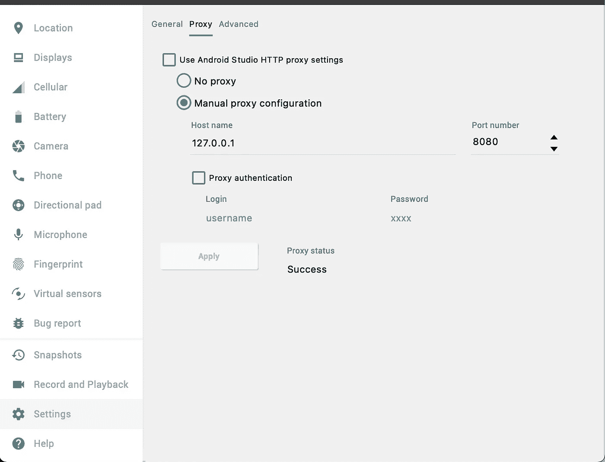
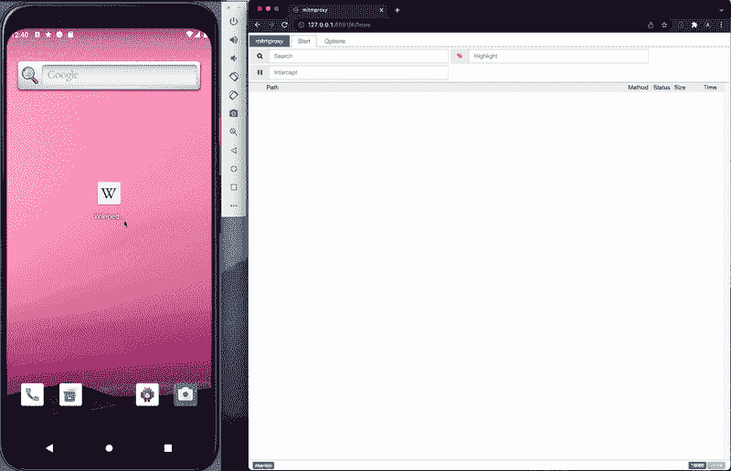
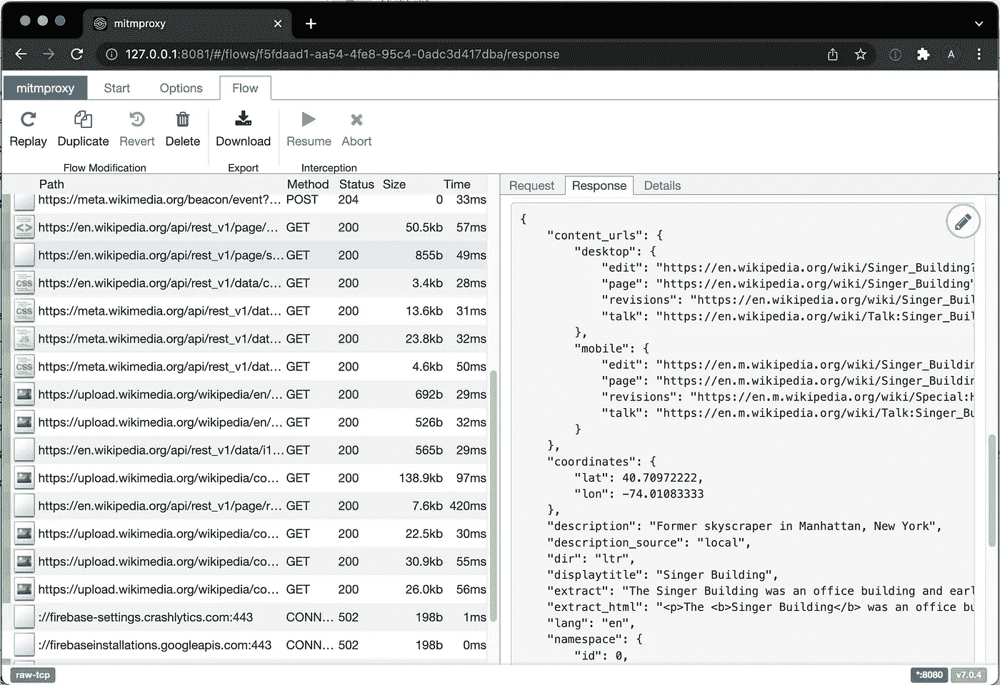
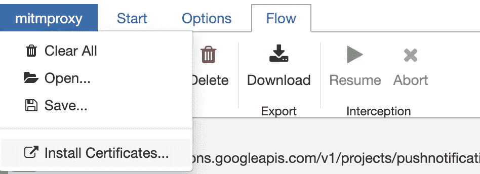
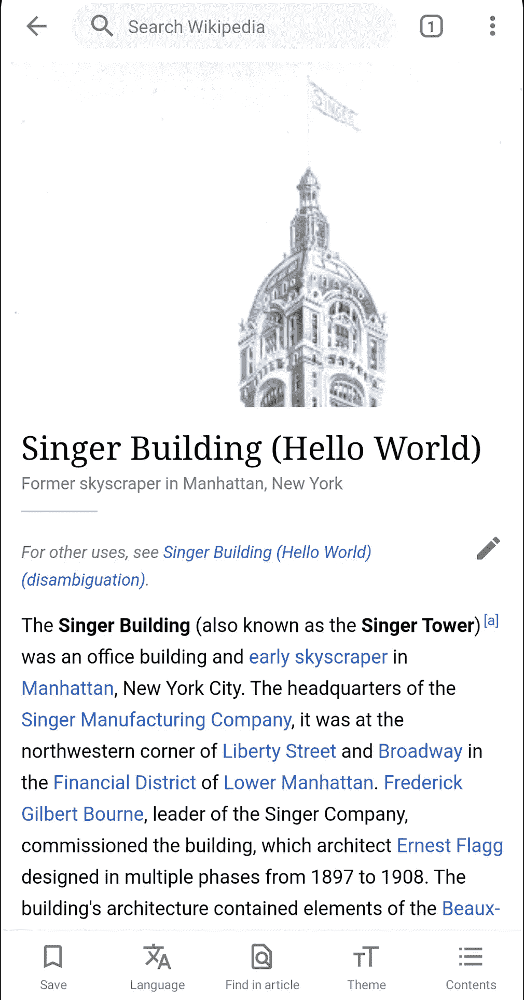

# 如何在 Android 和 iOS 应用中记录和回放 http 流量

> 原文：<https://itnext.io/how-to-record-replay-http-traffic-in-android-and-ios-apps-db24a5dcc0e?source=collection_archive---------1----------------------->

从 2022 年开始，我加入了一家规模虽小但雄心勃勃的初创公司( [mobile.dev](https://mobile.dev/) )，目标是为移动开发创造急需的基础设施。

我们分析应用程序并运行性能基准来检测生产前的问题，在某些情况下，我们需要使用网络模拟进行仪器测试。

我的第一个任务？弄清楚我们是否可以自己模拟网络，以便更容易地使用我们的产品。用模拟创建和维护插装测试从来都不容易——所以我们想在我们这边处理这个责任。

今天我将分享我旅程的一小部分。特别是，如何:

*   创建一个真实的模拟服务器，只需浏览一个应用程序。
*   让应用程序与模拟服务器通信。
*   编辑我们喜欢的 api 响应

这对于创建理想的测试环境很有用，只需要很少甚至不需要手工操作。

# 工作工具

## SDK ❌

在这个过程中有一些考虑因素。值得注意的是，我们考虑创建一个 SDK 来捕获应用程序的流量，将其存储在本地，然后再返回给用户——所有这些都是通过 http 拦截器完成的。

赞成的意见

*   一切都发生在应用程序内部。反应会非常快。
*   不需要额外的基础设施。
*   易于扩展。

骗局

*   每个平台和框架需要维护多个 SDK。
*   每个应用程序都需要 SDK 集成。
*   调试和修复问题变得更加困难，因为大量工作都是在客户端完成的。

这种方法虽然可行，但需要大量的资源来创建和维护。因此，我们很快放弃了这个想法，转而寻求更敏捷的解决方案。

## 代理✅

代理是监控和修改流量的最佳方式，我们的搜索导致了 [MITMProxy](https://mitmproxy.org/) 。拦截和修改 http 流量的开源工具。



向 Mitmproxy [的维护者](https://github.com/mitmproxy/mitmproxy/graphs/contributors)大喊一声，他们多年来已经构建了一个可靠的工具。如果你对它是如何工作的更感兴趣，你可以从这里开始。

它是开源的，独立于平台，可以将 http 流量记录到一个文件中，并可以用作重播服务器。**头奖！**

# 设置

## 代理人

在 macOS 上安装非常容易，每个平台都有[说明](https://docs.mitmproxy.org/stable/overview-installation/)。

```
**brew** install mitmproxy
```

Mitmproxy 自带 3 个 app:[**mitm proxy**、 **mitmweb** 和 **mitmdump**](https://docs.mitmproxy.org/stable/overview-getting-started/) 。我们将使用 mitmweb 进行演示。

现在让我们使用终端启动 mitmproxy:

```
**mitmweb**
```

这将:

*   启动代理服务器`127.0.0.1:8080`
*   在浏览器中启动网络界面`127.0.0.1:8081`



Mimproxy web 控制台

## 机器人

对于 Android，我将使用 Android Studio 附带的标准工具:

*   [安卓虚拟设备(AVD)](https://developer.android.com/studio/run/managing-avds)
*   安卓 10.0(谷歌应用编程接口)

一旦设置了 AVD，您必须安装 CA 证书，这将允许我们拦截 **https** 流量。谢天谢地，已经有了详细的[指南](https://docs.mitmproxy.org/stable/howto-install-system-trusted-ca-android/)😊

最后，设置设备代理。使用 AVD 设置面板很容易做到:



## ios

对于 iOS，您有两个选项。

*   您可以使用 Xcode 附带的 iOS 模拟器
*   你可以用你的 iPhone

在 iPhone 上，证书安装、代理设置和访问应用程序的过程要简单一些，所以我走了这条路。

*   [安装证书并设置设备代理](https://jasdev.me/intercepting-ios-traffic)

**注意** : *代理启用时 Appstore 不会加载，所以一定要先下载 app(见下文)。*

**应用程序**

最后但同样重要的是，我将使用一个我们都很熟悉的应用程序，**维基百科！**

*   Android ( [开源](https://github.com/wikimedia/apps-android-wikipedia) ) ( [Playstore](https://play.google.com/store/apps/details?id=org.wikipedia&hl=en) )
*   iOS ( [开源](https://github.com/wikimedia/wikipedia-ios) ) ( [Appstore](https://apps.apple.com/us/app/wikipedia/id324715238) )

对于 **Android** 你可以抓取 [apk](https://www.apkmirror.com/apk/wikimedia-foundation/wikipedia/) 并安装在 AVD 中。

对于 iOS 系统，如果你使用模拟器，你必须从源代码开始构建。如果你用的是 iphone，只需从 Appstore 下载应用程序。

现在有趣的部分开始了。🎉

# 记录

在设置过程中，我们启动了代理，并将我们的设备连接到它。现在，我们要做的就是启动应用程序。



如果一切设置正确，我们应该会看到应用程序发出的所有请求和响应。

我们还可以编辑回答。只需选择您想要编辑的通话，然后按下铅笔图标。



我将编辑维基百科文章的显示标题，这样我们就可以知道重放正在工作: ***歌手大厦*** 变成了***歌手大厦(Hello World)***



最后，我将把回放保存为`app.replay`

# 重播

现在我们有了重放文件，我们可以停止正在运行的 mitmweb `ctl+C`实例，并以重放模式启动。

```
**mitmweb** --server-replay app_edit.replay
```

这将使用`app_edit.replay`在重放模式下启动 mitmweb

它的工作方式是，每次应用程序发出 http 请求时，mitmproxy 都会尝试将请求与存储在重放文件中的请求进行匹配。

如果匹配，代理将用文件上的响应进行响应。



(左)普通 http 数据与(右)编辑重放

就这样，我们做到了！我们能够记录应用程序的流量，编辑并回放。

# 最后的想法

这只是课程的介绍，还有更深层次的主题要探讨，例如:

*   完全离线重放
*   自定义重放逻辑
*   处理认证、过期会话、时间戳等..
*   完全自动化的过程，创建真实的模拟服务器的飞行。

如果你想让我继续这个系列，请在评论中告诉我。