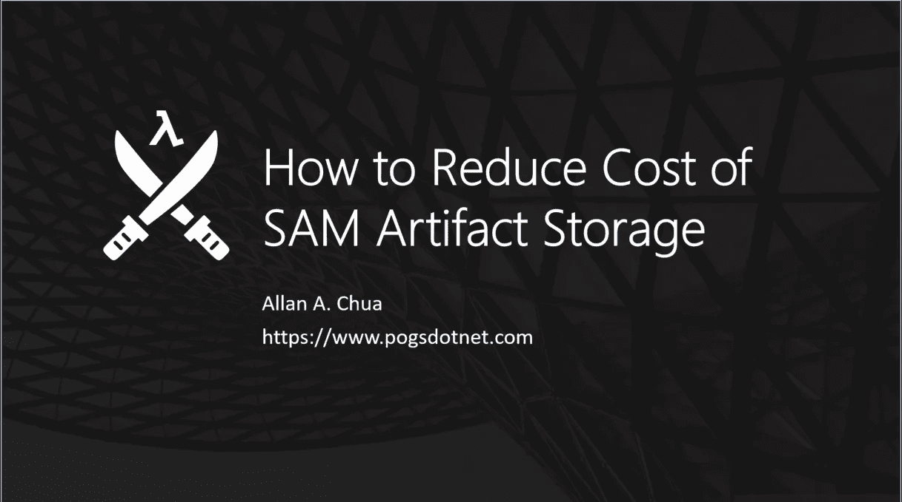
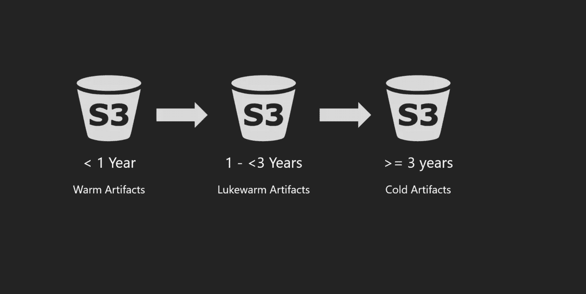

# 如何使用 S3 生命周期管理和云构建来降低 SAM 工件存储的成本

> 原文：<https://itnext.io/how-to-reduce-cost-of-sam-artifact-storage-using-s3-lifecyle-management-cloud-formation-4e18ef0cab1b?source=collection_archive---------3----------------------->

使用 AWS SAM 时，您需要做的一件微妙的事情是将 Lambda 部署包(工件)上传到一个 staging bucket，Lambda 服务在那里检索这些包。在 AWS Lambda 从 S3 取回工件之后，那些包经常停留在暂存桶中，并且可能随着时间的推移而累积，特别是对于具有大量 Lambda 函数的大型项目。随着时间的推移，这通常会导致 S3 账单缓慢而稳定地增长。

在本文中，我们将探索有哪些常用技术可以降低由 SAM 部署构件的构建所产生的成本。

## 选项 1:为开发环境工件添加一个 1 天的到期规则

开发环境的部署工件对一个组织来说基本上是没有价值的，它不允许开发人员从中提取有用的调试信息，除非你真的需要检查包。

为了帮助您的组织减少花费在工件存储上的成本，您可以为 S3 存储桶配置您的开发工件存储，以实现一个对象生命周期管理规则，该规则将终止任何超过一天的构建。您可以使用以下云形成模板来实现这一点:

使用对象生命周期管理在开发 S3 上管理 SAM 部署工件的云形成模板。

您可以通过以下任一方式发布此模板:

1.  通过从这个[链接](https://github.com/allanchua101/serverless-ninja/blob/master/013-saving-cost-from-artifact-storage/001-dev-expiration-sample/release.sh)执行发布脚本来使用引导式部署。它将请求**环境名称**(开发、UAT 和生产)&和 **AWS CLI 配置文件名称**。
2.  我的 Github 页面中的发布脚本是为我的代码示例设计的。如果您想编写自己的自动化脚本，可以使用以下命令:

## 选项 2:为 UAT 和生产环境工件添加一个合理的截止日期

UAT 和生产环境工件与开发环境工件是完全不同的讨论。它们通常对理解产品软件中存在的问题、安全漏洞和缺陷至关重要。

它们为调试和调查活动提供有价值的见解的可能性比它们的开发同行更高。鉴于这一事实，您可能需要考虑为这些环境实现更长的过期日期。

我无法定义“**合理的到期期限**”对您的组织意味着什么。这通常由以下标准决定:

*   关于数据安全的国际法
*   您所在国家/地区关于应用程序数据和工件的监管法律
*   您组织的内部政策

您可以从开发环境中调整示例，方法是将对您组织的用例有意义的值(以天为单位)放入云形成模板的这一部分:

与管理新加坡坏账的应用程序相关的工件的生命周期规则。

## 选项 3:使用 S3 转换规则来更新旧工件的存储层

您还可以通过确保工件(不经常检索的)在对您的组织很重要的时间范围内被转移到 S3 的较冷的层，来对您的产品环境中的工件实现缓慢转移的转移规则。

您可以利用下面的云形成模板来实现这一点:

使用 S3 和云形成的典型转换规则自动化

上面的示例应用以下规则来节省 S3 存储的成本:

*   一年后，它将温暖的文物(年龄不到一年)转移到 S3 标准 IA 层。
*   三年后，它将不太暖和的(年龄 3 岁及以下)文物转移到 S3 冰川。
*   它会删除存储中存在七年的对象

## 包扎

存储在 S3 存储桶中的 SAM 工件可能会堆积很长时间，明智的做法是实施一个明智的策略来管理这些工件。本文展示了 S3 对象生命周期管理和转移规则如何帮助组织降低存储无服务器应用程序工件所产生的成本。

*   使用一天到期的开发工件
*   为产品工件使用合理的到期日期，这取决于您组织的用例。
*   合理的工件到期日期因组织和国家而异。州法律可能会影响您可能用于此实施的值。
*   您可以实现一组 S3 对象生命周期转换规则，将不太频繁访问的工件慢慢移动到较冷的层。

您还可以使用这个 [Github](https://github.com/allanchua101/serverless-ninja/tree/master/013-saving-cost-from-artifact-storage) 库来访问这些实现的模板。

# 相关链接

 [## 无服务器忍者第 1 部分:无服务器=效率

### 本文旨在解释组织和个人如何从无服务器的高效率中获益…

medium.com](https://medium.com/@ac052790/serverless-ninja-part-01-serverless-efficiency-64cf77915838)  [## 无服务器 Ninja 第 2 部分:使用 AWS Lambda & NodeJS 通过 ChatOps 报告错误

### 这篇文章解释了如何通过 ChatOps 进行错误报告，以及它如何帮助组织更快地对问题做出反应…

medium.com](https://medium.com/@ac052790/serverless-ninja-part-02-reporting-errors-via-chatops-using-aws-lambda-nodejs-8d56dccadc9b)  [## allancha 101/无服务器-忍者

### 成为一名无服务器 API 忍者你需要知道的事情我要感谢以下的人，他们训练了我…

github.com](https://github.com/allanchua101/serverless-ninja) 

*原载于 2020 年 8 月 24 日*[*【https://www.pogsdotnet.com】*](https://www.pogsdotnet.com/2020/08/how-to-reduce-cost-of-sam-artifact.html)*。*