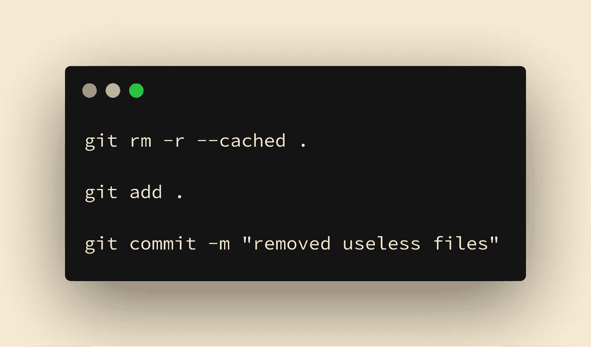

# 如何在更新后删除已经添加到 git 的文件？gitignore

> 原文：<https://itnext.io/how-to-remove-files-already-added-to-git-after-you-update-gitignore-90f169a0a4e1?source=collection_archive---------3----------------------->

有多少次你在项目的初始阶段提交文件到 git 上，过了一会儿你发现这些文件毫无用处？(对我来说:每个项目至少 3-4 次——该死的 android 在 react-native 上构建文件)

即使你更新了你的。gitignore，文件将继续被跟踪并保存在您的存储库中。



# 那么你怎样才能去除它们呢？这里有三个简单的步骤:

# 1.确保已提交所有更改

你的工作目录中不应该有任何未提交的文件。为了确保这一点，请使用

```
git status
```

如果它返回

```
nothing to commit, working tree clean
```

你已经准备好了！🚀如果没有，添加并提交您的文件或隐藏它们。

# 步骤 2:从存储库中删除所有内容

要清除您的回购，请使用:

```
git rm -r --cached .
```

*   rm 是 git 的 remove 命令
*   -r 表示递归，因此它也将删除文件夹内的内容
*   –缓存的 mea 只会从 git 索引中删除文件，而不会从您的当前目录中删除文件；你的文件很安全，✨
*   `.`表示删除所有文件。如果您只想取消对一个文件的跟踪，请添加路径而不是`.`，例如:git rm — cached。包封/包围（动词 envelop 的简写）

# 第三步:再次添加所有内容

这是最简单的部分:

```
git add .
```

# 第四步:承诺和聚会

现在提交您的更改

```
git commit -m “removed useless files”
```

现在您的存储库遵循您的。git 无视规则！派对时间到了！