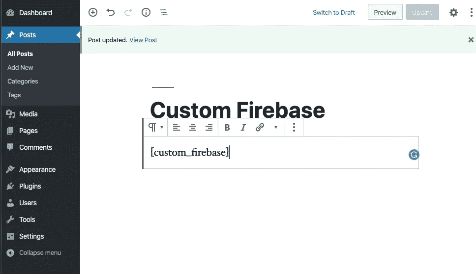
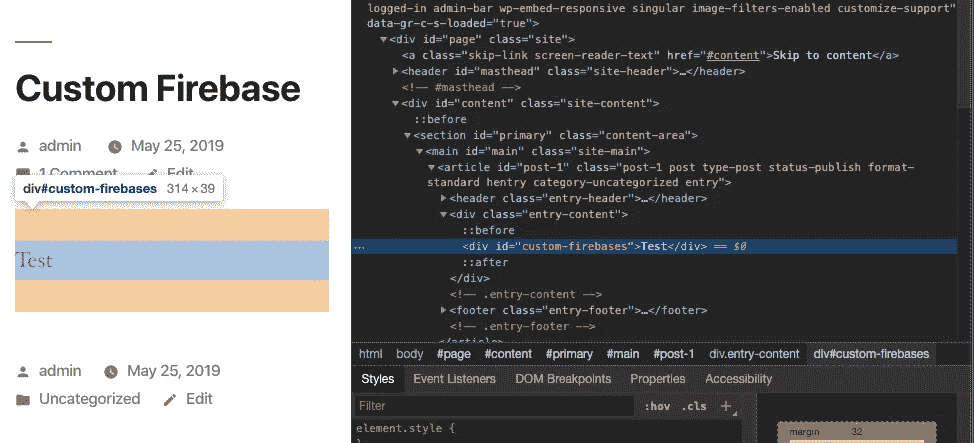
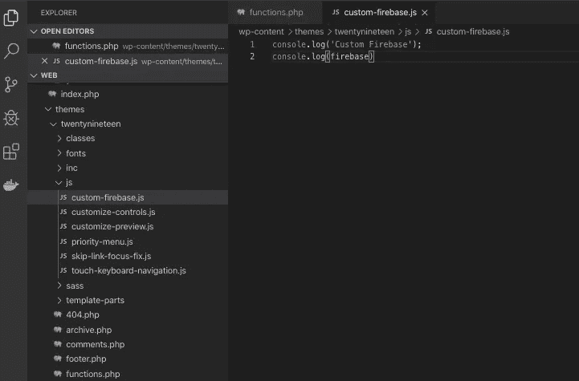
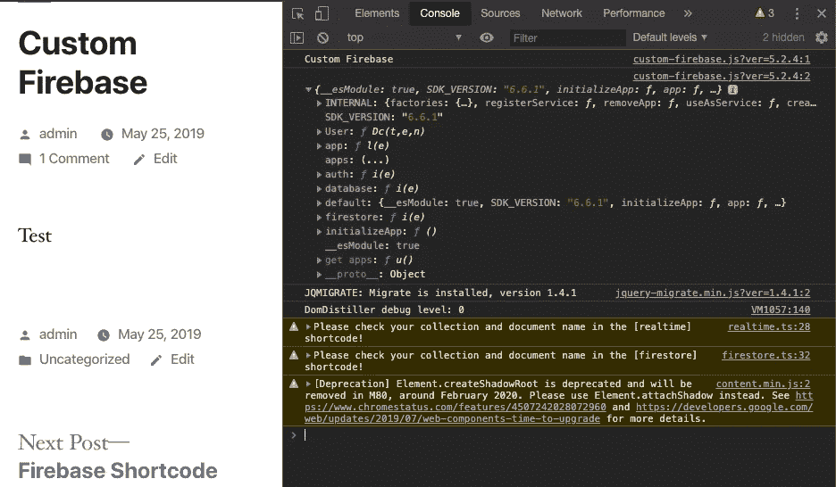
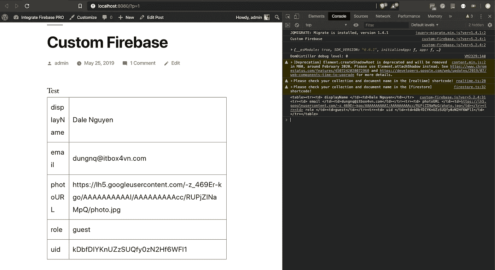

# 如何从 Firestore 检索数据并显示在 WordPress 上

> 原文：<https://itnext.io/how-to-retrieve-data-from-firestore-and-display-on-wordpress-8638854a762e?source=collection_archive---------1----------------------->

> 如果你对 Integrate Firebase PRO 版本感兴趣，请阅读完整更新的文档:[https://firebase-wordpress-docs.readthedocs.io/](https://firebase-wordpress-docs.readthedocs.io/)

【https://wordpress.dalenguyen.me/】演示:[T5](https://wordpress.dalenguyen.me/)

*   文章 1: [如何将 Firebase 集成到 WordPress](/how-to-integrate-firebase-and-wordpress-b017ee274687)
*   第 2 条: [**如何从 Firestore 中检索数据并显示在 WordPress 上**](/how-to-retrieve-data-from-firestore-and-display-on-wordpress-8638854a762e)
*   第 3 篇:[如何在 WordPress 中使用 Firebase 自定义声明](https://medium.com/@dalenguyen/how-to-work-with-firebase-custom-claims-in-wordpress-aaf83965bd20?sk=85786e3739d42b18c3e2c7344bc5f436)
*   第 4 条:[将数据从 WordPress 保存到 Firebase(实时+ Firestore)](/how-to-save-data-from-wordpress-to-firebase-realtime-firestore-2eda917d01fb)
*   第五篇: [Firebase WordPress 用户集成](/firebase-wordpress-user-integration-c18a28e41cbd)
*   第六篇:[如何在 WordPress 仪表盘中管理 Firebase 用户](/firebase-users-management-in-wordpress-dashboard-61b4a1ca066#d4c2-1605c6edec5f)
*   第 7 篇:[如何将数据从 WordPress 同步到 Firebase](/sync-data-from-wordpress-to-firebase-d6e5860d3a06)
*   第 8 条:[一键登录 WordPress & Firebase 或通过电子邮件链接](https://medium.com/@dalenguyen/one-click-login-to-wordpress-firebase-or-via-email-link-d7610d71cd23)
*   第 9 条:[从 WordPress 上传文件到云存储](https://medium.com/@dalenguyen/upload-files-to-cloud-storage-from-wordpress-e8acc8ce70cd)
*   第十条:[远程 URL 登录到 Firebase & WordPress](/remote-url-login-to-firebase-wordpress-2027fad7c159)
*   第 11 条:[添加 Firebase 认证到 WordPress 的 2 种方法& WooCommerce](https://dalenguyen.medium.com/2-ways-to-add-firebase-authentication-to-wordpress-woocommerce-df500c3b104e)
*   第 12 条:[如何将 WooCommerce 购买数据发送到 Firebase](https://dalenguyen.medium.com/how-to-send-woocommerce-purchase-data-to-firebase-8c8b4c8cff39)
*   第 13 条:[从 WordPress](https://dalenguyen.medium.com/create-manage-firebase-database-from-wordpress-13347d8ffb2e) 创建&管理 Firebase 数据库

很久以前，我写了一个插件，让[将 Firebase 整合到 WordPress](/how-to-integrate-firebase-and-wordpress-b017ee274687) 中，但是还没有一个合适的指南来指导如何使用它。所以我开始更新一些关于如何利用 WordPress 网站的 Integrate Firebase 插件的教程。

在本教程中，我将向你展示如何从你的 Firestore 中检索数据库，并将其显示在 WordPress 网站上。在此之前，请确保您已经:

*   安装并激活集成 Firebase 插件
*   更新 firebase 仪表板上的 Firebase 配置
*   确保 Firebase 安全规则允许您在登录或不登录的情况下访问文档

**第一步:创建自定义短代码**

您可以通过在当前主题中编辑 functions.php 来实现这一点

测试页面或帖子上的短代码

向页面/帖子添加简短代码

短码有效！！！

**第二步:添加自定义 javascript 文件**

同样，您可以通过编辑 functions.php 来实现这一点

您的 custom-firebase.js 将位于 js/ folder 下

在前端验证它。你现在可以进入 firebase 了。

**第三步:从 Firestore 检索并显示数据**

现在，一切都是关于 JavaScript 的。你可以自定义，修改，做任何你想做的事情。

检查 WordPress 帖子上的代码。

耶，firestore 数据恢复了

如果你对 Wordpress 的 [Integrate Firebase 插件感兴趣，请阅读一下。](https://github.com/dalenguyen/firebase-wordpress-plugin)