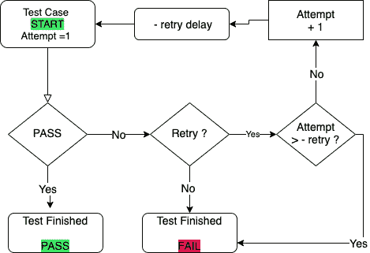

# 如何重试失败的自动化测试。

> 原文：<https://itnext.io/how-to-retry-fails-automation-tests-af4884c47712?source=collection_archive---------1----------------------->

帕特里克·沃德的照片

测试自动化的最大问题是不断变化的定位器和不稳定的测试。一般来说，不稳定的测试仍然通常被称为俚语表达。有很多使用定位器的信息和方法。[我在我的文章](/the-concept-of-the-right-locator-for-selenium-webdriver-automated-scripts-5b8c6bf528e5)中详细讨论了这一点。在本文中，我们将尝试处理不稳定测试的问题。

福湖泊试验。

如果你没有古怪的测试，那么你正在做一些不真实的事情。古怪的测试是邪恶的。古怪的测试是一种痛苦。这是你必须奋斗几天，有时甚至几周的事情。

下面是最具体的例子:您在 Selenium WebDriver 中编写了一个自动化测试。我们运行了几次。已修复和调试。从你的角度来看，一切都很好。

将它添加到主测试中。运行完所有测试的第二天，它是绿色的。“很好，”你想。

过了一段时间，这个测试失败了(不知什么原因)。
代码没有改变，应用程序运行良好。您重新开始这个测试，它运行没有错误，一切正常。在几次构建之后，您会注意到这个测试的行为就像圣诞树上的灯泡一样——闪烁:**失败，通过，失败，通过** …

又该如何应对？答案一如既往地非常简单——你需要理解。正如他们所说，任何问题都有一个名、姓和父名。最糟糕的测试有时可能是由于注意力不集中。有些很容易找到。但有些，你必须处理相当长的时间。

但有时我们的测试可能会因为我们无法控制的原因而失败。

自动化测试失败的原因有很多:

*   不稳定的测试。
*   运行环境尚未准备好。
*   一些框架问题。
*   环境绩效问题。
*   诸如此类…

在这种情况下，很难理解根本原因。有时为了理解测试是绝对正确的，我们需要重新开始。而且只有在连续两次测试失败的情况下才能断定它是有故障的。

这种情况通常会令人沮丧，并导致浪费时间不断查看错误。自动化结果中可能会出现误导的情况。当我们在所有这些之前添加重试机制时，我们可以通过使它们更加稳定来通过我们的测试。我知道实现这种方法的四种方法提供了一个极好的特性，使用它你可以在声明失败之前重试测试用例多次。这意味着，如果您发现失败，可以自动重新运行测试，以确保测试持续失败。这样可以减少由于随机问题导致的错误失败，并且您可以花更多的时间来调试真正的失败。

I RetryAnalyzer。在文章的这一部分，我们将讨论如何使用 [TestNG 框架](https://testng.org/doc/)。这个框架里有几个接口:IRetryAnalyzer，ITestListener，IReporter。为了实现失败测试的重启，TestNG 允许您使用 IRetryAnalyzer 接口。这个接口提供了布尔方法 retry，如果 retry 返回 true，或者如果 retry 不返回 false，那么 retry 负责重新启动测试。将测试结果(ITestResult result)传递给此方法。

下一步是将您的测试用例与 IRetryAnalyzer 关联起来。

第四单元 RetryRule。在本文的这一部分，我们将讨论 JUnit 4 规则的使用。该规则将重试几次失败的测试，这些测试是在测试之上的注释中提供的。这条规则背后的想法是减轻不可靠测试的影响。在 JUnit 测试框架中，允许您执行重试失败测试的类称为 TestRule。该类将在不中断测试流的情况下重新运行失败的测试。

让我们看一个 JUnit 规则的真实例子。此规则将重试失败的测试:

我们需要创建 Junit 规则来根据规则运行:

此外，我们需要规则中的一个整数值来计算我们需要重试测试的次数:

J 单元 5—*@重复测试*。在本文的这一部分，我们将看看 JUnit 5 中引入的 [@RepeatedTest](http://twitter.com/RepeatedTest) 注释。它为我们提供了一个强大的方法来编写任何我们想要重复几次的测试。

创建重复测试很简单——只需在测试方法上添加 [@RepeatedTest](http://twitter.com/RepeatedTest) 注释:

此外，您可能会使用额外的功能。除了指定重复次数之外，您还可以为每个重复提供一个自定义的显示名称。该自定义显示名称可以是静态文本+动态占位符的组合。

**测试重试梯度插件**。在文章的这一部分，我们将讨论 Gradle 插件。Gradle 有一个很棒的插件[可以帮助你处理不稳定的测试。它看起来很有趣，制作也很聪明。你不需要改变测试代码，只需将插件添加到 Gradle 并运行测试。](https://github.com/gradle/test-retry-gradle-plugin)

您可以使用这种梯度配置来重试测试，并且可以选择使构建失败:

这个插件有 4 个特别好的方面:

1.  不需要改变测试源。这允许*主动检测*新的片状测试！
2.  您可以使用`failOnPassedAfterRetry`控制当遇到剥落时您的构建是失败还是通过。这意味着您可以采用这个插件来检测不稳定的测试，而不会使它们静音。
3.  您可以使用`maxFailures`来防止在离散数量的测试失败后在测试运行中重试。如果您的构建遇到许多失败，很可能是有一个主要问题导致许多测试失败，重试是对资源的浪费。
4.  尽可能在方法级别或更精细的级别重试测试——无需重新运行整个测试类。

# 结论。

新的重试特性非常适合开发一组测试包或场景，在这些测试包或场景中，预期的结果是全部通过。通过定期执行所有的通过测试包，如果在最终结果中有任何失败，可以快速和容易地识别问题。重试功能可以通过最大限度地减少由于随机数据包丢失而可能发生的间歇性故障来增强这一过程。当重试特性被启用时，最终结果中的任何失败都表明一个特定的测试用例或功能块一直失败，可能需要进一步的调查。

在本文中，我们研究了 JUnit 和 TestNg 提供的用于重复测试的注释，并了解了配置它们的不同方法。如果你问我你更喜欢在你的框架中使用什么，我毫无疑问地推荐你使用来自 gradle 的**测试-重试-Gradle-插件**。我每天都在我的项目中使用这个插件。

【https://test-engineer.site/ 

# 作者[安东·斯米尔诺夫](https://www.linkedin.com/in/vaskocuturilo/)