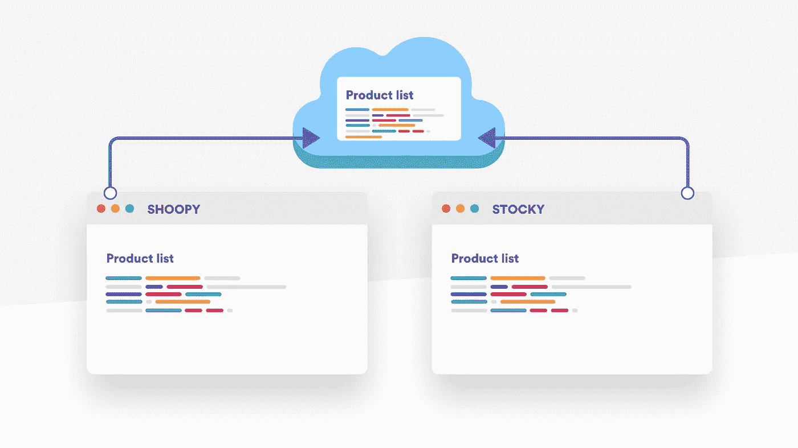
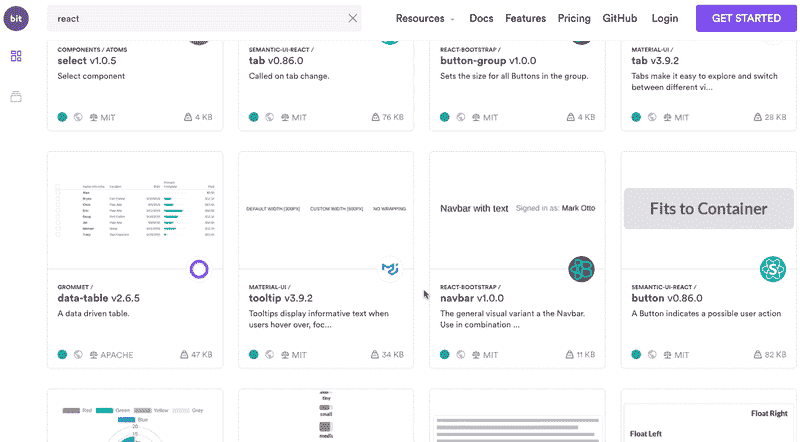
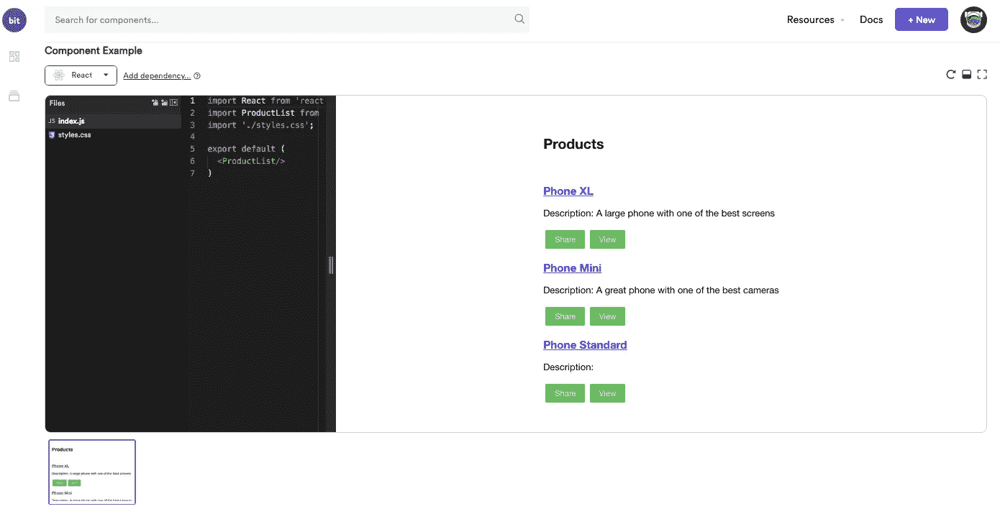

# 如何无开销地重用 React 组件

> 原文：<https://itnext.io/how-to-reuse-react-components-without-overhead-db41f646f527?source=collection_archive---------2----------------------->

## 通过实践学习如何使用 bit、npm & friends 在 React 应用程序之间轻松重用产品列表组件。



React 的一个伟大之处是它让你[构建可重用的组件](https://blog.bitsrc.io/reusable-components-in-react-a-practical-guide-ec15a81a4d71)。这些 UI 构建块本质上是高度封装的，可以在多个项目中共享，以构建不同应用程序的 UI。

在这个简短的教程中，我们将演示如何在不同的应用程序之间轻松地[隔离和重用 React 组件](https://blog.bitsrc.io/how-to-easily-share-react-components-between-projects-3dd42149c09)。此外，当完成时，你将拥有在任何规模下这样做的知识，并获得一个可重复使用的“乐高盒子”组件，用于你自己的应用程序。

我们将使用 [Bit CLI](https://github.com/teambit/bit) ，以及可选的 [bit.dev 协作平台](https://bit.dev)，来简化两个 create-react-app 应用程序之间共享组件的过程。我们还将了解如何从它们中的任何一个修改这个组件，同时在它们之间同步和更新更改。

您的项目不需要重构或配置，所以请随意遵循下面的中的[简短教程，或者直接在您自己的代码中尝试。](https://docs.bit.dev/docs/tutorials/bit-react-tutorial)

*   或者，先看 5 分钟的演示:)

# 你需要什么？

您需要验证是否安装了 Node 8.12+。

要运行本教程，克隆并设置 React 教程项目:[https://github.com/teambit/bit-react-tutorial](https://github.com/teambit/bit-react-tutorial)

```
git clone https://github.com/teambit/bit-react-tutorial
cd bit-react-tutorial
yarn install
```

# 设置位

首先，我们需要设置 Bit。

## 创建免费的 bit.dev 帐户

前往 [bit.dev](https://bit.dev/) 创建你的免费账户。输入用户名和密码或使用您的 GitHub 帐户进行鉴定。欢迎来到比特！请确保您记得您的用户名；在本教程中，您将需要它。每次看到`<username>`，都换成自己的用户名。

## 创建组件集合

当你登录到 bit.dev 时，你可以[创建一个集合](https://bit.dev/~create-collection)。集合是一组远程托管的组件，可以在应用程序之间共享和使用。现在就开始[创建你的收藏吧](https://bit.dev/~create-collection)。

你可以决定收藏是私人的还是公共的，选择权在你。请记住，这个集合可以在以后用作您团队的设计系统，由真实的代码构成！可以在这里看看一些[热门收藏。](https://bit.dev/collections)

## 安装 Bit CLI

使用 npm 在您的计算机上安装 Bit CLI:

```
npm install bit-bin -g
```

其他安装方法见[安装钻头](https://docs.bit.dev/docs/installing-bit.html)。

如果您安装了 Bit，请通过运行以下命令来验证安装:

```
bit --version
```

## 登录您的 Bit 帐户

向您的 bit.dev 帐户验证 Bit。从命令行运行:

```
bit login
```

这将打开您的浏览器，您可以在其中登录您的帐户。如果您已经登录，将显示成功消息。您现在可以开始使用 Bit 了。

作为登录过程的一部分，Bit 设置您的本地配置。您可以通过键入以下命令来查看您的配置:

```
bit config
```

此外，Bit 将 Bit 使用的 npm 注册表添加到您的`npmrc`配置中。(根据您的操作系统，默认位于`$HOME/.npmrc`)。

## 初始化 Bit 工作空间

切换到 React 教程项目目录，并使用 yarn 运行 Bit 初始化命令:

```
$ init --package-manager yarn
successfully initialized a bit workspace.
```

> *我们准备用 create-react-app，所以推荐用 yarn。如果您没有安装 Yarn，您可以安全地使用 npm。*

现在发生了另外两个变化:

*   在你的根目录下已经创建了一个名为`.bitmap`的新文件。该文件跟踪 bit 组件，只包含一个注释和一行您的 Bit 版本。
*   一个新的部分`bit`已经被添加到您的`package.json`文件中，并为您的项目提供了以下默认设置:

```
"bit": {
  "env": {},
  "componentsDefaultDirectory": "components/{name}",
  "packageManager": "yarn"
}
```

> 在一个实际的项目中，这些变更应该提交给你的版本控制系统。

# 共享 React 组件

现在，我们将跟踪 React 教程项目中的产品列表组件。将使用 id `product-list`跟踪组件。

Bit 将识别组件的文件，计算并定义其所有依赖关系，并创建一个隔离的环境，在该环境中，组件可以在任何项目中构建、测试和运行。现在，让我们跟踪一个组件。

## 跟踪“产品列表”组件

为了跟踪产品列表组件，我们需要告诉 Bit 关于组件和与之相关的文件的信息。

因为所有文件都位于 product-list 目录下，所以最简单的方法是将目录中的所有文件添加到组件中。位将创建一个以目录名命名的组件。

```
$ bit add src/components/product-list
tracking component product-list:
added src/components/product-list/index.js
added src/components/product-list/product-list.css
added src/components/product-list/products.js
```

创建新组件时，您需要确保已经正确添加了组件所需的所有文件。Bit 可以为您分析组件，并验证是否包含所有文件。您可以通过检查组件的状态来做到这一点:

```
$ bit status
new components
(use "bit tag --all [version]" to lock a version with all your changes) > product-list ... ok
```

> *我们还添加了包含产品数据的* `*products.js*` *文件。在这个演示应用程序中，这是可以接受的，因为该文件仅由产品列表组件使用。然而，在其他情况下，如果该文件由多个组件使用，您可能需要考虑将* `*products.js*` *文件创建为一个单独的组件，它将成为产品列表和其他组件的依赖项。*

## 安装 React 编译器

Bit 为您节省了每个组件构建配置的开销。它通过让您为工作区中的组件安装编译器来实现这一点。

到目前为止，我们已经为 Bit 提供了组件的源文件。但是为了使用其他项目中的文件，需要构建组件。

> Bit 存储了组件的源代码，但是代码仍然应该保留在你的版本控制系统(VCS)中，比如你的 Git 库。

Bit 有大量的开源编译器，由 Bit 团队维护。此外，社区已经创建了编译器，您可以通过搜索[位集合](https://bit.dev/)来使用它们。为了构建 React 组件，您将需要 [React 编译器](https://bit.dev/bit/envs/compilers/react)。

[](https://bit.dev/bit/envs/compilers/react) [## 编译器/react - envs 位

### 使用 Bit 编译 React 组件的 Bit 构建环境。导入环境。位导入…

bit.dev](https://bit.dev/bit/envs/compilers/react) 

要安装编译器，请在 React 教程存储库中运行以下命令:

```
$ bit import bit.envs/compilers/react --compiler
the following component environments were installed
- bit.envs/react@0.1.3
```

> *运行本教程时，版本可能会略有不同。*

React 编译器现在被设置为这个存储库中位工作空间的默认编译器。您可以检查`package.json`，并通过在 Bit 部分找到以下条目来验证编译器是否已安装:

```
"env": {
      "compiler": "bit.envs/compilers/react@1.0.2"
    },
```

# 构建 React 组件

现在编译器已经安装好了，构建组件。构建组件有两个目的:

*   使组件可以被其他项目直接使用。
*   请确保该组件包罗万象，包含与其他人共享所需的所有部分。

现在，组件存在于您的项目中，可能会消耗您的项目中的一些依赖项。Bit 构建在一个隔离的环境中进行，以确保该过程在云或任何其他项目中也能成功。

要构建组件，请在 react 项目中运行以下命令:

```
bit build
```

这导致组件名(产品列表)后跟一个文件名列表。这些是组件的构建文件。

# 导出(发布)React 组件，以便在其他应用程序中重用它



随着组件的正确构建，现在是时候与世界分享它了。
组件根据 semver 标准进行版本控制。要用版本标记组件，请运行以下命令:

```
$ bit tag --all 0.0.1
1 component(s) tagged
(use "bit export [collection]" to push these components to a remote")
(use "bit untag" to unstage versions)new components
(first version for components)
     > product-list@0.0.1
```

此命令标记当前在 Bit 中暂存的所有组件。在我们的例子中，它只是产品列表组件。

您可以检查组件状态(`bit status`)，您会发现以下内容:

```
$ bit status
staged components
(use "bit export <remote_scope> to push these components to a remote scope") > product-list. versions: 0.0.1 ... ok
```

这里需要注意的重要一点是，组件被认为是`staged`。这意味着它现在可以导出了。

为了将组件导出到您的 bit.dev 集合，我们将使用 export 命令和集合的全名，结构为`<username>.<collection>`:

```
$ bit export <username>.react-tutorial
exported 1 components to scope <username>.react-tutorial
```

该组件现在在 bit.dev 上的您的集合中可见。您可以在`https://bit.dev/<username>/react-tutorial`中访问它。您还可以访问为本次演示创建的组件:[https://bit.dev/bit/react-tutorial](https://bit.dev/bit/react-tutorial)

此时，检查 bit 的状态将不再显示该组件，因为该组件现在托管在远程集合上:

```
$ bit status
nothing to tag or export
```

如果您想查看所有组件，您可以运行:

```
bit list
```

您将获得所有组件及其版本的列表。

现在，组件代码在您的本地项目中(并且应该提交到您的源代码控制中)，但是它也可用于其他项目。

# 预览产品列表组件

[](https://bit.dev/gthomas/react-tutorial/product-list)

在 bit.dev cloud 上也有 React 组件。前往`[https://bit.dev](https://bit.dev/)`并登录您的账户(如果您尚未登录):

1.  选择左侧面板中的“收集浏览器”，然后选择“收集”。
2.  点击你的收藏——you׳ll 查看你的产品列表组件。
3.  单击产品列表组件以查看它的游乐场。

您也可以通过以下网址访问该页面:`https://bit.dev/<username>/react-tutorial/product-list`

component playground 为您提供了一个基本的 React 应用程序，其中已经包含了您的组件。

您可以通过添加一个名为`styles.css`的新文件来改进它，其样式如下:

```
#anchor {
  **flex-direction**: column;
}
```

将`styles.css`导入到操场中的`index.js`文件中:

```
**import** './styles.css';
```

保存示例

几秒钟后，你会看到组件渲染在操场上。您可以在此处查看示例[。](https://bit.dev/bit/react-tutorial/product-list)

在该组件的页面上，您还可以看到使用 yarn 或 npm 安装该组件的不同命令。可以复制纱线命令；我们很快就会用到它。

# 在另一个项目中安装组件

## 创建新的 React 应用程序

现在，您将创建另一个 react 应用程序，并使用 product-list 组件。最快的方法是使用 React CLI 生成新的应用程序。切换到新目录。

```
npx create-react-app my-new-app
```

在你的终端中，切换到`my-new-app`目录。

## 在新项目中安装组件

使用您喜欢的软件包安装程序(yarn 是首选)来安装组件。
组件存储在位注册表中，因此组件的完整路径是:`@bit/<username>.<collection name>.<component name>`

使用 yarn 运行安装命令:

```
yarn add @bit/<username>.react-tutorial.product-list --save
```

> *如果您想使用 npm，在创建项目后运行一次* `*npm install*` *，这样就会创建一个 package-lock.json，npm 就会正确地组织依赖项。*

该组件现已添加到您的`package.json`:

```
"@bit/<username>.react-tutorial.product-list": "0.0.1"
```

## 在您的应用程序中使用它

现在，您可以在代码中使用该组件，就像任何其他导入一样。将其作为模块添加到顶级应用程序模块中，并在应用程序页面上使用。我们将在代码中进行与我们在应用程序中所做的相同的更改:

```
// App.js
**import** ProductList **from** '@bit/<username>.react-tutorial.product-list';
**function** **App**() {
  **return** (
    <**div** className="App">
      <**ProductList**/>
    </**div**>
  );
}
```

更新 css 文件:

```
.App {
  **flex-direction**: column;
  **margin**: 20px;
}
```

最后，使用 React CLI 运行您的应用程序:

```
yarn start
```

瞧啊。现在，您可以在新创建的应用程序中看到组件列表。

# 修改组件

接下来，我们将对组件进行更改，并将其导出回集合。我们将在产品列表中添加一个查看按钮。为简单起见，它将只显示一个警告，说明该产品已被查看。

## 导入组件

到目前为止，product-list 组件只安装在我们的项目中(以它的构建形式)。现在，我们想将代码导入到我们的项目中进行更改。

为了导入组件，将`my-new-app`工作空间初始化为 Bit 工作空间:

```
bit init
```

在收到工作区已初始化的确认消息后，运行以下命令:

```
$ bit import <username>.react-tutorial/product-list
bit import bit.react-tutorial/product-list
successfully imported one component
- added <username>.react-tutorial/product-list new versions: 0.0.1, currently used version 0.0.1
```

> *缺失核心依赖项的通知正常。您的项目中应该已经有这些包了。*

该命令也可以在组件页面上找到。

您会得到一条消息，表明`@react/core`和`@react/common`是对等依赖关系。这是可以的，因为您的`my-new-app`项目已经包含了它们。

事情是这样的:

*   将创建一个新的顶级组件文件夹，其中包含组件的代码、编译后的代码和 node_modules(在这种情况下，node_modules 是空的，因为所有的 node_modules 都是对等依赖项，并且都来自根项目。
*   对`.bitmap`文件进行了修改，以包含对组件的引用
*   package.json 文件被修改为指向文件而不是远程包。您的`package.json`现在显示:

```
"@bit/<username>.react-tutorial.product-list": "file:./components/product-list"
```

启动您的应用程序，以确保它仍然工作。正如您将看到的，不需要任何更改:Bit 会处理好一切。

## 更新代码

让我们修改产品列表组件。更改`components/product-list/index.js`以包括以下方法:

```
view() {
    window.alert('The product has been viewed!');
 }
```

更改`components/product-list/index.js`中的`getProduct`功能，以包含新按钮:

```
getProduct(product, index) {
        **return** (
            <**div** key={index}>
                <**h3**>
                    <**a** title={product.name + ' details'} href="/">{product.name}</**a**>
                </**h3**>
                <**p**>Description: {product.description} </**p**>
                <**button** className="btn" onClick={this.share}>Share</**button**>
                <**button** className="btn" onClick={this.view}>View</**button**> </**div**>
        )
    }
```

更改 css 文件`components/product-list/product-list.css`以在`.btn`上包含一个边距:

```
**margin**: 4**px**;
```

运行 React 应用程序:

```
yarn start
```

应用程序尚未更改。那是因为位组件是由位编译器编译的。在单独的终端中，运行`bit build`命令来编译更改。您应该看到编译器已经安装:

```
successfully installed the bit.envs/compilers/react@0.1.3 compiler
```

随后将成功编译所有文件。

再次运行`my-new-app`,现在您将看到带有查看按钮的已更改组件。

> *在一个真实的项目中，建议将这些变更提交到您的 GitHub 存储库中。*

## 导出更改

接下来，将对组件所做的更改导出回 [bit.dev](https://bit.dev/) 。

```
bit status
```

产品列表组件已修改:

```
modified components
(use "bit tag --all [version]" to lock a version with all your changes)
(use "bit diff" to compare changes) > product-list ... ok
```

标记组件并将其导出为新版本。默认情况下，这是一个 semver `patch`版本:

```
$ bit tag product-list
1 component(s) tagged
(use "bit export [collection]" to push these components to a remote")
(use "bit untag" to unstage versions)changed components
(components that got a version bump)
     > <username>.react-tutorial/product-list@0.0.2
```

将其导出回收藏:

```
$ bit export <username>.react-tutorial
exported 1 components to scope <username>.react-tutorial
```

前往 [bit.dev](https://bit.dev/) 上的组件页面。在这里，您可以看到组件有了一个新版本。在 component playground 上也可以看到这些变化。

# 获取组件更新

在最后一个阶段，您将把更改导入到原始项目中。切换回`React-tutorial`。

## 导入组件更改

运行`bit import`查看是否有组件被更改(类似于执行 git pull 来检查 git 更改)。

我们将看到 product-list 组件已经更改，并且存在一个新版本:

```
$ bit import
successfully imported one component
- updated <username>.react-tutorial/product-list new versions: 0.0.2
```

组件已下载，但尚未更改。检查工作区状态，您将获得以下信息:

```
$ bit status
pending updates
(use "bit checkout [version] [component_id]" to merge changes)
(use "bit diff [component_id] [new_version]" to compare changes)
(use "bit log [component_id]" to list all available versions) > <username>.react-tutorial/product-list current: 0.0.1 latest: 0.0.2
```

## 检验

将对组件所做的更改合并到项目中。命令的结构是`bit checkout <version> <component>`。所以你跑:

```
$ bit checkout 0.0.2 product-list
successfully switched <username>.react-tutorial/product-list to version 0.0.2
updated src/app/product-list/product-list.component.css
updated src/app/product-list/product-list.component.html
updated src/app/product-list/product-list.component.ts
updated src/app/product-list/product-list.module.ts
updated src/app/product-list/products.ts
```

Bit 执行 git 合并。来自更新组件的代码现在被合并到您的代码中。

再次运行应用程序，查看它是否与更新的组件一起正常工作:

```
yarn start
```

就是这样。两个项目之间发生了变化。您的应用程序正在使用更新的组件运行。

编码快乐！

# 结论

从开发人员的角度来看，重用组件意味着在开发同样的东西上浪费更少的时间。它还标准化了您的项目，使它们更加模块化，更易于维护。这是一个很大的优势。

在用户方面，重用组件意味着保持一致的 UI 视觉和功能体验，这有助于你的用户成功地导航和与你的应用交互。随着时间的推移，您共享的组件变成了一个由真实代码组成的设计系统，您可以在整个组织中利用它，从而创建一个不断增长和协作的组件生态系统。

虽然用一个简单的应用程序进行了演示，但同样的工作流也适用于构建、分发和重用库中的组件。所以，架构很大程度上取决于你——Bit 只是让多回购代码共享体验像单回购一样灵活。我希望你喜欢！

# 了解更多信息

[](https://blog.bitsrc.io/11-react-component-libraries-you-should-know-178eb1dd6aa4) [## 2019 年你应该知道的 11 个 React UI 组件库

### 11 React 组件库与伟大的组件，用于在 2019 年构建您的下一个应用的 UI 界面。

blog.bitsrc.io](https://blog.bitsrc.io/11-react-component-libraries-you-should-know-178eb1dd6aa4) [](https://blog.bitsrc.io/5-tools-for-faster-development-in-react-676f134050f2) [## 在 React 中加快开发的 5 个工具

### 加速 React 应用程序开发的 5 个工具，侧重于组件。

blog.bitsrc.io](https://blog.bitsrc.io/5-tools-for-faster-development-in-react-676f134050f2) [](https://blog.bitsrc.io/let-everyone-in-your-company-see-your-reusable-components-270cd3213fe9) [## 让你公司的每个人共享你的可重用组件

### 以可视化的方式分享你现有的技术，帮助 R&D、产品、营销和其他所有人共同建设。

blog.bitsrc.i](https://blog.bitsrc.io/let-everyone-in-your-company-see-your-reusable-components-270cd3213fe9)