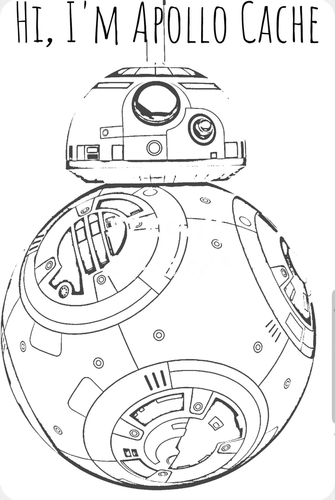
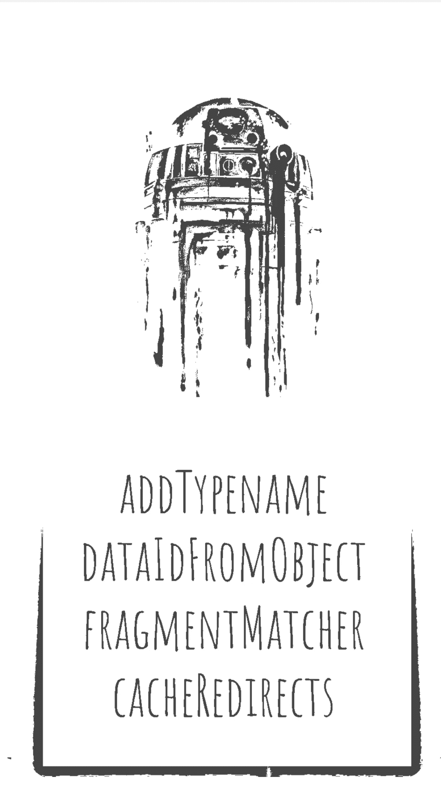
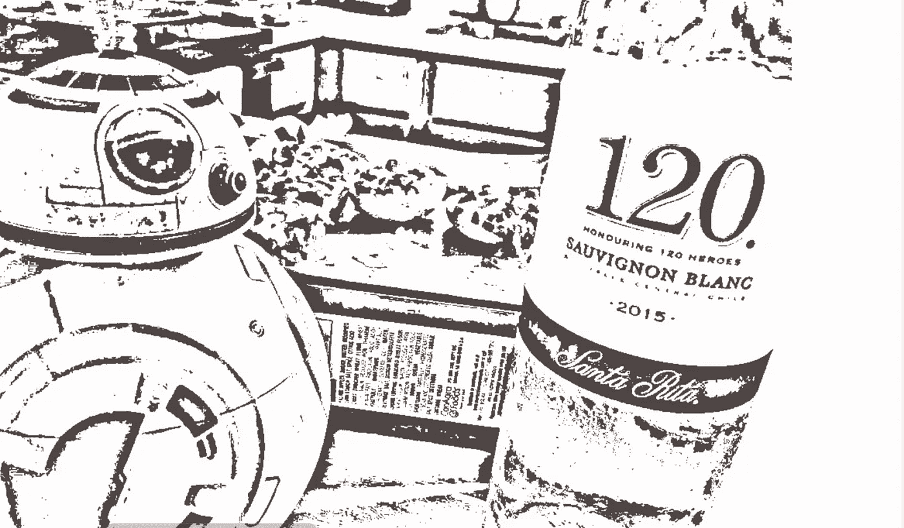
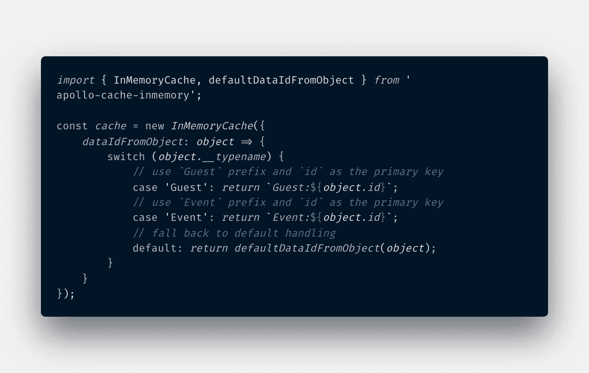

# 如何用 Apollo GraphQL 缓存震撼派对🎉🎈

> 原文：<https://itnext.io/how-to-rock-the-party-with-apollo-graphql-cache-f4679e4abd4e?source=collection_archive---------5----------------------->



嗨，我是`apollo-cache-inmemory`又名`**Apollo Cache**`。我是你的 Apollo 客户端中缓存的默认实现。所以让我解释一下我们为什么在这里！

我会在你需要的时候帮助你访问和操作缓存。你进行了变异吗？别担心！我可以帮你更新缓存。哦，顺便说一下，那个`Redux`很酷，但是你可能不需要再和他一起存储数据了🤷‍♂.请允许我…

嗯...谢谢，阿波罗缓存的介绍，但我想我会从这里开始。

好吧，所以当我第一次尝试阿波罗缓存的时候，我是无法理解的。有这么多不同的用例，我肯定会迷路。将“__typename”添加到所有的混乱中。所以我决定让阿波罗·凯奇成为我的朋友。事情是这样的:

首先，你得邀请阿波罗缓存参加你的派对:

```
npm install apollo-cache-inmemory --save
```

现在，阿波罗缓存将开始打破常规。刚介绍到`Apollo Client`(阿波罗客户端对缓存情有独钟)嘣！

```
const cache = new InMemoryCache();

const client = new ApolloClient({
  link: new HttpLink(),
  cache
});
```

但是我们想让它做更多的事情。所以，让它明白你的聚会规则，这样它就会按照你想要的方式行动。类似于`code of conduct`的东西？我们将在其构造函数中提供行为准则。对了，这是**全可选**。所以我们开始吧！

**行为准则:**



**addTypename:** 一个布尔值，指定是否将`__typename`添加到文档中。(默认为真)。*稍后详细介绍。*

**dataIdFromObject:** 缓存在将所有数据保存到存储之前对其进行规范化。这是一个接受数据对象并返回唯一 id 的函数。*在后面的故事中会详细介绍它的用法。*

**片段匹配器:**默认情况下，Apollo 缓存使用启发式片段匹配器。如果你打算在联合和接口上使用片段，这是一件**奇怪的**事情，你需要[告诉](https://www.apollographql.com/docs/react/advanced/fragments/#fragments-on-unions-and-interfaces) apollo cache。

**cacheRedirects:** 有时，我们会请求 apollo cache 已经存在于其存储中但位于不同资源键下的数据。通过 cacheRedirects，我们告诉 apollo cache 在哪里寻找已经存在的数据。



醉酒阿波罗缓存

阿波罗缓存立即在党内流行。所有的派对客人(你可以把他们想象成组件)都与缓存交互。我们在玩 [**反应和行动**](https://www.icebreakers.ws/active/react-and-act-game.html) **🧐** 在中，其中缓存保存了我们可以采取行动的所有事件以及每个团队的分数。让我告诉你，它做得很棒。阿波罗缓存做了三件事来快速存储和检索数据—

1.  将数据分割成单独的对象
2.  为每个对象创建一个唯一的标识符
3.  将数据存储在扁平数据结构中

它使用行为准则点 **addTypename** 和 **dataIdFromObject** 来做到这一点。通常，缓存使用数据中的`id`和`_id`字段以及`__typename`来创建唯一标识符。如果数据中没有提供`ids`，它将关闭`__typename`。 **dataIdFromObject** 函数

**我知道这很令人困惑。所以，让我们更深入地讨论这个问题:**

**但是首先，缓存是如何记住所有东西的？简单来说，Apollo cache 会记住你与它交互的方式。缓存将此称为**查询路径**。**

```
query {
    Events (category = 'happy') { 
        name
    }
}
```

**对于上面的查询，缓存会创建如下查询路径:**root query->Events(category =‘happy’)->name。**它假设对于一个查询路径，必须恰好有一个它所指向的资源。因此，下次当任何人询问 cache 相同的查询时，它会立即回答。例如，一位客人向 apollo cache 询问团队的得分和“快乐”类别的事件列表。**

```
query {
    Score(team = 'A') {
        points
    }
    Events (category = 'happy') { 
        name
    }
}
```

**缓存已经知道了事件列表，因为有人已经请求了它。所以它立刻回答了。爽快！**

**缓存尽力记住事情。但有时，查询路径不够清晰。例如，这是另外两位客人提出的问题:**

****嘉宾甲:**嘿，阿波罗缓存。你能给我一个属于“**跳舞**的项目吗？**

****嘉宾 B:** 缓存，你能给我提供**第二类的事件吗？**(此处类别由 id 引用)**

**现在碰巧 id = 2(或第二类)实际上是一个属于“跳舞”类别的事件。缓存如何看待这些请求？**

```
// 1st Request
query {
    Event (category = 'dancing') { 
        name
    }
}// 2nd Request
query {
    Event (id = 2) { 
        name
    }
}
```

**这里，缓存不知道这两个请求指向同一个结果。在正常情况下，缓存将获取该数据，并在其存储中保存两次。此时，缓存能够使用`dataIdFromObject`规则计算出这些请求发生了什么。**

**怎么会？在我们的帮助下。因此，在`dataIdFromObject`中，我们为任何需要查询的对象指定了唯一的标识符。这里，我们需要注意不要提供原始 id(SQL 主键)作为唯一标识符，因为 id = 5 可以表示事件或访客。我们需要把这个和`__typename`结合起来。所以像`Event:5`这样的标识符只表示 id =5 的事件数据，而`Guest:5`只表示 id = 5 的访客数据。**

****

**如果跳舞类别中的事件名称从“bachata”更改为“salsa ”,以上两个查询都将获得更新的答案。轻松利落！**

****

**阿波罗缓存还有许多其他的锦囊妙计。我们改天再讨论吧！**

***感谢推特用户@DrunkBB8 的原创图片。***