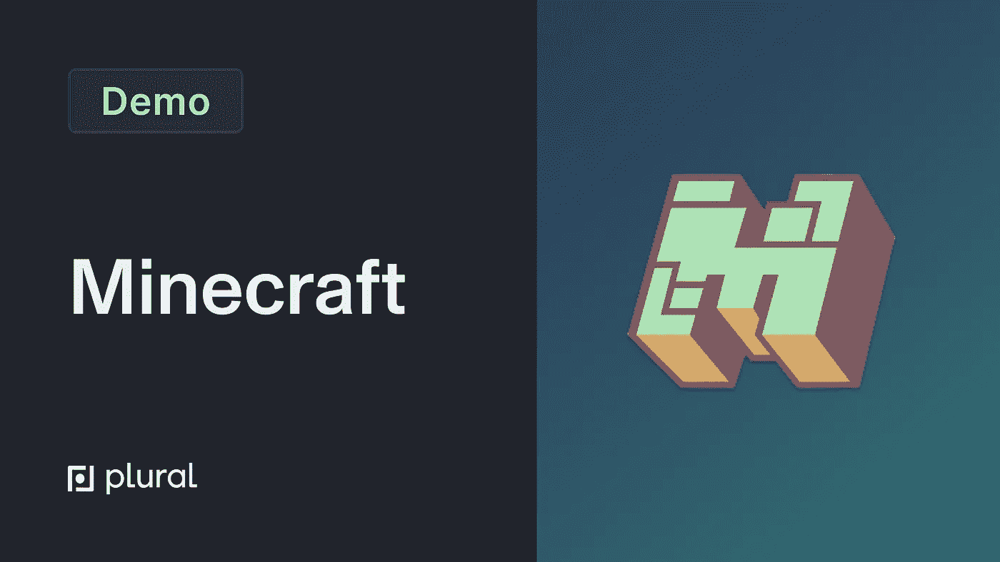

# 如何在 Kubernetes 集群上运行《我的世界》服务器

> 原文：<https://itnext.io/how-to-run-a-minecraft-server-on-a-kubernetes-cluster-b09833bfb2d4?source=collection_archive---------3----------------------->



图片由 Plural.sh 提供

当我们最初开始让人们拥有自己的应用程序时，我们关注的是核心基础设施和有用的工具。虽然这仍然是我们的主要关注点和最常见的用例，但我们确实考虑到了开发人员可能希望自托管的大量内容，例如带有服务器端组件的视频游戏。

虽然如果《我的世界》服务器独立运行在 Kubernetes 集群上，它可能不是最具成本效益的方式，但它可以成为一个项目或公司多个堆栈的有趣补充。

# 为什么你想自己托管自己的《我的世界》服务器？

在我们深入了解其工作原理的技术细节之前，有必要解释一下托管自己的《我的世界》服务器的优势。

*   自定义规则:托管自己的服务器可以让你自定义游戏体验，而不是在本地机器上运行普通游戏。
*   **Mods:** 通过自托管，你可以将 Mods 添加到你的服务器中，允许各种生活质量的提高，增加游戏深度，以及新的体验。点击这里，查看 CurseForge [上的一些改装。](https://www.curseforge.com/minecraft/mc-mods)
*   **基于角色的访问控制(RBAC):** 在个人服务器上玩的时候，你对用户的访问有更强的控制，并且可以设置基于角色的访问控制。

虽然托管自己的《我的世界》服务器不是一个新概念，但是当您开始使用 Kubernetes 部署《我的世界》服务器时，会遇到一些障碍。

# 库伯内特斯河畔的《我的世界》


照片由[尼娜·里瓦斯](https://unsplash.com/@nina_eyes?utm_source=medium&utm_medium=referral)在 [Unsplash](https://unsplash.com?utm_source=medium&utm_medium=referral) 上拍摄

使用 Kubernetes 集群自托管您的《我的世界》服务器的第一个主要障碍是弄清楚如何对《我的世界》服务器进程进行 dockerize。幸运的是，itzg 有一些非常惊人的现有技术，它们完全对接了《我的世界》服务器，包括一些非常常见的模块集，以及选择服务器版本和配置游戏其他重要设置的能力。

老实说，构建这个映像的难度远远超过了配置 Kubernetes 来运行它的难度，Itzg 值得为它的运行付出很多努力。

当你打开它时，《我的世界》是一个相对简单的系统。它包含一个节点，该节点需要一个持久性磁盘来存储游戏状态和配置文件，并且它需要某种网络接口，以便《我的世界》游戏客户端连接到服务器。

客户机-服务器协议建立在传输控制协议(TCP)的基础上，尽管也有利用用户数据报协议(UDP)的方式。将它转换成 Kubernetes 设置是相当容易的，它展示了一些很好的 Kubernetes 核心概念。

1.  **《我的世界》节点的状态集。**这简化了将卷绑定到 pod 的过程，并在技术上提供了一个稳定的网络地址，尽管这对于这些目的来说并不完全必要。您可以在这里使用部署，但是我通常发现 statefulsets 对于有状态的工作负载更简单。
2.  **映射到(1)中 statefulset 的 pod 的负载平衡器服务。** Kubernetes ingress 只支持超文本传输协议(HTTP)开箱即用，所以这是唯一的 k8s 原生解决方案。理论上，你也可以使用更高级的网络解决方案，比如 [istio](https://github.com/istio/istio) ，但是除非你过去有过使用它的经验，否则最好远离这个解决方案。
3.  **外部域名系统。**您还需要服务上的外部域名系统(DNS)注释来将 DNS 名称绑定到附加的负载平衡器，您可以在这里看到。**注意:**如果您使用的是复数，您也可以利用我们的 DNS 服务来设置主机名，因此无需购买域名。

值得一提的是，《我的世界》依赖 TCP 进行客户端-服务器通信，这确实带来了一个小问题。例如，亚马逊网络服务(AWS)的基本弹性负载平衡(ELB)或应用负载平衡器(ALB)并不支持 TCP。然而，您可以通过安装[AWS-负载平衡器-控制器](https://kubernetes-sigs.github.io/aws-load-balancer-controller/v2.4/)来实现这一点，这也很容易通过一些注释来配置:

```
service.beta.kubernetes.io/aws-load-balancer-scheme: internet-facing service.beta.kubernetes.io/aws-load-balancer-backend-protocol: TCP service.beta.kubernetes.io/aws-loadbalancer-type: external service.beta.kubernetes.io/aws-load-balancer-nlb-target-type: ip
```

默认情况下，大多数其他云都有兼容 TCP 的负载平衡器，但尽管这个问题值得关注。此外，其他游戏通常依赖 TCP 而不是 HTTP 协议与它们的客户端进行通信，因为它们通常是在考虑局域网(LAN)的情况下开发的。

# 在 Kubernetes 上部署《我的世界》时需要记住的事项

Kubernetes 是一个相当大的系统，通常有很高的运行成本。在 AWS 上，仅一架 EKS 控制飞机每月就要花费大约 50 美元。我们不指望大多数爱好者愿意花那么多钱买一台独立的《我的世界》服务器。也就是说，在两种情况下，它仍然是一个有用的设置:

1.  您希望有一个集群可供您和您的朋友运行一系列游戏，如《我的世界》、特拉利亚、瓦尔海姆或 CS: GO。在这种情况下，您可能无法将它们都打包到一个盒子中，使用类似 k8s 的东西来管理集群可以保持相对健康。
2.  你在低成本的机器上使用类似 k3s 的轻量级 k8s 发行版。在这种情况下，理论上您也可以使用 docker-compose，但是 k8s 会更健壮一些，如果需要的话可以支持集群。

这最终是个人喜好的问题，但对于像我们这样的 Kubernetes 书呆子来说，我们认为这可以是一种同时玩 Kubernetes 和一些你最喜欢的游戏的有趣方式。

# 如何在复数上安装《我的世界》

至于在 Plural 上安装《我的世界》，您可以通过在 AWS 上预先存在的 Plural 安装中运行`plural bundle install minecraft minecraft-aws`来完成。

对于 Azure 或 GCP，分别使用`minecraft-azure`或`minecraft-gcp`包名。

经过`plural build`和`plural deploy`，您的服务器将启动并运行。

如果您还没有多个安装，请查看我们的快速入门指南[点击](https://docs.plural.sh/getting-started/getting-started)开始运行。

一些需要注意的事项:

*   确保你更新到最新版本的 Java《我的世界》启动器
*   要连接到服务器，您将直接连接到它所在的多个地址，例如`minecraft.org_name.app.plural.sh`
*   请确保在共享地址之前为您的服务器添加密码并添加权限，因为任何知道地址的人都可以加入。

如果你喜欢我们正在做的事情，并希望为我们的项目做出贡献，请前往[我们的 GitHub](https://github.com/pluralsh/plural) 了解更多关于复数的知识。

*原载于 2022 年 9 月 27 日*[*https://www . plural . sh*](https://www.plural.sh/blog/how-to-run-a-minecraft-server-on-a-kubernetes-cluster/)*。*