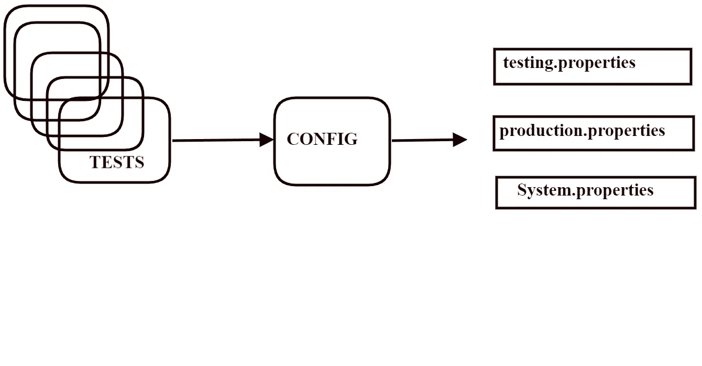
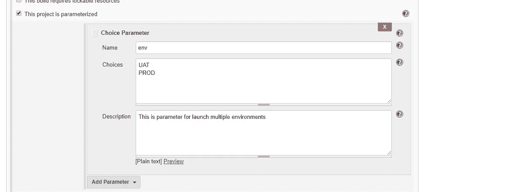
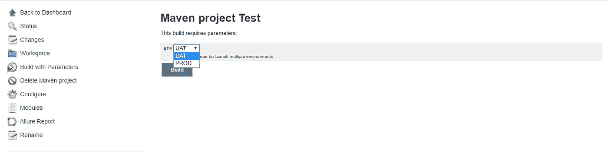

# 如何在多种环境下运行自动化脚本？

> 原文：<https://itnext.io/how-to-run-automation-scripts-in-multiple-environments-abc39d11aa20?source=collection_archive---------2----------------------->


每个应用程序都需要环境。主要的三个环境是测试、稳定性和生产。自动化工程师必须能够在这些环境中运行自动化脚本。当您运行测试时，您希望在不同的配置中完成这项工作。当您运行您只想指定的测试时，比如说:

**mvn 清洁测试-Denv =测试或 Gradle 清洁测试-Denv =测试**

对于 Gradle，您必须在 build.gradle 中创建任务:

```
tasks.withType(Test){
    systemProperty **'env'**, System.*getProperty*(**'env'**, **'env'**)
}
```

测试从测试环境开始。

要实现这一功能，可以通过 3 种方式进行改进:

1.  **使用 Java 语言。**

使用[@参数](http://twitter.com/Parameters)对测试方法进行标注。如果要传递的参数是简单的原始类型，如 int、String，..等等。

```
**public class** BaseWeb {*/**
     * Before test.
     *
     ** ***@param env this value*** environment*.
     */* @Parameters({**"env"**})
    @BeforeMethod(alwaysRun = **true**)
    **public void** beforeTest(@Optional(**"UAT"**) **final** String env) {
        **switch** (env) {
            **case "UAT"**:
                baseUrl = **"Here need add url for UAT"**;
                **break**;
            **case "PROD"**:
                baseUrl = **"Here need add url for PROD"**;
                **break**;
            **default**:
                *//Do nothing* }
    }
}
```

可选的指定了默认使用的环境。

要成功运行，您必须使用:

```
mvn clean test -Denv=PROD
```

2.**表示 TestNG 库。**

你需要创建一个文件，例如，他的名字是 testng.xml

```
<?xml version="1.0" encoding="UTF-8"?>
<!DOCTYPE suite SYSTEM "[http://testng.org/testng-1.0.dtd](http://testng.org/testng-1.0.dtd)">
<suite name="All Test Suite">
    <test name="PROD">
        <parameter name="env" value="**Here need add url for PROD**"/>
        <classes>
            <class name="tests.beforeTest"/>
        </classes>
    </test>
    <test name="UAT">
        <parameter name="env" value="**Here need add url for UAT**"/>
        <classes>
            <class name="tests.beforeTest"/>
        </classes>
    </test>
```

创建一个 BaseWeb 类，其中我们使用了变量 env 和注释 [@Parameters](http://twitter.com/Parameters) :

```
**public class** BaseWeb {*/**
     * Before test.
     *
     ** ***@param env this is*** environment*.
     */* @Parameters({**"env"**})
    @BeforeMethod(alwaysRun = **true**)
    **public void** beforeTest(**final** String env) {
        baseUrl = env;
    }}
```

要成功运行，您必须使用:

```
mvn clean test -Denv=PROD
```

3.**永旺比特**[http://owner.aeonbits.org/](http://owner.aeonbits.org/)所有者对图书馆的资助

OWNER API 是一个 Java 库，通过 Java 属性文件来最小化处理应用程序配置所需的代码。

OWNER 以 JAR 文件的形式提供，也可以从 Maven 中央存储库下载。

```
<dependencies>
    <dependency>
        <groupId>org.aeonbits.owner</groupId>
        <artifactId>owner</artifactId>
        <version>1.0.8</version>
    </dependency>
</dependencies>
```

或者格雷尔:

```
compile group: 'org.aeonbits.owner', name: 'owner', version: '1.0.8'
```

这个库允许您以属性文件的形式存储在不同环境下运行测试的所有数据。

该库的操作方法如图所示:



你有测试，他们与配置一起工作。从配置文件中读取配置数据，并通过系统属性重写。

描述 WebConfig 接口。我们用注释 [@Key](http://twitter.com/Key) 标记了工作中需要的所有方法。在 Key 中，指定要从文件中读取的名称属性。仅此而已。否则图书馆会为你做的。

```
/**
 * The interface Web config.
 */
[@Config](http://twitter.com/Config).Sources({"classpath:${env}.properties"})
public interface WebConfig extends Config {/**
     * Value BASE_CONFIG.
     */
    WebConfig BASE_CONFIG = ConfigFactory.create(WebConfig.class, System.getenv(), System.getProperties());/**
     * Value web.url.
     *
     * [@return](http://twitter.com/return) url. url
     */
    [@Key](http://twitter.com/Key)("web.url")
    String getWebUrl();}
```

此外，在方法 beforeTest 类 BasWeb 中，我们使用一个常量调用我们的方法:**BASE _ config . getweburl()**

```
**public class** BaseWeb {*/**
     * Before test.
     *
     * 
     */*
    @BeforeMethod(alwaysRun = **true**)
    **public void** beforeTest() {
        baseUrl = BASE_CONFIG.getWebUrl();
    }}
```

我们创建了一些属性文件，这些文件引用了我们的数据来处理环境。在我们的示例中，我们创建了两个属性文件 uat.properties 和 prod.properties

在数据文件中指定选项 web.url

```
uat.properties file.
 web.url = **Here need add url for UAT** 

 prod.properties file.
 web.url = **Here need add url for PROD**
```

要成功运行，您必须使用:

```
**mvn clean test -Denv=PROD** for Mavenor**gradle clean test -Denv=PROD** for Gradle
```

对于 Gradle，您必须在 build.gradle 中创建任务:

```
tasks.withType(Test){
    systemProperty **'env'**, System.*getProperty*(**'env'**, **'env'**)
}
```

# UPD:

如果您在项目中使用 CI Jenkins，您可能会有一个关于如何直接从 Jenkins 管理多个环境的问题。

要解决此问题，您需要创建一个作业并选中复选框“此项目已参数化”。接下来**添加参数** - >选择参数

在 name 字段中，选择我们将来要传递给 mvn 的变量的名称。例如 **env**

在“选择”字段中，您必须输入环境变量。在我们的例子中，它是 **UAT 和 PROD**

在描述字段中，需要对该参数进行描述。



接下来在字段目标和选项中，有必要注册:

```
clean test -Denv=${env}
```

现在，您可以使用参数运行 build。从下拉列表中，您可以选择 UAT 或生产。

