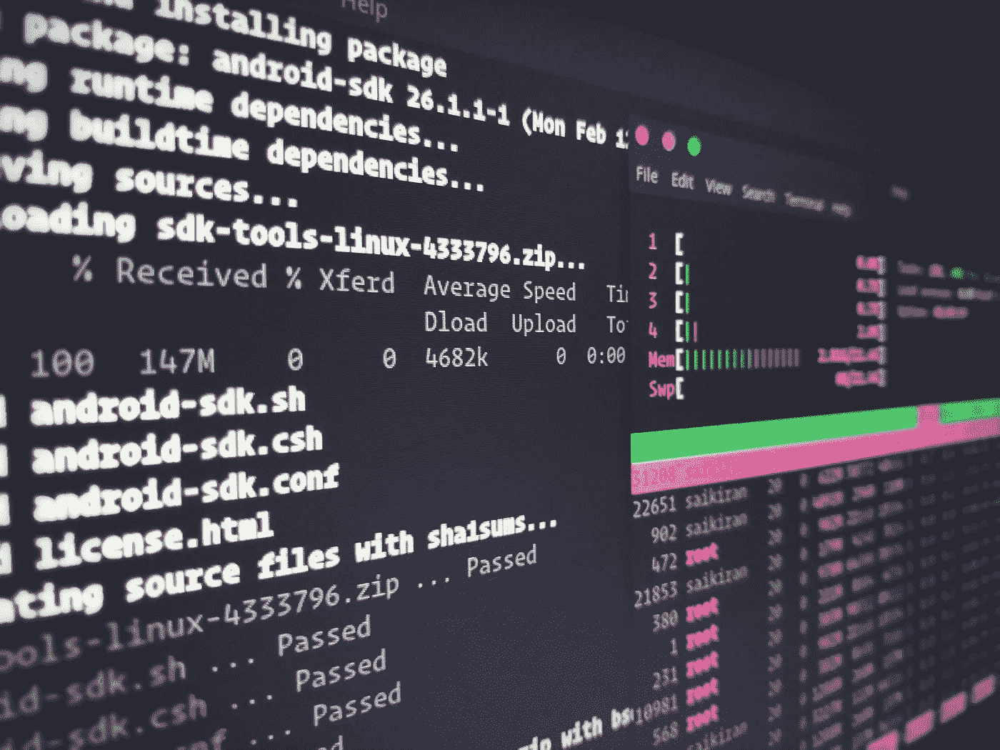
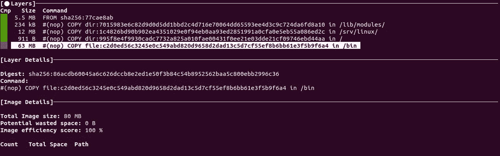
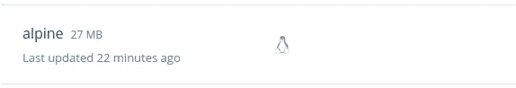
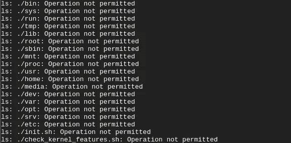

# 如何:使用最少权限从小型 alpine 映像运行 BpfTrace。

> 原文：<https://itnext.io/how-to-run-bpftrace-from-a-small-alpine-image-and-with-least-privileges-379146fcfcf1?source=collection_archive---------3----------------------->



在 [Unsplash](https://unsplash.com/?utm_source=unsplash&utm_medium=referral&utm_content=creditCopyText) 上 [Sai Kiran Anagani](https://unsplash.com/@_imkiran?utm_source=unsplash&utm_medium=referral&utm_content=creditCopyText) 拍摄的照片

[BpfTrace](https://github.com/iovisor/bpftrace) 是一种用于 Linux eBPF 的高级跟踪语言，它允许您提取在性能和安全性调查中非常方便的信息。有关 bpftrace 的更多信息，请查看官方的[参考指南](https://github.com/iovisor/bpftrace/blob/master/docs/reference_guide.md)。

# TL；博士:

下面是如何直接从 alpine 容器映像中运行 bpftrace。

```
docker run --rm -t -v /sys/kernel/debug:/sys/kernel/debug**:ro** --cap-add=SYS_ADMIN --security-opt no-new-privileges paulinhu/bpftrace:alpine sh -c "/init.sh && bpftrace -e 'kprobe:do_sys_open { printf(\"%s: %s\n\", comm, str(arg1)) } interval:s:2 { exit(); }'"
```

*如果以上对您不起作用，要么您的内核已经启用了锁定，要么您的内核主要版本与我构建 docker 映像的版本(5.x)不兼容。本页底部提供了故障排除。*

运行该容器，应该会产生主机中所有当前正在执行的命令以及每个命令打开的文件的列表:


请注意，容器中唯一装载的文件夹处于只读模式。另外，在上面的例子中，我没有使用 seccomp 配置文件运行。在这篇文章的后面，我将展示一个自定义的 seccomp 配置文件以及如何使用它——假设你有这样的倾向。:)

# 说来话长…

我找不到任何可以简单下载并使用 bpftrace 的 alpine 图像。我发现这有点奇怪，但后来试图建立自己的我意识到为什么。这一努力面临的基本挑战如下:

## 1.没有用于 alpine 的稳定 bpftrace 包

目前，alpine 唯一可用的 bpftrace 包正在测试中。我不喜欢依赖测试包，因为它们可能会改变，会破坏你的 docker 构建命令。

## 2.阿尔卑斯山不容易获得的依赖

如果重点是使用 ubuntu，您可以用 bpftrace 用一个命令简单地生成一个图像:

```
FROM ubuntu:disco as buildRUN apt update && apt install -y bpftrace linux-headers-$(uname -r)
```

对于“登山客”来说，故事并不那么简单。

## 3.Bpftrace 依赖于主机内核

在运行时，bpftrace 将使用**目标主机**的内核发布名称来引用内核头。这意味着，如果您在您的机器上构建一个 5 . 0 . 0–32-generic 的映像，并尝试在 5 . 0 . 0–1020-GCP 的服务器上运行该映像，它将无法运行。

# 建立一个轻松的 bpftrace 形象

上述大多数问题都可以通过从源代码构建所有依赖项来解决。使用一个[多级构建](https://docs.docker.com/develop/develop-images/multistage-build/)，所有的源代码都可以下载，连同它们的依赖项和它们的构建依赖项。最后，只需要将静态文件复制到 alpine:latest 映像中。生成的 docker 文件如下所示:

注意，为了解决内核版本名称的运行时依赖性，我创建了一个 init.sh 脚本，它将主机内核模块名称符号链接到在映像构建时创建的名称。除非它们大相径庭，否则 bpftrace 不应抱怨。显然，类型会随着新的内核版本而改变，所以您应该努力为目标机器构建，但是，使用这种方法，您应该会有一些偏差。

使用上面的 docker 映像，假设您的目标类似于您的本地机器，您可以使用:

```
build -t my-bpftrace:alpine \
--build-arg KERNEL_VERSION=$(uname -r | awk -F- '{ print $1 }') \
--build-arg KERNEL_RELEASE=$(uname -r) \
.
```

构建完成后，您可以使用下面的代码在同一台机器上执行:

```
docker run --rm -t -v /sys/kernel/debug:/sys/kernel/debug:ro--cap-add=SYS_ADMIN --security-opt no-new-privileges my-bpftrace:alpine bpftrace -e 'kprobe:do_sys_open { printf("%s: %s\n", comm, str(arg1)) } interval:s:2 { exit(); }'
```

如果您需要在使用不同内核版本名的不同机器上运行，确保您首先执行`/init.sh`。在这种情况下，还要确保避免任何双引号:

```
docker run --rm -t -v /sys/kernel/debug:/sys/kernel/debug**:ro** --cap-add=SYS_ADMIN --security-opt no-new-privileges my-bpftrace:alpine **sh -c "/init.sh &&** bpftrace -e 'kprobe:do_sys_open { printf(**\"**%s: %s\n**\"**, comm, str(arg1)) } interval:s:2 { exit(); }'**"**
```

结果是一个 80mb 的容器映像:



压缩后变成 27mb:



就是这样！至此，您已经有了一个运行 bpftrace 命令的简单图像。下面的位是可选的，假设你不关心 seccomp，并且在这个过程中没有任何问题。:)

关于构建图像的完整代码，请查看[这个报告](https://github.com/pjbgf/container-images/blob/master/bpftrace)。

# 用 seccomp 限制容器图像

BpfTrace 必须使用`CAP_SYS_ADMIN`功能来执行，并且还具有对`/sys/kernel/debug`文件夹的(只读)访问权。使用自定义的 seccomp 配置文件有助于减少攻击面，在运行这种功能时，攻击面并不小。

以下是我一直使用的配置文件:

可以通过添加`--security-opt seccomp=profile-name.json`来引用 seccomp 配置文件。最终的命令应该类似于:

```
docker run --rm -t -v /sys/kernel/debug:/sys/kernel/debug:ro--cap-add=SYS_ADMIN **--security-opt seccomp=bpftrace.json** --security-opt no-new-privileges paulinhu/bpftrace:alpine sh -c "/init.sh && bpftrace -e 'kprobe:do_sys_open { printf(\"%s: %s\n\", comm, str(arg1)) } interval:s:2 { exit(); }'"
```

通过应用 seccomp 配置文件，容器将受到限制，并且不能使用运行 bpftrace 命令所需的系统调用之外的系统调用。

## 玩弄 bpftrace

有许多在线工具可以让您更深入地了解服务器上正在发生的事情，这超出了本文的范围。但是这里有一个 bpftrace 的[报告](https://github.com/iovisor/bpftrace)中的例子摘录:

```
# Syscall count by program
bpftrace -e 'tracepoint:raw_syscalls:sys_enter { @[comm] = count(); }'

# Read bytes by process:
bpftrace -e 'tracepoint:syscalls:sys_exit_read /args->ret/ { @[comm] = sum(args->ret); }'

# Show per-second syscall rates:
bpftrace -e 'tracepoint:raw_syscalls:sys_enter { @ = count(); } interval:s:1 { print(@); clear(@); }'

# Trace disk size by process
bpftrace -e 'tracepoint:block:block_rq_issue { printf("%d %s %d\n", pid, comm, args->bytes); }'

# Count page faults by process
bpftrace -e 'software:faults:1 { @[comm] = count(); }'

# Files opened by process
bpftrace -e 'tracepoint:syscalls:sys_enter_open { printf("%s %s\n", comm, str(args->filename)); }'
```

运行它们时，您可以通过在末尾添加`interval:s:1 { exit(); }`来定义超时。还要确保你阅读了官方的[一行程序教程](https://github.com/iovisor/bpftrace/blob/master/docs/tutorial_one_liners.md)。

# 解决纷争

## 内核锁定已启用

这将是一些桌面发行版的默认设置，比如 Ubuntu。在尝试禁用它之前，确保您正在使用`CAP_SYS_ADMIN`运行容器。

**症状** 当执行容器时你得到下面的错误:

```
No error information: couldn't set RLIMIT_MEMLOCK for bpftrace. If your program is not loading, you can try "ulimit -l 8192" to fix the problem**Error creating printf map: Operation not permitted
Creation of the required BPF maps has failed.** Make sure you have all the required permissions and are not confined (e.g. like snapcraft does). `dmesg` will likely have useful output for further troubleshooting
```

**解决方法** 禁用内核锁定:

```
sudo bash -c 'echo 1 > /proc/sys/kernel/sysrq'
sudo bash -c 'echo x > /proc/sysrq-trigger'# https://bugzilla.redhat.com/show_bug.cgi?id=1599197
```

## 我不能在容器内执行命令

使用上面的 seccomp 配置文件运行映像将会限制在该容器中可以执行的内容。

**症状** 运行 ls 命令导致几个错误:



**解决方法** 这里有两个选项:1)根据您的实际需要定制 seccomp 配置文件。2)不要使用 seccomp 配置文件。

## 致命错误:找不到“linux/types.h”文件

BpfTrace 找不到内核头。

**症状**

```
No error information: couldn’t set RLIMIT_MEMLOCK for bpftrace. If your program is not loading, you can try “ulimit -l 8192” to fix the problem**/bpftrace/include/asm_goto_workaround.h:14:10: fatal error: ‘linux/types.h’ file not found**
```

**解决方法**
很可能是/init.sh 命令没有执行。

```
/init.sh
```

如果上述问题仍然存在，请检查构建映像的内核与执行映像的内核是否兼容。

对于一般错误，请查看[密件抄送常见问题](https://github.com/iovisor/bcc/blob/master/FAQ.txt)。