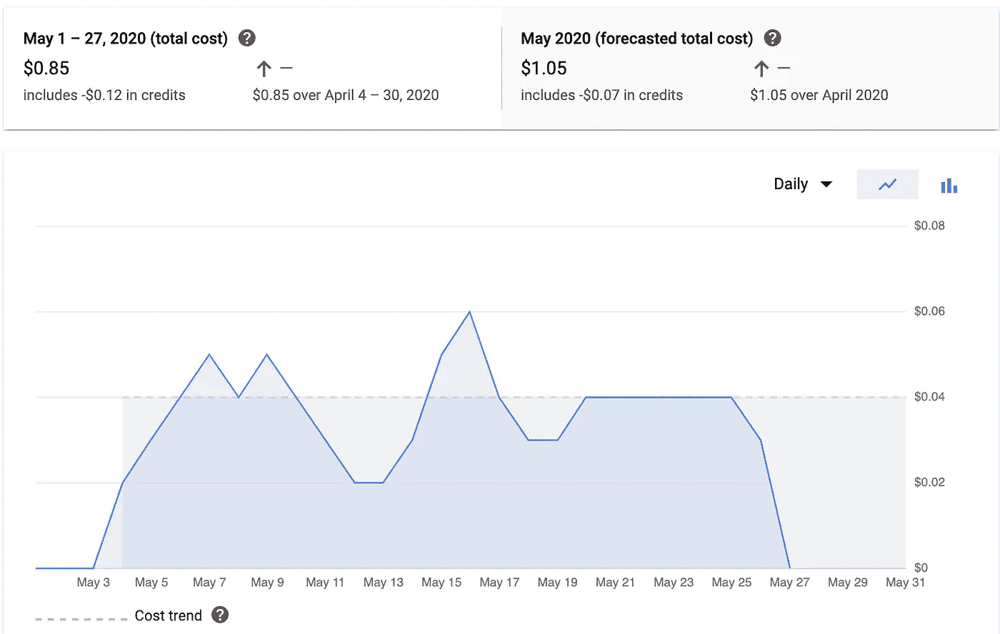

# 如何运行 1 个月的哈希公司保险库

> 原文：<https://itnext.io/how-to-run-hashicorp-vault-for-1-month-71f3f87d01d8?source=collection_archive---------1----------------------->

最近开始调查为一些个人项目跑 [HashiCorp 金库](https://www.vaultproject.io/)。问题是；我很贱。我想在 CI 管道内部使用 Vault 进行秘密管理，所以典型的“我的笔记本电脑上的开发集群”不会工作得很好。我需要一个持续运行的实例，但不想为一天只有几次点击的东西付费。此外，我讨厌修补系统。我不擅长跟上它。解决方案:[谷歌云运行](https://cloud.google.com/run)。

Google Cloud Run 是什么？—“全面管理的计算平台，用于快速、安全地部署和扩展容器化应用”。基本上，我可以给 GCP 一个容器映像，他们给我一个完全安全的 https 端点，我“只在你的代码运行时付费，计费精确到 100 毫秒。”

这正是我所需要的。HashiCorp 提供了[容器映像](https://hub.docker.com/_/vault)，我启动并运行了不到 1 个月(YMMV)。

我们还需要做一些事情来实现这个目标。

*   [Google 存储桶](https://cloud.google.com/storage/docs/creating-buckets) —用于持久数据。
*   [谷歌 KMS](https://cloud.google.com/kms) —用于[自动解封保险库](https://learn.hashicorp.com/vault/operations/autounseal-gcp-kms)。

因为我喜欢代码的一致性和基础设施，所以我去寻找一种方法，用 [Terraform](https://www.terraform.io/) 把这一切放在一起。我在 GitHub 上发现了这个[由](https://github.com/mbrancato/terraform-google-vault) [Mike Brancato](https://github.com/mbrancato) 完成的精彩项目。他将所有这些元素以一种快速的方式组合在一起，构建了一个完全自动扩展的 Google Cloud Run 实例，并使用 KMS 自动解封。

有一个小警告——冷启动需要一点时间来开启保险库。我没有计时，但是非常快。但是，这将导致对 Vault 的第一次调用失败。我的解决方法是尽早调用`vault status`来触发第一个容器，解封，并在管道的其余部分需要它时做好准备。这是一个非常可以接受的解决方法，因为我没有持续的流量。

如果你对我如何将 Vault 添加到我的 GitLab CI/CD 管道感兴趣，请查看下面的视频。在那里，我使用按需 JWT 令牌进行身份验证，以存储和提取我的秘密到我的管道中。视频描述中的代码。