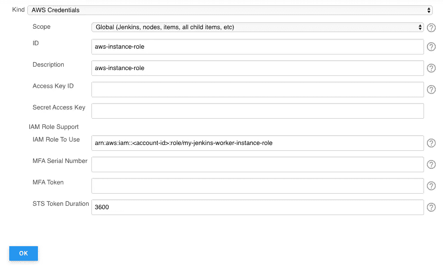

# 如何在 EKS 上使用实例角色运行具有跨帐户 ECR 映像的 Jenkins 代理。

> 原文：<https://itnext.io/how-to-run-jenkins-agents-with-cross-account-ecr-images-using-instance-roles-on-eks-2544b0fc6819?source=collection_archive---------1----------------------->

我们对 Jenkins 又爱又恨，一方面它是一个久经考验的 CI/CD 解决方案，另一方面它有最过时的界面，但我们一直在使用它，我们必须让它适应新工具。

在我的例子中，我希望有一个 AWS 帐户保存我在 ECR 上的所有 docker 图像，并能够在同一组织下的任何其他帐户上使用它，以运行基于它的 Jenkins 代理。

# **让您的组织可以访问 ECR**

从 AWS 的角度来看，这很容易实现，您只需要对您的映像制定一个策略，在我的情况下，该策略允许从与我们的组织 ID 匹配的所有内容进行只读访问。
你可以在这里找到一篇很棒的博文，展示了如何使用 terraform 完成这个过程:[https://tech.scribd.com/blog/2020/orgwide-ecr.html](https://tech.scribd.com/blog/2020/orgwide-ecr.html)

ECR 跨账户访问政策

从 EC2 实例和您的本地开发机器，通过正确配置的 AWS CLI，您应该能够读取这个存储库。
这个 AWS 教程应该够用了:[https://AWS . Amazon . com/blogs/compute/authenticating-Amazon-ECR-repositories-for-docker-CLI-with-credential-helper/](https://aws.amazon.com/blogs/compute/authenticating-amazon-ecr-repositories-for-docker-cli-with-credential-helper/)

我们还没有完成，我们想用这个图像作为一个詹金斯代理。
接下来的步骤应该在另一个账户上完成，而不是在持有 ECR 的账户上。

# **设置正确的詹金斯凭证**

现在我们开始为我们的詹金斯经纪人准备一切。
我假设 EKS 已经有一个 Jenkins 在使用声明性管道运行 jobs。
[https://github.com/jenkinsci/kubernetes-plugin](https://github.com/jenkinsci/kubernetes-plugin)

首先，让我们在 Jenkins 上创建 AWS 凭证:

AWS 凭据创建表单

将`Access Key ID`和`Secret Access Key`字段留空很重要，这将允许詹金斯`docker-commons`和`amazon-ecr`插件使用实例角色。

确保您的 EC2 EKS 工人正在使用实例角色`arn:aws:iam::<account-id>:role/my-jenkins-worker-instance-role`

# 配置 Jenkins 角色

该角色应包含以下策略:

奇怪的是，我们需要允许一个角色承担它自己，但这是我让它与 Jenkins 管道代理定义的当前状态一起工作的唯一方法。

# 在管道上使用它

现在，我们只需要把它用在我们的管道上:

我们使用来自交叉帐户 ECR 的图像和我们创建的空凭证，诀窍是始终设置`registryCredentialsId`和`registryUrl`。

这应该足以让 Jenkins 代理使用共享的 ECR 映像在 EKS 上运行。

我希望这对你有帮助，我第一次花了将近一周的时间让它工作。