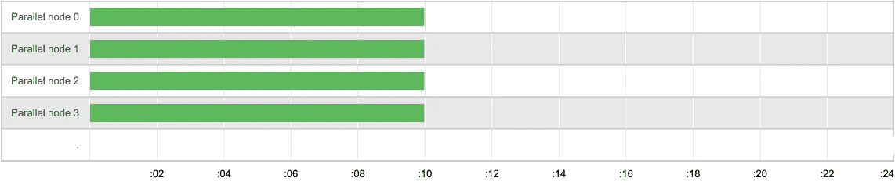

# 如何在 Github Actions 上运行 Ruby Minitest 中的并行测试

> 原文：<https://itnext.io/how-to-run-parallel-tests-in-ruby-minitest-on-github-actions-97b985f22fa7?source=collection_archive---------3----------------------->

如何在 Github Actions 上的 Minitest 中运行 Ruby on Rails 测试？如果测试很慢该怎么办？如何管理复杂的工作流程？您可以使用 Github Actions 构建矩阵来在作业之间划分 Minitest 文件，从而更快地运行测试套件。


如果您的 Minitest 测试需要几十分钟，并且您想为您的 Ruby 工程团队节省一些时间，那么您可以在 CI 服务器上使用测试并行化。

为了尽可能快地运行测试，您需要将它们分成相等的时段(并行作业)。但是怎么做呢？一些测试文件的执行速度非常快，如果运行系统测试(E2E 测试)，其他 Minitest 文件可能需要几分钟。

还有一个方面是为每个并行作业准备测试环境。我说的准备是指你需要克隆一个库，安装 ruby gems 或者从缓存中加载它们，也许你需要加载一些 docker 容器，等等。这可能会在每个并行作业上花费不同的时间。随机的网络错误会发生，比如网络延迟[加载缓存的 gem](https://docs.knapsackpro.com/2021/how-to-load-ruby-gems-from-cache-on-github-actions)，或者 Github 动作有时会使你的某个作业比其他作业启动得晚。这是网络环境中不可避免的问题，会导致您的测试在每个并行任务上运行不同的时间。这在下图中可以看到，它导致 CI 构建变慢。


在一个完美的场景中，您希望涵盖所有这些问题，并且无论如何，仍然能够以一种确保每个并行作业上的测试在相似的时间完成的方式，在并行作业中分割迷你测试工作。这保证了没有瓶颈。完美的测试划分如下图所示。



# 使用队列模式以动态方式分割测试

您可以使用[背包 Pro](https://knapsackpro.com/?utm_source=medium&utm_medium=blog_post&utm_campaign=medium-run-minitest-on-github-actions-with-parallel-jobs-using-build-matrix) 队列模式在并行任务之间动态地分割测试。这样，每个作业都会消耗队列中的测试，直到队列为空。简单地说，这允许您有效地利用 CI 服务器资源，并在最佳时间运行测试。

我描述了[队列模式如何与动态测试套件分割](https://docs.knapsackpro.com/2020/how-to-speed-up-ruby-and-javascript-tests-with-ci-parallelisation)并行分割 Ruby 和 JavaScript 测试。你可以从那篇文章中了解一下。

# Github 动作构建矩阵来运行并行测试

Github Actions 有一个[构建矩阵特性](https://docs.github.com/en/actions/learn-github-actions/managing-complex-workflows#using-a-build-matrix)，允许同时运行许多作业。您可以使用它在并行作业之间运行 Minitest 测试。

下面是 Rails 项目和 Minitest 的完整 Github Actions YML 配置。测试是用`knapsack_pro` Ruby gem 和队列模式来划分的。

```
name: Main

on: [push]

jobs:
  test:
    runs-on: ubuntu-latest

    *# If you need DB like PostgreSQL, Redis then define service below.*
    *#* [*https://github.com/actions/example-services/tree/master/.github/workflows*](https://github.com/actions/example-services/tree/master/.github/workflows)
    services:
      postgres:
        image: postgres:10.8
        env:
          POSTGRES_USER: postgres
          POSTGRES_PASSWORD: ""
          POSTGRES_DB: postgres
        ports:
          - 5432:5432
        *# needed because the postgres container does not provide a healthcheck*
        *# tmpfs makes DB faster by using RAM*
        options: >-
          --mount type=tmpfs,destination=/var/lib/postgresql/data
          --health-cmd pg_isready
          --health-interval 10s
          --health-timeout 5s
          --health-retries 5
      redis:
        image: redis
        ports:
          - 6379:6379
        options: --entrypoint redis-server

    *#* [*https://help.github.com/en/articles/workflow-syntax-for-github-actions#jobsjob_idstrategymatrix*](https://help.github.com/en/articles/workflow-syntax-for-github-actions#jobsjob_idstrategymatrix)
    strategy:
      fail-fast: false
      matrix:
        *# Set N number of parallel jobs you want to run tests on.*
        *# Use higher number if you have slow tests to split them on more parallel jobs.*
        *# Remember to update ci_node_index below to 0..N-1*
        ci_node_total: [8]
        *# set N-1 indexes for parallel jobs*
        *# When you run 2 parallel jobs then first job will have index 0, the second job will have index 1 etc*
        ci_node_index: [0, 1, 2, 3, 4, 5, 6, 7]

    env:
      RAILS_ENV: test
      PGHOST: localhost
      PGUSER: postgres
      *# Rails verifies Time Zone in DB is the same as time zone of the Rails app*
      TZ: "Europe/Warsaw"

    steps:
      - uses: actions/checkout@v2

      - name: Set up Ruby
        uses: ruby/setup-ruby@v1
        with:
          *# Not needed with a .ruby-version file*
          ruby-version: 2.7
          *# runs 'bundle install' and caches installed gems automatically*
          bundler-cache: true

      - name: Create DB
        run: |
          bin/rails db:prepare
      - name: Run tests
        env:
          KNAPSACK_PRO_TEST_SUITE_TOKEN_MINITEST: ${{ secrets.KNAPSACK_PRO_TEST_SUITE_TOKEN_MINITEST }}
          KNAPSACK_PRO_CI_NODE_TOTAL: ${{ matrix.ci_node_total }}
          KNAPSACK_PRO_CI_NODE_INDEX: ${{ matrix.ci_node_index }}
          KNAPSACK_PRO_FIXED_QUEUE_SPLIT: true
          KNAPSACK_PRO_LOG_LEVEL: info
        run: |
          bundle exec rake knapsack_pro:queue:minitest
```

# 摘要

如您所见，缓慢的 Minitest 测试套件对您来说并不是问题。QA、测试人员或自动化工程师可以从提高 CI 构建速度中受益，并允许他们的软件开发团队更快地交付产品。可以在[背包 Pro](https://knapsackpro.com/?utm_source=medium&utm_medium=blog_post&utm_campaign=medium-run-minitest-on-github-actions-with-parallel-jobs-using-build-matrix) 了解更多。


*原载于 2021 年 4 月 4 日*[](https://docs.knapsackpro.com/2021/run-minitest-on-github-actions-with-parallel-jobs-using-build-matrix)**。**